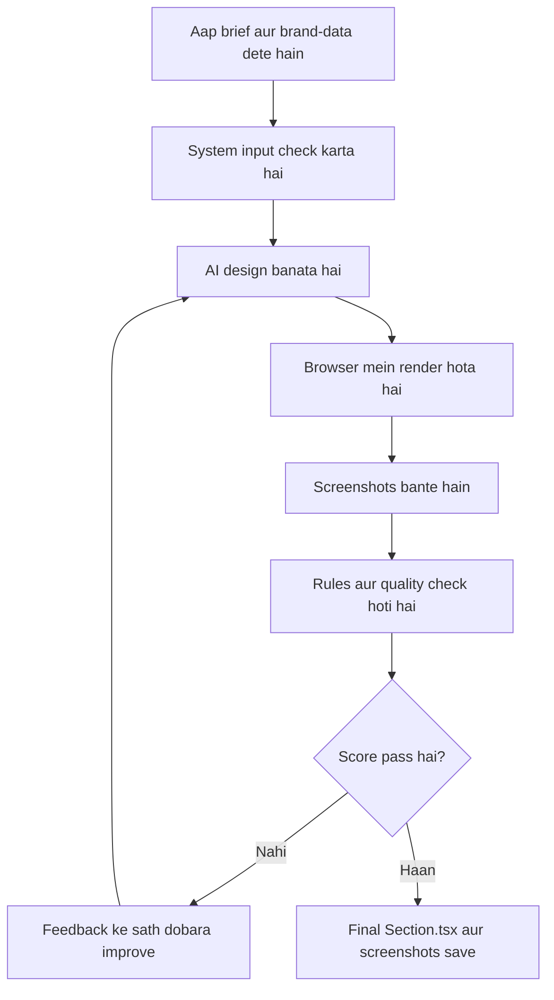
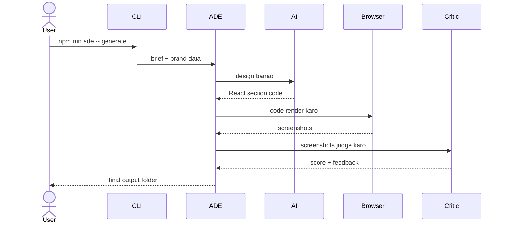
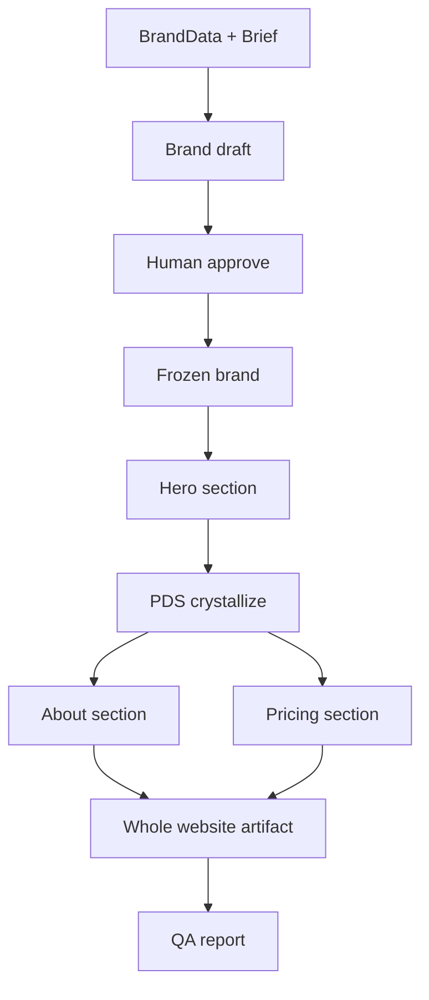
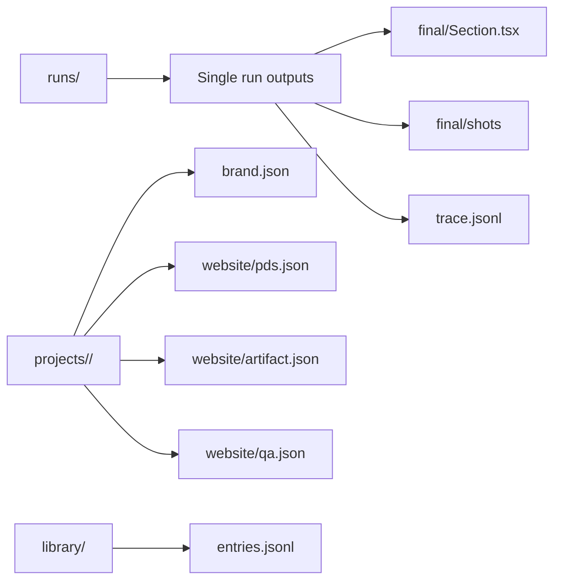

# Autonomous Design Engine - Simple Roman Urdu Guide

Yeh guide non-technical user ke liye hai. Iska maqsad yeh hai ke aap samajh saken:

- System ko kya input dena hota hai.
- Kaunsi command chalani hoti hai.
- Output kahan milta hai.
- Agar website ke multiple sections banwane hon to flow kya hoga.
- Problem aaye to kya check karna hai.

Commands English mein rahengi kyun ke computer ko command waise hi deni hoti hai. Explanation Roman Urdu mein hai.

---

## 1. System Kya Karta Hai?

ADE ek design engine hai. Aap isko business ki information dete hain, jaise:

- Client ka naam
- Industry
- Target audience
- Goal
- Section ka content
- Brand ke colors aur fonts

Phir system khud:

1. Input check karta hai.
2. Design banata hai.
3. Browser mein design render karta hai.
4. Screenshot leta hai.
5. Accessibility aur brand rules check karta hai.
6. AI Critic se design quality judge karwata hai.
7. Agar design weak ho to feedback de kar dobara improve karta hai.
8. Final approved design `.tsx` file aur screenshots mein save karta hai.

Simple lafzon mein: aap brief dete hain, system website/product section design karke output deta hai.

---

## 2. Sab Se Pehle Setup

Terminal/PowerShell mein project folder par jayen:

```powershell
cd autonomous-design-engine
```

Dependencies install karein:

```powershell
npm install
```

Browser engine install karein:

```powershell
npx playwright install chromium
```

Environment file banayen:

```powershell
Copy-Item .env.example .env
```

System check karne ke liye:

```powershell
npm run build
npm test
```

Agent SDK login/model access check karne ke liye:

```powershell
npm run spike
```

Agar `npm run spike` pass ho jaye, iska matlab system AI model se baat kar sakta hai.

---

## 3. Aap System Ko Kya Input Dete Hain?

Mostly 2 files hoti hain:

1. Brief file
2. Brand-data file

### 3.1 Brief File

Brief file mein bataya jata hai ke design kis business ke liye banana hai.

Example:

```json
{
  "client": "Burke's Steakhouse",
  "industry": "Restaurant / Hospitality",
  "location": "Bengaluru, Karnataka",
  "audience": "Affluent professionals and couples aged 28-55",
  "goal": "Drive table reservations",
  "section": {
    "name": "hero",
    "content": {
      "headline": "Where Every Cut Tells a Story",
      "subheadline": "Premium dry-aged steaks, curated wines, and a premium dining atmosphere.",
      "cta": {
        "text": "Reserve Your Table",
        "href": "/reservations"
      },
      "nav": ["Menu", "Reservations", "Events", "About", "Contact"],
      "tags": ["Dry-Aged Steaks", "Private Dining", "Wine Cellar"]
    }
  }
}
```

Is file mein important cheezen:

- `client`: client ka naam
- `industry`: business kis field mein hai
- `audience`: kiske liye design ban raha hai
- `goal`: page ka maqsad kya hai
- `section.name`: section ka naam, jaise `hero`, `pricing`, `about`
- `section.content`: actual text jo design mein use hona chahiye

Sample brief already yahan hai:

```text
briefs/burkes-hero.json
```

### 3.2 Brand-Data File

Brand-data file mein brand ke colors aur fonts hote hain.

Example:

```json
{
  "client_id": "burkes-steakhouse",
  "palette": [
    { "role": "primary", "value": "#1C1917" },
    { "role": "accent", "value": "#B45309" },
    { "role": "surface", "value": "#FAFAF9" }
  ],
  "typography": [
    { "role": "display", "family": "Playfair Display", "fallback": "Georgia, serif" },
    { "role": "ui", "family": "Inter", "fallback": "system-ui, sans-serif" }
  ]
}
```

Is file mein important cheezen:

- `client_id`: client ka short id
- `palette`: allowed brand colors
- `typography`: allowed fonts

Sample brand-data already yahan hai:

```text
briefs/burkes-brand.json
```

---

## 4. Sirf Ek Section Ka Design Kaise Banayen?

Yeh sab se simple run hai. Ismein system ek section banata hai, jaise hero section.

Command:

```powershell
npm run ade -- generate `
  --brief briefs/burkes-hero.json `
  --brand-data briefs/burkes-brand.json `
  --section hero `
  --out runs/burkes-hero `
  --variations 1 `
  --max-iters 4 `
  --threshold 80
```

Is command ka matlab:

- `--brief`: input brief file
- `--brand-data`: brand colors/fonts file
- `--section`: section ka naam
- `--out`: output kis folder mein save hoga
- `--variations`: har round mein kitne designs banenge
- `--max-iters`: system kitni dafa improve karne ki koshish karega
- `--threshold`: pass score, 80 ka matlab design ko 100 mein se kam az kam 80 chahiye

Output yahan milega:

```text
runs/burkes-hero/
```

Important output files:

```text
runs/burkes-hero/final/Section.tsx
runs/burkes-hero/final/shots/
runs/burkes-hero/trace.jsonl
```

Meaning:

- `Section.tsx`: final React component
- `shots`: final screenshots
- `trace.jsonl`: har round ka record, score, feedback, tokens

---

## 5. Agar Poori Website Ke Sections Banwane Hon

Is flow mein pehle brand freeze hota hai, phir sections design hote hain.

### Step 1: Brand Draft Banayen

```powershell
npm run ade -- design brand `
  --client burkes-steakhouse `
  --context briefs/burkes-hero.json `
  --brand-data briefs/burkes-brand.json
```

Yeh command brand draft banati hai.

Output yahan save hota hai:

```text
projects/burkes-steakhouse/brand.json
```

### Step 2: Brand Approve/Freeze Karein

```powershell
npm run ade -- design brand `
  --client burkes-steakhouse `
  --approve `
  --approved-by "Design Lead"
```

Iske baad brand frozen ho jata hai. Frozen ka matlab: ab later sections ko isi brand ke colors/fonts follow karne honge.

### Step 3: Pehla Section Banayen

```powershell
npm run ade -- design section `
  --client burkes-steakhouse `
  --surface website `
  --name hero `
  --content briefs/burkes-hero.json `
  --variations 1 `
  --max-iters 4
```

Agar pehla section approve ho gaya, system us se Project Design System, yani PDS, bana leta hai.

PDS ka simple matlab:

- Common colors
- Common spacing
- Common radius
- Common component style

Later sections isi PDS ko follow karte hain.

### Step 4: Later Sections Banayen

Har later section ke liye ek alag brief file banayen, example:

```text
briefs/burkes-about.json
briefs/burkes-pricing.json
```

Phir command chalayein:

```powershell
npm run ade -- design section `
  --client burkes-steakhouse `
  --surface website `
  --name about `
  --content briefs/burkes-about.json
```

System pehle se built sections ke screenshots bhi dekhta hai, taake naya section same website ka hissa lage.

---

## 6. Site Plan Se Multiple Sections Ek Sath Chalana

Agar aap ek file mein sections ki list dena chahte hain, to site plan use karein.

Example `site-plan.json`:

```json
{
  "sections": [
    { "name": "hero", "brief": "briefs/burkes-hero.json", "brandData": "briefs/burkes-brand.json" },
    { "name": "about", "brief": "briefs/burkes-about.json" },
    { "name": "pricing", "brief": "briefs/burkes-pricing.json" }
  ]
}
```

Note: `burkes-about.json` aur `burkes-pricing.json` files aapko khud banani hongi.

Run:

```powershell
npm run ade -- design site `
  --client burkes-steakhouse `
  --surface website `
  --plan site-plan.json `
  --variations 1 `
  --max-iters 4
```

---

## 7. Output Kahan Save Hota Hai?

Single run output:

```text
runs/<run-name>/
```

Project-level output:

```text
projects/<client-id>/
```

Example:

```text
projects/burkes-steakhouse/
  brand.json
  website/
    pds.json
    artifact.json
    qa.json
    runs/
      hero/
        final/
          Section.tsx
          shots/
```

Important files:

- `brand.json`: frozen/draft brand
- `pds.json`: design system
- `artifact.json`: website/product ke approved sections
- `qa.json`: QA report
- `final/Section.tsx`: final code
- `final/shots`: screenshots

---

## 8. QA Kaise Chalani Hai?

QA command:

```powershell
npm run ade -- design qa `
  --client burkes-steakhouse `
  --surface website `
  --threshold 80
```

QA batata hai:

- Sections approved hain ya nahi
- Average score kya hai
- Brand/PDS follow ho raha hai ya nahi
- Koi issue hai ya nahi

---

## 9. Report Kaise Dekhni Hai?

Ek run ka report:

```powershell
npm run ade -- report --out runs/burkes-hero
```

Multiple runs ka report:

```powershell
npm run ade -- report --all runs
```

Report mein aapko pata chalega:

- Score improve hua ya nahi
- Kitne tokens use hue
- Run approved hua ya escalated
- Iteration by iteration kya hua

---

## 10. Human Feedback Kaise Record Karna Hai?

Agar aap final design ko human feedback dena chahte hain:

```powershell
npm run ade -- verdict `
  --out runs/burkes-hero `
  --preferred final `
  --rating good `
  --notes "Final design zyada clear aur premium lag raha hai."
```

Rating options:

- `bad`
- `weak`
- `good`
- `strong`

Yeh feedback future calibration mein help karta hai.

---

## 11. Library Ko Sikhana

Jab koi artifact approve ho jaye, system us se general design pattern learn kar sakta hai.

```powershell
npm run ade -- design learn `
  --client burkes-steakhouse `
  --surface website `
  --brief briefs/burkes-hero.json `
  --human-verdict "approved"
```

Library ka matlab:

- System old approved projects se generic design lessons save karta hai.
- Client ka private naam, exact colors, exact copy leak nahi honi chahiye.
- Future projects mein yeh soft guidance ke tor par use hoti hai.

---

## 12. System Ki Current State Dekhna

```powershell
npm run ade -- design show `
  --client burkes-steakhouse `
  --surface website
```

Yeh batata hai:

- Brand available hai ya nahi
- PDS available hai ya nahi
- Artifact mein kitne sections hain
- QA pass hai ya fail
- Library mein kitni entries hain

---

## 13. Simple Diagrams

### 13.1 Simple Flow



### 13.2 One Section Run



### 13.3 Website Workflow



### 13.4 Storage Diagram



---

## 14. Common Problems Aur Fix

| Problem | Kya karein |
|---|---|
| `Brief file not found` | File path check karein. |
| `Brand-data file not found` | Brand-data ka path sahi dein. |
| `ANTHROPIC_API_KEY is required` | Aap `ADE_PROVIDER=api` use kar rahe hain; API key set karein ya `agent-sdk` use karein. |
| Agent SDK auth failure | Claude login check karein, phir `npm run spike` chalayein. |
| Model not found | `.env` mein `ADE_MODEL` ko available model par set karein. Default `claude-sonnet-4-6` hai. |
| Playwright/Chromium error | `npx playwright install chromium` chalayein. |
| Design off-brand colors use kar raha hai | BrandData/PDS colors check karein. |
| Site run says frozen brand missing | Pehle `design brand --approve` chalayein. |
| Run escalated ho gaya | Score threshold, max iters, budget, ya input quality check karein. |

---

## 15. Daily Use Ke Liye Short Checklist

1. `cd autonomous-design-engine`
2. Brief JSON ready karein.
3. BrandData JSON ready karein.
4. `npm run spike` se AI access check karein.
5. Single section ke liye `npm run ade -- generate ...`
6. Website flow ke liye:
   - `design brand`
   - `design brand --approve`
   - `design section`
   - `design qa`
7. Output `runs/` ya `projects/` folder mein check karein.

---

## 16. Useful Commands

Help commands:

```powershell
npm run ade -- --help
npm run ade -- generate --help
npm run ade -- design brand --help
npm run ade -- design section --help
npm run ade -- design site --help
npm run ade -- design qa --help
npm run ade -- design learn --help
npm run ade -- design show --help
```

Most common command:

```powershell
npm run ade -- generate `
  --brief briefs/burkes-hero.json `
  --brand-data briefs/burkes-brand.json `
  --section hero `
  --out runs/burkes-hero
```

