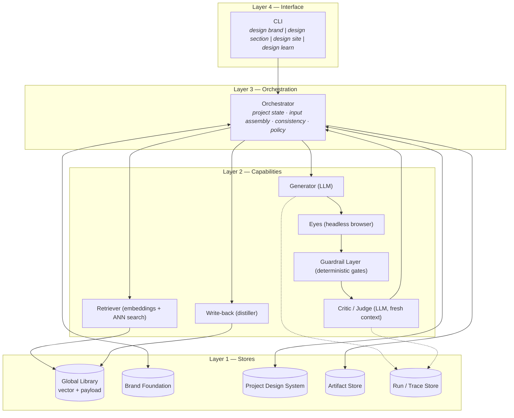
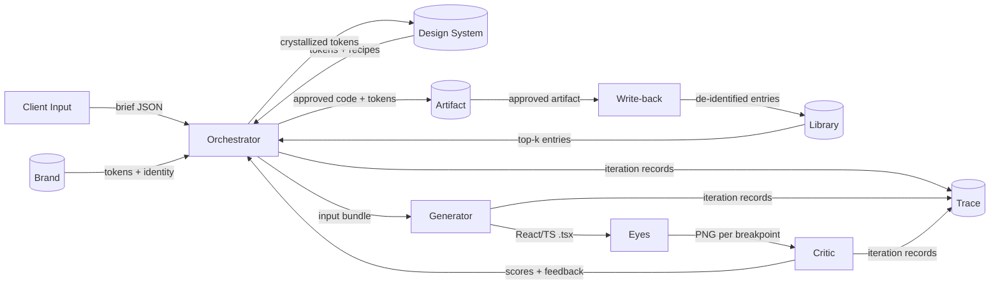

# 02 — Architecture

> How the components connect, how control and data flow, and the concrete **tech-stack ingredients** proposed to realize each part. Components are defined in `01`; data shapes in `03`. Tech choices here are *recommended defaults with rationale*, not yet installed.

---

## 1. Layered view

ADE has four layers. Higher layers depend only on the layer directly below.



- **Layer 4 (Interface):** a CLI is the only entry point (chosen in planning). Subcommands map to workflows in `06`.
- **Layer 3 (Orchestration):** the one stateful brain. Holds the project, assembles input bundles, enforces hard constraints, runs the loop, decides crystallization and write-back.
- **Layer 2 (Capabilities):** stateless workers the Orchestrator calls — the three capabilities (Eyes/Memory/Taste) plus the Generator and the Retriever/Write-back halves of Memory, **and the Guardrail Layer** (deterministic gates that own the objective floor — see [11](./11-guardrails-and-invariants.md)).
- **Layer 1 (Stores):** durable state. Two *hard* stores, one *soft* store, two record stores.

---

## 2. The control loop (where the work happens)

The center of the architecture is a single loop the Orchestrator drives per section:

```
                 ┌──────────── assemble input bundle ───────────┐
                 │  hard:  brand + project design system + brief │
                 │  soft:  retrieved library + ≤5 references     │
                 │  ctx:   screenshots of already-built sections │
                 └───────────────────┬──────────────────────────┘
                                     ▼
   ┌────────────┐   code    ┌────────────┐  shots  ┌────────────┐
   │ GENERATOR  │ ────────► │   EYES     │ ──────► │  CRITIC    │
   └─────▲──────┘           └────────────┘         └──────┬─────┘
         │  edit feedback                pass│fail        │
         └───────────────────────────────────┴───────────┘
                                     │ pass
                                     ▼
                       crystallize? (section 1) → PDS
                                     ▼
                              approved section → Artifact Store
```

Control rules (full detail in `05`):
- **Gates (`11`):** a **render-health gate** runs before critique (a render bug must never reach the Critic), deterministic **hard-constraint checks** (a11y, token-allowlist, responsive) run on a healthy render, and the **Pass Gate is composite** — approved ⇔ deterministic checks pass **and** the Critic passes.
- **Loop budget:** `max_iterations` per section; **best-so-far** is retained so a run never ends worse than its best candidate.
- **Variation:** the Generator may emit *N* candidates; the Critic ranks pairwise and the best continues.
- **Stop conditions:** Pass Gate met, or budget exhausted (escalate to human, with best-so-far), or an unrepairable render/hard violation (abort + record). Every run ends in exactly one recorded state.

---

## 3. Data flow (what moves between components)



Key property: **screenshots, not prose, cross the Eyes→Critic edge.** The system judges rendered pixels (vision), which is both more faithful and cheaper than re-encoding a design as text.

---

## 4. Context economy — how this stays under the token limit

A standing concern: "how do you fit references + memory + output in a 200K window?" The architecture answers it structurally (validated as hypothesis **H7** in `08`):

| Technique | Where | Effect |
|---|---|---|
| **Retrieval, not loading** | Retriever → Library | Pull only top-k relevant entries (KB), never the whole store |
| **Vision over text** | Eyes → Critic | A screenshot replaces a 1,000-line text encoding of a design |
| **Per-section generation** | Orchestrator | A hero needs only hero-relevant inputs, not the whole site |
| **Compact loop state** | Generator loop | Each iteration sees current code + shots + feedback, not full history |
| **Distill-once** | Write-back | Expensive analysis happens once per artifact, not per generation |

Net: context cost is ~**constant** regardless of how many references exist or how large the Library grows.

---

## 5. Proposed tech-stack "ingredients"

> Recommendations with rationale and alternatives. The spec stays implementation-agnostic where it can; these are defaults for the build phase, **not installed in this phase**.

| Concern | Recommended | Why | Alternatives |
|---|---|---|---|
| **LLM (Generator & Critic)** | Claude **Opus 4.8** (`claude-opus-4-8`) via the official Anthropic SDK; adaptive thinking; **vision** for screenshot critique | Strongest current model for long-horizon agentic + design work; native vision for the Critic; one SDK for both roles | Other frontier multimodal models; a cheaper model for the Generator + Opus for the Critic |
| **Generator output format** | **React + TypeScript** components (`.tsx`), styled with **Tailwind** | The team's real stack — components drop into Next.js later with no rewrite; a component representation is also what product *apps* need (narrows the marketing→app gap, `09` Q5) | Raw HTML/CSS/JS (simpler to render but throwaway, off-stack) |
| **Eyes — render harness** | thin **Vite + React** app that mounts the candidate component (R&D); **Next.js** app for production parity | Vite starts in milliseconds — ideal for rendering many candidates per loop; the component is identical under either harness | A minimal Next.js preview route from day one |
| **Eyes — capture** | **Playwright** (headless Chromium); loads the **harness URL**, screenshots at 1440 / 768 / 375 | Purpose-built, scriptable, reliable cross-breakpoint capture; the team identified it already | Puppeteer; a hosted screenshot service |
| **Orchestrator + CLI** | **Node + TypeScript** | Same language as the LLM/browser SDKs and the React output; matches the team's stack; one runtime end-to-end | Python (rich ML libs, but a second runtime) |
| **Library vector store** *(later phase)* | **pgvector** on Postgres | Reuses the team's existing Postgres stack; ANN + relational payload in one place | Qdrant / Chroma (standalone); a flat-file store for earliest R&D |
| **Embeddings** *(later phase)* | A text-embedding model over the *problem-space* synthesis of each entry (see `03` §embed-vs-payload) | Retrieval matches briefs to problems, not hex codes | Any embedding API; local embedding model |
| **Artifact / Trace storage** | Plain files (JSON + assets) for R&D; DB later | Simplest thing that supports audit and the `08` metrics | Object storage; a runs DB |

**MVP needs only the generation rows** (LLM, output format, render harness, capture, Orchestrator/CLI). No vector DB, no embeddings, no brand store for the first build (`07`).

---

## 6. Separation of concerns (the rules that keep it clean)

1. **Generator never grades; Critic never writes code.** Two roles, fresh contexts.
2. **Only Write-back writes the Library.** Generation reads memory; it never mutates it.
3. **Hard stores are written by deliberate events**, never as a side effect of generation: Brand by human approval, Project Design System by crystallization.
4. **The Orchestrator is the only stateful component.** Capabilities are stateless functions of their inputs — which is what keeps them swappable and testable.
5. **The CLI holds no logic** beyond parsing and dispatch — every behavior lives in Orchestration so it is reusable when a UI or API is added later.
6. **Objective is deterministic; subjective is the Critic.** Anything code can check (a11y, token drift, render success, schema, content presence) is checked by the Guardrail Layer, never the LLM. The Critic judges only subjective quality (see [11](./11-guardrails-and-invariants.md)).
7. **Every external call is fallible.** Model/retrieval/render calls use retries+backoff, timeouts, streaming for large output, refusal fallback, and a pinned model id recorded in the trace; retrieval failure degrades gracefully to brand+brief.
8. **Stores are atomic, versioned, and isolated.** Hard stores (Brand, Design System) are append-only + versioned + written only by deliberate events; writes are atomic; concurrent runs are isolated per client; every loop iteration is persisted immediately ([03](./03-data-model.md) §8, [11](./11-guardrails-and-invariants.md) §5).

---

## 7. Deployment shape (R&D phase)

```
 ┌──────────────────────────── one machine / one process ───────────────────────────┐
 │  CLI ──► Orchestrator ──► { Anthropic SDK (cloud)  ·  Playwright (local Chromium) }│
 │                       └─► local files: ./projects/<client>/{brand,system,artifacts,trace} │
 └────────────────────────────────────────────────────────────────────────────────────┘
        (A local render harness — Vite + React — hosts each candidate component for
         Playwright to screenshot. Library / pgvector added in a later phase; not in the MVP.)
```

Everything runs locally except the LLM calls. This keeps the first build cheap, observable, and fast to iterate — the right shape for validating the hypotheses in `08` before investing in infra.
