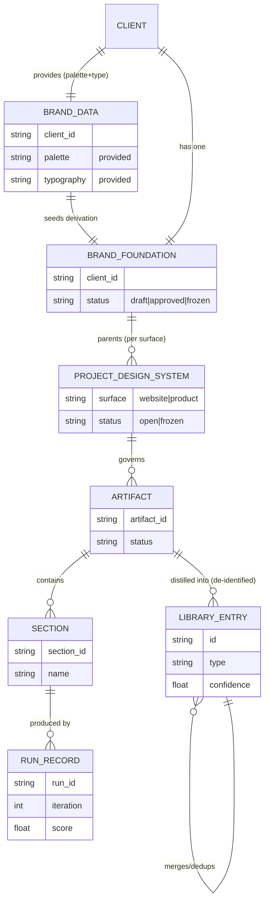
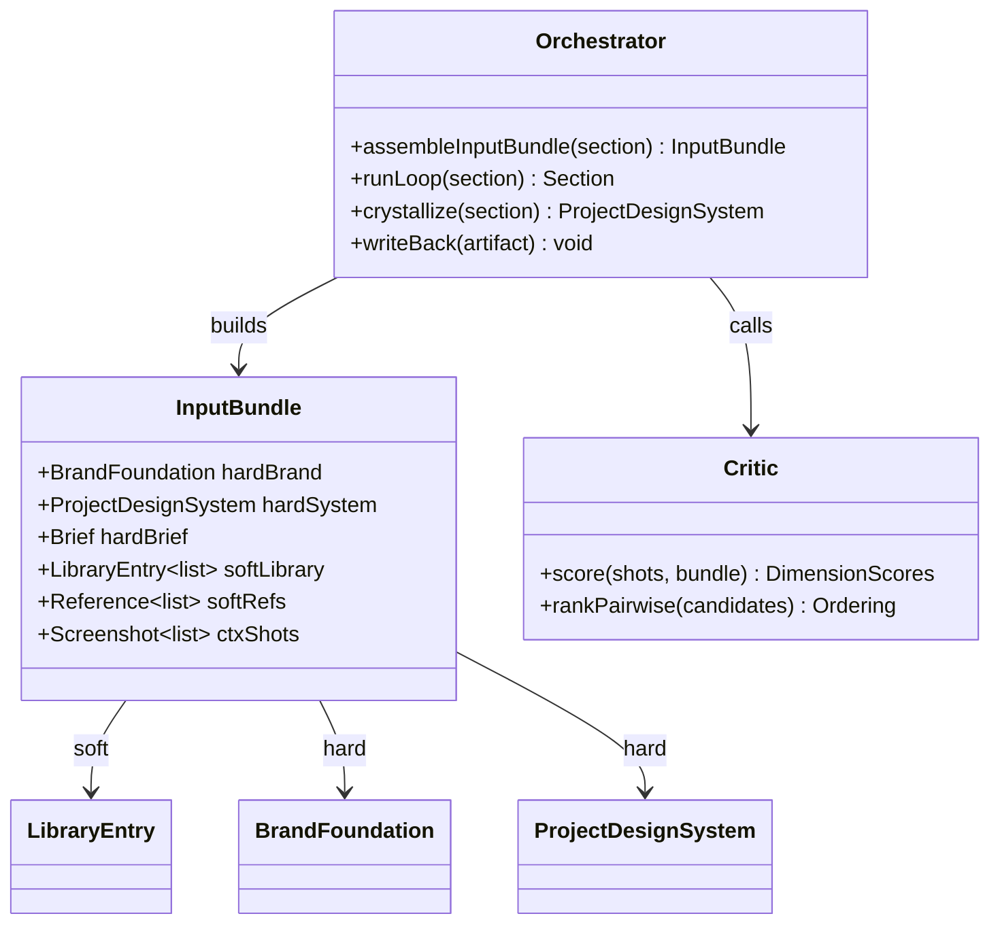

# 03 — Data Model

> The exact shapes of everything ADE stores. Five entities: **Library Entry** (soft), **Brand Foundation** (hard), **Project Design System** (hard), **Artifact** (output), **Run/Trace Record** (audit). Plus the **embed-vs-payload** rule for the vector store. Schemas are shown as TypeScript-ish interfaces for precision; they are language-agnostic.

---

## 1. Entity-relationship overview (UML)



The crucial relationships: **Brand parents many per-surface Design Systems** (website, product …); **a Design System governs many Artifacts**; **an approved Artifact is distilled into de-identified Library Entries**. The Library is *not* connected to a single client — that disconnection is what makes it reusable.

---

## 2. Library Entry (the soft, cross-project store) — the vector-DB record

This is the most important schema in the system. It stores the **abstracted lesson**, never the client instance.

```ts
interface LibraryEntry {
  id: string;                       // e.g. "pat_hero_trust-editorial_b2b-services"
  type: "principle" | "pattern" | "component-recipe" | "anti-pattern";
  title: string;

  // ── EMBEDDED (the vector — what a brief is matched against) ──
  intent: string;                   // WHY it exists: the design problem it solves
  context_fit: {                    // the brief shape it suits
    domain: string;                 // "premium / high-trust B2B services"
    audience: string;
    personality: string[];          // ["established","trustworthy","restrained"]
    goal: string;                   // "lead-gen via confidence, not urgency"
    feel: string[];                 // ["warm","editorial","spacious"]
  };

  // ── PAYLOAD (returned on a hit; NOT embedded) ──
  construction: string[];           // HOW it is built (structure, sequence, technique)
  rationale: string[];              // WHY built that way (reasoning, trade-offs)
  pairs_with: string[];             // ids of patterns it composes with
  avoid: string[];                  // generalized anti-patterns ("what kills it")
  recipe_values?: Record<string,string>; // reusable CRAFT values only (e.g. a spring easing)
  provenance: string[];             // de-identified project ids it was learned from
  outcome: {
    human_verdict: string;          // "approved, strong" | "rejected" | ...
    confidence: number;             // 0..1, rises with corroboration
    times_used: number;
  };
  tags: string[];
  created_at: string;
  updated_at: string;
}
```

**Burkes instance (de-identified):**

```yaml
id: pat_hero_trust-editorial_b2b-services
type: pattern
title: Trust-signal editorial hero for premium B2B services
intent: >
  Establish credibility and emotional buy-in BEFORE any ask, where trust is the
  conversion lever. Make the visitor feel the brand's authority before asking.
context_fit:
  domain: premium / high-trust B2B services (real estate, advisory, legal, wealth)
  audience: risk-averse buyers making one large, considered decision
  personality: [established, trustworthy, restrained, modern]
  goal: lead-gen via confidence, not urgency
  feel: [warm, editorial, spacious]
construction:
  - full-bleed architectural/editorial photography as the hero plate
  - 3-zone header (nav-left / wordmark-center / CTA+social-right)
  - headline split into 2 short lines; tags row; scroll cue
  - content sequence Title -> Tags -> Scroll  (NO subtitle paragraph)
  - single CTA = one exit ramp
rationale:
  - photography seduces before copy convinces -> minimal text, no overlays
  - pull-not-push reads premium; urgency reads desperate
  - one CTA removes decision friction in a high-consideration purchase
avoid:
  - dark gradient overlay on the hero photo (kills the photography -> kills the intent)
  - backdrop-blur header (reads generic-SaaS; breaks editorial tone)
  - context paragraph under the tags (over-explains; dilutes the pull)
provenance: [proj_2026_realestate_tx]      # no client name, copy, or tokens
outcome: { human_verdict: "approved, strong", confidence: 0.2, times_used: 1 }
tags: [hero, trust, editorial, b2b, services, restraint, photography-led]
```

### 2.1 Embed-vs-payload rule (vector-store design)

```
EMBED (the vector)   a natural-language synthesis of intent + context_fit
                     → "hero for high-trust B2B service, risk-averse audience,
                        established/restrained personality, confidence-led goal…"

PAYLOAD (metadata)   construction · rationale · pairs_with · avoid · recipe_values ·
                     provenance · outcome · tags   (stored, returned on a hit, NOT embedded)
```

**Why:** an incoming request is a *brief* (a problem statement), so you embed the **problem space** and match nearest-neighbor on that. Embedding hex codes or HTML pollutes the vector with semantically-empty tokens and ruins retrieval. You retrieve by *problem*, then read the *solution* from payload.

### 2.2 What must NEVER enter a Library Entry
- Exact brand tokens / hex values (identity → Brand/Project store).
- Literal client copy (content, not design knowledge).
- Client names / PII.
- Raw HTML/CSS of the instance (the artifact, not the lesson).
- Anything reusable only for *this* client.

> The test for any fact: **"Would this help me design for a completely different client?"** Yes → Library. Only this client → a hard store.

---

## 3. Brand Foundation (hard, per client) — provided givens + AI-derived strategy

The identity that applies to **everything** a client ships (website, product, email…). It is built in **dependency order**: the human provides only the **essential visual givens** (colors + typography) in a small `BrandData` file; the AI **derives** the rest of the foundation (personality reading, tone, motion voice, color-usage rules) from those givens **plus** the business context; a human **approves** the derived result. Approved once, then frozen.

> **Why this split.** The givens are *facts the client owns and maintains*; everything else is *strategic interpretation*. Providing only the givens keeps the AI's strategy un-anchored (objective), and — because every derived element is computed *from* the givens — there is no derived decision the human overrides after the fact, so the foundation never goes stale. If a given changes, the dependent derived elements are **re-derived** (a new `version`), never hand-patched. (Establishment flow: `06` §2; principle: `04` §2.1.)

### 3.1 BrandData — the provided input (palette + typography ONLY)

A tiny human-authored file: the only brand constraints you supply. Nothing strategic lives here.

```ts
interface BrandData {                 // the human-provided givens — one small file per client
  client_id: string;
  palette: { role: string; value: string }[];                 // exact brand colors + roles
  typography: { role: "display"|"ui"|"mono"; family: string; fallback: string }[];
  logo_ref?: string;                  // asset pointer, if the client maintains one
}
```

### 3.2 BrandFoundation — the derived, approved identity

```ts
interface BrandFoundation {
  client_id: string;
  version: number;                    // append-only; bumped on approval OR re-derivation (I5)
  status: "draft" | "approved" | "frozen";
  identity: {
    palette: { role: string; value: string; usage: string }[]; // FROM BrandData (+ AI-assigned usage)
    typography: { role: "display"|"ui"|"mono"; family: string; fallback: string }[]; // FROM BrandData
    motion_voice: string;        // DERIVED — "restrained, cinematic, no bounce"
    personality: string[];       // DERIVED from business context — ["trust","legacy","reliable","modern"]
    tone: string;                // DERIVED — brand voice for copy
    logo_ref: string;            // FROM BrandData
  };
  provenance: {                       // per-element source — drives correct re-derivation
    palette: "provided";
    typography: "provided";
    motion_voice: "derived" | "provided";   // "provided" only if a client overrides the default
    personality: "derived" | "provided";
    tone: "derived" | "provided";
    derived_from?: string;            // what the derivation consumed, e.g. "brand-data v1 + brief"
  };
  approved_by: string;
  approved_at: string;
}
```

**Provided vs derived.** `palette`, `typography`, `logo_ref` come **verbatim** from `BrandData` (the AI only *assigns usage roles* to the palette). `motion_voice`, `personality`, `tone` are **derived** by the AI from the givens + business context, then human-approved. A client may *optionally* override a derived element (its `provenance` then flips to `"provided"`), but the default is full derivation so the AI's strategy stays objective. Disagreement with a derived element is resolved by **re-derivation** (enrich an input, bump `version`), never by hand-editing a derived field.

**Burkes instance:** the human provides a warm-neutral near-zero-chroma palette + a humanist display family / clean UI family (the `BrandData`); the AI **derives** personality `[trust, legacy, reliable, modern]`, an "assured, editorial, never urgent" tone, and a restrained cinematic motion voice from that data + the real-estate business context; a human approves; it freezes. The same frozen foundation is reused when the Burkes **product** is built later.

---

## 4. Project Design System (hard, per surface, frozen after section 1)

Concrete, binding tokens + component recipes for **one surface** (this website; later, the product). The **foundation** (tokens) is born by **crystallization** the moment section 1 is approved (see `04`). The **component layer is extensible**: later sections may *add* new component recipes (each locked once added) but may never *contradict* the frozen tokens or an existing locked component. *Frozen at the core, growing at the edges.*

> **Stack note.** For this team's stack, `tokens` crystallize into a **Tailwind theme + CSS variables**, and each component recipe is realized as a **typed React component** (see `02`, `05`, `07`). Tokens are framework-agnostic data; components are React/TS.

```ts
interface ProjectDesignSystem {
  client_id: string;
  version: number;                       // append-only; bumped on crystallization & each component add (I5)
  surface: "website" | "product";
  status: "open" | "foundation-frozen"; // open before section 1; tokens locked after,
                                         // component layer keeps growing
  inherits: string;                   // -> BrandFoundation.client_id
  tokens: {                           // FOUNDATION — frozen after section 1, never changed
    color: Record<string,string>;     // exact values, e.g. accent: "#…"
    type: Record<string,string>;      // e.g. "display": "80px/1em F37-like"
    space: Record<string,string>;     // e.g. "page-inset": "15px"
    radius: Record<string,string>;
    shadow: Record<string,string>;
    motion: Record<string,string>;    // durations, easings
  };
  components: {                        // EXTENSIBLE — append-only; each locked once added
    name: string;                     // "button","card","nav"
    anatomy: string;
    variants: string[];
    states: string[];                 // default/hover/active/focus/disabled…
    locked_in: string;                // section_id that introduced & locked this component
  }[];
  foundation_from: string;            // section_id that established the foundation (section 1)
  foundation_frozen_at?: string;
}
```

**Rule (extend, never contradict):** after section 1, the **tokens are law**. A later section may *introduce* a component the hero never had (a card, a form, a table) — that recipe joins `components[]` and is locked from then on — but it may not re-define a color, type step, spacing unit, or an already-locked component. This mirrors how real design systems grow: a small token + component core first, more components as new screens demand them.

**Burkes instance (website):** after the hero is approved, the **foundation** freezes — `accent #…`, `display 80px/1em`, `page-inset 15px`, sharp `0px` CTA on soft `15px` containers, spring easing for icons. The About section then *adds* a `card` recipe (locked from then on); pricing *adds* a `pricing-tier` recipe — all built **against** the frozen tokens as hard law, never changing them.

---

## 5. Artifact & Section (the output)

```ts
interface Artifact {
  artifact_id: string;
  client_id: string;
  surface: "website" | "product";
  status: "in-progress" | "approved" | "delivered";
  sections: Section[];
}

interface Section {
  section_id: string;
  name: string;                       // "hero","about",…
  code: {                             // React + TypeScript (the team's stack) — NOT raw HTML
    component: string;                // the .tsx source for this section
    styles?: string;                  // Tailwind by default (inline classes); or a CSS/tokens module
    files?: Record<string,string>;    // any supporting components/helpers (path -> source)
  };
  screenshots: Record<"1440"|"768"|"375", string>; // file refs (from the preview harness, see 07)
  final_score: DimensionScores;       // see §6
  status: "draft" | "approved";
}
```

---

## 6. Run / Trace Record (audit + measurement)

Every loop iteration is recorded — this is the substrate the hypotheses in `08` are measured on.

```ts
interface RunRecord {
  run_id: string;
  section_id: string;
  iteration: number;                  // 0,1,2,…
  candidate_id?: string;              // when N variations are generated
  input_bundle_ref: string;           // what was fed (soft/hard/ctx)
  output_code_ref: string;
  screenshots: Record<string,string>;
  scores: DimensionScores;
  verdict: "pass" | "fail";
  critic_feedback: string;            // targeted, actionable
  duration_ms: number;
  tokens: { input: number; output: number };
}

interface DimensionScores {           // the Critic rubric (see 05)
  brand_adherence: number;            // 0..100 — hard-store fit
  system_adherence: number;           // 0..100 — design-system fit (n/a for section 1)
  brief_fit: number;                  // 0..100 — serves the business goal
  craft: number;                      // 0..100 — quality/aesthetics
  weighted_total: number;
}
```

---

## 7. Class view — how the entities relate at runtime



*(The `assembleInputBundle` method is where the soft/hard/ctx separation from `01` §4 becomes literal code — it is the heart of how autonomy and consistency coexist.)*

---

## 8. Storage mapping (proposed)

| Entity | MVP (R&D) | Later phase |
|---|---|---|
| Library Entry | — (not used in MVP) | pgvector: vector = embedded synthesis; row = payload |
| Brand Foundation | — (not in MVP) | JSON row / file per client |
| Project Design System | — (not in MVP) | JSON row / file per surface |
| Artifact / Section | local files `./projects/<client>/artifacts/` | object store / DB |
| Run/Trace Record | local JSON `./projects/<client>/trace/` | runs DB |

The MVP (`07`) persists only **Artifact/Section** and **Run/Trace** — enough to prove the loop and measure H1.

### 8.1 Integrity & concurrency requirements (all stores)

These are mandatory storage rules — the solution to the storage/consistency failure class (full design in [11 §5](./11-guardrails-and-invariants.md)). They apply whatever the backend (files now, DB later):

- **Atomic writes** — temp-file + atomic rename; a crash never leaves a partial/corrupt file (F-STO-01).
- **Append-only versioning** for the **hard stores** (Brand, Project Design System) — every change is a new immutable `version` with provenance; reads are snapshot-consistent (F-STO-02, F-BRD-02). Hard stores change **only** by deliberate events: Brand by human approval, Design System by crystallization / component-add — never as a side effect of generation.
- **Per-client concurrency control** — a lock or optimistic version precondition so concurrent runs cannot clobber a client's Brand/System/Library (F-STO-03).
- **Durable trace** — each `RunRecord` is appended **immediately** (not at run end), atomically — the measurement substrate survives a crash (F-STO-04).
- **Referential integrity** — soft-delete/archive over hard-delete; an integrity scan detects dangling artifact→system / entry→provenance links (F-STO-05).
- **Schema-validate on read** — incompatible/corrupt data is caught at load, never propagated.
- **Embedding-model id stored with each vector** — re-embed the whole Library on a model change (F-MEM-03).
