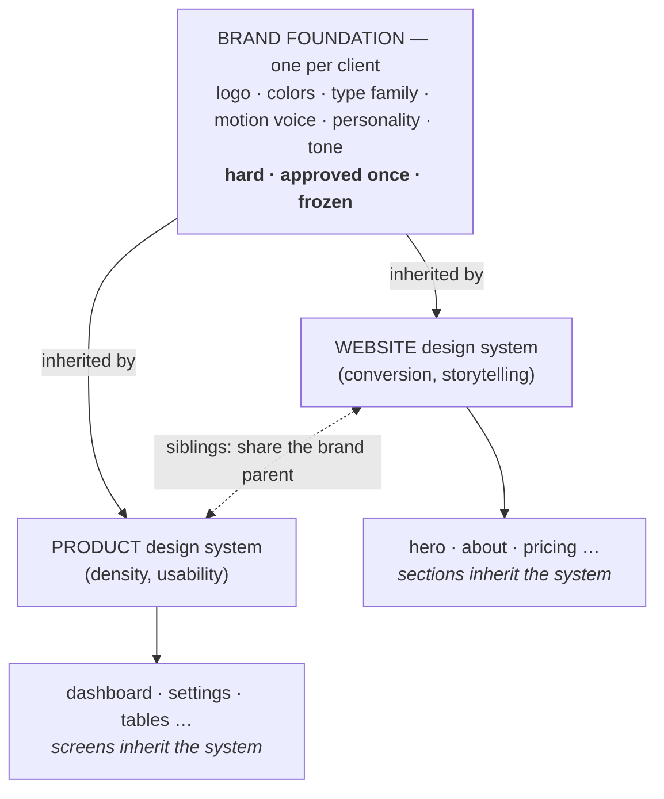
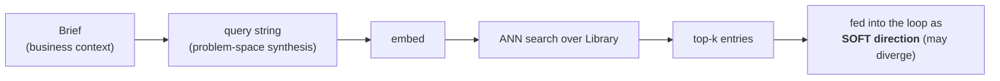
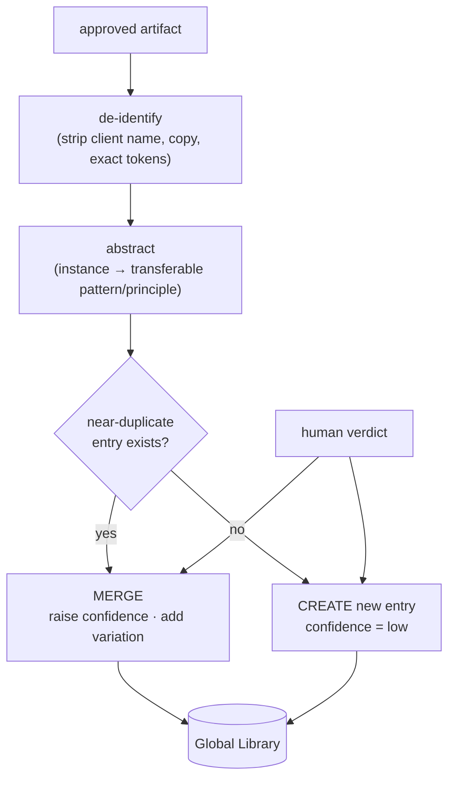

# 04 — Memory & Consistency

> The two-memory model and how consistency is *enforced* rather than hoped for. This is where "gets smarter" and "stays consistent" — two opposite jobs — are kept in separate machinery. Schemas live in `03`; this doc explains how they are used.

---

## 1. Two memories, opposite jobs

The single most important distinction in ADE. There are **two** design memories doing **opposite** things; merging them breaks the system.

| | **Global Library** | **Brand + Design System** |
|---|---|---|
| Job | get *smarter* over time | stay *consistent* |
| Scope | all clients, forever | one client / one surface |
| Used as | retrieved inspiration | binding requirement |
| AI may diverge? | **yes** — direction | **no** — law |
| Soft / hard | soft | hard |
| Written by | Write-back, after each project | Brand: human approval · System: crystallization |

The Library makes project #50 better than project #1. The Brand/System makes *one* client's hero, About page, and product app feel like the same company. They pull opposite directions — one loose, one rigid — which is exactly why they are **separate stores**, never one blended "memory."

---

## 2. The consistency hierarchy (three levels)

Consistency is **not emergent**. It is enforced by a frozen, three-level hierarchy every generation must obey.



- **Within one artifact** (hero → about): the **Project Design System** keeps sections consistent.
- **Across artifacts** (website ↔ product): the **Brand Foundation**, sitting above both, keeps them recognizably one brand while each surface adapts to its context.

> **Lock the primitives, free the composition.** Color, type, spacing, motion, component styles are locked; layout and section structure are free. *Atoms fixed, arrangements free* — consistent without being monotonous.

### 2.1 The Brand Foundation itself: provided givens → derived strategy

The hierarchy above *starts* at the Brand Foundation — but **how is the brand itself decided?** By the same **fix-then-derive** discipline that crystallization (§3) uses one level down. The human provides only the **givens they own** — palette + typography (a small `BrandData` file, `03` §3.1) — and the AI **derives** the rest of the foundation (personality, tone, motion voice, color-usage rules) from those givens plus the business context.

```
   PROVIDED (givens — facts you own)        DERIVED (AI strategy, grounded in givens + brief)
   ─────────────────────────────────        ────────────────────────────────────────────────
   • palette (exact colors + roles)    ──►   • personality reading
   • typography (typefaces + roles)    ──►   • tone of voice
   • logo                              ──►   • motion voice
                                             • color role / usage rules
                                       (a human APPROVES the derived result, or sends it back)
```

Two rules make this safe:

- **Derive in dependency order; never patch a derived leaf.** Because every derived element is computed *from* the givens, there is no derived decision a human overrides after the fact — which is exactly what would otherwise leave the motion/tone rationale **stale** when colors change. Disagree with a derived element? Change an input (enrich the brief, or adjust a given) and **re-derive** — a new `version` (`03` §3.2), not a hand-edit.
- **Minimal givens keep the strategy objective.** Every adjective a human supplies anchors the AI's search. Providing only the visual essentials lets its brand strategy stay un-anchored; the human still holds a **veto** (approval), just not the pen. This is the Goal-B autonomy principle applied to the brand layer: constrain the *facts*, free the *strategy*.

Both the provided givens and the approved derived foundation are **hard** (they sit at rank 2 of the precedence in §7); the only difference is who authored each element, recorded per-element in `provenance` (`03` §3.2).

---

## 3. Crystallization — where per-artifact consistency is born

The first section is special: it is where the Project Design System gets **decided**. The moment it is approved, its decisions stop being soft direction and become hard law.

```mermaid
sequenceDiagram
    participant O as Orchestrator
    participant Loop as Generation Loop
    participant H as Human
    participant PDS as Project Design System

    O->>Loop: design section 1 (hero) — system still "open"
    Loop-->>O: approved hero (component + de-facto tokens)
    O->>H: present hero for approval
    H-->>O: approved
    O->>PDS: CRYSTALLIZE — freeze the FOUNDATION (tokens) + the hero's components
    Note over PDS: status: open → foundation-frozen
    O->>Loop: design section 2 (about) — tokens HARD; may ADD new components
```

Before crystallization the AI is choosing the system; after, it is obeying it. This is the mechanism that answers *"will the About section match the hero?"* — **yes, because the hero's decisions were frozen into law the About section must follow**, and the About generation is additionally shown the hero's screenshots as visual context.

### Freeze the foundation, grow the components

One section is enough to lock the **foundation** — colors, type scale, spacing, radii, motion, and the components the hero actually used. But a hero cannot contain *every* component (no cards, forms, tables, or empty/error states). So crystallization is **not** "freeze everything after section 1." It is:

```
   After section 1:   FOUNDATION (tokens)        → FROZEN, never changed
                      hero's components           → locked
   Each later section: may ADD a new component    → locked once added
                       may NOT change a token or an already-locked component
```

The design system is **frozen at the core, extensible at the component layer** — exactly how human design systems are built (a token + component core first, more components as new screens demand them). Consistency is still guaranteed: the tokens every section draws from never move; only the *set of available components* grows. (Schema + rule in `03` §4; this resolves open question #4 in `09`.)

**Reviewed before it becomes law.** Because the foundation is extracted from a *single* section, a bad extraction (a hero that over- or under-specifies tokens — F-PDS-01) would lock an error into every later section. So crystallization output passes a **Phase-Exit Review** before it is frozen ([11 §2.3](./11-guardrails-and-invariants.md)): a fresh-context Critic checks the candidate tokens against the brand and the approved hero — *are these the right primitives? is anything over-fitted to this one section, or missing something later sections will need?* — and returns an over/under-specified foundation for bounded correction. Only a reviewed foundation is frozen; the human still signs off, but on a pre-filtered system.

---

## 4. The "one hero → three stores" fan-out

The same approved hero deposits knowledge into **all three** stores — but a **different slice** into each. This resolves the most common confusion ("does the hero go in the vector DB?").

```
                 ┌─────────────────────────── approved Burkes hero ───────────────────────────┐
                 ▼                                   ▼                                          ▼
   GLOBAL LIBRARY (soft, vector)        BRAND FOUNDATION (hard)              PROJECT DESIGN SYSTEM (hard)
   "Trust-signal editorial hero          "Burkes = warm-neutral palette,      accent #… · display 80px/1em ·
    for B2B services"                     humanist display type,               page-inset 15px · the actual
   • abstracted, de-identified            restrained motion, legacy voice"     hero component code
   • the LESSON, not the artifact        • this client's identity             • exact tokens + literal recipe
   → reused for FUTURE, DIFFERENT        → reused for Burkes' OTHER            → reused for THIS site's other
     clients                               surfaces (the product)               sections (about/pricing/footer)
```

The test that routes each fact:
- *Helps a different client?* → Library (de-identified).
- *This client's identity across surfaces?* → Brand Foundation.
- *This surface's exact implementation?* → Project Design System.

---

## 5. Retrieval — how soft memory is used at generation time



The query is built from the **brief**, embedded, and matched nearest-neighbor against the embedded problem-space of each entry (see `03` §2.1). Returned entries are **soft** — the Generator synthesizes from them and may depart. The *hard* constraints come from Brand/System, never from here.

**Burkes query example:**
`"hero · B2B real estate · audience: sellers/investors · personality: trust, legacy, modern · goal: lead-gen · feel: warm, editorial"`
→ returns `[trust-editorial-hero pattern, restraint principle, sharp-CTA recipe, no-gradient-on-photography anti-pattern]`.

---

## 6. Write-back — how the Library gets smarter (not just bigger)

After an artifact is approved, **Learning Write-back** distills it into the Library.



What makes it *smarter* rather than a junk drawer:

- Entries are **evidence-weighted**. One project → `confidence: low` (a hypothesis). Corroboration across projects + positive human verdicts → confidence rises. Rejected/under-performing patterns are down-weighted or deleted.
- Retrieval ranks by **similarity × confidence**, so validated knowledge surfaces and unproven guesses sink.
- This is where **human taste accretes** into the system: every approve/reject verdict re-weights the Library. Over time it reflects *what has actually worked for us, judged by us* — the whole point of Goal B, and why the judge (taste) is the long-term bottleneck (`09`).
- **Altitude is reviewed before an entry is stored.** The hardest part of distillation is picking the right *altitude* — too specific and the entry never transfers, too vague and it never helps (F-WB-02). So after de-identification and abstraction, each candidate entry passes a **Phase-Exit Review** ([11 §2.3](./11-guardrails-and-invariants.md)): a fresh-context Critic judges whether the lesson is at a transferable altitude (a reusable *pattern*, not a one-off instance and not an empty generality) and returns a mis-abstracted entry for bounded re-distillation before it can pollute retrieval.

---

## 7. Conflict precedence (the rules that resolve disagreements)

When inputs disagree, resolve in this fixed order:

```
1. Quality / accessibility floor   (hard — never violated)
2. Brand Foundation                (hard)
3. Project Design System           (hard)   ← may specialize, never contradict, the brand
4. Business brief                  (hard)
─────────────────────────────────────────────
5. Global Library entries          (soft — synthesized)
6. ≤5 references                   (soft — direction only)
```

- **Hard always beats soft.** A reference suggesting a teal accent loses to a brand whose accent is warm-neutral.
- **Among hard inputs**, the floor and brand are inviolable; the project system *specializes* the brand (e.g., a denser type scale for the product) but can never contradict it.
- **Among soft inputs**, the AI synthesizes freely; nothing is stitched part-by-part (no Frankenstein merges).

---

## 8. Why references are dissolved, never stitched

A repeated trap (and the failure of the old `synthesis_map` thinking): combining references **element-by-element** ("button from A, color from B") yields a Frankenstein. ADE treats ≤5 references as a **moodboard**:

```
   STITCHED (wrong)                         DISSOLVED (right)
   button from A + color from B +           internalize what makes each work →
   animation from C                         synthesize ONE coherent new design
   → 3 design languages colliding           → may resemble none of them; that's success
```

References inform *direction*; the business context *decides*. Output that diverges from every reference **to better serve the client** is success, not error.
