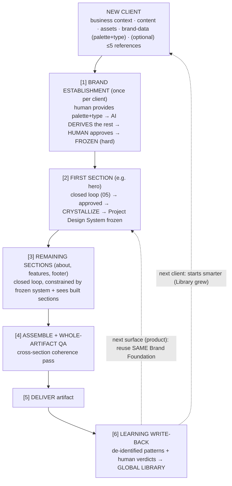
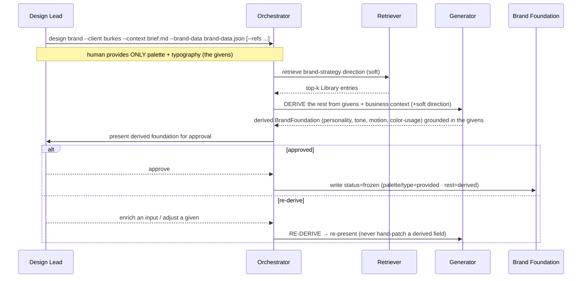
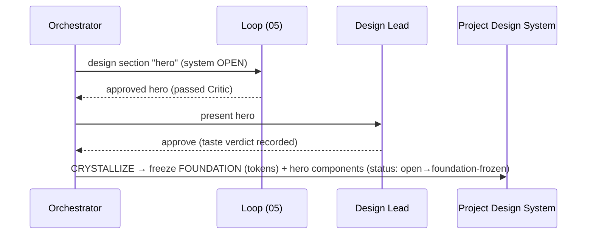
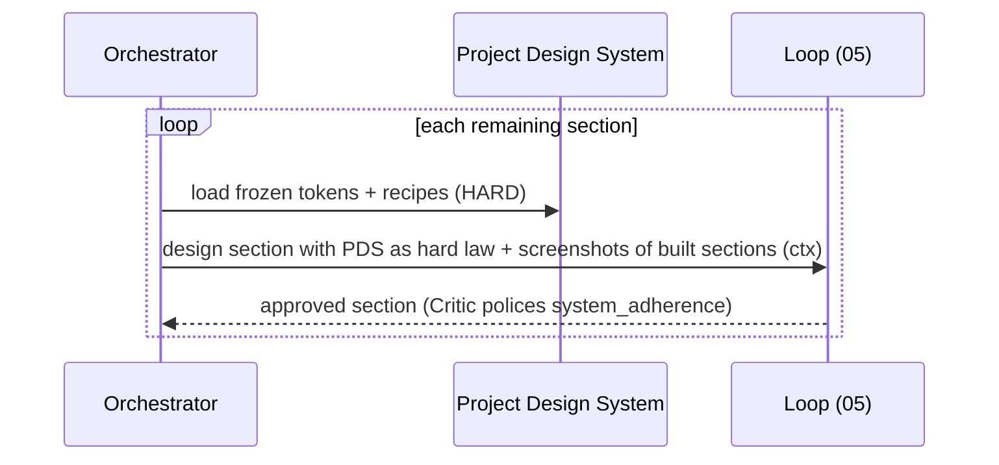
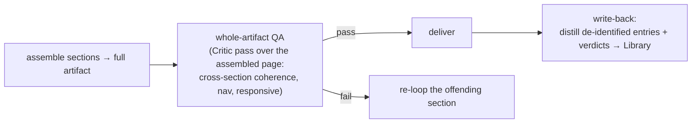
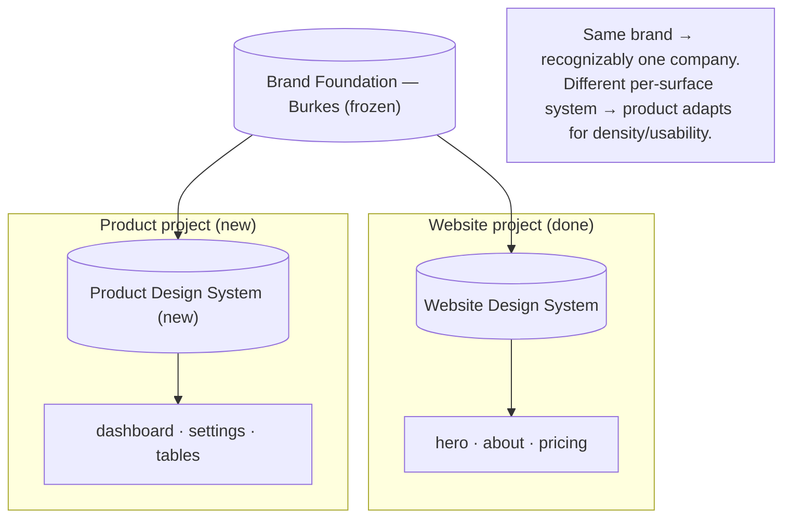

# 06 — Workflows

> End-to-end flows that compose the components (`01`), stores (`03`), memory rules (`04`), and the loop (`05`) into the things a user actually runs. Each maps to a CLI subcommand (`07`, and the full CLI surface here). The Burkes example threads through.

---

## 1. The full project lifecycle



This is the spine. Everything below zooms into one stage.

---

## 2. Stage 1 — Brand establishment (once per client)

High-stakes and long-lived, so a human approves it; after that it is frozen and reused for every surface.



**Burkes:** the Lead provides only the **givens** — a warm-neutral palette + humanist display / clean UI families (`brand-data.json`). From those plus the real-estate business context, the AI **derives** the personality `[trust, legacy, reliable, modern]`, an assured/editorial tone, and a restrained cinematic motion voice; the Lead approves; it freezes. Disagreement is resolved by re-deriving (adjust an input), not by hand-editing a derived field. (This same frozen brand is reused in §6 for the product.)

---

## 3. Stage 2 — First section + crystallization



The hero is designed with the loop; on human approval its **foundation** (tokens) is frozen into the Project Design System and the hero's components are locked. Later sections build against those frozen tokens and may *add* new components, never change them (`04` §3, `03` §4). The verdict is recorded for Library write-back and Critic calibration.

---

## 4. Stage 3 — Remaining sections (consistency enforced)



Each later section is generated **against** the frozen system and **sees** the already-built sections — the two mechanisms that guarantee the About page matches the hero (`04` §3).

---

## 5. Stages 4–6 — Assemble, deliver, learn



- **QA** is a Critic pass over the *assembled* artifact, catching cross-section issues a per-section pass can't (inconsistent nav, rhythm breaks across sections).
- **Write-back** runs once, post-delivery (`04` §6).

---

## 6. Cross-artifact reuse — website → product

The website and product are **siblings** under one Brand Foundation. The product run reuses the frozen brand and builds its **own** per-surface design system.



The product's **first screen** is its section-1: it runs the loop under the (already frozen) brand, then **crystallizes a new Product Design System**. Subsequent product screens inherit that. Brand consistency across artifacts is guaranteed by the shared parent; surface-appropriate difference is enabled by the separate child systems.

---

## 7. CLI subcommand → workflow map

| CLI subcommand | Workflow stage | Notes |
|---|---|---|
| `design brand --client <c> --context <brief> --brand-data <f>` | Stage 1 | derives the foundation from brand-data + context, then (with `--approve`) freezes it |
| `design section --client <c> --surface <s> --name <n> --content <f>` | Stages 2–3 | runs the loop; first approved section crystallizes the system |
| `design site --client <c> --surface <s> --plan <f>` | Stages 2–4 | sequences sections + assemble/QA |
| `design learn --artifact <id>` | Stage 6 | write-back to Library |
| `design show --client <c>` | — | inspect brand/system/artifacts/trace |

> The **MVP** (`07`) implements only a reduced `design section` — one section, no brand/library — to prove the loop. The other subcommands are the target surface this workflow doc describes.

---

## 8. Where the human is in the loop (and where they are not)

```
HUMAN gates (destination):                 AI runs unattended (route):
  • brand approval (Stage 1)                 • section design loop (05)
  • section approval / taste verdict         • retrieval + synthesis
  • final delivery sign-off                  • crystallization (mechanical)
                                             • write-back distillation
```

Over successive projects, as the Critic calibrates to human verdicts (`08` H8), the human gates can be relaxed — the **autonomy ladder** in `09`. Early on, every Critic "pass" is human-spot-checked; later, only exceptions are.
