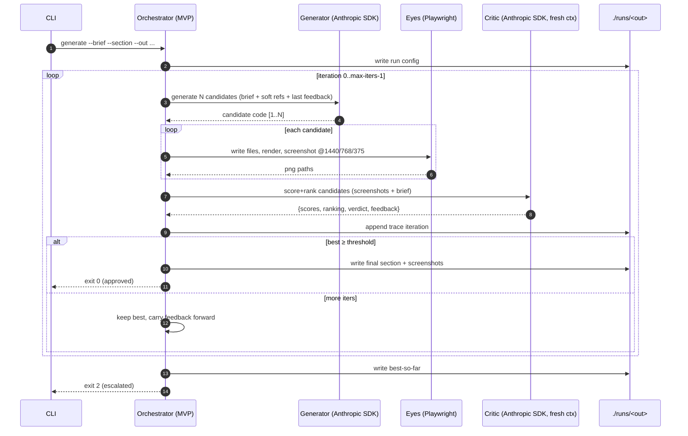

# 07 — MVP: the CLI closed loop on one section

> **The first thing to build.** A CLI that runs the closed loop (`05`) on a **single section**, from a brief, with **no** Library and **no** Brand/Design-System stores yet. Its only job: prove the **Eyes** capability — that an agent which sees its own render can improve a section against a brief with no reference to clone (**hypothesis H1**, `08`).
>
> This document is written to the **buildability bar**: an engineer should be able to implement it from this page alone, without further design decisions.

---

## 1. Scope

**In:** brief → generate → render → screenshot → critique → edit → repeat → output a finished section + a trace. One section. CLI-driven. Local.

**Out (deferred to later phases):** Library / vector DB / retrieval, Brand Foundation, Project Design System, crystallization, multi-section consistency, write-back, references (optional flag only), whole-site assembly. (These are specced in `02`–`06` but **not** built here.)

```
  MVP = the dashed box only
  ┌─────────────────────────────────────────────────────────────┐
  │  brief ──► [ generate → render → screenshot → critique ]──►  │  ← loop
  │                         ▲___________edit____________│         │
  │  ──► best section (html/css/js + screenshots + trace.json)    │
  └─────────────────────────────────────────────────────────────┘
   (no library · no brand store · no crystallization · no write-back)
```

### 1.1 Output is React + TypeScript (your stack), not raw HTML

The Generator outputs a **React + TypeScript component** (`.tsx`) styled with **Tailwind** — your real stack — not throwaway HTML/CSS/JS. Two reasons:

1. **It matches your stack.** The component drops straight into Next.js later; nothing is rewritten.
2. **It is the representation product *apps* need.** Apps are built from components with states; starting in React means the gap between "marketing page" and "product app" is small later (the remaining work is *driving* states, not changing the output format — see `09` open question #5).

The only added cost vs raw HTML is a **preview harness**: a thin app that mounts the generated component so the Eyes can render and screenshot it. Recommended: **Vite + React** for the MVP (starts in milliseconds, ideal for rendering many candidates fast); switch/add **Next.js** when you want production parity. The *component* is final either way — only the harness differs.

---

## 2. Command surface

```
ade generate \
  --brief    ./briefs/burkes-hero.json   # required: the brief (schema §3)
  --section  hero                         # required: section name
  --out      ./runs/burkes-hero           # required: output dir
  --variations 2                          # optional: N candidates per iteration (default 1)
  --max-iters 4                           # optional: loop budget (default 4)
  --threshold 80                          # optional: pass score 0–100 (default 80)
  --refs     ./refs/*.png                 # optional: ≤5 reference screenshots (soft)
  --model    claude-opus-4-8              # optional (default)
  --headed                                # optional: show the browser while rendering
```

Exit codes: `0` approved (passed), `2` escalated (budget exhausted, best-so-far emitted), `3` aborted (unrepairable), `1` error.

---

## 3. Brief input format (`--brief`)

A single JSON file. This is the **hard** input the section must serve.

```json
{
  "client": "The Burkes Group",
  "industry": "Real estate & mortgage",
  "location": "The Woodlands, TX",
  "audience": "home buyers, sellers, investors",
  "personality": ["trust", "legacy", "reliable", "modern"],
  "goal": "lead generation via confidence, not urgency",
  "feel": ["warm", "editorial", "spacious"],
  "section": {
    "name": "hero",
    "content": {
      "headline": "Built on Trust, Driven by Legacy.",
      "tags": ["Strategic", "Trusted", "Results-Driven"],
      "cta": { "text": "Contact Us", "href": "#contact" },
      "nav": ["About Us", "Buy", "Sell", "Services"]
    },
    "assets": { "hero_image": "./assets/hero-bg.png" }
  }
}
```

> In the MVP, brand-like cues (`personality`, `feel`) live **in the brief** because there is no Brand store yet. When the Brand Foundation is built (later phase), those move there and become a separate hard input.

---

## 4. The loop (exact behavior)



Iteration detail:
1. **Generate** — call the model with the Generator prompt (`05` §6.1, reduced: no brand/system inputs). With `--variations N`, request N candidates (separate calls or one call returning N).
2. **Render** — write each candidate's `Section.tsx` into the **preview harness**, (re)start/refresh its dev server (Vite/Next); Playwright loads the harness URL, sets viewport to each breakpoint, screenshots full page.
3. **Critique** — call the model with the Critic prompt (`05` §6.2) in a **fresh** context, passing the screenshots (vision) + the brief. Get structured scores + ranking + feedback.
4. **Decide** — if best ≥ `--threshold`, finish; else carry the best candidate + feedback into the next iteration.
5. **Trace** — append the full iteration record (`03` §6) to `trace.json`.

---

## 5. Output layout

```
runs/burkes-hero/
├── config.json                 # the resolved run config
├── final/
│   ├── Section.tsx             # the approved (or best-so-far) React/TS component
│   ├── supporting/*.tsx        # any helper components it produced
│   └── shots/{1440,768,375}.png
├── iterations/
│   ├── iter-0/
│   │   ├── cand-1/{Section.tsx,…,shots/*.png}
│   │   ├── cand-2/{…}
│   │   └── critique.json
│   ├── iter-1/ …
└── trace.json                  # array of RunRecord (03 §6) — the H1 measurement substrate
```

`trace.json` is the deliverable that matters most for validation: it lets you see whether scores **rose across iterations** (the H1 signal).

---

## 6. Component shape (MVP build)

A thin TypeScript program; no framework needed.

```
src/
├── cli.ts            # arg parsing → calls orchestrator (no logic here)
├── orchestrator.ts   # runLoop(): the 05 loop; owns budget, selection, trace
├── generator.ts      # generate(bundle, feedback?) → candidate Section.tsx (Anthropic SDK)
├── critic.ts         # critique(shots, brief) → scores+ranking+feedback   (Anthropic SDK, vision)
├── eyes.ts           # mount .tsx in harness → render → screenshots        (Playwright)
├── prompts.ts        # generator/critic prompt builders (05 §6)
├── schema.ts         # Brief, RunRecord, DimensionScores (03)
└── trace.ts          # append/read trace.json
harness/              # thin Vite + React app: mounts the candidate Section.tsx at a route
├── index.html        # harness shell (not the design output — just the preview host)
├── src/main.tsx      # imports the candidate component + renders it
└── vite.config.ts
```

Dependencies to add (build phase, not now): `@anthropic-ai/sdk`, `playwright`, a small arg parser, plus the harness stack — `react`, `react-dom`, `vite`, `@vitejs/plugin-react`, `tailwindcss`, `typescript`. Node + TS. `ANTHROPIC_API_KEY` from env. (Swap the Vite harness for a minimal Next.js app when you want production parity — the generated component is unchanged.)

---

## 7. Config & defaults

| Setting | Default | Notes |
|---|---|---|
| model | `claude-opus-4-8` | adaptive thinking; vision for the Critic |
| breakpoints | 1440 / 768 / 375 | screenshot widths |
| variations | 1 | raise to 2–3 to enable pairwise selection |
| max-iters | 4 | loop budget |
| threshold | 80 | weighted pass score |
| output max_tokens | high; **stream** the Generator call | a full section can be large — stream to avoid timeouts |

---

## 8. Done-criteria for the MVP

The MVP is complete when, for the Burkes hero brief (no reference):

1. `ade generate` runs the full loop unattended and emits a finished section + screenshots + `trace.json`.
2. The loop **demonstrably edits in response to critique** (iteration N+1 addresses iteration N's feedback) — visible in `iterations/`.
3. Across a handful of briefs, scores **trend upward** across iterations more often than not (the H1 signal; see `08`).
4. A human, shown the final output, judges it "good or close" for the brief on a meaningful fraction of runs (the H2 smell-test).

These criteria are deliberately about **the loop working**, not about perfect design — the MVP proves the mechanism; quality is raised later by Memory and a calibrated Critic.

---

## 9. What the MVP intentionally does NOT prove (and defers)

| Not proven here | Where it comes | Why deferred |
|---|---|---|
| Consistency across sections | Brand + crystallization (phase 2) | needs a second section + the hard stores |
| Getting smarter over time | Library + write-back (phase 3) | needs the vector DB + multiple projects |
| Calibrated taste | human-verdict loop (phase 4) | needs accumulated verdicts |

Keeping the MVP this narrow is the point: it is the **smallest build that proves the core thesis**, cheaply, before any infrastructure is committed.
