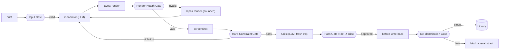

# 11 — Guardrails, Invariants & Resilience (the solutions)

> The failures in [10-failure-modes.md](./10-failure-modes.md) are not 80 unrelated bugs — they cluster into a handful of root patterns. This document **implements the solutions** as system-wide design elements: a deterministic **Guardrail Layer**, a set of always-true **Invariants**, and **Resilience / Integrity** rules. Designed once here, enforced everywhere. §7 maps each solution back to the specific `F-*` failures it closes, so coverage is verifiable, not asserted.

This doc adds a new component to the architecture (the **Guardrail Layer**) and is wired into [01](./01-actors-and-components.md), [02](./02-architecture.md), [05](./05-generation-loop.md), [03](./03-data-model.md), and [07](./07-mvp-cli.md).

---

## 1. The six root patterns behind the failures

| # | Root pattern | Failures it drives | Solution (this doc) |
|---|---|---|---|
| RP-1 | **LLM is asked to judge things that must be deterministic** (a11y, token drift, render success, schema, content presence) | F-QF-01/02, F-PDS-02, F-CON-01, F-GEN-01/03/05, F-EYE-05 | **Guardrail Layer** (§2) |
| RP-2 | **No role/context isolation** (generator grades itself; render bugs read as design) | F-JDG-03, F-EYE-05 | **Invariants I2, I3** + render-health gate |
| RP-3 | **Unbounded / unrecorded processes** (runaway loops, regressions, lost trace) | F-LOOP-*, F-MOD-04, F-STO-04, F-JDG-04 | **Bounded loop + best-so-far + durable trace** (§3, I4, I6, I10) |
| RP-4 | **Mutable, un-versioned state + concurrency** | F-BRD-02, F-STO-01/02/03/05 | **Integrity & concurrency rules** (§5, I5) |
| RP-5 | **Provider / infra fragility** | F-MOD-01/02/03/05/06, F-MEM-07 | **Resilience rules** (§4) |
| RP-6 | **Soft/hard conflation & untrusted input** | F-SPEC-03, F-REF-01/02, F-MEM-06, F-INP-06 | **Authority tagging + injection safety** (I1, I8, I9) |

The rest of the doc specifies each solution.

---

## 2. The Guardrail Layer (new deterministic component)

The spec previously leaned on the LLM Critic for everything. The failure analysis shows that anything **objectively checkable** must be checked by code, not a model. The **Guardrail Layer** is a set of deterministic checkers and gates that wrap the LLM steps. It is a *tool* (no model calls), making it cheap, reliable, and testable.



### 2.1 The gates

| Gate | When it runs | Checks (deterministic) | On fail |
|---|---|---|---|
| **Input Gate** | before generation | brief schema valid; required fields present; no unresolved contradictions; assets exist; content sanitized (injection-safe) | reject with precise error / ask human (F-INP-01..06) |
| **Render-Health Gate** | after render, **before** critique | non-blank DOM; no error overlay; build/type-check clean; fonts + images loaded; layout settled; screenshot↔candidate fingerprint match | route to **render-repair** path, not the Critic (F-EYE-01..05, F-GEN-03) |
| **Hard-Constraint Gate** | after a healthy render, before/with critique | token-allowlist (no off-system colors/type/space); required elements present; **a11y audit** (contrast, alt, focus, semantics, keyboard); responsive overflow; performance budget; no placeholder text; all brief content present | feed the specific violation back as **hard feedback**; never approve (F-PDS-02, F-CON-01, F-GEN-01/05, F-QF-01/02) |
| **Schema Gate** | on every LLM structured output (critic verdict, crystallizer, write-back entry) | output matches the expected JSON schema | one re-ask, then safe default (F-MOD-03) |
| **De-identification Gate** | before any Library write | no client name/PII; no exact brand tokens; no verbatim client copy | block + re-abstract; never write (F-WB-01) |

### 2.2 The composite Pass Gate (the key change)

A section is **approved** only when **both** hold:

```
APPROVED  ⇔  (all deterministic Hard-Constraint checks PASS)   AND   (Critic verdict = pass)
             └────────────── objective floor ──────────────┘        └──── subjective quality ────┘
```

This splits the job correctly: **deterministic checks own the objective floor; the Critic owns subjective quality.** The Critic can no longer "pass" something that fails contrast or drifts off-system, and it is never asked to *measure* what code can measure. (Closes the F-QF-* and F-JDG false-pass classes at the structural level.)

### 2.3 Phase-Exit Review — the Pass Gate, generalized to every artifact

The composite Pass Gate above runs at **one** boundary: an approved section. But a section is not the only artifact that becomes a hard input to a later stage. A **Brand Foundation** becomes law for every surface; a **Project Design System** becomes law for every later section; a **Library entry** becomes retrieved direction for every future project. Today each of those is produced and then handed **straight to a human** with no automated review — so an off-brief brand (F-BRD-01), a mis-crystallized system (F-PDS-01), or a badly-abstracted entry (F-WB-02) reaches the human cold, and if the human misses it, the error **propagates to everything downstream**.

The **Phase-Exit Review** closes this by applying the *same composite pattern* at **every** artifact boundary, not just the section one:

```
An artifact may become an input to a later stage ONLY after it passes its Phase-Exit Gate:

   ┌─ deterministic checks ──┐   ┌──── fresh-context Critic review ────┐   ┌─── human ────┐
   │ objective, per artifact  │ ∧ │ subjective, per-artifact rubric,    │ ∧ │ at high-stakes │
   │ (a11y / tokens / schema /│   │ actionable feedback, BOUNDED        │   │ boundaries,    │
   │  de-id …)                │   │ review → fix → re-check (≤1–2 tries)│   │ until the      │
   └──────────────────────────┘   └─────────────────────────────────────┘   │ ladder earns   │
                                                                             │ its removal    │
                                                                             └────────────────┘
```

Key properties:

- **It is not a new component or a monolithic "master judge."** It is the existing pair — the deterministic Guardrail Layer (objective) and a **fresh-context Critic** (subjective, I2) — invoked at more boundaries. The Critic review here is an **LLM call and therefore never part of the deterministic Guardrail Layer**; it is the *subjective* half of the composite gate, run on a non-section artifact.
- **Each boundary has its own rubric**, because the artifacts differ in kind — most are *data/strategy*, not rendered pixels, so the review judges different things than the section (pixel) Critic:

  | Boundary | Review rubric (subjective) | Deterministic half | Closes |
  |---|---|---|---|
  | **Brand Foundation** (derived → before approval) | does the derived personality/tone/motion voice fit the business context + provided palette/type? are the 2–3 directions distinct and justified? | palette a11y/contrast (F-BRD-04) | F-BRD-01 |
  | **Project Design System** (crystallized → before freeze) | do the extracted tokens faithfully capture the hero *without over- or under-specifying*? is the foundation complete enough for later sections, not over-fitted to one? (`04` §3) | schema-valid tokens | F-PDS-01 |
  | **Library entry** (abstracted → before insert) | is the abstraction at a *transferable* altitude — general enough to reuse, specific enough to be useful? (`04` §6) | de-identification gate (F-WB-01) | F-WB-02 |
  | **Section** (already gated) | brand/system/brief/craft on rendered pixels (`05` §4) | Hard-Constraint Gate | F-GEN-*, F-QF-* |
  | **Assembled artifact** (already gated) | cross-section coherence (`06` §5) | responsive / overflow | F-CON-03 |

- **Bounded, not iterative.** Unlike the section Eyes-loop (up to `max_iters`), a phase-exit review is a *gate*, not the engine: **≤1–2 review→fix→re-check** cycles, then escalate to the human. A single review that hands back fixes and lets them through **unverified** is forbidden — that is the open-loop "final exam" the loop replaced (`05` §8); the fix is always re-checked.
- **It catches bad; it does not certify good.** The Critic is a proxy, not an oracle (`05` §4, §8 below). The Phase-Exit Review is a **pre-human filter + hard floor**, never a reason to remove the human gate at a high-stakes boundary before that boundary's Critic↔human agreement is proven (H8, autonomy ladder `09` §2). It is precisely the surface on which that agreement is *measured*, per boundary.

---

## 3. Loop-integrity solutions (bounded, non-regressing, recorded)

| Solution | Rule | Closes |
|---|---|---|
| **Best-so-far retention** | The current best candidate is kept; an iteration's output replaces it only if it scores higher. The loop can never end worse than its best seen. | F-LOOP-02 (regression) |
| **Monotonic, bounded loop** | `max_iters` + token/wall-clock budget; on exhaustion → **escalate** with best-so-far, never silently fail. | F-LOOP-01/04/05, F-MOD-04 |
| **Render-repair sub-loop** | Render failures get a *separate*, bounded repair path (fix code), distinct from design critique; unrepairable after K tries → **abort + record**. | F-GEN-03, F-EYE-05 |
| **Durable trace** | Every iteration is appended to the trace **immediately** (not at run end), atomically. | F-STO-04 |
| **Terminal-state guarantee** | Every run ends in exactly one recorded state: `approved | escalated | aborted`. No run vanishes. | F-LOOP-*, observability |

---

## 4. Resilience requirements (provider & infra)

The Orchestrator must treat every external call as fallible:

- **Retries with backoff** on transient model/API errors (429/5xx/timeout); resume from the last persisted iteration. (F-MOD-01)
- **Refusal handling + fallback** for benign-task refusals. (F-MOD-02)
- **Stream** large Generator outputs; generous `max_tokens`; per-section scope to bound size. (F-GEN-06, F-MOD-06)
- **Structured outputs** for all machine-read responses (critic, crystallizer, entries) + Schema Gate. (F-MOD-03)
- **Pinned model id**, recorded in every trace record; re-baseline metrics on any change. (F-MOD-05)
- **Graceful degradation:** retrieval/vector-store failure is non-blocking — proceed on brand+brief, log the degradation. (F-MEM-07, F-MEM-05)
- **Embedding-model versioning:** store the embedding model id with each vector; re-embed the whole store on change. (F-MEM-03)

---

## 5. Data integrity & concurrency

All stores obey these rules (specified into [03](./03-data-model.md) §8.x):

- **Atomic writes** — temp-file + atomic rename; never a partial file. (F-STO-01)
- **Append-only versioning** for the hard stores (Brand, Design System); every change is a new immutable version with provenance; reads are snapshot-consistent. (F-STO-02, F-BRD-02)
- **Hard stores written only by deliberate events** — Brand by human approval; Design System by crystallization. Never as a side effect of generation.
- **Per-client concurrency control** — a lock or optimistic version precondition so concurrent runs can't clobber a client's Brand/System/Library. (F-STO-03)
- **Referential integrity** — soft-delete/archive over hard-delete; integrity scan catches dangling artifact→system / entry→provenance links. (F-STO-05)
- **Schema-validate on read** — corrupt/incompatible data is detected at load, not propagated. (F-STO-01)

---

## 6. Brief Comprehension step (input understanding)

Before any generation spend, a **comprehension pass** (cheap, one LLM call gated by the Input Gate) runs:

```
brief ──► COMPREHEND ──► { restated goal · audience · constraints · detected gaps · detected conflicts }
                              │
                  ┌───────────┴───────────┐
            clear │                       │ missing field / contradiction / ambiguity
                  ▼                       ▼
            proceed to generation   ASK the human, do not invent
```

- **Restate** the brief as goal/audience/constraints; the human can confirm or correct. (F-INP-01)
- **Detect missing required fields** and **contradictions**; surface them instead of inventing. (F-INP-02, F-INP-03)
- Comprehension output is recorded and fed to the Generator and Critic as the canonical interpretation.

---

## 7. System invariants (always-true properties)

These are guarantees the implementation must uphold and tests must assert. They are the compact contract of the whole system.

| ID | Invariant | Enforced by | Closes |
|---|---|---|---|
| **I1** | Hard inputs always override soft inputs (precedence order, [04 §7](./04-memory-and-consistency.md)). | authority tagging at assembly | F-SPEC-03, F-REF-02, F-MEM-06 |
| **I2** | The Critic never shares context/session with the Generator. | separate sessions | F-JDG-03 |
| **I3** | Objectively-checkable properties are checked deterministically, never LLM-judged. | Guardrail Layer | F-QF-01/02, F-PDS-02, F-JDG-04 |
| **I4** | A run's result is never worse than its best-seen candidate. | best-so-far retention | F-LOOP-02 |
| **I5** | Hard stores are append-only, versioned, atomically written, and changed only by deliberate events. | integrity rules (§5) | F-BRD-02, F-STO-01/02 |
| **I6** | Every loop iteration is persisted before the next begins. | durable trace | F-STO-04 |
| **I7** | The Library is written only from human-approved artifacts, through the de-identification gate. | write-back policy | F-WB-01/04 |
| **I8** | References are soft, capped at 5, and never scored for resemblance. | bundle assembly + rubric | F-REF-01/03 |
| **I9** | Brief/content is treated as data, never instructions; hard constraints survive any input. | injection-safe prompting + post-checks | F-INP-06, F-SPEC-03 |
| **I10** | Every run terminates in exactly one recorded state: approved / escalated / aborted. | bounded loop + escalation | F-LOOP-*, F-SPEC-05 |
| **I11** | Render-valid screenshots are a precondition for design critique. | render-health gate | F-EYE-05 |
| **I12** | Reported quality numbers are observed (human-anchored), never predicted or Critic-only. | measurement discipline | F-SPEC-05, F-JDG-02 |
| **I13** | No artifact becomes a hard input to a later stage without passing its **Phase-Exit Gate** (deterministic checks ∧ fresh-context Critic review); hard-store artifacts additionally require human approval until the autonomy ladder earns its removal. | Phase-Exit Review (§2.3) + human gate | F-BRD-01, F-PDS-01, F-WB-02, error propagation |

---

## 8. Coverage map (solution → failures closed)

Every failure class in [10](./10-failure-modes.md) is addressed by at least one solution here:

| Solution | Failures closed / mitigated |
|---|---|
| **Guardrail Layer — Input Gate** | F-INP-04/05/06, F-REF-04 |
| **Guardrail Layer — Render-Health Gate** | F-EYE-01/02/03/04/05, F-GEN-03 |
| **Guardrail Layer — Hard-Constraint Gate** | F-GEN-01/05, F-PDS-02, F-CON-01, F-QF-01/02 |
| **Guardrail Layer — Schema Gate** | F-MOD-03, F-GEN-06 |
| **Guardrail Layer — De-identification Gate** | F-WB-01 |
| **Composite Pass Gate** | F-JDG-04 (false pass), F-QF-*, F-PDS-02 |
| **Phase-Exit Review (§2.3)** | F-BRD-01, F-PDS-01, F-WB-02 (error propagation at phase boundaries) |
| **Best-so-far + bounded loop** | F-LOOP-01/02/04/05, F-MOD-04 |
| **Durable trace + terminal-state** | F-STO-04, observability across F-LOOP-* |
| **Resilience rules** | F-MOD-01/02/05/06, F-MEM-03/05/07, F-GEN-06 |
| **Integrity & concurrency** | F-STO-01/02/03/05, F-BRD-02 |
| **Brief Comprehension** | F-INP-01/02/03 |
| **Invariants I1/I8 (authority + refs)** | F-SPEC-03, F-REF-01/02/03, F-MEM-06 |
| **Invariant I2 (role isolation)** | F-JDG-03 |
| **Invariants I7/I12 + human gate** | F-WB-04, F-HUM-01/03, F-JDG-02, F-SPEC-05 |
| **Confidence-decay retrieval (MP-9)** | F-MEM-01/02, F-WB-02/03/05, F-RNK-*, F-LRN-01 |
| **Human gate + autonomy ladder (MP-12)** | F-HUM-02/03, F-JDG-01, F-SPEC-02 |

Failures that remain **partially open by nature** (not fully closeable, only managed) are the *taste-ceiling* ones — F-JDG-01, F-SPEC-01/02, F-LRN-01/02. These are the genuine open research items ([09](./09-roadmap-and-open-questions.md)); the guardrails reduce their blast radius (deterministic floor + human gates) but cannot make the Critic reliable on their own. The spec is honest about this rather than pretending a guardrail solves taste.

---

## 9. What's in the MVP vs later

The cheap, high-value guardrails belong in the **MVP** (Phase 0) — they cost little and protect H1's measurement:

| Guardrail / rule | MVP (Phase 0) | Later phase |
|---|---|---|
| Input Gate (brief schema, asset check, content/placeholder) | ✅ | — |
| Render-Health Gate (build/type-check, non-blank, fonts/images, settle) | ✅ | — |
| Hard-Constraint Gate — a11y (contrast/alt/focus) + responsive overflow | ✅ | — |
| Hard-Constraint Gate — token-allowlist | — (no design system yet in MVP) | ✅ Phase 1 |
| Schema Gate on critic output | ✅ | — |
| Best-so-far + bounded loop + durable trace + terminal-state | ✅ | — |
| Resilience (retries, streaming, refusal, pinned model) | ✅ | — |
| De-identification Gate | — (no Library in MVP) | ✅ Phase 2 |
| **Phase-Exit Review (brand / PDS / library)** | — (no hard stores or Library in MVP) | ✅ Phase 1 (brand, PDS) · Phase 2 (library) |
| Versioning / concurrency / referential integrity | minimal (atomic writes + trace) | ✅ when hard stores exist |
| Brief Comprehension step | ✅ (lightweight) | richer later |

> The MVP done-criteria in [07](./07-mvp-cli.md) are updated to include these gates: the loop is only "working" if a render bug is caught by the Render-Health Gate (not the Critic), and an a11y/contrast failure cannot pass.

---

## 10. How this changes the architecture (summary)

- **New component:** the **Guardrail Layer** (deterministic tool) joins Eyes / Generator / Critic in Layer 2 ([01](./01-actors-and-components.md), [02](./02-architecture.md)).
- **The loop gains gates:** render-health before critique; hard-constraint checks as part of the pass; pass = deterministic ∧ Critic ([05](./05-generation-loop.md)).
- **Stores gain integrity rules:** atomic, versioned, locked, durably traced ([03](./03-data-model.md) §8).
- **Inputs gain a comprehension step** and injection safety.
- **The Critic shrinks in *what*, widens in *where*:** its job stays subjective-quality-only (everything objective moves to code), but the same fresh-context judge now runs as a **Phase-Exit Review** on each phase artifact (brand, design system, library entry) before that artifact becomes law downstream (§2.3), not only on section pixels.

This is the difference between a system that *describes* its failure modes and one that is *engineered against them*.
