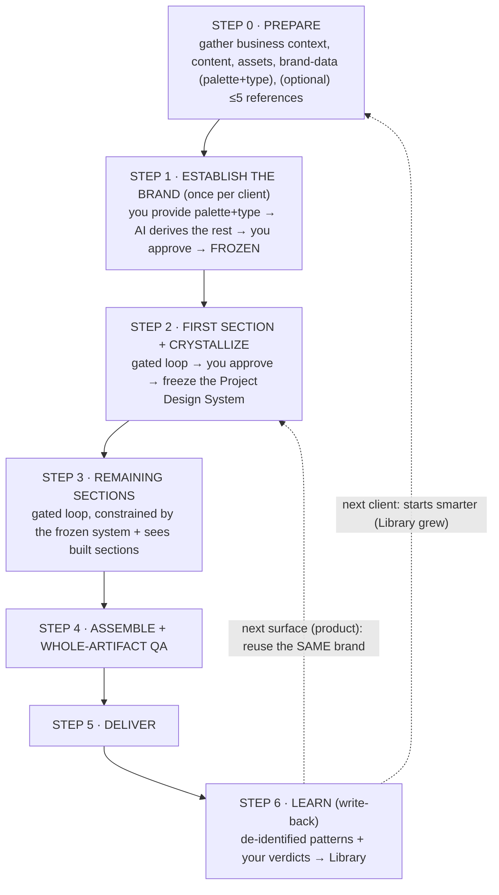
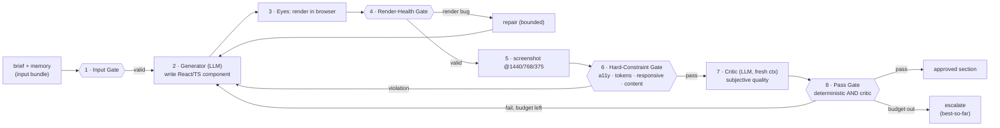
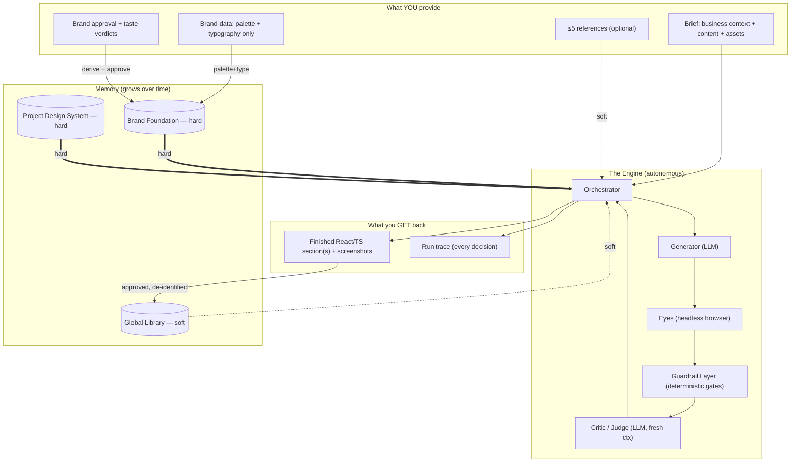
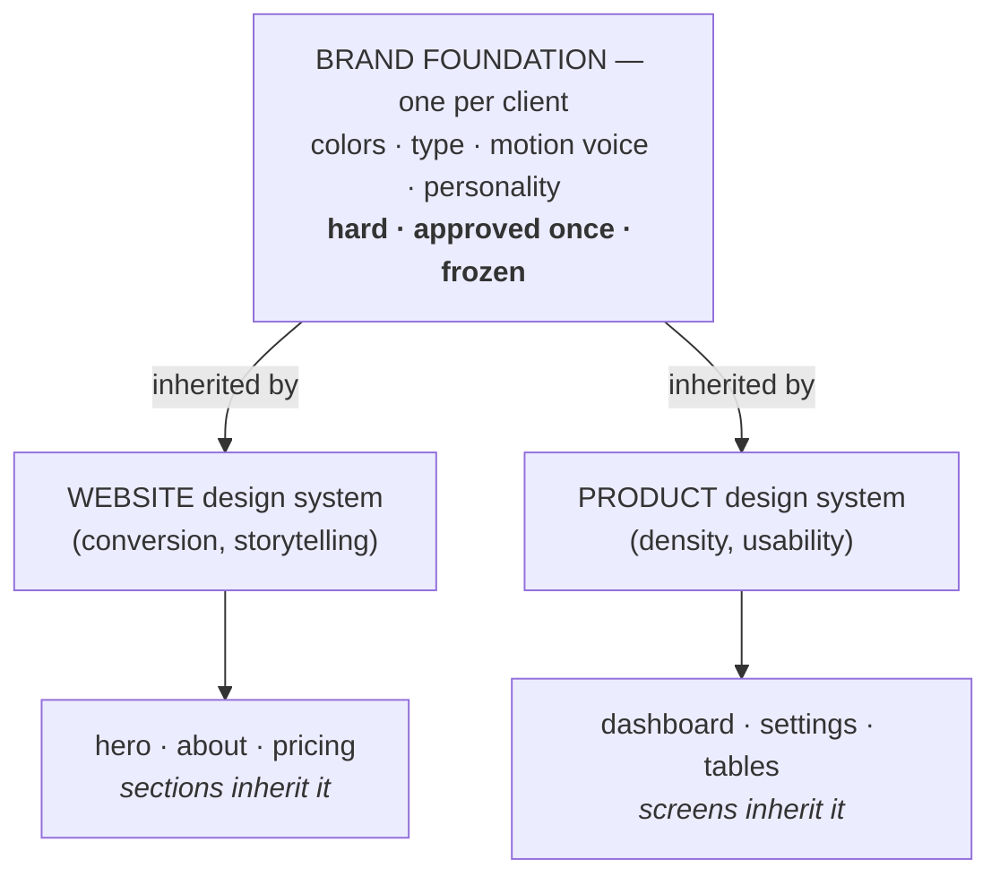

# Autonomous Design Engine (ADE) — Specification

> A system in which the AI **autonomously designs** websites and products from a company's business context — drawing on accumulated design knowledge, judging its own rendered output, and getting better with every project. **Not** a tool that clones a reference site.
>
> This is a **specification**, not code. It exists to be understood at any level of detail, stress-tested against our assumptions, and built from later. **No application code exists yet** — by design.

**This README is the front door.** It walks the **entire process from start to finish** — what you do at the beginning, what you hand the system, what happens at each step, and what comes out — so you can understand the whole thing without reading any other file. Deeper detail is one click away in the numbered docs.

---

## Contents

1. [What it is (in one breath)](#what-it-is-in-one-breath)
2. [The process at a glance](#the-process-at-a-glance)
3. [Step 0 — Before you begin: what you prepare](#step-0--before-you-begin-what-you-prepare)
4. [The end-to-end process, step by step](#the-end-to-end-process-step-by-step)
   - [Step 1 — Establish the brand (once per client)](#step-1--establish-the-brand-once-per-client)
   - [Step 2 — Design the first section, then crystallize](#step-2--design-the-first-section-then-crystallize)
   - [Step 3 — Design the remaining sections](#step-3--design-the-remaining-sections)
   - [Step 4 — Assemble and QA the whole artifact](#step-4--assemble-and-qa-the-whole-artifact)
   - [Step 5 — Deliver](#step-5--deliver)
   - [Step 6 — Learn (write-back)](#step-6--learn-write-back)
5. [Inside one step: the generation loop (the engine)](#inside-one-step-the-generation-loop-the-engine)
6. [What you get back (the outputs)](#what-you-get-back-the-outputs)
7. [The whole system on one page](#the-whole-system-on-one-page)
8. [Memory & consistency](#memory--consistency)
9. [The soft/hard model (the spine)](#the-softhard-model-the-spine)
10. [Guardrails (why it doesn't go off the rails)](#guardrails-why-it-doesnt-go-off-the-rails)
11. [Where you actually start: the MVP](#where-you-actually-start-the-mvp)
12. [Common questions](#common-questions)
13. [Full document set & reading order](#full-document-set--reading-order)
14. [Glossary](#glossary)
15. [Status & next step](#status--next-step)

---

## What it is (in one breath)

Three capabilities make an autonomous designer:

```
EYES    render → see → critique → edit      (build first — the MVP)
MEMORY  a soft growing Library + hard per-client Brand/System stores
TASTE   judge "is this good for this brief?" with no source to copy  (open research)
```

The one-line test that separates ADE from a cloning tool:

> **If you deleted the reference, would the system still produce a good design?**
> In ADE, *yes* — the intelligence lives in the AI, its Library, and its ability to judge its own work. A reference is at most *direction*, never a template.

---

## The process at a glance

The whole thing is **one prepare step + six run steps**. You do the work at the top of each step; the engine does the rest. The middle of every "design" step is the same **generation loop** (covered in its own section below).



| Step | You do | The system does | You get |
|---|---|---|---|
| **0 · Prepare** | gather context, content, assets; write the brief + brand-data | — | a ready brief + brand-data + assets |
| **1 · Brand** | provide palette+type; approve (once) | **derives** the rest of the Brand Foundation | a **frozen** brand identity (hard) |
| **2 · First section** | approve | runs the loop, then crystallizes | an approved section + a **frozen** Design System |
| **3 · More sections** | approve each | runs the loop per section, constrained | consistent sections |
| **4 · Assemble + QA** | review | assembles + critiques the whole artifact | a coherent, QA'd artifact |
| **5 · Deliver** | take delivery | packages the output | React/TS components + screenshots + trace |
| **6 · Learn** | — | de-identifies + writes lessons to the Library | a smarter system for next time |

> **Where you actually start in practice:** not at Step 1. The **MVP** ([§ Where you actually start](#where-you-actually-start-the-mvp)) is a stripped-down **Step 2** — one section, from a brief, with no brand store and no Library yet — because that's the cheapest way to prove the core idea. The full six-step process is the destination; the MVP is the first stone laid.

---

## Step 0 — Before you begin: what you prepare

Everything starts with **inputs you assemble**. You provide **six kinds**, each tagged by **authority** — *hard* inputs the AI **must obey**, *soft* inputs it **may diverge from**.

| # | Input | Who/when | Authority | What it is |
|---|---|---|---|---|
| 1 | **Business context (the brief)** | you, per project | **hard** | industry, audience, goal of the business |
| 2 | **Content & assets** | you, per section | **hard** | the actual copy (headline, CTA, nav), logo, images |
| 3 | **Brand-data (palette + typography)** | you, **once** per client | **hard** | the *only* visual essentials you supply — exact colors + typefaces (a small `brand-data.json`) |
| 4 | **References (≤5)** | you, *optional* | **soft** | inspiration sites/screenshots — *direction only* |
| 5 | **Brand approval** | you, **once** per client | gates | you approve the Brand Foundation the AI **derives** from your brand-data + context; then it's frozen |
| 6 | **Taste verdicts** | you, ongoing | calibrates | approve / reject / notes on finished work |

You do **not** specify layouts, pick colors per section, or write rules per mistake. Those are the AI's job (the "route"). **You set the *destination*; the AI finds the route.**

Notice what you **don't** provide: brand **personality, tone, and motion** are *not* your inputs — the AI **derives** them from your business context + brand-data, so its strategy stays objective and un-anchored. You supply the colors and typefaces you maintain; the AI decides what they *mean* and how they move. (Why: [04 §2.1](./04-memory-and-consistency.md).)

**Practically, before you run anything you need:**

- a **brief JSON** (business context + content; shape below),
- a **brand-data JSON** with your **palette + typography only** (`brand-data.json`),
- the **content** for the section(s) you want (headline, CTA, nav, etc.),
- any **assets** (logo, hero image) referenced by the brief,
- *(optional)* up to **5 reference screenshots** for direction,
- for the build phase only: an **`ANTHROPIC_API_KEY`** and the tooling in [07](./07-mvp-cli.md).

### The two files — concrete shape

You hand over **two small files** (the running example, "The Burkes Group" — a real-estate firm). First, `brief.json` — the business context + content:

```json
// brief.json — what the business is + the actual copy
{
  "client": "The Burkes Group",
  "industry": "Real estate & mortgage",
  "audience": "home buyers, sellers, investors",
  "goal": "lead generation via confidence, not urgency",
  "section": {
    "name": "hero",
    "content": {
      "headline": "Built on Trust, Driven by Legacy.",
      "tags": ["Strategic", "Trusted", "Results-Driven"],
      "cta": { "text": "Contact Us", "href": "#contact" },
      "nav": ["About Us", "Buy", "Sell", "Services"]
    },
    "assets": { "hero_image": "./assets/hero-bg.png" }
  }
}
```

Second, `brand-data.json` — the **only** visual essentials you supply (palette + typography):

```json
// brand-data.json — the colors + typefaces you own and maintain
{
  "client_id": "burkes",
  "palette": [
    { "role": "background", "value": "#F7F5F1" },
    { "role": "ink",        "value": "#1C1A17" },
    { "role": "accent",     "value": "#8A6A3B" },
    { "role": "muted",      "value": "#6B6155" }
  ],
  "typography": [
    { "role": "display", "family": "Canela", "fallback": "Georgia, serif" },
    { "role": "ui",      "family": "Inter",  "fallback": "system-ui, sans-serif" }
  ],
  "logo_ref": "./assets/burkes-logo.svg"
}
```

> The **brief is a problem statement**, not a design spec. You tell the system *what the business needs*; it decides *how the design should serve it*.
>
> **Personality, tone, and motion are deliberately absent** from both files — the AI **derives** them from your business context + brand-data, and a human approves the result. You provide the *facts*; the AI forms the *strategy*. (Full schemas: brand-data + foundation in [03 §3](./03-data-model.md), brief in [07 §3](./07-mvp-cli.md).)

---

## The end-to-end process, step by step

Each step below uses the same shape: **You provide → The system does → You get**. Together they are the complete run, from a new client to a delivered, learned-from artifact. (The authoritative version with sequence diagrams is [06-workflows.md](./06-workflows.md).)

### Step 1 — Establish the brand (once per client)

The brand is high-stakes and long-lived, so it is set **once** and a human signs off. It is built **fix-then-derive**: you provide only the visual essentials you own; the AI derives the strategy around them.

| | |
|---|---|
| **You provide** | **brand-data** — palette + typography only (the givens) — plus the business context (+ optional references) |
| **The system does** | takes your palette/type as fixed and **derives the rest of the Brand Foundation** — personality, tone, motion voice, color-usage rules — grounded in your givens + the business context |
| **You do** | review the **derived** foundation → **approve** (or enrich an input and let it **re-derive** — you never hand-patch a derived field) |
| **You get** | a **frozen Brand Foundation** (hard law for everything that follows) |

**Burkes:** you provide a warm-neutral palette + humanist display / clean UI families (`brand-data.json`). The AI derives the personality `[trust, legacy, reliable, modern]`, an assured/editorial tone, and a restrained motion voice from that data + the real-estate context; the lead approves; it freezes. Reused unchanged for the product later.

> **Why only colors + typography?** Those are the facts you *own and maintain*. Everything else is strategy — and providing it would anchor the AI's thinking. Handing over only the essentials keeps its recommendations objective; you still hold the **veto** (approval), just not the pen. (Principle: [04 §2.1](./04-memory-and-consistency.md).)

> Why a human gate here: the brand constrains *every* later artifact, so a wrong brand is expensive. This is one of the few places the human is required (see [the human-in-the-loop map](./06-workflows.md#8-where-the-human-is-in-the-loop-and-where-they-are-not)).

### Step 2 — Design the first section, then crystallize

The first section (usually the **hero**) is special: there is no Project Design System yet, so this section *creates* it. The section is designed by the **generation loop** (next section), and on approval its foundational decisions are **frozen** so every later section must match.

| | |
|---|---|
| **You provide** | the brief + content/assets for this section (brand already frozen) |
| **The system does** | runs the **gated generation loop** (generate → render → gates → critique → edit) until the section passes |
| **You do** | review the approved section → **approve** (your verdict is recorded) |
| **The system then does** | **crystallizes** — extracts the tokens this section established (color, type, spacing, radius, motion) and **freezes them** into a new **Project Design System**; the hero's components are locked in |
| **You get** | an approved hero component **+** a frozen Project Design System (hard law for Step 3) |

> **Crystallization freezes the *foundation* (tokens), not everything.** Later sections may **add** new components; they can never **change** the frozen tokens. Frozen at the core, extensible at the edges. (Detail: [04 §3](./04-memory-and-consistency.md).)

### Step 3 — Design the remaining sections

Every other section (about, features, pricing, footer…) runs the **same loop** as Step 2, but now under two consistency constraints that did not exist for the hero.

| | |
|---|---|
| **You provide** | the content for each remaining section |
| **The system does** | for each section, runs the loop with: (a) the **frozen Project Design System** as hard law, and (b) **screenshots of the already-built sections** as visual context, so the new section *looks like it belongs* |
| **You do** | review/approve each section |
| **You get** | approved sections that are **consistent** with the hero (same tokens) without being **monotonous** (free layout/composition) |

This is *how* the About page is guaranteed to match the hero: it is generated **against** the frozen system **and** it can see the sections already built (see [04 §3](./04-memory-and-consistency.md), [06 §4](./06-workflows.md#4-stage-3--remaining-sections-consistency-enforced)).

### Step 4 — Assemble and QA the whole artifact

Per-section approval can't catch problems that only appear when sections sit together (nav drift, rhythm breaks across sections, responsive seams). So the assembled page gets its own pass.

| | |
|---|---|
| **You provide** | nothing new |
| **The system does** | assembles the approved sections into the full artifact and runs a **Critic pass over the whole page** — cross-section coherence, nav consistency, responsiveness end to end |
| **On failure** | the offending section is **re-looped** (back into the engine), not patched blindly |
| **You get** | a coherent, QA'd artifact ready to deliver |

### Step 5 — Deliver

| | |
|---|---|
| **You provide** | nothing new |
| **The system does** | packages the artifact: the **React + TypeScript** components, the **screenshots** at each breakpoint, and the **run trace** |
| **You get** | output that drops straight into Next.js — your real stack, nothing to rewrite (full output list in [§ outputs](#what-you-get-back-the-outputs)) |

### Step 6 — Learn (write-back)

This is the step that makes the system get **better over time** — the difference between a tool and an engine.

| | |
|---|---|
| **You provide** | nothing new (your earlier approve/reject verdicts are reused) |
| **The system does** | distills the approved artifact into **de-identified** Library entries — *what* pattern, *why* it was built, *when* it fits — each with a confidence score, and writes them to the **Global Library** |
| **You get** | a smarter system: the **next** project retrieves these lessons and starts ahead of where this one did |

**Then the loop of projects closes** (see the dashed arrows in [the at-a-glance diagram](#the-process-at-a-glance)):

- **Next surface for the same client** (e.g. the product app) → reuse the **same frozen brand**, jump back to Step 2 to crystallize a *new* per-surface system.
- **Next client entirely** → start at Step 0 again, but the Library has grown, so the system begins smarter.

---

## Inside one step: the generation loop (the engine)

Steps 1–3 all say "runs the loop." **This is the loop** — the **Eyes** capability and the single most important mechanism in ADE. It is the same micro-process every time a section is designed.

The agent generates a design, **renders and looks at it**, a deterministic **Guardrail Layer** checks the objective floor, a **Critic** judges subjective quality, and it **edits and repeats** until it passes. A design is **approved only when both the deterministic checks pass AND the Critic passes** (the composite **Pass Gate**).



The same eight stages, in words — **what happens at each step of the loop**:

| # | Stage | What happens | If it fails |
|---|---|---|---|
| 1 | **Input Gate** | check the brief/assets are valid and non-contradictory | reject early with a clear error |
| 2 | **Generate** | the LLM writes a React/TS component (Tailwind) from the input bundle (+ last critique) | — |
| 3 | **Render** | the Eyes mount the component in a preview harness and load it in a real browser | — |
| 4 | **Render-Health Gate** | deterministic: does it build, is the DOM non-blank, fonts/images loaded, layout settled? | route to a **bounded repair** — a render bug is **never** judged as bad design |
| 5 | **Screenshot** | capture the rendered result at 1440 / 768 / 375 | — |
| 6 | **Hard-Constraint Gate** | deterministic: a11y/contrast, responsive overflow, content present, token-allowlist | feed the **specific** violation back to step 2 |
| 7 | **Critique** | a **fresh-context** Critic scores *subjective* quality (brand fit, brief fit, craft) from the screenshots | feed actionable notes back to step 2 |
| 8 | **Pass Gate** | approved **iff** deterministic checks pass **AND** Critic ≥ threshold | if budget remains → loop again; else **escalate with best-so-far** |

Three things make this trustworthy rather than a runaway:

- **Bounded.** A per-section budget (`max_iterations`) caps the loop; it never spins forever.
- **Best-so-far.** The best candidate is retained throughout — a run never ends worse than its best attempt, and an escalation still returns something usable (never nothing).
- **Every run ends in a recorded state** — `Approved`, `Escalated` (budget exhausted → human reviews), or `Aborted` (a hard constraint genuinely can't be met → recorded and surfaced). **No silent failure.**

Why this matters: the old approach generated *blind* and hoped. ADE **looks at its own work** and is gated so a render bug can never be mistaken for bad design, and a contrast/brand failure can never "pass." (Full detail: [05-generation-loop.md](./05-generation-loop.md); the gates: [11-guardrails-and-invariants.md](./11-guardrails-and-invariants.md).)

---

## What you get back (the outputs)

| Output | What it is |
|---|---|
| **Finished section(s) / artifact** | real **React + TypeScript** components (Tailwind) — your stack, drop straight into Next.js |
| **Screenshots** | the rendered result at 1440 / 768 / 375 |
| **Run trace** | every iteration, score, and decision (audit + the substrate for measuring whether the loop actually improves) |
| **Growing memory** *(over time)* | a per-client **Brand + Design System**, and a cross-project **Library** that makes the next project better |

A delivered run looks like this on disk (MVP shape, from [07 §5](./07-mvp-cli.md)):

```
runs/burkes-hero/
├── config.json                 # the resolved run config
├── final/
│   ├── Section.tsx             # the approved (or best-so-far) React/TS component
│   └── shots/{1440,768,375}.png
├── iterations/                 # every candidate + critique, per iteration
└── trace.json                  # the full decision history
```

---

## The whole system on one page

Your inputs (left) feed an autonomous engine (middle) that draws on growing memory (right) and returns finished designs. Over time the **left shrinks** (less instruction needed) and the **right grows** (more accumulated knowledge).



The **Orchestrator** is the one stateful brain: it assembles the input bundle, runs the loop, enforces the hard constraints, decides crystallization, and triggers write-back. Everything else is a stateless worker it calls. (Full component catalogue: [01](./01-actors-and-components.md); architecture + tech stack: [02](./02-architecture.md).)

---

## Memory & consistency

There are **two** memories doing **opposite** jobs — never merge them:

| | **Global Library** | **Brand + Design System** |
|---|---|---|
| Job | get *smarter* over time | stay *consistent* |
| Scope | all clients, forever | one client / one surface |
| Used as | retrieved direction (soft) | binding law (hard) |
| Written by | write-back after each project (Step 6) | brand: human approval (Step 1) · system: crystallization (Step 2) |

Consistency is **enforced**, not hoped for — via a frozen three-level hierarchy:



- **Within one site** (hero → about): the **Project Design System** keeps sections consistent.
- **Across artifacts** (website ↔ product): the shared **Brand Foundation** keeps them one brand.

(Detail: [04-memory-and-consistency.md](./04-memory-and-consistency.md).)

---

## The soft/hard model (the spine)

Everything hinges on this. **Autonomy lives in the route; consistency lives in the destination.**

```
   AUTONOMY — the ROUTE (AI decides)        CONSISTENCY — the DESTINATION (locked)
   ───────────────────────────────         ──────────────────────────────────────
   • how to compose the layout             • brand colors, type, motion voice
   • which patterns to draw on             • the frozen project design system
   • how to solve the brief                • the business requirements
   • when it's good enough                 • accessibility / quality floor
        (soft inputs)                            (hard inputs)
```

A reference suggesting a teal accent **loses** to a brand whose accent is warm-neutral. Hard always beats soft; among soft inputs the AI synthesizes freely (never stitched part-by-part).

---

## Guardrails (why it doesn't go off the rails)

A deterministic **Guardrail Layer** owns everything *objectively checkable* — so the LLM is never asked to judge what code can measure:

```
APPROVED ⇔ (deterministic checks pass)        AND   (Critic passes)
            a11y · contrast · token-allowlist ·       subjective quality
            responsive · content · render-valid
```

Plus system **invariants** the build must uphold: the Critic never grades its own work; a render bug never reaches the Critic; the best candidate is never replaced by a worse one; hard stores are append-only + versioned; every run ends in a recorded state. (Full catalogue of failures → [10-failure-modes.md](./10-failure-modes.md); the solutions → [11-guardrails-and-invariants.md](./11-guardrails-and-invariants.md).)

---

## Where you actually start: the MVP

You don't build the whole six-step process first. You build the **cheapest test of the core idea**: the generation loop on **one section**, from a brief, with **no** brand store and **no** Library yet. It's a stripped-down Step 2.

```
  MVP = the gated loop on ONE section
  ┌──────────────────────────────────────────────────────────────┐
  │ brief ─► generate → render → [gates] → critique → edit ─► best │
  │                    ▲________________ repeat ____________│       │
  │ output: React/TS section + screenshots + trace.json           │
  └──────────────────────────────────────────────────────────────┘
   (no library · no brand store · no crystallization — yet)
```

Driven by a **CLI**:

```
ade generate --brief ./briefs/burkes-hero.json --section hero --out ./runs/burkes-hero
```

It includes the cheap guardrails (render-health, a11y, schema) from day one. Its only job: prove that an agent which *sees its own work* designs better against a brief with nothing to clone — **hypothesis H1**. If that holds, the rest of the process (brand, consistency, Library, taste calibration) is built on top, phase by phase ([09](./09-roadmap-and-open-questions.md)). Full build-ready spec: [07-mvp-cli.md](./07-mvp-cli.md).

---

## Common questions

**Does it clone a reference site?**
No. References are *soft direction*, capped at 5, dissolved into principles (a moodboard, not a parts bin). Output that diverges from every reference *to better serve the client* is success.

**Will the About page actually match the hero?**
Yes. When the hero is approved (Step 2), its decisions are *frozen* into the Project Design System (hard law), and later sections (Step 3) are generated against it **and** shown screenshots of the built sections.

**Will the website and the product look like the same brand?**
Yes. Both inherit one frozen **Brand Foundation**; each gets its own per-surface system so the product can be denser without breaking the brand.

**Do I have to define the whole brand?**
No — only the parts you own: **colors and typography** (a small `brand-data.json`). The AI *derives* the rest of the brand — personality, tone, motion voice — from that plus your business context, and you approve the result. You provide facts; it forms strategy. If a given later changes, the derived parts are **re-derived**, never left stale. (Why: [04 §2.1](./04-memory-and-consistency.md).)

**How does it fit references + memory + output in the model's context window?**
By design: **retrieve** (don't load) from the Library, use **vision** (a screenshot beats a 1,000-line text encoding), generate **per-section**, and keep loop state compact. Context cost stays roughly flat regardless of Library size.

**Can it design product apps, not just marketing pages?**
The output is already React components — the representation apps need. The remaining work is *driving* component states (empty/loading/error/clicks) and judging each; that's a later phase. Marketing sections first.

**Does it really get smarter over time?**
That's the bet (hypothesis H6). After each approved project (Step 6), lessons are de-identified and written to the Library with a confidence score; the next project retrieves them. Validated by an on/off ablation, not assumed.

**Can I trust it to ship without me?**
Not yet. *Taste* — judging "good" with no reference — is the genuine open problem. You stay in the loop (brand approval + sign-off) and remove gates only as the Critic proves it agrees with you (the "autonomy ladder", [09](./09-roadmap-and-open-questions.md)).

**What's the very first thing that gets built?**
The gated loop on **one section**, from a brief, no memory — the cheapest test of the core idea ([07](./07-mvp-cli.md)).

---

## Full document set & reading order

| # | Document | What you'll learn |
|---|---|---|
| 0 | [00-overview.md](./00-overview.md) | Vision, why not cloning, the three capabilities, scope |
| 1 | [01-actors-and-components.md](./01-actors-and-components.md) | Every actor/component + its job + soft/hard authority (UML) |
| 2 | [02-architecture.md](./02-architecture.md) | How it connects; control/data flow; tech-stack ingredients |
| 3 | [03-data-model.md](./03-data-model.md) | Exact schemas; embed-vs-payload; integrity rules (ER + class) |
| 4 | [04-memory-and-consistency.md](./04-memory-and-consistency.md) | Two memories; hierarchy; crystallization; retrieval; write-back |
| 5 | [05-generation-loop.md](./05-generation-loop.md) | The engine in depth; critic rubric; prompt specs (sequence + state) |
| 6 | [06-workflows.md](./06-workflows.md) | Full project flows; website→product reuse |
| 7 | [07-mvp-cli.md](./07-mvp-cli.md) | **What we build first** — the CLI loop, build-ready |
| 8 | [08-hypotheses-and-validation.md](./08-hypotheses-and-validation.md) | The assumptions, each falsifiable, with metrics |
| 9 | [09-roadmap-and-open-questions.md](./09-roadmap-and-open-questions.md) | Build phases, autonomy ladder, cost, risks, open problems |
| 10 | [10-failure-modes.md](./10-failure-modes.md) | **Single source of truth for every failure** (spec + impl) |
| 11 | [11-guardrails-and-invariants.md](./11-guardrails-and-invariants.md) | **The solutions** — guardrail layer, invariants, resilience, integrity |

**If you only read three:** `00` (why), `05` (the engine), `07` (what we build first). Before implementing, also read `10` (failure modes) and `11` (the guardrails that close them).

---

## Glossary

| Term | Meaning |
|---|---|
| **Goal A / Goal B** | A = clone a reference onto new content (the old pipeline). B = autonomous design from a brief (this system). |
| **Eyes** | The render→screenshot→critique→edit loop; the agent seeing its own output. |
| **Memory** | The two design memories: soft Library + hard Brand/System. |
| **Taste** | The Critic/Judge: evaluating quality with no source to diff against. |
| **Soft input** | Direction the AI may diverge from (references, Library). |
| **Hard input** | Law the AI must obey (Brand, Design System, brief, quality floor). |
| **Global Library** | Soft, cross-project, retrievable store of de-identified design knowledge. Makes the system *smarter*. |
| **Brand-data (givens)** | The only brand input you provide: palette + typography (the facts you own). Seeds the derived Brand Foundation. |
| **Brand Foundation** | Hard, per-client identity. Palette/type are *provided*; personality, tone, motion are **AI-derived** from those + the business context, then approved once and frozen. |
| **Provided vs derived** | Provided = a fact the human supplies (colors, type). Derived = strategy the AI computes from the provided facts + brief. Disagree with a derived element → re-derive, don't hand-patch. |
| **Project Design System** | Hard, per-surface tokens + recipes, frozen after section 1, components extensible. Makes one artifact *consistent*. |
| **Crystallization** | Freezing section 1's foundation into the Project Design System. |
| **Write-back** | Distilling an approved artifact into de-identified Library entries. |
| **Input bundle** | The soft + hard + visual-context set assembled per section. |
| **Guardrail Layer** | Deterministic gates owning the objective floor (a11y, tokens, render-health, schema, de-id). |
| **Pass Gate** | A section is approved only if deterministic checks AND the Critic pass. |
| **Best-so-far** | The best candidate seen in a run, always retained so a run never ends worse than its best attempt. |
| **The route / the destination** | Route = how to design (AI's freedom). Destination = brand/requirements (locked). |

---

## Status & next step

- **Spec:** v0.2, complete for Phase 0 understanding and validation (now includes failure modes + guardrails).
- **Code:** none yet (intentional).
- **Next action:** when this spec is accepted, build **Phase 0** (the MVP in [07](./07-mvp-cli.md)), run it on the Burkes hero + ~10 briefs, and measure **H1** ([08](./08-hypotheses-and-validation.md)). Let that evidence decide whether to proceed.

> Guiding principle, inherited from our own logs: **report observed numbers, never predicted ones.** Every metric in this spec is a target to measure against — not a claim.
