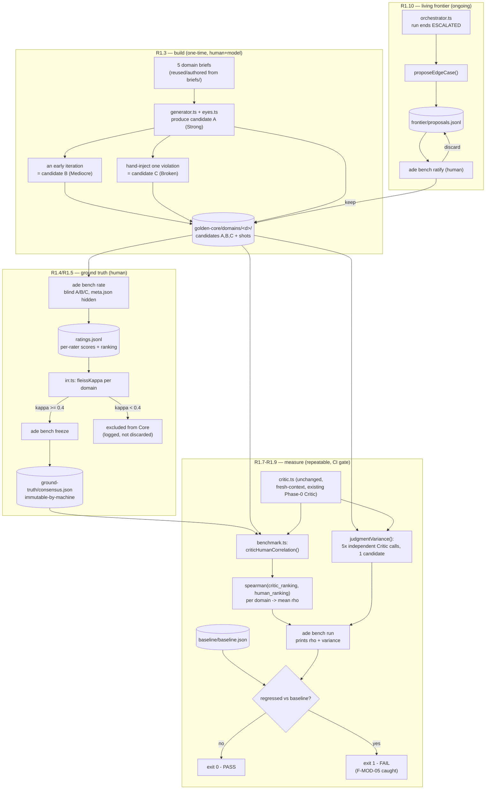

# R1 — Benchmark: Implementation Plan (execution-altitude, step-by-step)

> **What this is.** A build plan for **R1, the standing human-anchored benchmark** — the Tier-0 enabler of the research agenda ([spec/14 §4](../spec/14-research-agenda.md)). It turns the R1 *design spec* ([spec/18](../spec/18-r1-benchmark-specification.md)) and the Evaluation Charter ([spec/13](../spec/13-evaluation-charter.md)) into numbered, self-contained tasks that a small model (e.g. Gemini 3.1 Pro) can execute one at a time **without making any design decisions**.
>
> **Why R1 first.** The agenda's rule is non-negotiable: *"R1 (the benchmark) comes first — nothing else can be validated without it"* ([spec/14 §4](../spec/14-research-agenda.md)). R2, R3, R4 … are all measured **against** R1. Do this before any other research bet.
>
> **Prerequisite.** Phase 0 and Phase 1 are implemented (the loop, the Critic, the trace, the verdict log, the hard stores). This plan **extends** that existing code — it does not rebuild it.

---

## 0. Rules for the implementer (READ FIRST — do not skip)

These rules override any habit or default. Follow them literally.

1. **Do the tasks in number order** (R1.0 → R1.12). Each task lists what it depends on. Do **not** start a task until its dependencies are `DONE`.
2. **One task = one commit.** Finish a task completely (code + test + `DONE WHEN` passes) before starting the next. Never leave a task half-done to jump ahead.
3. **The `DONE WHEN` block is the contract.** A task is finished only when the exact command in its `DONE WHEN` block runs and prints the expected result. If it doesn't, the task is not done — fix it, don't move on.
4. **Never invent behaviour.** Every function signature, file path, schema field, and test assertion is given exactly. If something is genuinely missing or contradictory, **stop and write the question in `plans/R1-OPEN-QUESTIONS.md`** — do not guess.
5. **NEVER set `ANTHROPIC_API_KEY`.** All model calls go through the existing provider abstraction (`src/model.ts`, `ADE_PROVIDER=agent-sdk`). Setting the API key env var forces billing and breaks the access model. This is the one rule that is never OK to break.
6. **Extend, don't rewrite.** Where a task says "reuse X from `src/foo.ts`", import and call it — do **not** copy-paste or reimplement it. If existing code seems wrong, note it in `R1-OPEN-QUESTIONS.md`; do not silently rewrite Phase 0/1 code.
7. **The Golden Core is immutable by the machine.** No code in `src/` may ever write to, overwrite, or delete anything under `golden-core/ground-truth/`. Only the two human commands (`ade bench rate`, `ade bench freeze`) write there, and only by appending/creating — never editing frozen files. (Contamination defense F-SPEC-04, F-SPEC-06.)
8. **The Golden Core is held-out.** Nothing under `golden-core/` may ever be written to the Library (`src/library.ts`) or passed to the Generator as soft direction. This is the train/eval firewall — violating it invalidates the whole benchmark.
9. **Language & style:** TypeScript, strict mode, ESM (`import … from './x.js'` with the `.js` extension, matching the existing `src/` files). Every new pure function gets a `vitest` unit test. Match the comment/JSDoc style already in `src/verdicts.ts`.
10. **Definition of done for any file you create:** it typechecks (`npx tsc --noEmit`), its pure logic has a unit test, and its errors are typed and handled (no silent `catch {}`).

### The one-line "done" template every task uses

```
DONE WHEN: <exact shell command>   →   <exact expected output / assertion>
```

If you can run that command and see that output, the task is complete. That is the only definition of done.

---

## 1. What you are building (the acceptance test)

R1 is **a dataset + a measurement protocol + a CI gate**. When R1 is finished, this must be true:

> Running `npm run ade -- bench run` executes the current Critic over a **frozen, human-rated, 5-domain Golden Core** and prints:
> 1. **Critic↔Human rank correlation** (Spearman's ρ, averaged over domains) — the primary signal.
> 2. **Judgment variance** (test–retest over 5 independent Critic runs on one candidate).
> 3. A **PASS/FAIL vs. a saved baseline** — so any future change to the Critic/prompt/model/constitution that lowers correlation or raises variance is caught automatically (the regression gate, F-MOD-05).

Everything below builds toward exactly that command working and being trustworthy.

---

## 2. Architecture at a glance

### 2.0 Flow (UML — activity/data flow)



**Held-out firewall (R1.2, R1.11):** `CORE` and `CONSENSUS` are never reachable from `library.ts`'s write path — enforced by `assertNotGoldenCorePath`, tested in R1.11. Nothing in this diagram feeds the Generator.

### 2.1 New files you will create

| File | Purpose | Task |
|---|---|---|
| `src/goldenCore.ts` | Read/validate the Golden Core; enforce immutability + held-out law | R1.2 |
| `src/benchmark.ts` | Pure metrics: Spearman, Fleiss' κ, correlation & variance runners | R1.6–R1.8 |
| `src/irr.ts` | Inter-rater reliability + consensus freezing | R1.5 |
| `src/benchRate.ts` | Interactive multi-rater rating session (CLI) | R1.4 |
| `src/benchCli.ts` | `ade bench …` subcommand dispatch (build/rate/freeze/run/propose/ratify) | R1.12 |
| `tests/benchmark.test.ts` | Unit tests for the pure metrics | R1.6–R1.8 |
| `tests/irr.test.ts` | Unit tests for Fleiss' κ + consensus | R1.5 |
| `tests/goldenCore.test.ts` | Held-out + immutability + schema tests | R1.2, R1.11 |
| `plans/R1-OPEN-QUESTIONS.md` | Where you log anything blocking/ambiguous | R1.0 |

### 2.2 New schemas (added to `src/schema.ts`)

`GoldenCoreDomain`, `QualityTier`, `GoldenCoreCandidate`, `GoldenCoreEntry`, `RaterDimensionScores`, `RaterScore`, `PairwiseRanking`, `ConsensusRanking`, `BenchBaseline`, `EdgeCaseProposal`. (Exact shapes in R1.1.)

### 2.3 On-disk layout of the Golden Core (git-committed, human-owned)

```
golden-core/                              # NEW top-level dir under autonomous-design-engine/
├─ README.md                              # states the held-out + immutable-by-machine law
├─ domains/
│  ├─ b2b-saas/
│  │  ├─ brief.json                       # { brief: Brief, brandData: BrandData }
│  │  ├─ meta.json                        # { domain, tiers: {A,B,C → strong/mediocre/broken} }  ← hidden from raters
│  │  └─ candidates/
│  │     ├─ A/ { Section.tsx, shots/{1440,768,375}.png }
│  │     ├─ B/ { Section.tsx, shots/{1440,768,375}.png }
│  │     └─ C/ { Section.tsx, shots/{1440,768,375}.png }
│  ├─ ecommerce/        (same shape)
│  ├─ editorial/        (same shape)
│  ├─ dashboard/        (same shape)
│  └─ playful-app/      (same shape)
├─ ratings/
│  └─ ratings.jsonl                       # one line per (rater, domain): scores + pairwise ranking (append-only)
├─ ground-truth/
│  └─ consensus.json                      # frozen consensus ranking per domain (ONLY high-agreement domains)
└─ baseline/
   └─ baseline.json                       # saved Critic correlation/variance to regress against
```

**A/B/C are deliberately anonymous on disk.** Which letter is Strong/Mediocre/Broken lives only in `meta.json`, which the rating UI must **never** show a rater (blind presentation, spec/18 §2.1). Metrics code reads `meta.json` only *after* ratings are frozen, to sanity-check (see R1.5).

### 2.4 New CLI surface (all under `ade bench`)

| Command | Does | Task |
|---|---|---|
| `ade bench build` | Scaffold the 5 domain folders; generate/derive the 3 candidates per domain | R1.3 |
| `ade bench rate --rater <id>` | One human rates all domains (blind); appends to `ratings.jsonl` | R1.4 |
| `ade bench freeze` | Compute Fleiss' κ; freeze consensus for high-agreement domains only | R1.5 |
| `ade bench run` | Run the Critic over frozen domains; print Spearman + variance; PASS/FAIL vs baseline | R1.6–R1.9 |
| `ade bench baseline` | Save the current `bench run` result as the regression baseline | R1.9 |
| `ade bench propose` | (auto-called by orchestrator) log an anomalous run as an edge-case proposal | R1.10 |
| `ade bench ratify` | Human promotes a proposed edge case into the Core | R1.10 |

---

## 3. Task list (dependency-ordered)

| # | Task | Depends on | Kind |
|---|---|---|---|
| R1.0 | Audit & green-baseline the existing repo | — | reconcile |
| R1.1 | Golden Core schemas in `schema.ts` | R1.0 | schema |
| R1.2 | `goldenCore.ts` — load, validate, held-out & immutability guards | R1.1 | code+test |
| R1.3 | Build the 5-domain dataset (briefs + A/B/C candidates) | R1.2 | data |
| R1.4 | `ade bench rate` — blind multi-rater rating session | R1.2 | code |
| R1.5 | `irr.ts` — Fleiss' κ + `ade bench freeze` consensus | R1.1, R1.4 | code+test |
| R1.6 | `benchmark.ts` — Spearman ρ (pure fn) | R1.1 | code+test |
| R1.7 | `benchmark.ts` — Critic↔Human correlation runner | R1.2, R1.5, R1.6 | code |
| R1.8 | `benchmark.ts` — judgment variance (test–retest) | R1.2, R1.6 | code+test |
| R1.9 | `ade bench run` + baseline + regression gate | R1.7, R1.8 | code |
| R1.10 | Frontier expansion: propose + ratify | R1.2, R1.9 | code |
| R1.11 | Contamination-defense tests (held-out, no self-scoring) | R1.2, R1.9 | test |
| R1.12 | Wire `ade bench` into the CLI + docs | all above | wiring |

You can stop after **R1.9** and have a working benchmark + regression gate (the acceptance test in §1). R1.10–R1.12 are the "living frontier" and polish; do them, but the core value lands at R1.9.

---

## 4. The tasks

Each task has the same shape: **Goal · Read first · Steps · Test · DONE WHEN**. Do them in order.

---

### R1.0 — Audit & green-baseline the existing repo

**Goal:** Prove the Phase 0/1 base compiles and its tests pass *before* adding R1, so any later breakage is yours, not pre-existing. This directly answers the "I don't know what it turned into" problem.

**Read first:** `package.json` (scripts), `tsconfig.json`, `src/schema.ts`, `src/verdicts.ts`, `src/calibration.ts`, `src/report.ts`.

**Steps:**
1. `npm install` (if not already).
2. Run the typechecker: `npx tsc --noEmit`. Record the result.
3. Run the tests: `npm test`. Record pass/fail counts.
4. Create `plans/R1-OPEN-QUESTIONS.md` with a heading `# R1 — Open Questions & Blockers`.
5. **If tsc or tests fail:** do **not** start R1. Write the exact failures into `R1-OPEN-QUESTIONS.md` and stop — report back to the human. A benchmark built on a broken base measures nothing.
6. If both are green, add one line to `R1-OPEN-QUESTIONS.md`: `R1.0: base is green — tsc clean, N tests passing.`

**DONE WHEN:** `npx tsc --noEmit && npm test` → exits 0 (all green), **and** `plans/R1-OPEN-QUESTIONS.md` exists. If it can't be green, the task's output is a written blocker list and a STOP — that is also a valid "done" for R1.0.

---

### R1.1 — Golden Core schemas

**Goal:** Add every R1 data shape to `src/schema.ts` as zod schemas + inferred types, so all later code is type-safe and validated at the edges.

**Read first:** `src/schema.ts` lines 93–145 (`DimensionScores`, `CriticOutput`, `RunRecord`) and 411–427 (`VerdictEntry`) — match that exact style (zod schema, then `export type X = z.infer<…>`).

**Steps:** Append the following block to `src/schema.ts` (after the existing schemas). Use it verbatim:

```ts
// ─── R1 Golden Core (spec/18) ──────────────────────────────────────

export const GoldenCoreDomainSchema = z.enum([
  'b2b-saas',
  'ecommerce',
  'editorial',
  'dashboard',
  'playful-app',
]);
export type GoldenCoreDomain = z.infer<typeof GoldenCoreDomainSchema>;

/** The hidden intended quality tier of a candidate. NEVER shown to a rater. */
export const QualityTierSchema = z.enum(['strong', 'mediocre', 'broken']);
export type QualityTier = z.infer<typeof QualityTierSchema>;

/** Candidate ids are always the anonymous letters A/B/C on disk. */
export const CandidateIdSchema = z.enum(['A', 'B', 'C']);
export type CandidateId = z.infer<typeof CandidateIdSchema>;

export const GoldenCoreCandidateSchema = z.object({
  id: CandidateIdSchema,
  tsx_path: z.string(),          // golden-core/domains/<d>/candidates/<id>/Section.tsx
  shots_dir: z.string(),         // …/candidates/<id>/shots
});
export type GoldenCoreCandidate = z.infer<typeof GoldenCoreCandidateSchema>;

export const GoldenCoreEntrySchema = z.object({
  domain: GoldenCoreDomainSchema,
  brief: BriefSchema,
  brand_data: BrandDataSchema,
  candidates: z.array(GoldenCoreCandidateSchema).length(3),
  created_at: z.string(),        // ISO 8601
});
export type GoldenCoreEntry = z.infer<typeof GoldenCoreEntrySchema>;

/** meta.json: the hidden tier mapping — read only AFTER ratings are frozen. */
export const GoldenCoreMetaSchema = z.object({
  domain: GoldenCoreDomainSchema,
  tiers: z.object({ A: QualityTierSchema, B: QualityTierSchema, C: QualityTierSchema }),
});
export type GoldenCoreMeta = z.infer<typeof GoldenCoreMetaSchema>;

/** A single human's per-dimension scores for one candidate (0–100 each). */
export const RaterDimensionScoresSchema = z.object({
  brief_fit: z.number().min(0).max(100),        // P1 — serves the brief
  hierarchy: z.number().min(0).max(100),        // P3 — unambiguous hierarchy
  distinctiveness: z.number().min(0).max(100),  // P4/P7 — not category-mean
  craft: z.number().min(0).max(100),            // overall execution quality
});
export type RaterDimensionScores = z.infer<typeof RaterDimensionScoresSchema>;

/** One rater's full submission for ONE domain: per-candidate scores + a strict ranking. */
export const RaterScoreSchema = z.object({
  rater_id: z.string(),
  domain: GoldenCoreDomainSchema,
  scores: z.object({
    A: RaterDimensionScoresSchema,
    B: RaterDimensionScoresSchema,
    C: RaterDimensionScoresSchema,
  }),
  ranking: z.array(CandidateIdSchema).length(3),  // strict order, best → worst
  notes: z.string().optional(),
  timestamp: z.string(),
});
export type RaterScore = z.infer<typeof RaterScoreSchema>;

/** The frozen human ground truth for one domain (only if agreement was high enough). */
export const ConsensusRankingSchema = z.object({
  domain: GoldenCoreDomainSchema,
  ranking: z.array(CandidateIdSchema).length(3),  // consensus order, best → worst
  fleiss_kappa: z.number(),
  n_raters: z.number().int().min(2),
  frozen: z.literal(true),
  frozen_at: z.string(),
});
export type ConsensusRanking = z.infer<typeof ConsensusRankingSchema>;

/** Saved regression baseline for `ade bench run`. */
export const BenchBaselineSchema = z.object({
  mean_spearman: z.number(),                 // averaged over frozen domains
  per_domain_spearman: z.record(z.string(), z.number()),
  judgment_variance: z.number(),             // test–retest variance
  model_id: z.string(),
  critic_temperature: z.number(),
  saved_at: z.string(),
});
export type BenchBaseline = z.infer<typeof BenchBaselineSchema>;

/** An orchestrator-proposed edge case awaiting human ratification. */
export const EdgeCaseProposalSchema = z.object({
  proposal_id: z.string(),
  run_id: z.string(),
  reason: z.enum(['iter-cap-still-failing', 'guardrail-repeat-trip']),
  brief_ref: z.string(),
  output_ref: z.string(),
  proposed_at: z.string(),
  ratified: z.boolean().default(false),
});
export type EdgeCaseProposal = z.infer<typeof EdgeCaseProposalSchema>;
```

**Test:** add `tests/goldenCore.test.ts` with one case that constructs a valid `GoldenCoreEntry` object and asserts `GoldenCoreEntrySchema.safeParse(x).success === true`, and one invalid case (2 candidates instead of 3) asserting `.success === false`.

**DONE WHEN:** `npx tsc --noEmit && npx vitest run tests/goldenCore.test.ts` → passes (2 assertions green).

---

### R1.2 — `goldenCore.ts` (load, validate, held-out & immutability guards)

**Goal:** One module that is the *only* way code reads the Golden Core, and that structurally enforces the two firewalls (held-out, immutable-by-machine).

**Read first:** `src/verdicts.ts` (for the `readVerdicts`/`appendVerdict` file-IO style you should mirror), R1.1 schemas.

**Steps — implement exactly these exports in `src/goldenCore.ts`:**

```ts
/** Absolute-ish root of the Golden Core, relative to repo root. Configurable for tests. */
export const GOLDEN_CORE_ROOT = 'golden-core';

/** List the domain folders that physically exist under golden-core/domains/. */
export function listDomains(root?: string): GoldenCoreDomain[];

/** Load & zod-validate one domain's brief.json + candidate folders → GoldenCoreEntry.
 *  Throws a typed GoldenCoreError if the folder is malformed or a candidate is missing. */
export function loadDomain(domain: GoldenCoreDomain, root?: string): GoldenCoreEntry;

/** Load every existing domain. Skips (with a warning) any that fail validation. */
export function loadAllDomains(root?: string): GoldenCoreEntry[];

/** Read meta.json (the hidden tiers). MUST NOT be called by the rating UI. */
export function loadMeta(domain: GoldenCoreDomain, root?: string): GoldenCoreMeta;

/** Read frozen consensus (ground-truth/consensus.json) → map domain→ConsensusRanking.
 *  Returns {} if not frozen yet. */
export function loadConsensus(root?: string): Record<string, ConsensusRanking>;

/** The single guard that enforces firewall #8. Call this at the top of any Library/
 *  Generator write path in a test; throws if a path is inside golden-core/. */
export function assertNotGoldenCorePath(path: string): void;
```

- `GoldenCoreError` is a typed error class (`export class GoldenCoreError extends Error {}`).
- `assertNotGoldenCorePath` throws `GoldenCoreError` if the normalized path contains the `golden-core/` segment. This is the programmatic form of firewall rule #8.
- **No function in this file writes anything.** Reads only. (Freezing is done by R1.5's command, which writes `consensus.json` once.)

**Test (`tests/goldenCore.test.ts`, extend it):**
- `assertNotGoldenCorePath('golden-core/domains/b2b-saas/brief.json')` throws; `assertNotGoldenCorePath('runs/x/Section.tsx')` does not.
- `loadDomain` on a fixture folder returns a valid `GoldenCoreEntry`; on a folder missing candidate C, throws `GoldenCoreError`.

**DONE WHEN:** `npx vitest run tests/goldenCore.test.ts` → all cases pass, including the two `assertNotGoldenCorePath` cases.

---

### R1.3 — Build the 5-domain Golden Core dataset

**Goal:** Populate `golden-core/domains/<5 domains>/` with a brief + 3 tiered candidates (A/B/C) each. This is a **data-authoring** task; it produces files, not much code.

**Read first:** `briefs/burkes-hero.json` + `briefs/burkes-brand.json` (the brief/brand shapes), `src/generator.ts` (how a candidate `.tsx` is produced), `src/eyes.ts` (how shots are captured), spec/18 §1.1–1.2.

**The 5 domains and where their brief comes from** (reuse existing briefs where they fit; write new ones otherwise):

| Domain | Reuse brief | If none, author from |
|---|---|---|
| `b2b-saas` | `briefs/flowmetrics-hero.json` | a SaaS analytics landing hero |
| `ecommerce` | `briefs/velvet-thread-hero.json` | a product-grid storefront hero |
| `editorial` | `briefs/wanderlust-hero.json` | a long-form travel/blog hero |
| `dashboard` | `briefs/nexus-hero.json` | a data-dense app dashboard header |
| `playful-app` | `briefs/cafe-botanica-hero.json` | an expressive consumer-app hero |

> If a chosen brief doesn't clearly fit its domain, pick another from `briefs/` that does, or write a new `brief.json` in the same shape. Record which brief maps to which domain in `plans/R1-OPEN-QUESTIONS.md`.

**How to produce the 3 candidates per domain** (spec/18 §1.2 — Strong / Mediocre / Broken):
1. **Candidate A (Strong):** run the existing loop to completion — `npm run ade -- generate --brief <brief> --brand-data <brand> --section hero --out runs/gc-<domain>-A` — and copy its `final/Section.tsx` + `final/shots/*` into `candidates/A/`.
2. **Candidate B (Mediocre):** take an **early iteration** from the same run (e.g. `iterations/iter-1/…`) — passable but not cohesive — and copy it into `candidates/B/`. (If no suitable mid-iteration exists, run with `--max-iters 1`.)
3. **Candidate C (Broken):** hand-edit A's `Section.tsx` to inject one obvious, real violation (e.g. break responsive layout at 375, or use an off-brand color, or collapse the hierarchy), re-render its shots via the harness, and copy into `candidates/C/`.
4. Write `meta.json` = `{ "domain": "<d>", "tiers": { "A": "strong", "B": "mediocre", "C": "broken" } }`. **Optionally shuffle** which letter maps to which tier per domain so raters can't pattern-match "A is always best" — if you shuffle, keep `meta.json` truthful to the shuffle.
5. Write `brief.json` = `{ "brief": <Brief>, "brandData": <BrandData> }` for the domain.
6. Verify each domain loads: it must pass `loadDomain(domain)` from R1.2 without throwing.

**Also write `golden-core/README.md`** stating, in plain words: *this directory is human-owned and held-out; no code writes to `ground-truth/`; nothing here is ever added to the Library or shown to the Generator (spec/18 §1.3, §6).*

**DONE WHEN:** `npm run ade -- bench build --verify` (a thin command added in R1.12; until then, a tiny script) prints `5/5 domains valid` — i.e. `loadAllDomains()` returns 5 entries and each has exactly 3 candidates with existing `Section.tsx` + 3 shots. Interim check before R1.12 exists: a one-off `npx tsx -e "import {loadAllDomains} from './src/goldenCore.js'; console.log(loadAllDomains().length)"` prints `5`.

> **Budget note:** building candidate A for 5 domains is ~5 full loop runs on the Pro credit. Do them one at a time; watch the run budget caps. This is the most model-spend-heavy task in R1.

---

### R1.4 — `ade bench rate` (blind multi-rater rating session)

**Goal:** An interactive CLI that shows one rater all 5 domains **blind** (candidate letters only, tiers hidden), collects per-dimension scores + a strict A/B/C ranking per domain, and appends one `RaterScore` line per domain to `golden-core/ratings/ratings.jsonl`.

**Read first:** `src/verdicts.ts` → `captureVerdict` (the `readline` interactive pattern — reuse this exact approach), R1.1 (`RaterScore`), R1.2 (`loadAllDomains`, and the rule that this UI must **never** call `loadMeta`).

**Steps — implement `runRatingSession(raterId: string, root?: string): Promise<void>` in `src/benchRate.ts`:**
1. `const domains = loadAllDomains(root)`. For each domain, in a randomized order:
   - Print the domain name, the brief's `goal`, and the **three candidates' `shots_dir` paths** (A, B, C). Tell the rater to open the three shot folders and compare. **Do not** print tiers or any hint of intended quality.
   - For each candidate A, B, C: prompt for four integers 0–100 — `brief_fit`, `hierarchy`, `distinctiveness`, `craft` (validate each is 0–100; re-ask on bad input, mirroring `captureVerdict`).
   - Prompt for a **strict ranking**: "Best to worst, e.g. `A B C`" → parse into a 3-element `CandidateId[]`; reject if it isn't a permutation of A/B/C.
   - Prompt for optional notes.
   - Build a `RaterScore` (validate with `RaterScoreSchema.parse`) and **append** it as one JSON line to `ratings.jsonl` (reuse the append pattern from `appendVerdict`; create the dir if missing).
2. On completion, print `Recorded N/5 domains for rater <id>`.

**Guards:**
- This file must **not** import or call `loadMeta` — enforce by code review; add a comment `// FIREWALL: never read meta.json here (blind presentation, spec/18 §2.1)`.
- Never overwrite an existing rater's lines; always append. (Multiple raters = multiple lines per domain.)

**DONE WHEN:** `npm run ade -- bench rate --rater alice` (after R1.12 wiring) runs a full session and `golden-core/ratings/ratings.jsonl` gains 5 valid lines, each passing `RaterScoreSchema`. Interim: call `runRatingSession('alice')` from a scratch script and confirm the 5 appended lines validate.

> **Human process note (for the project owner, not the model):** R1 needs **≥2 raters** for inter-rater reliability (spec/18 §2.2). As a solo dev, options are: rate twice yourself weeks apart (test–retest, weaker), or recruit 1–2 others for one session. Log the decision in `R1-OPEN-QUESTIONS.md` — it's the single biggest threat to R1's validity (F-HUM-02).

---

### R1.5 — `irr.ts` (Fleiss' κ) + `ade bench freeze` (consensus)

**Goal:** Compute inter-rater agreement over the pairwise rankings and **freeze** a consensus ground-truth ranking only for domains where raters agree enough. Low-agreement domains are **excluded** from the Core (spec/18 §2.2, the fail condition).

**Read first:** R1.1 (`RaterScore`, `ConsensusRanking`), Appendix A.2 (the Fleiss' κ formula + worked example — implement it from there exactly).

**Steps:**
1. In `src/irr.ts`, implement the pure function:
   ```ts
   /** Fleiss' kappa over N items × K categories. `counts[i][j]` = number of raters
    *  who assigned item i to category j. Returns κ in [-1, 1]. See Appendix A.2. */
   export function fleissKappa(counts: number[][]): number;
   ```
   Test it against the Appendix A.2 worked example (κ ≈ the given value ± 0.001).
2. Implement:
   ```ts
   /** Turn each rater's ranking of a domain into the Fleiss counts matrix, where the
    *  "items" are the 3 rank positions and "categories" are the 3 candidate letters,
    *  then return kappa for that domain. */
   export function domainAgreement(raterScores: RaterScore[]): number;

   /** The consensus ranking = candidates ordered by mean rank position across raters
    *  (lower mean rank = better). Ties broken by mean overall dimension score. */
   export function consensusRanking(raterScores: RaterScore[]): CandidateId[];
   ```
3. Implement `freezeConsensus(root?: string): { frozen: ConsensusRanking[]; excluded: {domain,kappa}[] }`:
   - Group `ratings.jsonl` by domain. For each domain with ≥2 raters, compute `domainAgreement`.
   - **Threshold:** freeze the domain **iff** κ ≥ **0.4** (moderate agreement; a documented, changeable constant `MIN_KAPPA = 0.4` at the top of the file). Otherwise exclude it.
   - For frozen domains, build a `ConsensusRanking` and write them all to `golden-core/ground-truth/consensus.json` (a single JSON object keyed by domain). **This is the only write to `ground-truth/` in the whole system**, and it only ever *creates/replaces the consensus file from the raw ratings* — it never edits ratings.
   - Print a table: domain | κ | frozen? | consensus ranking.
   - **Sanity check (not a gate):** after freezing, load `meta.json` per frozen domain and print whether the consensus put the `strong` candidate first and the `broken` candidate last. If a frozen domain's consensus disagrees badly with the intended tiers, flag it for human review (the humans might be right and the tier label wrong — do not auto-correct).

**Test (`tests/irr.test.ts`):**
- `fleissKappa` on the Appendix A.2 matrix → within ±0.001 of the stated value.
- `fleissKappa` on perfect agreement → `1`; on random/no agreement → near `0`.
- `consensusRanking` on 3 raters who all rank `A B C` → returns `['A','B','C']`.

**DONE WHEN:** `npx vitest run tests/irr.test.ts` passes, **and** (after ratings exist) `npm run ade -- bench freeze` writes a `consensus.json` containing only domains with κ ≥ 0.4 and prints the κ table.

---

### R1.6 — `benchmark.ts`: Spearman's ρ (pure function)

**Goal:** The primary metric primitive: rank correlation between two orderings of the same 3 candidates.

**Read first:** Appendix A.1 (Spearman formula + worked example).

**Steps:** in `src/benchmark.ts`:
```ts
/** Spearman's rank correlation between two rankings of the same items.
 *  Inputs are orderings (best→worst) of the SAME set of ids, e.g. ['A','B','C'] vs ['A','C','B'].
 *  Returns ρ in [-1, 1]. For 3 items the possible values are exactly {1, 0.5, -0.5, -1}. See Appendix A.1. */
export function spearman(rankingX: string[], rankingY: string[]): number;
```
- Convert each ordering to a position map (id → rank index 0..n-1), then apply the formula in Appendix A.1. Throw if the two rankings aren't permutations of the same id set.

**Test (`tests/benchmark.test.ts`):**
- identical rankings → `1`.
- fully reversed (`['A','B','C']` vs `['C','B','A']`) → `-1`.
- one adjacent swap (`['A','B','C']` vs `['A','C','B']`) → `0.5`.
- mismatched id sets → throws.

**DONE WHEN:** `npx vitest run tests/benchmark.test.ts -t spearman` → 4 cases pass.

---

### R1.7 — `benchmark.ts`: Critic↔Human correlation runner

**Goal:** For each frozen domain, run the current Critic over its 3 candidates, get the Critic's ranking, and Spearman-correlate it with the human consensus. Average over domains = the **primary R1 signal**.

**Read first:** `src/critic.ts` (`critique(shots, bundle)` signature and that it returns `CriticOutput` with a `ranking` field — see `src/schema.ts` `CriticOutputSchema`), `src/goldenCore.ts` (`loadConsensus`, `loadDomain`), R1.6 (`spearman`).

**Steps:** implement in `src/benchmark.ts`:
```ts
export interface DomainCorrelation { domain: string; critic_ranking: string[]; human_ranking: string[]; rho: number; }
export interface CorrelationResult { per_domain: DomainCorrelation[]; mean_spearman: number; }

/** For every frozen domain: build the Critic input from the domain's brief + the 3 candidates'
 *  shots, call the Critic once to rank the 3, and Spearman-correlate with the frozen consensus. */
export async function criticHumanCorrelation(cfg: Config, root?: string): Promise<CorrelationResult>;
```
- Only iterate domains present in `loadConsensus()` (frozen ones). If none are frozen, throw a clear error: `"No frozen consensus — run 'ade bench freeze' first."`
- For each domain: load the 3 candidates' screenshots, assemble the Critic input the same way the loop does (reuse whatever bundle/critic-call helper `orchestrator.ts` uses; do **not** hand-roll a new prompt). The Critic must rank all 3 in one call → use its `ranking` output. If `ranking` is absent, derive it by sorting the per-candidate `weighted_total` descending.
- `rho = spearman(criticRanking, humanRanking)`; `mean_spearman` = simple average over domains.
- **Critic runs at `criticTemperature`** from config (low; F-JDG-06). Uses the provider abstraction — no API key.

**Test:** this needs a live model, so no unit test with real calls. Instead add an integration test using the **mock provider** already used in `tests/integration.test.ts`: feed canned critic rankings for 2 fake domains with known consensus and assert `mean_spearman` equals the hand-computed value. (Reuse the mock `ModelProvider` from the existing integration test.)

**DONE WHEN:** `npx vitest run tests/benchmark.test.ts -t correlation` (mock-provider) → mean_spearman matches the hand-computed expected value.

---

### R1.8 — `benchmark.ts`: judgment variance (test–retest)

**Goal:** Measure how much the Critic disagrees with *itself*. Feed one candidate to the Critic 5 times in independent contexts; report the variance of its score. High variance = the judge is a slot machine (F-JDG-06).

**Read first:** `src/critic.ts`, R1.2.

**Steps:** implement in `src/benchmark.ts`:
```ts
export interface VarianceResult { domain: string; candidate: string; scores: number[]; variance: number; stdev: number; }

/** Run the Critic N times (default 5) on ONE candidate, each call a fresh context,
 *  and return the variance of its overall (weighted_total) score. */
export async function judgmentVariance(cfg: Config, domain: GoldenCoreDomain, candidate: CandidateId, n = 5, root?: string): Promise<VarianceResult>;
```
- Each of the N calls is fully independent (new message list — the Critic is already fresh-context per I2; just call it N times).
- `variance` = population variance of the N `weighted_total` scores; `stdev = sqrt(variance)`. Put these two tiny math helpers as pure functions and unit-test them (Appendix A.3).
- For the `bench run` summary (R1.9), call this once on a **fixed reference candidate** (e.g. `b2b-saas` / `A`) so the number is comparable across runs.

**Test (`tests/benchmark.test.ts`):** unit-test `variance([80,80,80,80,80]) === 0` and `variance([70,90]) === 100` (population variance). The full 5-call path is exercised live in `bench run`, not unit-tested.

**DONE WHEN:** `npx vitest run tests/benchmark.test.ts -t variance` → the two variance math cases pass.

---

### R1.9 — `ade bench run` + baseline + the regression gate

**Goal:** The command from §1 — run correlation + variance over the frozen Core, print them, and **compare to a saved baseline**, exiting non-zero if quality regressed. This is the CI-for-quality gate (F-MOD-05).

**Read first:** R1.7, R1.8, R1.1 (`BenchBaseline`), `src/config.ts` (how `Config` is built, `modelId`, `criticTemperature`).

**Steps:** implement `runBenchmark(cfg, opts)` (call it from the CLI in R1.12):
1. `const corr = await criticHumanCorrelation(cfg)` and `const varc = await judgmentVariance(cfg, 'b2b-saas', 'A')`.
2. Print a report:
   ```
   R1 BENCHMARK — <model_id> @ criticTemp=<t>
   ── Critic↔Human rank correlation (Spearman ρ) ──
   <domain>: ρ=<..>   (critic <A B C>  vs  human <A B C>)
   …
   mean ρ = <..>        [primary signal — higher is better, target > 0]
   ── Judgment variance (test–retest, n=5 on b2b-saas/A) ──
   scores = [..]   variance = <..>   stdev = <..>   [lower is better]
   ```
3. **Baseline compare:**
   - `ade bench baseline` writes the current `{mean_spearman, per_domain_spearman, judgment_variance, model_id, critic_temperature, saved_at}` to `golden-core/baseline/baseline.json` (via `BenchBaselineSchema`).
   - `ade bench run` loads that baseline (if present) and computes deltas. **Regression gate:** FAIL (exit code 1) if `mean_spearman` dropped by more than **0.1** below baseline, **or** `judgment_variance` rose by more than **50%** above baseline. Otherwise PASS (exit 0). Print `PASS`/`FAIL (regressed on: …)`.
   - If no baseline exists yet, print `no baseline — run 'ade bench baseline' to set one` and exit 0.
4. **Thresholds are named constants** at the top of the file (`MAX_RHO_DROP = 0.1`, `MAX_VARIANCE_RISE = 0.5`) so they're easy to tune and are documented.

**DONE WHEN:**
- `npm run ade -- bench baseline` writes a schema-valid `golden-core/baseline/baseline.json`, then
- `npm run ade -- bench run` prints the correlation + variance report and `PASS` (exit 0) on the unchanged system.
- To prove the gate bites: temporarily degrade the Critic prompt (or lower `criticTemperature` handling) so ranking gets worse, re-run `bench run`, and confirm it prints `FAIL` and exits 1. Revert the degradation after.

---

### R1.10 — Frontier expansion (propose + ratify)

**Goal:** Let the running system nominate its own blind spots as new eval cases; a human ratifies them into the Core (spec/18 §5).

**Read first:** `src/orchestrator.ts` (where a run reaches a terminal state — `ESCALATED`/`ABORTED`), R1.1 (`EdgeCaseProposal`), R1.2.

**Steps:**
1. In `orchestrator.ts`, at the point a run ends `ESCALATED` because it hit `maxIters` while still failing the Pass Gate (or a guardrail tripped repeatedly), call a new `proposeEdgeCase(runResult)` (in `src/benchCli.ts` or a small `frontier.ts`). It appends an `EdgeCaseProposal` line to `golden-core/frontier/proposals.jsonl`. Keep this **non-fatal** — a failure to log a proposal must never crash the run (wrap in try/catch that only logs).
2. `ade bench propose --run <dir>` — manual equivalent for an existing run.
3. `ade bench ratify --proposal <id>` — human command: shows the brief + output, asks keep/discard; on keep, it scaffolds a new domain folder under `golden-core/domains/` (or a `frontier/` subset) exactly like R1.3 so it can be rated + frozen by the normal R1.4/R1.5 path. Discarded proposals are marked `ratified:false` and left in place (audit trail).

**DONE WHEN:** `npm run ade -- bench propose --run runs/<some-escalated-run>` appends a valid `EdgeCaseProposal` line, and `ade bench ratify --proposal <id>` (choosing discard) marks it without error. (Full "ratify→rate→freeze" of a real edge case is a human workflow, verified by inspection.)

---

### R1.11 — Contamination-defense tests

**Goal:** Turn the two firewalls (§0 rules 7 & 8) into automated tests, so a future change can't silently break them.

**Read first:** R1.2 (`assertNotGoldenCorePath`), `src/writeback.ts` + `src/library.ts` (the Library write path), spec/18 §6.

**Steps — add to `tests/goldenCore.test.ts`:**
1. **Held-out (firewall #8):** assert that the Library write path refuses a Golden Core path. If `writeback`/`library` don't currently call `assertNotGoldenCorePath`, add that guard call at the top of the Library insert function, then test that inserting an entry whose provenance path is under `golden-core/` throws.
2. **No self-scoring (firewall #7):** a test that greps `src/**` for any `writeFileSync`/`appendFileSync`/`rmSync` whose target path contains `ground-truth` and asserts the **only** such write lives in the freeze command (`irr.ts`). (Implement as a static string scan over the source files, or assert a documented allowlist of one.)
3. **Immutability:** after `freezeConsensus`, calling it again with the same ratings produces an identical `consensus.json` (deterministic; no accidental mutation of ratings).

**DONE WHEN:** `npx vitest run tests/goldenCore.test.ts` → all firewall tests pass, including the Library-rejects-golden-core-path case.

---

### R1.12 — Wire `ade bench` into the CLI + docs

**Goal:** Make every command above runnable via `npm run ade -- bench <sub>`, and document R1 so the next person (or model) can use it.

**Read first:** `src/cli.ts` (how existing subcommands like `generate`/`report` are registered with `commander`), all the functions built above.

**Steps:**
1. In `src/benchCli.ts`, build a `commander` sub-program `bench` with subcommands: `build [--verify]`, `rate --rater <id>`, `freeze`, `run`, `baseline`, `propose --run <dir>`, `ratify --proposal <id>`. Each just parses flags → builds `Config` via `config.ts` → calls the function from R1.3–R1.10. **No logic in the CLI layer** (match the existing `cli.ts` discipline).
2. Register `bench` in `src/cli.ts`.
3. Add a `plans/R1-USAGE.md`: the end-to-end runbook — `bench build` → `bench rate` (×N raters) → `bench freeze` → `bench baseline` → thereafter `bench run` before/after any Critic/model/constitution change.
4. Add one line to `plans/` index or the ADE `AGENTS.md`/`IMPLEMENTATION_PLAN.md` pointing at this plan + `R1-USAGE.md` (so R1 is discoverable, matching how the repo already points tools at its docs).

**DONE WHEN:** `npm run ade -- bench --help` lists all 7 subcommands, and the full sequence `bench build --verify` → `bench freeze` → `bench baseline` → `bench run` completes without error on the built dataset.

---

## 5. Final R1 acceptance checklist

R1 is complete when **all** of these are true:

- [ ] `npx tsc --noEmit` clean; `npm test` green (including `benchmark`, `irr`, `goldenCore` suites).
- [ ] `golden-core/` holds 5 valid domains × 3 candidates, each with `Section.tsx` + 3 shots.
- [ ] At least 2 raters' scores exist in `ratings.jsonl`; `bench freeze` has written `consensus.json` for the high-agreement domains (κ ≥ 0.4).
- [ ] `npm run ade -- bench run` prints mean Spearman ρ + judgment variance and a PASS/FAIL vs. baseline.
- [ ] The regression gate demonstrably FAILs when the Critic is deliberately degraded, and PASSes when reverted.
- [ ] The two firewall tests pass (held-out + no-self-scoring).
- [ ] `plans/R1-USAGE.md` exists and the runbook works end-to-end.

When this is done, you have the anchor every later bet is measured against. **The next bet is R2** (the human-feedback channel — the agenda's second enabler, and the prerequisite for R4). Do **not** start R3/R4 until R2's richer channel exists, because a reward model trained on thin CLI verdicts is built on sand (spec/14 §4).

---

## Appendix A — formulas (implement these exactly)

### A.1 Spearman's rank correlation ρ

For two rankings of the same `n` items, let `d_i` = (rank of item *i* in ranking X) − (rank of item *i* in ranking Y), where rank is the 0-based (or 1-based — must be consistent) position in the ordering.

```
ρ = 1 − ( 6 · Σ d_i²  ) / ( n · (n² − 1) )
```

**Worked example (n = 3):** X = `[A,B,C]` (ranks A=0,B=1,C=2), Y = `[A,C,B]` (ranks A=0,C=1,B=2).
- d_A = 0−0 = 0; d_B = 1−2 = −1; d_C = 2−1 = +1. Σd² = 0+1+1 = 2.
- ρ = 1 − (6·2)/(3·(9−1)) = 1 − 12/24 = 1 − 0.5 = **0.5**. ✓ (matches R1.6's test)

Full reverse `[A,B,C]` vs `[C,B,A]`: d = (0−2, 1−1, 2−0) = (−2,0,2), Σd²=8, ρ = 1 − 48/24 = **−1**. ✓

### A.2 Fleiss' kappa κ

`N` items, each rated by `n` raters into one of `k` categories. `counts[i][j]` = how many raters put item *i* in category *j* (each row sums to `n`).

```
p_j = ( Σ_i counts[i][j] ) / (N · n)                     # proportion of all assignments to category j
P_i = ( ( Σ_j counts[i][j]² ) − n ) / ( n · (n − 1) )    # agreement for item i
P̄  = ( Σ_i P_i ) / N                                     # mean observed agreement
P̄e = Σ_j p_j²                                            # expected agreement by chance
κ  = ( P̄ − P̄e ) / ( 1 − P̄e )
```

**Worked example:** N=2 items, n=3 raters, k=3 categories. counts = `[[3,0,0],[0,2,1]]`.
- p = [3/6, 2/6, 1/6] = [0.5, 0.333, 0.167].
- P_1 = (9 − 3)/(3·2) = 6/6 = 1.0. P_2 = ((0+4+1) − 3)/6 = (5−3)/6 = 0.333.
- P̄ = (1.0 + 0.333)/2 = 0.667. P̄e = 0.25 + 0.111 + 0.028 = 0.389.
- κ = (0.667 − 0.389)/(1 − 0.389) = 0.278/0.611 = **0.455**. (Use this as the R1.5 unit-test target, ±0.001.)

*Perfect agreement* (every rater same category for every item) → κ = 1. *Chance-level* → κ ≈ 0.

### A.3 Population variance & standard deviation

```
mean = (Σ x_i) / n
variance = (Σ (x_i − mean)²) / n          # population (÷ n, not n−1)
stdev = sqrt(variance)
```
`variance([80,80,80,80,80]) = 0`; `variance([70,90]) = ((70−80)²+(90−80)²)/2 = (100+100)/2 = 100`. ✓

---

## Appendix B — what R1 does NOT include (explicit non-goals)

- **No reward model.** That's R4, and it depends on R2 first. R1 only *measures* the Critic; it doesn't train anything.
- **No constitution grounding of the Critic.** That's R3 — R1 is how you'll *prove* R3 helps (agreement ↑, variance ↓), but R1 itself changes nothing about how the Critic thinks.
- **No new rating UI beyond the CLI.** The rich pairwise/annotation UI is R2. R1's rating CLI is deliberately minimal — enough to build the ground truth, no more.
- **No auto-editing of human ratings, ever.** Firewall #7.
