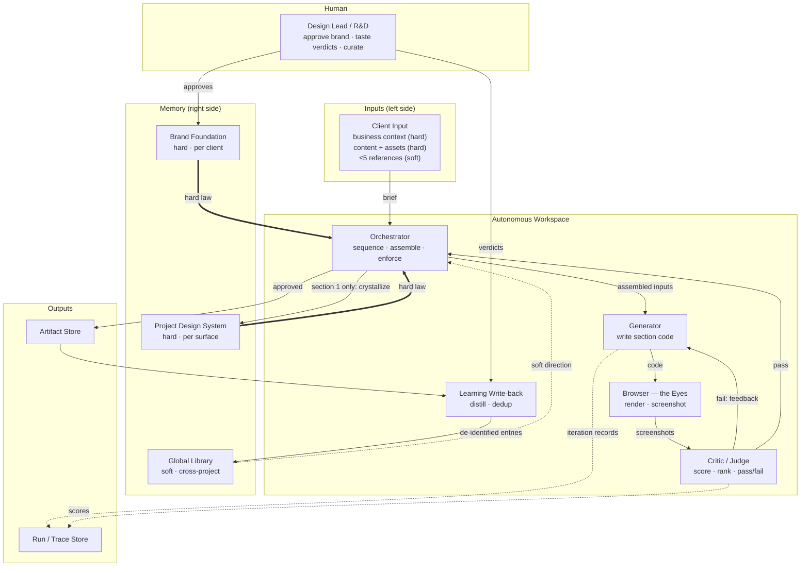

# 01 — Actors & Components

> The cast of the system: every participant, its **single responsibility**, and its **authority** (does it set soft direction or hard law?). If a component has two responsibilities, it is two components.

---

## 1. Actor & component catalogue

| Actor / Component | Kind | Single responsibility | Authority |
|---|---|---|---|
| **Design Lead / R&D** | Human | Approve the brand once; give taste verdicts; curate what the library learns | Sets the **hard** floor |
| **Client Input** | Data source | Provide business context, content, assets, and optionally ≤5 references | context = **hard**, references = **soft** |
| **Orchestrator** | AI agent | Run a project: comprehend the brief, sequence sections, assemble inputs, run guardrail gates, enforce consistency, trigger write-back | — (executes policy) |
| **Generator** | AI agent | Produce the code (React + TypeScript component) for one section | — |
| **Critic / Judge** | AI agent | Score & rank rendered output against brand + system + brief + quality, and **Phase-Exit-Review each phase artifact** (brand, design system, library entry) before it becomes law downstream; decide pass/fail — always in fresh context | — (applies the rubric) |
| **Browser (the "Eyes")** | Tool | Render output and screenshot it at each breakpoint | — (reports facts) |
| **Guardrail Layer** | Tool (deterministic) | Run the deterministic gates — input, render-health, hard-constraint (a11y/token/responsive), schema, de-identification — and gate the loop | — (enforces the hard floor) |
| **Global Library** | Memory store | Hold cross-project, de-identified design knowledge; answer retrieval queries | **soft** (retrieved as direction) |
| **Brand Foundation** | Memory store | Hold one client's identity (colors, type, motion voice, personality) | **hard** (binding) |
| **Project Design System** | Memory store | Hold per-surface tokens + component recipes, frozen after section 1 | **hard** (binding) |
| **Artifact Store** | Output store | Hold generated sections / pages / the assembled artifact | — (record) |
| **Run/Trace Store** | Output store | Record every loop iteration, score, and decision for audit | — (record) |
| **Learning Write-back** | Process | Distill an approved artifact into de-identified library entries; dedup/merge | writes **soft** memory |

> **Agent multiplicity.** Orchestrator / Generator / Critic may be three separate agents or one model in three roles. The one hard rule: the **Critic must run in a fresh context from the Generator** — a generator grading its own work is the failure mode the old pipeline lived (its `thought_process.md` was the generator grading its own homework).

---

## 2. Component diagram (UML)



Read the edges by weight: **`==hard law==>`** is binding, **`-.soft direction.->`** is advisory. The loop GEN → EYES → CRIT → (fail) → GEN is the engine; everything else feeds it or records it.

---

## 3. Responsibilities in depth

### 3.1 Human — Design Lead / R&D
The only human in the loop. Three jobs, all at the *destination* level (never the route):
1. **Approve the brand foundation** once per client (high-stakes, long-lived — not something to re-derive per run).
2. **Give taste verdicts** on finished work (approve / reject / notes). These are the training signal that calibrates the Critic and weights the Library over time.
3. **Curate** what the Library keeps — confirm, correct, or delete entries.

The Lead does **not** specify layouts, pick colors per section, or write rules per failure. Those are the AI's route.

### 3.2 Client Input
Not an agent — a structured data source. Carries:
- **Business context** (industry, audience, goals) — **hard**.
- **Content & assets** (copy, logo, images) — **hard**.
- **Brand-data** (palette + typography only — the visual givens you maintain) — **hard**. *Brand personality, tone, and motion are **not** provided here; the AI derives them (`03` §3, `04` §2.1).*
- **≤5 references** (optional) — **soft** direction only. (See `04` for why references are dissolved into direction, never stitched as parts.)

### 3.3 Orchestrator
The "design lead" agent. Owns project state and policy:
- Decides which section to build and in what order.
- **Assembles the authority-tagged input bundle** for each generation (soft + hard + visual context — see `05`), ensuring the frozen Brand Foundation is wired as a `hard` input.
- **Enforces consistency**: after section 1 it triggers *crystallization* into the Project Design System; for later sections it injects that system as hard law plus screenshots of already-built sections.
- Triggers **Learning Write-back** when an artifact is approved.

### 3.4 Generator
Single job: turn an assembled input bundle into a section's code. It is *free on the route* — it composes, chooses patterns, solves the brief — but must honor every hard input. It never self-grades (that is the Critic's job, in fresh context).

### 3.5 Critic / Judge (the Taste capability)
Looks at the **rendered screenshots** (not the code, not a thought-process doc) and:
- Scores against a rubric (brand adherence, design-system adherence, brief fit, craft/quality).
- For multiple candidates, **ranks pairwise** (more reliable than absolute scores).
- Emits a pass/fail + targeted, actionable feedback for the next iteration.

The same judging capability also runs as a **Phase-Exit Review** ([11 §2.3](./11-guardrails-and-invariants.md)) at the *other* artifact boundaries — on a derived **Brand Foundation**, a crystallized **Project Design System**, and a distilled **Library entry** — each with its own rubric (these are *data/strategy* artifacts, so the review judges strategy fit and abstraction altitude, not pixels). This widens *where* the Critic runs, not *what* it does: still subjective-only, still in a context **fresh** from whatever produced the artifact (I2), so it remains one component, not two.

The Critic is the system's proxy for taste; it is the weakest link and improves only as human verdicts calibrate it (see `08` H3/H8).

### 3.6 Browser — the Eyes (the Eyes capability)
A tool, not an agent. Renders the Generator's code in a real headless browser and screenshots it at each breakpoint (1440 / 768 / 375). It reports facts; it makes no judgments. Without it, the Critic is blind and the system collapses back into the old open-loop pipeline.

### 3.7 Memory stores
Three stores, two kinds (full detail in `03` and `04`):
- **Global Library** — *soft*, cross-project, retrieved. Job: make the system smarter over time.
- **Brand Foundation** — *hard*, per client, frozen once. Job: keep everything a client ships on-brand.
- **Project Design System** — *hard*, per surface, frozen after section 1. Job: keep sections of one artifact consistent.

### 3.8 Output stores
- **Artifact Store** — the generated sections and assembled artifacts (the deliverable).
- **Run/Trace Store** — every iteration, score, and decision, for audit and for measuring the hypotheses in `08`.

### 3.9 Learning Write-back
Runs after an artifact is approved. Distills it into **de-identified** library entries (the abstracted lesson, never the client's tokens/copy), and **dedups/merges** against existing entries (raise confidence, add a variation, or create new). This is the only writer to the Global Library — and it writes **only through the de-identification gate** (§3.10).

### 3.10 Guardrail Layer (the deterministic floor)
A non-LLM tool that runs the system's **deterministic gates** — the structural solution to the failure classes in [10](./10-failure-modes.md) (full design in [11-guardrails-and-invariants.md](./11-guardrails-and-invariants.md)). It exists because anything *objectively checkable* must be checked by code, not a model:
- **Input gate** — brief schema, required fields, contradiction/asset checks, content sanitization.
- **Render-health gate** — only render-valid screenshots reach the Critic (a render bug must never be judged as bad design).
- **Hard-constraint gate** — a11y/contrast, token-allowlist, responsive overflow, required elements, no placeholders/missing content.
- **Schema gate** — every machine-read LLM output validates.
- **De-identification gate** — no client identity may enter the Library.

The **Pass Gate** is composite: a section is approved only when *deterministic checks pass* **and** *the Critic passes*. This shrinks the Critic to its proper job (subjective quality) and moves everything objective to code.

> The component diagram above shows the core loop. For the **gated** loop (where each gate sits), see [11 §2](./11-guardrails-and-invariants.md).

---

## 4. Authority map (the one table to remember)

```
SOFT (AI may diverge)                 HARD (AI must obey)
─────────────────────                 ───────────────────
• ≤5 references                       • Brand Foundation
• Global Library entries              • Project Design System
                                      • Business context / brief
                                      • Quality & accessibility floor
```

Every later document resolves conflicts using this map: **hard always wins; among soft inputs the AI synthesizes freely.** (Conflict precedence is detailed in `04`.)

---

## 5. What is deliberately NOT an actor

- **A "rules file" per source site.** Replaced by the Eyes — the Critic *sees* a bad gradient instead of needing a pre-written rule against it.
- **A frozen 20-file spec decoded blind.** Replaced by the live loop.
- **The reference site as a template.** Demoted to a soft input among many.

These omissions are intentional and trace directly to the failure analysis in `00-overview.md` §2.
