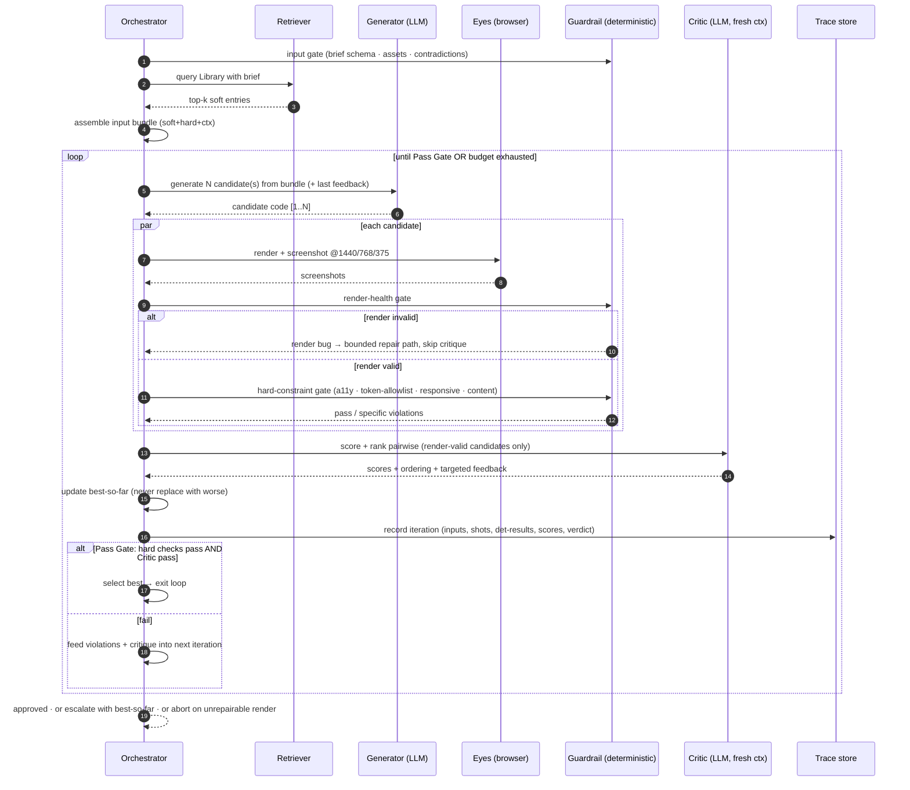
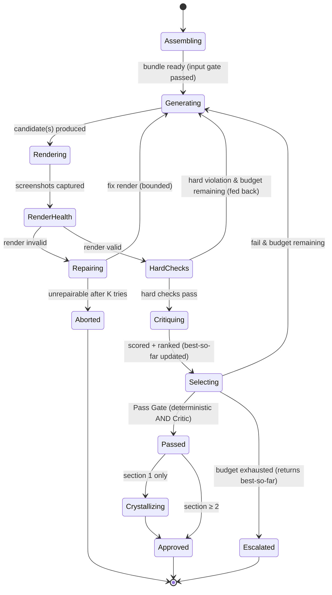

# 05 — The Generation Loop (the engine)

> The core of ADE: the closed **generate → render → screenshot → critique → edit** loop — the "Eyes" capability, with the Critic as the "Taste" proxy. This is the most important behavioral spec; the MVP (`07`) implements exactly this loop for one section.

---

## 1. Inputs to a single section generation

The Orchestrator assembles one **input bundle** per section. Every input is tagged by authority (`01` §4, `04` §7).

```
   INPUT BUNDLE (assembled by the Orchestrator)
   ┌──────────────────────────────────────────────────────┐
   │ SOFT │ retrieved Library slices (top-k)               │
   │      │ ≤5 reference screenshots (direction, not copy) │
   │──────┼────────────────────────────────────────────────│
   │ HARD │ Brand Foundation                               │
   │      │ Project Design System  (exists after section 1)│
   │      │ business context + THIS section's content      │
   │      │ quality / accessibility floor                  │
   │──────┼────────────────────────────────────────────────│
   │ CTX  │ screenshots of already-built sections          │
   └──────────────────────────────────────────────────────┘
```

- **SOFT** is direction the Generator may diverge from.
- **HARD** is law the Generator must obey (and the Critic scores against).
- **CTX** is visual context so a later section *looks like it belongs* — the agent designs with the rest of the page in front of it, as a human would.

> **Output representation.** The Generator produces a **React + TypeScript** component (`.tsx`) styled with **Tailwind** (the team's stack) — **not** raw HTML/CSS/JS. The Eyes render it through a **preview harness** (a thin Vite/Next app that mounts the component) and screenshot that. Components are real, reusable stack output (they drop into Next.js later), and a component representation is also what product *apps* need — so this choice both matches the team and moves the system toward app-readiness (see `02` §5, `07`, and `09` open question #5).

---

## 2. Sequence diagram — one section, with the loop



Notes:
- **Variation (N candidates)** is optional per iteration; even N=1 works for the MVP. Pairwise ranking is used whenever N>1.
- The **Critic sees screenshots**, never the thought process — judging rendered pixels is the whole point.
- Every iteration is **traced** (this is the data the `08` hypotheses are measured on).

---

## 3. State diagram — the loop's lifecycle



Three terminal states: **Approved** (success), **Escalated** (budget exhausted → human decides), **Aborted** (a hard constraint cannot be satisfied → recorded, surfaced). No silent failure.

---

## 4. The Critic rubric (the Taste proxy)

The Critic scores the rendered section on four weighted dimensions. The weights differ for section 1 (no design system exists yet).

| Dimension | What it measures | Weight (≥2) | Weight (section 1) |
|---|---|---|---|
| **Brand adherence** | fit to Brand Foundation (palette, type, motion voice, personality) | 25% | 35% |
| **System adherence** | fit to Project Design System (exact tokens, component recipes) | 25% | n/a |
| **Brief fit** | does it serve the business goal/audience? | 25% | 30% |
| **Craft** | hierarchy, rhythm, restraint, polish, responsiveness | 25% | 35% |

Rules:
- **Deterministic floor first (composite Pass Gate).** The *objective* parts of brand/system adherence (token-allowlist) and the entire quality floor (a11y/contrast, responsive overflow, content presence, no placeholders) are checked by the **Guardrail Layer** ([11](./11-guardrails-and-invariants.md)) **before** the Critic — not by the Critic. A Critic “pass” can never override a deterministic failure: `approved ⇔ deterministic checks pass AND Critic passes`. This shrinks the rubric below to the *subjective* remainder.
- **`criticTemperature = 0.2`** (stable, not divergent — the Critic must stay consistent across repeated calls on the same screenshots; the Generator uses `genTemperature = 0.7` to diverge).
- **Phase-0 rubric (no design system yet)**: `system_adherence = null` — the token-allowlist does not exist in Phase 0 (no PDS), so this dimension is excluded. Effective weights for section 1: brand_adherence 35 %, brief_fit 30 %, craft 35 %. The full four-dimension rubric (25 % each) applies from section 2 onward, once the PDS exists.
- **Pairwise over absolute.** When `--variations ≥ 2`, the Critic compares candidates head-to-head (“A or B, and why”) *before* assigning absolute 0–100 scores — pairwise comparison is far more reliable than absolute scoring alone. Validation runs **must** use `--variations ≥ 2` so the H1 signal is not dominated by single-candidate Critic noise.
- **Record raw judgments.** The exact structured Critic output (scores, ranking, verdict, feedback — not just the final verdict) is persisted in every `RunRecord` in `trace.jsonl`. These raw judgments are the H8 calibration substrate — they must exist even when a run ends in escalation or abort.
- **Fresh session enforcement (I2).** The Critic's session / context is initialized independently of the Generator's; they share no conversation history, no tool state, and no cached context. The only inputs the Critic receives are screenshots and the hard constraints — never the Generator's reasoning or intermediate steps.
- **Feedback must be actionable.** Each fail returns specific, addressable notes (“the CTA competes with the headline; the photo is cropped too tight at 375”) — not “make it better.”
- **The Critic is a proxy, not an oracle.** It is the system's weakest link; it is calibrated over time by human verdicts (see `08` H3/H8). Until then, a human spot-checks Critic “passes.”
- **Beyond the section.** The same Critic capability also runs as a **Phase-Exit Review** ([11 §2.3](./11-guardrails-and-invariants.md)) on the non-section artifacts (brand, design system, library entry), each with its own rubric — the four dimensions above are the *section* rubric, not the Critic's only job.

---

## 5. Stop conditions & budgets

| Condition | Action |
|---|---|
| **Pass Gate met** — deterministic hard checks pass **and** Critic ≥ threshold | exit → Approved |
| Render invalid, unrepairable across K tries (`renderRepairTries`) | Aborted + recorded (each repair attempt is traced and counted against the run budget) |
| Hard-constraint violation unresolved within iteration budget | Escalated (returns best-so-far) |
| `iterations == max_iterations` (default 4) | Escalated (human reviews best-so-far) |
| Wall-clock / token budget per section exceeded | Escalated (returns best-so-far) |
| Model-call count budget exceeded | Escalated (returns best-so-far) |
| A↔B ping-pong detected (same violation class flips between two states across iterations) | Escalated early — do not spin; human resolves the oscillation |

Budgets are configurable and enforced **centrally** by the Orchestrator, not per-call. The point is **bounded** autonomy: the loop never spins forever and always ends in a recorded, inspectable state. **Best-so-far is retained throughout** — an Escalated run still returns the best candidate seen, never nothing and never a regression (I4, [11 §3](./11-guardrails-and-invariants.md)).

> **Note (Escalation queue):** Any condition that triggers an "Escalated" or "Aborted" state does not just print to stdout; it emits a structured record to the `escalations.jsonl` queue. Escalation is a designed, asynchronous human touchpoint, not merely a failed terminal state ([see 06 §9](./06-workflows.md)).

---

## 6. Prompt specifications

> These are *specs* (intent + required inputs/outputs), not final wording. Final prompts are tuned during the build. The model is Claude Opus 4.8 with vision; the Generator and Critic run in **separate** contexts.

### 6.1 Generator prompt (spec)

```
ROLE: You are an expert product/web designer. Design and BUILD one section.

YOU MUST OBEY (hard):
  - Brand Foundation:        {palette, type, motion voice, personality, tone}
  - Project Design System:   {tokens, component recipes}   # if present
  - Business brief:          {industry, audience, goal, this section's content}
  - Quality floor:           responsive @1440/768/375; accessible; performant

YOU MAY DRAW ON (soft — synthesize, do not copy):
  - Library direction:       {top-k entries: intent/construction/rationale/avoid}
  - References:              {≤5 screenshots} as DIRECTION only

VISUAL CONTEXT:
  - Already-built sections:   {screenshots}  # make this section belong to the same family

LAST CRITIQUE (if any): {actionable feedback to address}

OUTPUT: a complete React + TypeScript component (.tsx) for THIS section only,
        styled with Tailwind, importing the project's design tokens.
        No placeholders. Use the brand/system tokens exactly. It must render
        in the preview harness with no extra wiring.
```

**Generator output rules (Phase 0)** — these are enforced deterministically by the Guardrail Layer ([`11 §2.1`](./11-guardrails-and-invariants.md)), not by the prompt alone:

- **Single file**: exactly one self-contained `.tsx`; no `supporting/*.tsx` in Phase 0.
- **Import allowlist**: `react` only. No icon, image, or UI component libraries. Hallucinated imports break the build and are fed back as a *fix* task (never a design score).
- **Static Tailwind class strings only**: no computed or template-literal class names — the Play CDN's JIT cannot see them.
- **Streaming + truncation check**: call is streamed with generous `max_tokens`; on `finish_reason = max_tokens` *or* unbalanced braces/JSX, retry once at a higher budget (counted against model-call budget); on second failure, route to render-repair, not critique.
- **`--refs` is a no-op in Phase 0**: accepted as a flag, wired for real in Phase 2 (C2.4).

### 6.2 Critic prompt (spec)

```
ROLE: You are a senior design critic. You did NOT build this. Judge it honestly.

INPUTS:
  - Rendered screenshots @1440/768/375
  - The same hard constraints (brand, system, brief, floor)
  - (if ranking) multiple candidates' screenshots

CAVEATS (if applicable):
  - "The brand font '<family>' is rendered via fallback '<fallback>' due to licensing. Judge type scale/weight/hierarchy, not letterforms."

TASK:
  1. Score each candidate on: brand_adherence, system_adherence, brief_fit, craft (0–100).
  2. If multiple: rank pairwise and justify the ordering.
  3. Verdict per candidate: pass | fail (vs threshold).
  4. For any fail or weak dimension: give SPECIFIC, ADDRESSABLE feedback.

OUTPUT (structured): { scores, weighted_total, ranking, verdict, feedback }.
Judge what is RENDERED. Do not infer intent that is not visible.
```

### 6.3 Crystallizer prompt (spec — section 1 only)

```
ROLE: Extract the design system implied by this approved section.

INPUT: approved section (React + TypeScript component) + Brand Foundation.

TASK: produce the Project Design System — exact tokens (color/type/space/radius/
      shadow/motion) and component recipes (anatomy, variants, states) that THIS
      section established. These become HARD law for all later sections.

OUTPUT: the ProjectDesignSystem (see 03 §4) — tokens as a Tailwind theme + CSS
        variables, plus typed React component recipes the hero used. Freeze the
        FOUNDATION (tokens); later sections ADD components but never change tokens.
        Specialize the brand; never contradict it.
```

---

## 7. Consistency vs. variation inside the loop

The loop must produce sections that are **consistent** (same tokens) without being **monotonous** (same layout). The mechanism:

- **Locked by hard inputs:** color, type, spacing, motion, component styles (from Brand + System).
- **Free for the Generator:** layout, composition, section structure, which patterns to draw on.

So the Critic's `system_adherence` dimension polices the *primitives*, while `craft` and `brief_fit` reward *appropriate variation*. A section that merely clones the hero's layout should score well on adherence but poorly on craft/brief-fit for its own purpose.

### 7.1 Protected exploration (M8)

In explore iterations (typically early in the loop), **one candidate is flagged `exploration: true`**. This candidate is generated at a higher temperature or with an explicit "take a defensible risk" instruction, and is exempt from the strict scoped-feedback constraints of the other candidates. 

Its purpose is to preserve discontinuous options and provide the human review queue with interesting rejects. It is logged in full and is eligible for selection **only** through the normal Pass Gate — the `exploration` flag is never a bypass for quality or constraints. To support trajectory learning from these candidates, human verdicts in the R2 channel must support a **`rejected_with_interest`** label (feeding R13).

---

## 8. Why this loop replaces the old pipeline's machinery

| Old pipeline needed… | Because… | ADE replaces it with… |
|---|---|---|
| `generation_rules.md` per site | the generator was blind | the **Critic seeing** the mistake |
| `thought_process.md` self-grading | no external judge | a **fresh-context Critic** |
| "never re-open the site" dogma | token fear | **vision + retrieval** keep context bounded |
| predicted accuracy tables | no measurement | **traced, scored iterations** (`08`) |

The loop is not a tweak to the old pipeline — it is the thing the old pipeline's `Stage 6` was quietly trying to become, promoted from a final exam to the engine.
