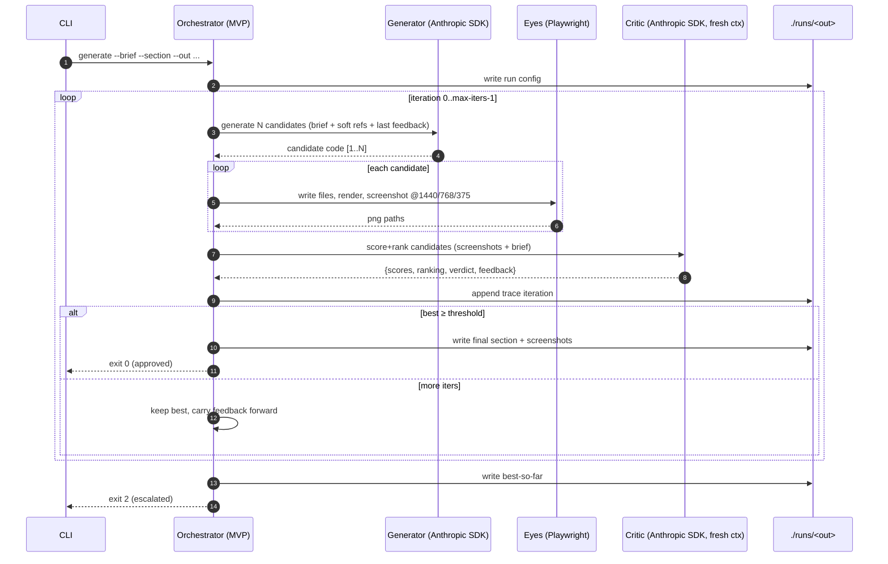

# 07 — MVP: the CLI closed loop on one section

> **The first thing to build.** A CLI that runs the closed loop (`05`) on a **single section**, from a brief, with **no** Library and **no** Brand/Design-System stores yet. Its only job: prove the **Eyes** capability — that an agent which sees its own render can improve a section against a brief with no reference to clone (**hypothesis H1**, `08`).
>
> This document is written to the **buildability bar**: an engineer should be able to implement it from this page alone, without further design decisions.

---

## 1. Scope

**In:** brief → generate → render → screenshot → critique → edit → repeat → output a finished section + a trace. One section. CLI-driven. Local.

**Out (deferred to later phases):** Library / vector DB / retrieval, Brand Foundation, Project Design System, crystallization, multi-section consistency, write-back, references (optional flag only), whole-site assembly. (These are specced in `02`–`06` but **not** built here.)

```
  MVP = the dashed box only
  ┌─────────────────────────────────────────────────────────────┐
  │  brief ──► [ generate → render → screenshot → critique ]──►  │  ← loop
  │                         ▲___________edit____________│         │
  │  ──► best section (React/TS .tsx + screenshots + trace.jsonl)    │
  └─────────────────────────────────────────────────────────────┘
   (no library · no brand store · no crystallization · no write-back)
```

### 1.1 Output is React + TypeScript (your stack), not raw HTML

The Generator outputs a **React + TypeScript component** (`.tsx`) styled with **Tailwind** — your real stack — not throwaway HTML/CSS/JS. Two reasons:

1. **It matches your stack.** The component drops straight into Next.js later; nothing is rewritten.
2. **It is the representation product *apps* need.** Apps are built from components with states; starting in React means the gap between "marketing page" and "product app" is small later (the remaining work is *driving* states, not changing the output format — see `09` open question #5).

The only added cost vs raw HTML is a **preview harness**: a thin app that mounts the generated component so the Eyes can render and screenshot it. Recommended: **Vite + React** for the MVP (starts in milliseconds, ideal for rendering many candidates fast); switch/add **Next.js** when you want production parity. The *component* is final either way — only the harness differs.

---

## 2. Command surface

```
ade generate \
  --brief      ./briefs/burkes-hero.json   # required: business context + content (schema §3)
  --brand-data ./briefs/burkes-brand.json  # optional: palette + typography (hard tokens; §3)
  --section    hero                         # required: section name
  --out        ./runs/burkes-hero           # required: output dir
  --variations 2                          # optional: N candidates per iteration (default 1)
  --max-iters 4                           # optional: loop budget (default 4)
  --threshold 80                          # optional: pass score 0–100 (default 80)
  --refs               ./refs/*.png       # optional: ≤5 reference screenshots (soft)
  --gen-model          claude-sonnet-4-6  # optional (default: from Appendix B)
  --critic-model       claude-opus-4-8    # optional (default)
  --orchestrator-model claude-haiku-4-5   # optional (default)
  --headed                                # optional: show the browser while rendering
```

### 2.1 Provider environment configuration (`ADE_PROVIDER`) — C0.0

The system abstracts provider calls behind the `Provider` interface (`src/provider.ts` / `src/model.ts`). Selection is governed by `ADE_PROVIDER`:
- **`agent-sdk`** (default for dev): Uses the Claude Agent-SDK via Pro-credit OAuth credentials. **Must not require `ANTHROPIC_API_KEY` in the environment.**
- **`api`** (prod-only): Uses direct Anthropic API calls with `ANTHROPIC_API_KEY`.
- **`local`** (fallback): Uses local Ollama model instances for offline or degraded operations.

Every model invocation records the provider mode and pinned `model_id` into `trace.jsonl`.

### 2.2 Phase 0 Measurement tools (`verdict` & `report`) — C0.16

- **`ade verdict`**: Persists structured human feedback (`iter_0_path`, `final_path`, `control_best_path`, `human_pick`, `rating_4pt`, `notes`, `dist_tags`). Supports a **three-way blind comparison** to prevent presentation bias and `--retest` mode for quarterly human re-test rituals.
- **`ade report`**: Emits **observed** operational and quality metrics from trace and verdict data (never predicted Critic scores), including burn-rate vs S2 quota limits.

### 2.3 Phase 1 Brand & Review Management (`design brand` & `review`) — C1.2, C1.3, C1.6

- **`ade design brand`**: Manages the Brand Foundation lifecycle.
  ```
  ade design brand --client burkes --context ./briefs/burkes-hero.json --brand-data ./briefs/burkes-brand.json
  ade design brand --client burkes --approve [--approved-by human]
  ```
  Derives 2–3 distinct brand directions (personality, tone, motion voice, color-usage rules). Resolves approval status and freezes approved Brand Foundations with immutable versioning (`store.ts`).
- **`ade review`**: Manages review routing and human approval workflows for Phase-Exit boundaries (Brand & Project Design System). Interacts with `escalations.jsonl` queue to pause/resume blocked runs.

Exit codes: `0` approved (passed), `2` escalated (budget exhausted, best-so-far emitted), `3` aborted (unrepairable), `1` error.

### 2.4 Phase 2 Memory & Strategy (Library, Embeddings, Ablation) — C2.0-C2.8, E2.2, E2.4

- **Embedding Configuration**: Handled by `ADE_EMBEDDING_PROVIDER` (defaults to a `local` embedding model to satisfy C2.0 key-free constraint). Changing the embedding model version triggers a full re-embed of the store.
- **`ade memory write-back`** (alias: `ade design learn`): Executes the C2.5 Stage B pipeline (De-identification Gate → Abstraction → Altitude Phase-Exit Review → Dedup/Merge → Provisional Tier B Insert). Use `--skip-review` only as an explicit opt-out; review is wired **on by default** so every real Library entry is reviewed before insertion.
- **`ade design reembed [--check]`** (C2.0): Detects embedding-model drift in the Library by comparing each entry's stored embedding model id against the current active model. `--check` reports drift count without re-embedding. Without `--check`, regenerates all embeddings under the current model. A toolchain version bump treats a drift report as a hard gate before any new retrieval run.
- **`ade design curate-library`** (C2.6 / M20): Runs a periodic curation pass over the Library. Evaluates all high-confidence entries older than 30 days using the Critic (fresh-context). Entries rejected by the curation gate are **retired** (confidence set to 0.1, `retired: true`) rather than deleted. A curation pass is recommended after each major model succession event (M12).
- **`ade design library-entropy`** (C2.6): Reports the Shannon diversity entropy of the Library's retrieval distribution, computed from `times_used` across active entries. A low entropy score (close to 0) signals that the Library is collapsing to a small set of overused patterns — a retrieval echo-chamber signal. A high score (approaching `log2(N)`) indicates uniform usage. Track over time to detect progressive echo-chamber drift.
- **`ade design strategy`** (E2.4): Generates an upstream Strategy/IA site plan (audience/positioning → site narrative → per-section goals) from a brief JSON, upstream of section generation. The plan itself is Phase-Exit-Reviewed (fresh-context Critic + cross-family second judge, bounded ≤2 tries). Use `--out` to write the resulting `SitePlan` JSON for injection into `ade design site --strategy`.
  ```
  ade design strategy --brief ./briefs/burkes-hero.json --out ./plans/burkes-site-plan.json
  ade design site --client burkes --plan ./plans/sections.json --strategy ./plans/burkes-site-plan.json
  ```
  The `--strategy` flag on `design site` folds each section's per-section goal and key message from the site plan into that section's brief as soft guidance.
- **`ade design qa [--cross-surface]`** (C1.11): Runs a whole-artifact QA pass against a frozen brand and design system. Reports per-section scores, identifies coherence violations (nav inconsistency, visual rhythm breaks, responsive seams), and issues a pass/fail verdict. With `--cross-surface`, also checks website/product brand reuse — verifying that both surfaces share the same frozen brand tokens and that no surface-local token divergence has crept in.
- **`ade verdict --pairwise`**: Extends Phase 0 verdicts with a pairwise comparison UI, constitution-dimension sliders, and spatial annotations (R2 feedback channel, C2.8), including the `rejected_with_interest` label to feed exploration candidates.
- **`ade eval ablate`** / **`ade ablation`**: Runs the E2.2 three-arm ablation test (No Library vs. Stage A Own-Client vs. Stage B Cross-Client) to measure H6 compounding effects. Requires a `--briefs` manifest of matched briefs and produces an `h6-summary.json`.
- **`ade rlaif`**: Generates RLAIF preference labels for a completed run (pairwise preferred/rejected pairs from Critic output).
- **`ade rlaif:export`**: Exports the accumulated pairwise verdict corpus into a standard Direct Preference Optimization (DPO) dataset format for downstream reward model training.

### 2.5 Phase 3 Taste Calibration & Scale — C3.2-C3.9

- **`ade eval prove-taste-calibration`** / **`ade prove-taste-calibration`**: The Phase 3 Exit Gate. Quantitatively checks if Critic↔human agreement exceeds the required threshold (>85%) across all difficulty strata, and validates that pairwise ranking outperforms absolute scoring (H8). Reports per-stratum agreement and trend (H3).
- **`ade succession run --old-model <id> --new-model <id>`**: Executes the M12 Substrate Succession playbook (6-step). Runs judge distillation — re-runs the new model on historical records and reports verdict accuracy vs the old baseline. Produces a `SuccessionEntry` (old_model, new_model, distillation accuracy, deltas, timestamp) appended to `knowledge/decisions-and-conventions.md`.
- **`ade selfaudit --out <dir>`** (M20): Runs the M20 periodic self-audit pass over `trace.jsonl` and verdicts. Emits **three typed proposal streams** into `<dir>/proposals/`:
  1. `failure-catalogue-proposals.md` — recurring hard-gate violations (clusters of the same violation class across ≥2 runs) and persistent generation failures.
  2. `constitution-amendment-proposals.md` — Critic↔Human misalignment cases (human approves what Critic fails, or vice versa), proposing constitution principle reviews.
  3. `frontier-eval-cases.md` — `strong`-rated patterns (propose for Library or benchmark) and domain blind spots (systematically low-scoring briefs).
  All proposals require human ratification before any change is applied (Tier A gating).

### 2.6 Phase 4 Production Hardening — C4.0-C4.8, E3.1-E3.3

- **`ade prove-ship-readiness`**: Phase 4 Exit Gate. Checks all 5 criteria: (a) deterministic floor, (b) H1 improvement, (c) H2 ≥50% human good-or-close, (d) H4 zero token drift, (e) measured benchmark gain.
- **`ade integrity`**: Scans all hard stores for dangling references — brand/PDS/artifact referential integrity check (C1.0). Exits non-zero if any dangling artifact→system or entry→provenance link is found.
- **`ade escalations list / answer`**: Manages the structured `escalations.jsonl` queue. `list` shows open escalations with their question payloads; `answer` records a human resolution and unblocks the run.
- **`ade benchmark`**: Runs the anchor-set benchmark suite (bias-probes, stratum agreement, core vs. held-out score, benchmark age/staleness warning). `--compare <id>` measures cross-model agreement gap.
- **Production Cost Controls (E3.1 — Design-to-Code Strict Parity):** `design section` and `design site` accept production-scope flags enforced at delivery:
  - `--production` — enables the full Production-Parity Gate (cross-browser, hydration, Web Vitals) and the Design-to-Code Strict Parity check (`validateDesignToCodeParity`: no inline `style={{}}`, all top-level functions exported).
  - `--harness next` — switches the render harness from Vite CDN to Next.js (production parity, C4.4).
  - `--max-tokens-per-section`, `--max-seconds-per-section`, `--max-usd-per-section` — per-section spend/latency hard caps; violation emits a `production-budget` gate failure.
- **Telemetry (E3.3):** All scaling events are written to `telemetry/events.jsonl` via `src/telemetry.ts`. Three event types are tracked:
  - `brand_reuse` — each time a frozen Brand Foundation is used on a new surface (H5 substrate).
  - `library_recall` — retrieval query length and hit count per run (H9 substrate).
  - `engine_mode_efficiency` — whether the run is `zero-to-one` or `refactoring`, iteration count, success, and duration (H10/E3.2 substrate).

---

## 3. Inputs: the brief + brand-data (`--brief`, `--brand-data`)

Two small JSON files. The human provides only **facts and constraints**; strategic brand cues (personality, tone, motion) are **AI-derived**, never hand-specified.

**`--brief`** — business context + this section's content. The **hard** input the section must serve:

```json
{
  "client": "The Burkes Group",
  "industry": "Real estate & mortgage",
  "location": "The Woodlands, TX",
  "audience": "home buyers, sellers, investors",
  "goal": "lead generation via confidence, not urgency",
  "section": {
    "name": "hero",
    "content": {
      "headline": "Built on Trust, Driven by Legacy.",
      "tags": ["Strategic", "Trusted", "Results-Driven"],
      "cta": { "text": "Contact Us", "href": "#contact" },
      "nav": ["About Us", "Buy", "Sell", "Services"]
    },
    "assets": { "hero_image": "./assets/hero-bg.png" }
  }
}
```

**`--brand-data`** — the **only** visual essentials you supply: palette + typography ([03 §3.1](./03-data-model.md)). The MVP uses these as fixed **hard** tokens (enforced by the color allowlist, §4); it does **not** yet derive a full Brand Foundation around them — that's the brand phase.

```json
{
  "client_id": "burkes",
  "palette": [
    { "role": "background", "value": "#F7F5F1" },
    { "role": "ink",        "value": "#1C1A17" },
    { "role": "accent",     "value": "#8A6A3B" }
  ],
  "typography": [
    { "role": "display", "family": "Canela", "fallback": "Georgia, serif" },
    { "role": "ui",      "family": "Inter",  "fallback": "system-ui" }
  ]
}
```

> **Why no `personality`/`feel` field?** Those are *strategic interpretation*, not facts you own — so the system **derives** them (full system: from business context + brand-data; MVP: the Generator infers them per-section). Specifying them by hand would anchor the AI's strategy, the opposite of Goal B. The only brand constraints you supply are the palette + typography in `--brand-data`. (Rationale: [04 §2.1](./04-memory-and-consistency.md).)

### 3.1 `plan.json` (Strategy-decision capture)

Whenever the human makes an IA, copy, or structure choice that shapes a run, it is captured in `plan.json` (per run, human-authored). This is optional in Phase 0 (single-section mode) but **must be recorded when present**. This corpus forms the training data for the future autonomous strategy layer (EG-2).

**Capture rule:** The capture is explicitly **passive** — supplying `plan.json` does not alter the Generator's system prompt or behavior in Phase 0; it merely attaches the human's strategy rationale to the run's trace for future modeling.

**Schema:**
```json
{
  "sections": [{ "name": "hero", "order": 1, "purpose": "Clear value prop + email capture" }],
  "narrative_rationale": "Leading with the pain point before showing the UI builds more trust.",
  "copy_decisions": [{
    "element": "hero_headline",
    "choice": "Don't just track time. Own it.",
    "rationale": "Aspirational rather than functional; matches the new brand voice."
  }],
  "audience_notes": "SaaS founders, high urgency, low patience.",
  "decisions": [{
    "decision": "Skipped the social proof section",
    "alternatives_considered": "Adding a 3-logo strip under the hero",
    "rationale": "Burkes has no recognizable customers yet; a weak logo strip hurts credibility.",
    "author": "human"
  }]
}
```

### 3.2 Input Gate: asset fitness + injection safety — C0.1

The Input Gate ([`11 §2.1`](./11-guardrails-and-invariants.md)) runs these additional checks before any model call:

**Asset fitness** — a file that exists but is unfit is rejected here, not at render time (driven by `sharp` / `src/imageutils.ts`):
- **Colorspace**: must be sRGB. CMYK JPEGs are auto-converted via `sharp` where safe; if conversion is ambiguous or destructive, the file is flagged with a precise error.
- **Minimum resolution**: metadata dimensions are read via `sharp` and checked against the display size the asset will occupy (e.g., a full-bleed hero image must meet a minimum px threshold for the 1440 px breakpoint).
- **Logo alpha check**: `logo_ref` assets are checked via `sharp` channel stats for alpha-channel presence and background transparency — a white-background logo will be caught here before it fails silently against the brand palette.
- **Aspect-ratio sanity**: a clearly wrong crop ratio (e.g. 1:100) is flagged as a likely mistake, not silently passed.

**Injection safety** — all brief strings and content fields are wrapped as *data* with clear delimiters before they enter any model prompt (invariant I9). Hard constraints are re-checked deterministically by the Hard-Constraint Gate (C0.7) after generation — so adversarial text in a brief field cannot bypass the deterministic floor even if it alters the model's output.

**Token-Economy Instrumentation (C0.17 / H7 substrate)** — the input bundle's token breakdown is measured and recorded in every `RunRecord` across bundle parts: `hard` (brief/brand/system), `soft` (refs/Library), `visual_context` (prior-section screenshots), and `loop_state`, alongside output tokens and wall-clock.

**Fail behaviour**: any gate failure emits a **precise, actionable error message** and makes **zero model calls**.

### 3.3 Brief Comprehension step — C0.2

Before generation begins, an Orchestrator-tier call restates the brief as `{ goal, audience, constraints }` and detects `{ detected_gaps, detected_conflicts }`.
- **Missing required fields or contradictions**: triggers a human prompt to resolve the ambiguity rather than making a silent assumption.
- **Reference Interpretation scoring (M18)**: brief comprehension outputs are evaluated against a frozen, human-authored reference interpretation on restatement accuracy and interpretation depth.
- **Trace persistence**: the canonical restatement is recorded in the trace and passed to Generator and Critic.

### 3.4 Bounded Loop Control & Escalation Queue — C0.11 / M7

- **Render-Repair Sub-loop (`renderRepairTries` / C0.6)**:Syntax/parse errors and blank renders route to a dedicated render-repair sub-loop bounded by `renderRepairTries`. Render repair attempts are counted against the run budget and never passed to the design Critic (invariant I11).
- **Escalation Queue (`escalations.jsonl` / M7)**: On terminal budget exhaustion, unrepairable render failures, or unresolved judge disagreements, the loop writes `best-so-far` and emits a structured entry to `escalations.jsonl` (exit code `2` ESCALATED), ensuring no run vanishes silently.

### 3.5 Phase 1 Multi-Section & Craft Metrics Extensions — C1.9, C1.11, E1.5 / M17

- **DOM Craft Metrics (M17 / E1.5)**: Deterministic measurements computed from the rendered DOM at gate time (spacing-scale conformance, type-scale conformance, grid regularity, tap-target geometry). Injected as **advisory context into the Critic prompt** and logged to `trace.jsonl` (never hard-gated unless benchmark evidence correlates with human verdicts).
- **Multi-Section Visual Context Window (C1.9)**: When generating subsequent sections, screenshots of 1–3 prior approved sections are injected as soft visual context to enforce cross-section harmony while bounding token consumption per section.
- **Whole-Artifact Assembly & QA Pass (C1.11)**: Individual sections are assembled into full pages to run a whole-page Critic pass (nav consistency, visual rhythm, responsive seams). Incoherencies trigger a section re-loop rather than an ad-hoc code patch.

---

## 4. The loop (exact behavior)



Iteration detail (gates from [11](./11-guardrails-and-invariants.md) are part of the MVP):
1. **Generate** — Generator prompt (`05` §6.1, reduced: **brand-data** palette+type as hard tokens; no full design system; personality/tone inferred per-section). With `--variations N`, request N candidates.
2. **Render** (Eyes pipeline — C0.5) — each candidate gets a **fresh build directory + unique local port** (prevents stale-module bleed between candidates). Playwright loads the harness URL with a `candidateId` query parameter. Before capture, await in sequence: `document.fonts.ready` → network idle → images decoded → animation / CSS transition settle. Components with async data must set `data-ade-ready="true"` on their root element when ready; the harness awaits this attribute in addition to mount + fonts (unsignaled async fetches are forbidden in Phase-0 output). A **content fingerprint** of the DOM is checked against the current `candidateId` — a stale render from a prior candidate is detected and retried, never accepted. Screenshots captured at 1440 / 768 / 375 px.
3. **Render-health gate** (deterministic — C0.6) — **fast syntax check** (esbuild.transform: catches parse/syntax errors; does *not* type-check — semantic errors surface via the Vite error overlay), non-blank DOM, expected root node present, no error overlay, fonts + images loaded, layout settled, `window.__ADE_READY_ID__ === candidateId` per-candidate nonce match (prevents stale-render false passes). Invalid → bounded **render-repair** sub-loop (fix the code), **not** the design Critic — a render bug is categorically distinct from a design failure (I11).
4. **Hard-constraint gate** (deterministic) — a11y/contrast audit (axe-core), responsive-overflow, content-present / no-placeholder, and — when `--brand-data` is supplied — a **color allowlist** (only the provided palette may appear; off-palette hex fails). Violations are fed back as **hard** feedback. *(The full token-allowlist for spacing/radii/etc. is still skipped — no design system yet.)*
5. **Critique** — Critic prompt (`05` §6.2) in a **fresh** context (I2), screenshots + brief → structured scores + ranking + feedback (validated by the **Schema gate**).
6. **Decide — Pass Gate** = hard-gate pass **AND** Critic ≥ `--threshold`. Update **best-so-far** (never replace with worse, I4). If not passed and budget remains, carry violations + critique forward; else escalate with best-so-far.
7. **Trace** — append the iteration record (`03` §6) to `trace.jsonl` **immediately** as a new JSONL line (durable, atomic — I6). JSONL format ensures a mid-run crash leaves all completed iteration records intact and individually parseable.

---

## 5. Output layout

```
runs/burkes-hero/
├── config.json                 # the resolved run config
├── final/
│   ├── Section.tsx             # the approved (or best-so-far) React/TS component
│   ├── supporting/*.tsx        # Phase 1+ only — Phase 0 emits exactly one self-contained Section.tsx (§6.1)
│   └── shots/{1440,768,375}.png
├── iterations/
│   ├── iter-0/
│   │   ├── cand-1/{Section.tsx,…,shots/*.png}
│   │   ├── cand-2/{…}
│   │   └── critique.json
│   ├── iter-1/ …
└── trace.jsonl                 # JSONL, one RunRecord per line, atomically appended per iteration — the H1 measurement substrate
```

`trace.jsonl` is the deliverable that matters most for validation: it lets you see whether scores **rose across iterations** (the H1 signal). JSONL format (one `RunRecord` per line, not a JSON array) is required so each iteration can be appended atomically without rewriting the whole file — a JSON array cannot be atomically appended.

---

## 6. Component shape (MVP build)

A thin TypeScript program; no framework needed.

```
src/
├── cli.ts            # arg parsing → calls orchestrator / verdict / report / brand / review
├── orchestrator.ts   # runLoop(): the 05 loop; owns budget, selection, trace
├── generator.ts      # generate(bundle, feedback?) → candidate Section.tsx
├── critic.ts         # critique(shots, brief) → scores+ranking+feedback (vision)
├── eyes.ts           # mount .tsx in harness → render → screenshots (Playwright)
├── guardrails.ts     # deterministic gates: render-health, a11y, content, schema, token-allowlist (11)
├── prompts.ts        # generator/critic prompt builders (05 §6)
├── schema.ts         # Brief, RunRecord, DimensionScores, VerdictEntry, BrandFoundation, PDS (03)
├── trace.ts          # append/read trace.jsonl (immediate, atomic)
├── provider.ts       # ADE_PROVIDER selection (agent-sdk, api, local)
├── model.ts          # LLM call dispatch with quota tracking
├── config.ts         # environment and run configuration builder
├── imageutils.ts     # sRGB conversion & image fitness checks via sharp
├── verdicts.ts       # 3-way blind verdict capture and --retest handler
├── report.ts         # observed metric reporting & S2 burn-rate validation
├── store.ts          # append-only atomic versioned hard store (C1.0)
├── brand.ts          # brand derivation pipeline & frozen foundation management (C1.1-C1.4)
├── crystallizer.ts   # conservative hero token extraction & PDS crystallization (C1.5)
├── escalations.ts    # asynchronous human escalation queue management (M7 / E1.2)
├── reviewers.ts      # cross-family second judge & Phase-Exit Review rules (C1.3, C1.6)
├── reviewRouting.ts  # review boundary routing & escalation dispatch (C1.3, C1.6)
├── constitution.ts   # design constitution principles & ethics rules (C1.13, 12)
├── benchmark.ts      # R1 golden core benchmark runner & statistical evaluator (C1.13)
├── embeddings.ts     # local/API embedding provider integration (C2.0)
├── library.ts        # vector store ops, Stage A/B scoping (C2.2)
├── retrieval.ts      # confidence-weighted matching, cold-start fallback (C2.3)
├── writeback.ts      # de-id, abstraction, dedup pipelines for Stage B (C2.5-C2.7)
harness/              # thin Vite + React app: mounts candidate Section.tsx at a route
├── index.html        # harness shell (preview host)
├── src/main.tsx      # imports candidate component + renders it
└── vite.config.ts
```

### 6.1 Generator output contract (Phase 0) — C0.3

The Generator is bound by these output rules, enforced deterministically by the Guardrail Layer ([`spec/11`](./11-guardrails-and-invariants.md)):

- **Single file**: exactly one self-contained `.tsx` per candidate — no `supporting/*.tsx` in Phase 0 (deferred to Phase 1).
- **Import allowlist**: `react` only — no icon libraries, image libraries, or UI component libraries. Hallucinated imports break the build; they are caught deterministically by the Guardrail Layer and fed back as a *fix* task, never scored as a design failure.
- **Static Tailwind class strings only**: no runtime-constructed class names (e.g. no template literals computing class values — the Tailwind Play CDN's JIT cannot discover what is not a literal string in the source).
- **Streaming + truncation check**: the Generator call is streamed with a generous `max_tokens` budget. If the stream ends with `finish_reason = max_tokens` *or* braces / JSX are unbalanced, the loop retries once with a higher token budget (counted against the run's model-call budget); if the second attempt also fails, the candidate routes to the render-repair path — never to critique.
- **`--refs` is a no-op in Phase 0**: the flag is accepted by the CLI but has no effect on generation. It is wired for real in Phase 2 (C2.4).
- **No placeholders**: the Generator instruction explicitly forbids lorem ipsum, TODO comments, and placeholder copy. The Hard-Constraint Gate (C0.7) also scans for these deterministically as a downstream check.

### 6.2 Harness isolation (Phase 0) — C0.4

The preview harness treats generated code as **untrusted from the start**:

- **Vendored Tailwind runtime** — the Tailwind Play CDN script is downloaded once at setup, pinned by version + checksum, and served from `harness/vendor/`. All fonts are self-hosted in `harness/public/fonts/` (Google-Fonts files fetched at setup; commercial faces mapped to nearest local fallback with the substitution recorded per run).
- **Network-isolated (zero egress)** — egress is denied by default at the Playwright browser level. **Zero allowlist exceptions hold**: a candidate render that triggers any network request (even for an asset) fails the render-health check instantly. This forces the system to rely strictly on self-hosted/vendored assets.
- **Ephemeral per candidate** — each candidate gets its own fresh build directory and unique local port; no module cache or HMR state bleeds between candidates.
- **Images mapped locally** — the Generator output may `import` or src a brand logo; the harness serves dummy placeholders or local `public/` assets so the render completes without network fetches.
- **No secrets or credentials in scope** — the harness shell and its runtime environment must never contain `ANTHROPIC_API_KEY` or any other sensitive value.
- **Pinned toolchain** — Playwright, Vite, and the Tailwind CDN version tag are pinned explicitly in the lockfile; a supply-chain update cannot silently alter render output (F-OPS-07).

Dependencies (build phase): `@anthropic-ai/claude-agent-sdk`, `playwright`, `@axe-core/playwright` (deterministic a11y gate), a small arg parser, plus the harness stack — `react`, `react-dom`, `vite`, `@vitejs/plugin-react`, `tailwindcss`, `typescript`. Node + TS. Provider via `ADE_PROVIDER` env var — **never `ANTHROPIC_API_KEY` in dev** (see `AGENTS.md` and `knowledge/decisions-and-conventions.md`). (Swap the Vite harness for a minimal Next.js app when you want production parity — the generated component is unchanged.)

---

## 7. Config & defaults

| Setting | Default | Notes |
|---|---|---|
| gen-model | `claude-sonnet-4-6` | default; fast, good enough for drafted generation (note that pinned ids are re-verified at S3 against the current lineup) |
| critic-model | `claude-opus-4-8` | default; strongest reasoning, vision for the Critic |
| orchestrator-model | `claude-haiku-4-5` | default; fast, cheap routing |
| breakpoints | 1440 / 768 / 375 | screenshot widths |
| variations | 1 | raise to 2–3 to enable pairwise selection |
| max-iters | 4 | loop budget |
| threshold | 80 | weighted pass score |
| output max_tokens | high; **stream** the Generator call | a full section can be large — stream to avoid timeouts |

---

## 8. Done-criteria for the MVP

The MVP is complete when, for the Burkes hero brief (no reference):

1. `ade generate` runs the full loop unattended and emits a finished section + screenshots + `trace.jsonl`.
2. The loop **demonstrably edits in response to critique** (iteration N+1 addresses iteration N's feedback) — visible in `iterations/`.
3. The loop-vs-control comparison is measured: Humans blind-prefer the loop's final output over the matched-compute control's best output at statistical significance (pre-registered α=0.05, n≥20 briefs). See `08 §2` H1 for details on the control arm.
4. A human, shown the final output, judges it "good or close" for the brief on a meaningful fraction of runs (the H2 smell-test).
5. **The guardrails work:** an injected render bug is caught by the **render-health gate** and routed to repair (never scored as bad design), and an a11y/contrast failure **cannot** pass the Pass Gate. This proves the deterministic floor protects the H1 measurement.

These criteria are deliberately about **the loop working**, not about perfect design — the MVP proves the mechanism; quality is raised later by Memory and a calibrated Critic.

---

## 9. What the MVP intentionally does NOT prove (and defers)

| Not proven here | Where it comes | Why deferred |
|---|---|---|
| Consistency across sections | Brand + crystallization (phase 2) | needs a second section + the hard stores |
| Getting smarter over time | Library + write-back (phase 3) | needs the vector DB + multiple projects |
| Calibrated taste | human-verdict loop (phase 4) | needs accumulated verdicts |

Keeping the MVP this narrow is the point: it is the **smallest build that proves the core thesis**, cheaply, before any infrastructure is committed.
