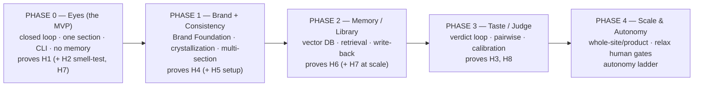

# 09 — Roadmap & Open Questions

> The build order, the autonomy ladder, cost/latency realities, risks, and the genuinely unsolved problems. The roadmap is the *capabilities* order from `00` (eyes → memory → taste), gated by the hypotheses in `08`.

---

## 1. Phased roadmap



| Phase | Builds | Gate to advance |
|---|---|---|
| **0 — Eyes (MVP)** | the loop (`07`) | **H1 passes** (else stop & rethink) |
| **1 — Brand + Consistency** | Brand store, crystallization, section sequencing | **H4 passes** (zero token drift, variety kept) |
| **2 — Memory** | pgvector Library, retriever, write-back | **H6 passes** (Library-on beats Library-off) |
| **3 — Taste** | human-verdict capture, pairwise calibration | **H3/H8 trending up** |
| **4 — Scale & Autonomy** | whole-artifact runs; relax gates per the ladder | sustained quality at lower human touch |

Each phase is **independently valuable and independently abandonable**: if a gate fails, you stop having spent only that phase's effort — the whole point of sequencing by capability and gating by measurement.

---

## 2. The autonomy ladder

Autonomy is **earned with evidence**, not switched on. Human gates are removed only where the Critic has proven calibrated (H8).

```
Rung 0 (MVP)     human reviews every output; AI runs the loop
Rung 1           human approves brand + each section; AI runs loops unattended
Rung 2           human approves brand + spot-checks sections (Critic trusted on most)
Rung 3           human approves brand only; sections auto-approved unless Critic flags
Rung 4           human sets direction + final sign-off; AI runs the project
```

You move up a rung only when, at the current rung, the Critic's "pass" and the human's verdict agree often enough that the human's review is mostly redundant. **A gate is relaxed ONLY where that boundary's measured Critic↔human agreement clears an explicit threshold.** **Never skip rungs on faith.** **Dropping back a rung** on quality complaints or measured regression is a first-class, expected move.

Brand approval likely stays human for a long time — it's high-stakes, long-lived, and cheap to keep. The mechanism that makes a rung *measurable* is the **Phase-Exit Review** ([11 §2.3](./11-guardrails-and-invariants.md)): each boundary (section, brand, design system, library) already runs an automated review just inside its human gate, so the agreement between that review and the human is the exact signal that says whether the gate can be relaxed — and each boundary climbs the ladder on its own evidence.

---

## 3. Cost & latency realities

The loop is many model calls (generate × variations × iterations + critique), each possibly with vision and long output.

| Lever | Effect |
|---|---|
| `--variations` | linearly multiplies generate cost; raises quality via selection |
| `--max-iters` | caps worst-case cost per section |
| per-section generation | keeps each call's context small (`02` §4) |
| cheaper Generator + Opus Critic | optionally split: a cheaper model drafts, Opus judges |
| caching the bundle prefix | the hard inputs repeat across iterations — cache them |

For R&D this is acceptable; at production scale it must be budgeted. Track tokens/section from the trace (H7) from day one so cost is never a surprise.

---

## 4. Risks & mitigations

| Risk | Likelihood | Mitigation |
|---|---|---|
| **Taste is too weak** (Critic ≈ random) | high | the known bottleneck; keep humans in the loop; invest phase 3; pairwise + examples + verdict calibration |
| Loop "passes" mediocre work | med | human spot-checks at low rungs; raise threshold; better rubric |
| Library accumulates noise | med | confidence weighting + dedup + deletion (`04` §6); curate |
| Consistency drift across sections | med | crystallization + hard token check (H4 is hard-checkable) |
| Cost/latency at scale | med | budgets, caching, model split |
| Reference over-influence (sliding into cloning) | med | references are soft + capped at 5; Critic rewards brief-fit not resemblance |
| Long-tail site classes (apps, WebGL) break static output | low (early) | scope MVP to marketing sections; revisit representation for app surfaces later |

---

## 5. Open research questions (honest unknowns)

1. **Taste without a reference.** Can an LLM judge "good design for this brief" reliably enough to drive autonomy? This is the deepest open question; the whole of Goal B's ceiling rests on it. (H3/H8.)
2. **Calibration transfer.** Do human verdicts on one domain (real estate) improve the Critic on another (SaaS)? Or is taste domain-specific?
3. **Library granularity.** What's the right altitude for entries — broad principles, mid patterns, specific recipes? Too broad = vague; too specific = non-transferable. Likely a mix; the ratio is unknown. The **Phase-Exit Review** on write-back ([11 §2.3](./11-guardrails-and-invariants.md)) is the runtime check that *catches* bad-altitude entries, but it does not settle the underlying question of the ideal distribution.
4. **Crystallization fidelity.** *Largely resolved in spec (`04` §3, `03` §4):* freeze the **foundation** (tokens) after section 1 and **extend** the component layer as later sections introduce new components — do not wait for 2–3 sections. The remaining unknown is how reliably the AI extracts a *correct* foundation from a single section (does a hero alone over- or under-specify tokens?). A **Phase-Exit Review** of the crystallized foundation before it freezes ([11 §2.3](./11-guardrails-and-invariants.md)) is the guardrail against a bad extraction; how often it must intervene is itself a phase-1 measurement. Validate in phase 1 (relates to H4).
5. **Surface representation.** *Narrowed by the stack choice:* the Generator already outputs **React + TypeScript components** — the representation product apps need — so the marketing→app gap is smaller than first assumed. The open part is **state & interaction**: apps have empty/loading/error states and clicks a single screenshot cannot capture. The same loop works, but for apps the **Eyes must drive the component through its states** (Playwright can) and the Critic must judge multiple states. Marketing sections first (one rendered state); app state-driving is a later phase.
6. **Variation vs. cost.** How many candidates per iteration actually move quality enough to justify the spend? (Tunes `--variations`.)

These are flagged so they are **researched, not assumed**. None blocks the MVP; several are the substance of phases 2–4.

---

## 6. What "done" looks like (the long horizon)

ADE is "working" when:
- A new client's brief produces a **good, on-brand, consistent** artifact with **minimal human touch** (high rung on the ladder).
- Each project **measurably improves** the next (H6 sustained).
- The Critic's verdicts **track** the team's taste closely enough to trust most "passes" (H8 cleared).
- The **left side has shrunk** (little human instruction per project) and the **right side has grown** (a rich, validated Library).

That end state is years of iteration away and gated at every step by `08`. The near-term commitment is small and concrete: **build Phase 0, measure H1, and let the result decide the next move.**

---

## 7. Immediate next action (after this spec is accepted)

1. Stand up the Phase 0 project skeleton (`07` §6) — Node/TS + Anthropic SDK + Playwright.
2. Implement `ade generate` exactly as `07` specifies.
3. Run it on the Burkes hero brief (no reference) and 8–10 others.
4. Read `trace.jsonl` + collect human ratings → decide **H1/H2**.
5. Only then commit to Phase 1.

> The spec is the map. Phase 0 is the first step, and it is deliberately cheap, so the most important thing — *does an agent that sees its own work actually design better?* — gets answered with evidence before anything larger is built.
