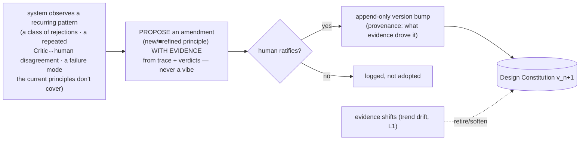

# 12 — The Design Constitution (living)

> A **seed**, not a cage. This document grounds the system's *taste* — what "good" means and why — **without prescribing how to design**. It is deliberately thin, deliberately incomplete, and deliberately **living**: the system proposes amendments from what it observes, a human ratifies them, and it grows richer over time — authored increasingly by the system itself. It is the design-side analogue of a constitution in Constitutional AI: a few principles the judge reasons *against*, not a manual it executes.

---

## 1. Posture — seed thin, grow living, anchor human

Three commitments govern this document:

- **Specify the destination, never the route.** By the spec's own spine ([00 §5](./00-overview.md)), autonomy lives in the *route* (how to compose, which patterns, what style) and consistency lives in the *destination* (what good means, the non-negotiables). This constitution encodes the **destination only**. Everything it is silent on is, by design, the system's to decide.
- **Principles, not rules.** A rule ("headlines 48–72px, 8px grid, ≤2 fonts") prescribes a solution and caps the system at *our* ceiling — the system knows more design than we do. A principle ("make the hierarchy unambiguous") states *what we value* and lets the system find the method. This document contains **principles and rationale**, never prescriptions.
- **Anchor human, extend by machine.** The system may *propose* amendments; only a human *ratifies* them (§7). This keeps the constitution from drifting into whatever the system finds convenient to satisfy — the difference between real improvement and reward hacking ([10](../failures/overall-system-failures/10-failure-modes.md) F-JDG-02, F-SPEC-05).

> **Why thin is a feature, not a gap.** A rich, prescriptive constitution would drag the system toward the mean of what we already know. A thin one leaves room for the system to discover designs *we would not have thought of* — which is the primary objective. Thinness here is a **granted freedom**, made explicit in §5.

---

## 2. What this document is — and is not

| It IS | It is NOT |
|---|---|
| A grounding the **Critic** reasons against ([05 §4](./05-generation-loop.md)) and every **Phase-Exit Review** invokes ([11 §2.3](./11-guardrails-and-invariants.md)) | A style guide, pattern library, or component spec |
| A small set of **principles + rationale** | A set of rules, values, or measurements |
| A **living** document the system co-authors (§7) | A fixed rulebook |
| The stabiliser that lowers Critic variance (F-JDG-06) | The thing that decides a design (that is the loop) |

The constitution does not *score* anything — the Critic and the deterministic gates do. It gives the Critic a shared, explicit, versioned reference so its judgments are grounded and consistent rather than improvised per call.

---

## 3. The seed principles (v0)

Ten principles. Each states *what good means*, *why*, and — critically — *what it does not dictate*. They are the destination; the route is the system's.

**P1 — Serve the brief before the eye.** Beauty is in service of the business goal; a beautiful section that does not advance the goal has failed. *Why:* Goal B is design *for a brief*, not decoration ([00 §1](./00-overview.md)). *Does not dictate:* what "serving the goal" looks like — that is the design.

**P2 — Earn every element.** Default to less; every element must justify its presence against removal. *Why:* restraint reads as confidence; clutter reads as uncertainty. *Does not dictate:* how much whitespace, which elements — only that each be earned.

**P3 — Make the hierarchy unambiguous.** A first-time viewer's attention should land where the goal needs it, in the order the goal needs. *Why:* a design the eye cannot navigate cannot convert. *Does not dictate:* how hierarchy is achieved (scale, weight, space, colour, motion — the system's choice).

**P4 — Consistency is the floor; distinctiveness is the aim.** Obey the brand and system (hard law), but a design indistinguishable from the category mean has failed even if it is "clean." *Why:* sameness is the AI-slop failure (F-GEN-02); differentiation is a core design job. *Does not dictate:* how to be distinctive.

**P5 — The medium is more than a frozen frame.** Motion, interaction states, the scroll experience, and *real, variable* content are part of the design, not afterthoughts. Judge the experience, not the postcard. *Why:* a static screenshot hides most of what a user feels. *Does not dictate:* which motion or interactions — only that they be considered and be good.

**P6 — Accessible and inclusive by construction.** Accessibility, internationalisation (RTL, text expansion), reduced-motion, and inclusivity are inputs from the first decision, not compliance added at the end. *Why:* excluding users is a quality failure, not a checklist miss (F-QF-01, F-BRD-04). *Does not dictate:* how — only that it hold under real conditions.

**P7 — Novelty must be earned by the brief, never by decoration.** Creativity in service of intent is the goal; ornament for its own sake is slop. *Why:* novelty that does not serve the brief is indistinguishable from noise. *Does not dictate:* how bold to be — the brief decides the licence.

**P8 — Excellence is spiky, not balanced.** A design that is exceptional where it matters beats one that is uniformly adequate. Do not average yourself into mediocrity. *Why:* summing dimensions into one score rewards compromise over greatness ([14](./14-research-agenda.md) R8); great work has a point of view. *Does not dictate:* which axis to spike — the brief and brand decide.

**P9 — Ethical constraints / No dark patterns.** Design must respect user agency and intent; it cannot use deceit, forced continuity, or manipulative patterns to drive metrics. *Why:* reward hacking on conversion proxies creates long-term trust collapse (F-LEG-03). *Does not dictate:* how to optimize a funnel honestly — only that the optimization must be honest.

**P10 — Representation and Bias.** Imagery, language, and cultural framing must reflect a pluralistic world, avoiding stereotypes or default-western/default-white anchoring unless specifically demanded by the localized brief. *Why:* unchecked generative models regress to narrow, biased cultural means (F-LEG-05). *Does not dictate:* specific demographics to include — but demands the system actively check its defaults.

---

## 4. The hard floor vs. the soft aspiration

Not every clause carries the same authority, mirroring the soft/hard spine ([01 §4](./01-actors-and-components.md)):

- **A small HARD floor** — inviolable, enforced by deterministic gates where possible, never traded away by the Critic: **accessibility/contrast floor** (P6 — including deep a11y: keyboard flow, screen-reader, reduced-motion, and 200%-zoom reflow, not only axe-core contrast), **no dark patterns** (P9 — the Critic and the Provenance gate both refuse manipulative patterns regardless of the brief), **brand & system adherence** (the hard stores), **brief truth** (never misrepresent the client), **honesty of the medium** (never fake a state, animation, or content the real build cannot deliver).
- **The principles as SOFT aspiration** — P1–P10 ground and stabilise the Critic's taste, but they are aspirations the system applies with judgment and *may help refine over time* (§7). They are calibration, not code.

Anchored exemplars (§6) are **soft calibration** — reference points, never templates. "This render is roughly a 90" anchors a scale; it does not say "copy this."

---

## 5. What this document deliberately does NOT prescribe

This section exists so the system reads the constitution's **silence as granted freedom**, not as gaps to fill randomly. The following are the system's route, and this document will never constrain them:

- **Layout, grid, composition, spacing rhythm, section structure.**
- **Which patterns to draw on**, and how to synthesise references and Library direction.
- **Aesthetic style or genre** (editorial, brutalist, playful, minimal, maximal — the brief and brand decide, not us).
- **Specific values** — exact type scales, colour ratios, motion curves (those live in the per-client hard stores, derived, not dictated here).
- **Method and process** — how the system reasons, explores, or sequences its work.

If a future decision tempts us to add a rule here, the test is: *does it state what good means (keep), or how to achieve it (reject)?*

---

## 6. Anchored exemplars (the calibration companion)

A prose principle is hard to apply consistently without a reference point. The constitution is paired with a small, growing set of **anchored exemplars**: rendered designs with human-assigned scores per dimension ("this is a 60 on craft, this is a 90"), spanning multiple domains ([14](./14-research-agenda.md) N1). They give the Critic a calibrated scale and are the most direct lever on judgment *variance* (F-JDG-06). They are **soft** (reference, not template), **held-out** from the Library (never retrieved as generation direction — that would collapse taste into a photocopier), and **human-owned** (the system may propose additions; a human rates them).

---

## 7. The self-amendment protocol (why it is *living*)

The constitution grows the way the Library does ([04 §6](./04-memory-and-consistency.md)): a thin seed that compounds through use, human-gated at every write.

Rules that keep amendment safe:

- **Evidence-gated.** A proposed amendment must cite trace/verdict evidence (a pattern of rejections or Critic↔human disagreement), not a preference. This ties the constitution to observed reality, not to what the system finds easy to satisfy.
- **Human-ratified, append-only, versioned.** Amendments are written only by human approval, as a new immutable version with provenance — the same discipline as the hard stores (I5). The system proposes; the human holds the pen on *what good means*.
- **Retirable.** A principle can be softened or retired when evidence shifts (aesthetic aging, [14](./14-research-agenda.md) L1) — the constitution is not a ratchet.
- **Governance is explicit.** *Who* ratifies, and how reviewer disagreement resolves, is an open governance question ([14](./14-research-agenda.md) J4) that must be answered before the loop is trusted at higher autonomy rungs.

> This is the resolution of the autonomy concern: the system is **not** caged by a fixed rulebook, nor is it left to grade its own homework against criteria it invents. It **authors an increasingly rich constitution**, anchored by a human it cannot overrule on the meaning of "good."

---

## 8. How it wires into the system

- **Grounds the Critic** ([05 §4](./05-generation-loop.md)) and every **Phase-Exit Review** ([11 §2.3](./11-guardrails-and-invariants.md)) — each judgment cites the principle(s) it rests on, so feedback is explainable and consistent.
- **Lowers judgment variance** (F-JDG-06) and gives the reward model a grounded target ([14](./14-research-agenda.md) R4).
- **Is itself measured.** The claim "grounding the Critic in the constitution raises Critic↔human agreement and lowers variance" is a falsifiable bet, tested on the evaluation charter's benchmark ([13](./13-evaluation-charter.md), [14](./14-research-agenda.md) R3). The constitution is not exempt from the "report observed numbers" culture ([08](./08-hypotheses-and-validation.md)); if grounding the Critic in it does not help, it is revised or dropped.

---

## 9. Burkes instance

For the Burkes hero, the constitution grounds the Critic concretely: **P1** ("serve the brief") means the hero must read as *trust, not urgency* — a countdown timer would violate the brief even if beautifully executed; **P4** ("distinctiveness") means a generic SaaS-gradient hero fails even if clean; **P7** ("earned novelty") licenses editorial restraint because the brief's goal (confidence-led lead-gen) rewards it. None of this dictates the layout — only what the layout must achieve.

---

## 10. Open questions (honest)

- **How thin is thin enough?** Too few principles under-grounds the Critic; too many cage it. The right count is itself an empirical question, measured by Critic↔human agreement on the benchmark.
- **Whose taste?** The governance of ratification (single lead, consensus, weighted panel) is unresolved (J4) and is prerequisite to trusting the loop unattended.
- **Does grounding actually help?** This is R3 — an open bet, not an assumption. The constitution earns its place by measurement or it is cut.
