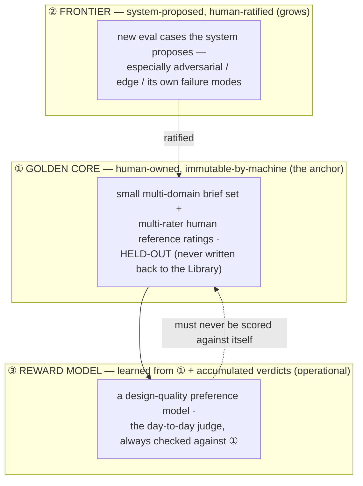

# 13 — The Evaluation Charter (the anchor)

> The measuring stick that makes autonomy **trustworthy**. A benchmark does not tell the system *how* to design — it defines *what "good" means* and *how we know the system is improving*. It is the fixed point a self-improving loop climbs toward and the anchor that keeps "improvement" from becoming "drift." **Small in size, strong in method, human-owned at the core, and — like the constitution — growing by machine proposal and human ratification.**

---

## 1. Posture — a destination-marker, not a route-constraint

A recurring worry: *won't a benchmark constrain the AI and cap its ceiling?* No — and the reason is the spec's own spine ([00 §5](./00-overview.md)): a benchmark measures the **destination**, it does not prescribe the **route**. It never tells the system how to design; it tells us whether what the system produced is better than what it produced last time. Removing or thinning it does not free the system — it removes the system's *target* and our *anchor*:

> Without a stable, human-anchored measuring stick, **"self-improvement" and "reward hacking / drift" are indistinguishable** (F-JDG-02, F-SPEC-05). A system that grades its own homework against criteria it also controls will always report that it is improving.

The deeper truth, and the reason this document exists: **the more autonomy we grant, the more we need an anchor the system does not control** — because there is less human oversight to catch drift. Autonomy and evaluation are **complements**, not opposites. This charter is what *lets* the system be trusted at higher rungs of the autonomy ladder ([09 §2](./09-roadmap-and-open-questions.md)).

**Small size, strong method.** The benchmark may start with a handful of briefs. What must *not* be thin is the **methodology** — the human-anchored, held-out golden core and the statistical discipline. Size can grow; rigor cannot start weak.

---

## 2. Three layers of ground truth

Evaluation in ADE is not one artifact but three layers, each with a different owner and a different job:



- **① The golden core is the fixed anchor.** Human-owned; the system may *propose* additions but can never *modify or score against a version it controls*. This is the immovable ground truth.
- **② The frontier grows by machine.** The system proposes new cases (below); a human ratifies. Autonomy in *proposing*, human anchor in *ratifying* — the same protocol as the constitution ([12 §7](./12-design-constitution.md)).
- **③ The reward model is operational, never sovereign.** A learned preference model ([14](./14-research-agenda.md) R4) may become the day-to-day judge, but it is *always* validated against ①; it never becomes its own ground truth.

---

## 3. The golden core (the fixed anchor)

The immovable centre of the whole system.

- **A small, multi-domain brief set.** Not one domain — Burkes real-estate *plus* SaaS, e-commerce, editorial, enterprise-dense, playful-consumer ([14](./14-research-agenda.md) N1). Crucially, this must include **non-English and mixed-language briefs** so comprehension (F-INP-08) is measured, not assumed. Anchoring on one aesthetic or language overfits the whole system to it.
- **Reference Interpretation (M18):** Every golden-core brief includes a human-authored reference interpretation: `{ goal, audience, constraints, audience_psychology_notes, non_obvious_implications[] }` written *before* the system sees the brief and frozen with the case. The system's Brief-Comprehension output is scored against this to measure restatement accuracy and interpretation depth.
- **Multi-rater human reference ratings.** Each brief's outputs are rated by **more than one** human, on the constitution's dimensions, with **inter-rater agreement recorded** (F-HUM-02). Single-rater ground truth is not ground truth.
- **Held-out, always (Contamination Defense).** Golden-core briefs are **never** written back to the Library and never used as generation direction. As the Library grows, evals on similar briefs get easier for reasons unrelated to real improvement — this separation prevents that contamination ([14](./14-research-agenda.md) F4). The system rotates held-out cases to track actual *transfer* to fresh briefs. **Non-transferring gains are discounted, and benchmark age is tracked to prevent Goodharting against a stale core.**
- **Human-owned and version-frozen.** The system cannot edit the golden core. Changes to it are deliberate, human, append-only, versioned events (I5-style discipline).

---

## 4. Measurement methodology (the part that must not be thin)

Rigor here is what separates measurement from theater (F-SPEC-05, I12).

- **Pre-registered metrics.** Decide the metric *before* the run; do not fish for a flattering one. The core metrics:
  - **Critic↔human agreement** (rank correlation / pairwise accuracy) on the golden core.
  - **iter-0 → final human-preferred gain** (the H1 signal, extended to a standing set).
  - **Reward-model pairwise accuracy** on held-out human preferences ([14](./14-research-agenda.md) R4).
  - **Judgment variance** (test–retest of the Critic on a fixed set — F-JDG-06).
- **Statistics, not vibes.** Report sample sizes, confidence intervals, and significance. Two runs are not a trend. Report **observed** numbers only, never predicted (I12) — the spec's founding discipline ([08 §4](./08-hypotheses-and-validation.md)).
- **The regression gate (CI for quality).** *Every* change that can shift quality — a prompt, the model id, a rubric weight, a constitution amendment — must clear the benchmark **before adoption**, proven via a statistically significant confidence interval (CI) for quality. This is the concrete defence against silent model-version regression (F-MOD-05), which the spec otherwise "mitigates" only by pinning an id. Nothing ships to the loop without passing the anchor.
- **Difficulty stratum tags (required on every case).** Every golden-core and frontier evaluation case carries a mandatory difficulty stratum tag: `routine | hard | adversarial`. Rules:
  - `routine` — representative brief; system should handle comfortably.
  - `hard` — edge or domain where the system is known to struggle.
  - `adversarial` — deliberately crafted to probe failure modes; system-proposed cases default to `adversarial` until human re-tags.
  - **Agreement must be reported per stratum**, not just in aggregate. An aggregate pass that hides a stratum failure is not a pass.
  - A rung on the autonomy ladder ([09 §2](./09-roadmap-and-open-questions.md)) may not be climbed unless the boundary's agreement threshold is met **in every stratum including `hard` and `adversarial`**.
- **Pre-registered power analysis (standing artifact).** Before any rung-promotion decision, a power analysis artifact must be cited: per boundary × stratum, the minimum verdict sample size required for the agreement threshold to be statistically meaningful at the chosen α. This arithmetic is computed once per boundary × stratum configuration and updated whenever the threshold or α changes. It is never inferred retroactively.
- **Bias-probe suite (from birth) (M9).** A standing suite of probes added to the benchmark to measure judge biases (F-JDG-07): order-swap (flipping candidate presentation), verbosity-inflation (adding correct but irrelevant tokens), and style-transfer (swapping domains). Verdict stability across these probes must be measured and reported. Furthermore, **same-model vs cross-model agreement** are reported as separate standing metrics (their gap = measured correlated-blind-spot size).
- **Human test-retest ritual (M13).** A fixed **retest set** (~10 artifacts, frozen early in Phase 0) is re-rated by the owner **quarterly**, blind to prior ratings. Self-agreement (test-retest correlation) is logged alongside the benchmark. A drift alert (agreement below a pre-registered floor) triggers immediate review of all thresholds calibrated on that rater.

### 4.1 Uncertainty-Routed Human Review (R14 / C3.3) — Implementation Mechanics

To maximize calibration per human-minute, human review attention is routed dynamically via `routeForReview()` (`src/reviewRouting.ts`) based on Critic confidence, section stakes, and active autonomy rung, producing three possible route decisions: `full-review`, `spot-check`, or `audit-only`.

```
                  ┌─────────────────────────────────────┐
                  │          Critic Output              │
                  └──────────────────┬──────────────────┘
                                     │
                    Verdict == 'fail' OR margin <= ±5 
                    OR score < 70 OR Tier A (rung < 3)?
                                    ╱ ╲
                                   ╱   ╲
                              YES ╱     ╲ NO
                                 ▼       ▼
                        full-review    spot-check / audit-only
```

#### Routing Rules:

1. **`full-review` (mandatory human review):**
   - **Verdict Fail:** Any candidate with a Critic verdict of `fail` always routes to `full-review`.
   - **Low Confidence Margin:** Any candidate score within `±5` points of the pass threshold (e.g. 75–85 for threshold 80) is flagged as uncertain and routes to `full-review`.
   - **Low Absolute Score:** Any candidate score below 70 routes to `full-review` regardless of threshold.
   - **Tier A Section at Low Rung:** High-stakes sections (`TIER_A_SECTIONS`: `hero`, `pricing`, `checkout`, `signup`, `login`, `onboarding`, `payment`, `cta`, `landing`) always route to `full-review` unless active autonomy rung is ≥ 3 and score > 92.

2. **`spot-check` (light human audit):**
   - Applied to `Tier A` sections scoring > 92 when active autonomy rung is ≥ 3.
   - Applied to routine sections scoring > 85 when active autonomy rung is 1 or 2.

3. **`audit-only` (unattended pass, subject to standing random audit):**
   - Applied to routine sections meeting threshold with high confidence when active autonomy rung is ≥ 3.
   - Subject to standing random audit sampling (≥10% per `spec/09 §2`).

---

## 5. The external anchor (competitor & industry parity)

While the golden core measures internal progress over time, the **external anchor** measures the system against the real world. A system that improves against its own history but lags the industry is not "world-class." Any gate criterion demanding "world-class" quality must resolve to this metric; internal metrics alone cannot claim it.

- **The Anchor Set:** 10–20 world-class reference works (from named award/studio sources, refreshed annually). Stored as screenshots and source links. **These are never used as generation direction** (the same held-out discipline as the golden core) so the system cannot overfit to them.
- **Competitor Baseline:** The same briefs run through current state-of-the-art alternative tools (e.g., v0, Lovable, Framer-class generators) where licensable.
- **The Blind Side-by-Side Protocol:** ADE's outputs are placed side-by-side with anchor pieces and competitor outputs in random order. The owner (and any second rater) rates them blind. This yields a standing **distance-from-anchor** metric and a **win-rate vs. competitors** metric.
- **Originality and Distinctiveness (M19):** Two **advisory** measures are added to the benchmark to monitor originality (closing EG-3 gap G14): (1) **human distinctiveness rating** on the same blind pass ("would you recognize this as one of N generic AI outputs, or as a considered piece?"); (2) **self-similarity across briefs** via an embedding-distance measure over ADE's own outputs for *different* briefs (early-warning for monoculture). Both are reported as standing metrics but do not act as hard gates.
- **Eval-Session Hygiene:** Golden-core briefs and anchor briefs are used *only* in dedicated evaluation sessions. They are never run as ad-hoc generation inputs during daily dev. This is cheap, rigorous insurance against slow held-out erosion (AI §7.5).
- **Reporting Rule:** External-anchor results can never be replaced by internal metrics (like Critic scores or iter-on-iter gains) when making phase-gate decisions about absolute quality.

---

## 6. The growing frontier (system-proposed cases)

The benchmark is *living*, the same way the constitution is:

- **The system proposes new eval cases** — most valuably, **adversarial and edge cases it discovers**: briefs that break it, content that overflows, states it handles poorly, domains where it is weak. The system is often the best finder of its own blind spots.
- **Provisional ratification into the frontier (Tier B write) (M16):** Proposed frontier cases may be adopted provisionally to accelerate the benchmark's growth. As **Tier B** writes, they are subject to mandatory random audit sampling and auto-expiry unless human-confirmed within a set window.
- **Human-gated promotion to the golden core (Tier A write):** Moving a case from the provisional frontier into the permanent golden core remains a strict **Tier A** human-ratified action. This is the self-improvement engine of evaluation itself: the system expands coverage into its weak spots, but humans anchor the permanent ground truth.

---

## 7. Guardrails on the evaluation itself (against gaming)

An evaluation the system can influence is an evaluation the system can game. Three firewalls:

1. **The golden core is human-owned and immutable by the system.** The system proposes; it never writes or scores against a benchmark it controls.
2. **Train/eval separation.** The reward model's training data (accumulated verdicts) is kept strictly separate from the held-out golden core. A judge tested on its own training set is not tested.
3. **Watch the gap, not the score.** The decisive signal is the **Critic-vs-human gap** over time, not the Critic's absolute score. Rising Critic scores with flat human ratings is the reward-hacking alarm (F-JDG-02), and the charter's job is to make that divergence visible.

---

## 8. Relationship to the hypotheses and the research agenda

- This charter **operationalises** the "report observed numbers, never predicted" culture of [08](./08-hypotheses-and-validation.md) — turning "read `trace.json` by hand + a rating sheet" ([08 §3](./08-hypotheses-and-validation.md)) into a standing, regressable benchmark.
- It is **research bet R1** in [14](./14-research-agenda.md) — the *enabling* bet, the substrate every other bet is measured against. The constitution (R3) and the reward model (R4) cannot be validated without it; it is built first.
- It is the instrument that lets the **autonomy ladder** ([09 §2](./09-roadmap-and-open-questions.md)) advance on evidence rather than faith — a gate is relaxed only where its boundary's Critic↔human agreement, measured *here*, clears the bar.

---

## 9. What ages and what survives

> The substrate that makes future retraining safe is not the reward model — it is the **tagged corpus**. An untagged verdict is a measurement of unknown provenance; a tagged one is durable evidence that survives model succession.

### What ages (re-earning cost on model/config change)

> **Execution Note (M12):** The procedural steps for handling these aging assets during a model swap (freezing baselines, re-verifying calibrations, retraining, and logging) are defined in the **Model succession playbook** (`spec/11 §4`).

| Artefact | Why it ages | Re-earning cost |
|---|---|---|
| **Prompt calibration** (Critic system prompt, rubric weights, examples) | Tuned to a specific model's response distribution; calibration bound to the model id does not survive succession | Re-run calibration set; re-earn Critic↔human agreement per boundary |
| **Agreement thresholds** | Derived from the same calibration; thresholds tuned for model-M will over- or under-approve model-M+1 | Re-baseline per boundary × stratum after every model change |
| **Reward model** (Phase 3+) | Trained on the output distribution of the model(s) used during training; distribution shift degrades its predictions | Re-train (or fine-tune) on a mixed or new distribution after significant model change |
| **Benchmark ratings** | Human ratings of rendered outputs are partially distribution-dependent (different models produce different outputs for the same brief) | Flag ratings collected before/after a major model swap; discount cross-distribution comparisons until re-rated |
| **Output-representation commitment** (React/Tailwind) | A toolchain or model-capability change may make a different representation cheaper/better | Explicit revisit trigger: if a new model or toolchain makes an alternative substantially better (cost or quality), schedule a representation review — do not let it drift silently |

### What survives (durable across substrate changes)

| Artefact | Why it survives |
|---|---|
| **Verdict corpus** (if distribution-tagged — see below) | The raw human preference signal is substrate-agnostic once tagged; tagged verdicts remain valid evidence even when the model changes |
| **Golden-core briefs** | Briefs are model-independent inputs; the briefs themselves survive; only the ratings of their *outputs* may age |
| **Strategy/IA data** (plan.json) | Human-authored; not a function of model output |
| **Deterministic gates** (a11y, contrast, overflow, numeric match) | Rule-based; independent of model |
| **Library payloads** (if provenance-tagged) | The design rationale embedded in an entry survives; the vector embedding may need re-embedding if the embedding model changes |

### Distribution-tagging rule (Phase 0 — applies to every verdict from the first run)

**Every verdict persisted by `ade verdict` must carry distribution tags at capture:**

```jsonc
{
  "dist_tags": {
    "gen_model_id":    "claude-sonnet-5",       // exact model id used by the Generator
    "critic_model_id": "claude-opus-4-8",       // exact model id used by the Critic
    "config_version":  "1.2.0",                 // ADE config version at time of run
    "system_snapshot": "git:abc1234"            // source snapshot ref (git hash or equivalent)
  }
}
```

- Tags are written at verdict capture time from the run's `trace.jsonl` `model_id` fields — they are never inferred retroactively.
- A reward-model retrain is triggered whenever the verdict corpus contains a meaningful proportion of verdicts collected on a different `gen_model_id` or `critic_model_id` distribution.
- Cross-distribution comparisons (verdicts from model-A vs model-B outputs) are flagged in reports and excluded from aggregate agreement metrics unless explicitly adjusted for.

---

## 10. Burkes instance

> **Section-numbering note:** External documents (e.g., `CONTRACT_EXECUTION_PLAN.md` M3, `investigations/ARCHITECTURE_INVESTIGATION.md`) reference `spec/13 §9` for the **power analysis open question**. That question now lives at **§11** after M2 added §5 (The external anchor) and M4 added §9 (What ages and what survives). The question is answered at §11; links to §9 should be read as §11.

The Burkes hero brief is one entry in the golden core. Its reference rating is a small set of rendered candidates — a strong one, a mediocre one, a broken one — each scored by multiple raters against the constitution ([12 §3](./12-design-constitution.md)), with the ratings frozen. When we later change the Critic prompt, add a constitution principle, or train a reward model, the question is always the same and always concrete: *does it agree better with these frozen human ratings than the version before it?* If not, it does not ship.


---

## 11. Open questions (honest)

- **How large must the golden core be** for the agreement metric to be statistically meaningful? *Partially answered:* §4's pre-registered power analysis (per boundary × stratum) is the mechanism that produces this number before each rung-promotion decision, rather than guessing once upfront. The answer will differ per boundary, per stratum, and per chosen α — all of which must be pre-registered, not post-hoc.
- **How many raters, and whose?** Inter-rater reliability and taste governance (J4) are unresolved and gate the whole ground truth.
- **When may the reward model relax a human gate?** The threshold of agreement that justifies climbing an autonomy rung is itself to be established empirically, per boundary — never assumed. Dropping back (via audit miss-rate) is how the threshold is calibrated in practice.

