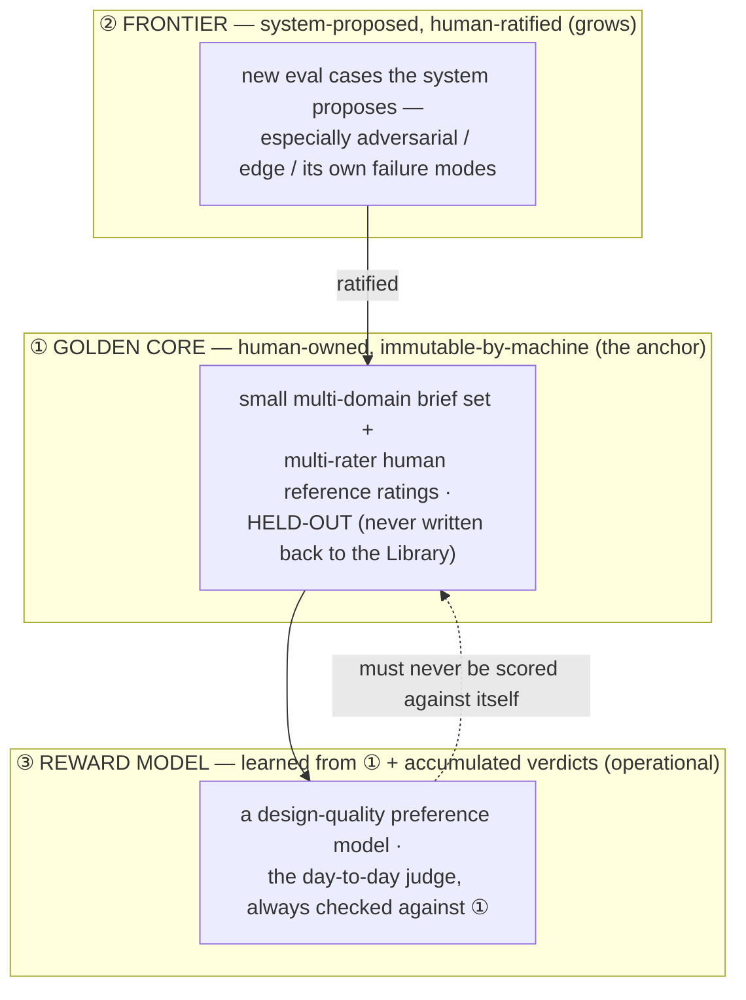

# 13 — The Evaluation Charter (the anchor)

> The measuring stick that makes autonomy **trustworthy**. A benchmark does not tell the system *how* to design — it defines *what "good" means* and *how we know the system is improving*. It is the fixed point a self-improving loop climbs toward and the anchor that keeps "improvement" from becoming "drift." **Small in size, strong in method, human-owned at the core, and — like the constitution — growing by machine proposal and human ratification.**

---

## 1. Posture — a destination-marker, not a route-constraint

A recurring worry: *won't a benchmark constrain the AI and cap its ceiling?* No — and the reason is the spec's own spine ([00 §5](./00-overview.md)): a benchmark measures the **destination**, it does not prescribe the **route**. It never tells the system how to design; it tells us whether what the system produced is better than what it produced last time. Removing or thinning it does not free the system — it removes the system's *target* and our *anchor*:

> Without a stable, human-anchored measuring stick, **"self-improvement" and "reward hacking / drift" are indistinguishable** (F-JDG-02, F-SPEC-05). A system that grades its own homework against criteria it also controls will always report that it is improving.

The deeper truth, and the reason this document exists: **the more autonomy we grant, the more we need an anchor the system does not control** — because there is less human oversight to catch drift. Autonomy and evaluation are **complements**, not opposites. This charter is what *lets* the system be trusted at higher rungs of the autonomy ladder ([09 §2](./09-roadmap-and-open-questions.md)).

**Small size, strong method.** The benchmark may start with a handful of briefs. What must *not* be thin is the **methodology** — the human-anchored, held-out golden core and the statistical discipline. Size can grow; rigor cannot start weak.

---

## 2. Three layers of ground truth

Evaluation in ADE is not one artifact but three layers, each with a different owner and a different job:

- **① The golden core is the fixed anchor.** Human-owned; the system may *propose* additions but can never *modify or score against a version it controls*. This is the immovable ground truth.
- **② The frontier grows by machine.** The system proposes new cases (below); a human ratifies. Autonomy in *proposing*, human anchor in *ratifying* — the same protocol as the constitution ([12 §7](./12-design-constitution.md)).
- **③ The reward model is operational, never sovereign.** A learned preference model ([14](./14-research-agenda.md) R4) may become the day-to-day judge, but it is *always* validated against ①; it never becomes its own ground truth.

---

## 3. The golden core (the fixed anchor)

The immovable centre of the whole system.

- **A small, multi-domain brief set.** Not one domain — Burkes real-estate *plus* SaaS, e-commerce, editorial, enterprise-dense, playful-consumer ([14](./14-research-agenda.md) N1). Crucially, this must include **non-English and mixed-language briefs** so comprehension (F-INP-08) is measured, not assumed. Anchoring on one aesthetic or language overfits the whole system to it.
- **Multi-rater human reference ratings.** Each brief's outputs are rated by **more than one** human, on the constitution's dimensions, with **inter-rater agreement recorded** (F-HUM-02). Single-rater ground truth is not ground truth.
- **Held-out, always (Contamination Defense).** Golden-core briefs are **never** written back to the Library and never used as generation direction. As the Library grows, evals on similar briefs get easier for reasons unrelated to real improvement — this separation prevents that contamination ([14](./14-research-agenda.md) F4). The system rotates held-out cases to track actual *transfer* to fresh briefs. **Non-transferring gains are discounted, and benchmark age is tracked to prevent Goodharting against a stale core.**
- **Human-owned and version-frozen.** The system cannot edit the golden core. Changes to it are deliberate, human, append-only, versioned events (I5-style discipline).

---

## 4. Measurement methodology (the part that must not be thin)

Rigor here is what separates measurement from theater (F-SPEC-05, I12).

- **Pre-registered metrics.** Decide the metric *before* the run; do not fish for a flattering one. The core metrics:
  - **Critic↔human agreement** (rank correlation / pairwise accuracy) on the golden core.
  - **iter-0 → final human-preferred gain** (the H1 signal, extended to a standing set).
  - **Reward-model pairwise accuracy** on held-out human preferences ([14](./14-research-agenda.md) R4).
  - **Judgment variance** (test–retest of the Critic on a fixed set — F-JDG-06).
- **Statistics, not vibes.** Report sample sizes, confidence intervals, and significance. Two runs are not a trend. Report **observed** numbers only, never predicted (I12) — the spec's founding discipline ([08 §4](./08-hypotheses-and-validation.md)).
- **The regression gate (CI for quality).** *Every* change that can shift quality — a prompt, the model id, a rubric weight, a constitution amendment — must clear the benchmark **before adoption**, proven via a statistically significant confidence interval (CI) for quality. This is the concrete defence against silent model-version regression (F-MOD-05), which the spec otherwise "mitigates" only by pinning an id. Nothing ships to the loop without passing the anchor.

---

## 5. The growing frontier (system-proposed cases)

The benchmark is *living*, the same way the constitution is:

- **The system proposes new eval cases** — most valuably, **adversarial and edge cases it discovers**: briefs that break it, content that overflows, states it handles poorly, domains where it is weak. The system is often the best finder of its own blind spots.
- **A human ratifies** each proposal into the frontier, and periodically promotes stable frontier cases into the golden core.
- **This is the self-improvement engine of evaluation itself:** the system does not just improve *against* the benchmark, it improves *the benchmark* — expanding coverage into exactly the regions it is weak, anchored at every step by human ratification.

---

## 6. Guardrails on the evaluation itself (against gaming)

An evaluation the system can influence is an evaluation the system can game. Three firewalls:

1. **The golden core is human-owned and immutable by the system.** The system proposes; it never writes or scores against a benchmark it controls.
2. **Train/eval separation.** The reward model's training data (accumulated verdicts) is kept strictly separate from the held-out golden core. A judge tested on its own training set is not tested.
3. **Watch the gap, not the score.** The decisive signal is the **Critic-vs-human gap** over time, not the Critic's absolute score. Rising Critic scores with flat human ratings is the reward-hacking alarm (F-JDG-02), and the charter's job is to make that divergence visible.

---

## 7. Relationship to the hypotheses and the research agenda

- This charter **operationalises** the "report observed numbers, never predicted" culture of [08](./08-hypotheses-and-validation.md) — turning "read `trace.json` by hand + a rating sheet" ([08 §3](./08-hypotheses-and-validation.md)) into a standing, regressable benchmark.
- It is **research bet R1** in [14](./14-research-agenda.md) — the *enabling* bet, the substrate every other bet is measured against. The constitution (R3) and the reward model (R4) cannot be validated without it; it is built first.
- It is the instrument that lets the **autonomy ladder** ([09 §2](./09-roadmap-and-open-questions.md)) advance on evidence rather than faith — a gate is relaxed only where its boundary's Critic↔human agreement, measured *here*, clears the bar.

---

## 8. Burkes instance

The Burkes hero brief is one entry in the golden core. Its reference rating is a small set of rendered candidates — a strong one, a mediocre one, a broken one — each scored by multiple raters against the constitution ([12 §3](./12-design-constitution.md)), with the ratings frozen. When we later change the Critic prompt, add a constitution principle, or train a reward model, the question is always the same and always concrete: *does it agree better with these frozen human ratings than the version before it?* If not, it does not ship.

---

## 9. Open questions (honest)

- **How large must the golden core be** for the agreement metric to be statistically meaningful? A power analysis, not a guess.
- **How many raters, and whose?** Inter-rater reliability and taste governance (J4) are unresolved and gate the whole ground truth.
- **When may the reward model relax a human gate?** The threshold of agreement that justifies climbing an autonomy rung is itself to be established empirically, per boundary — never assumed.
