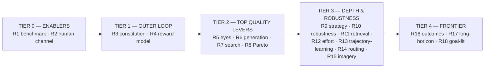

# 14 — Research Agenda (the gap map)

> The single record of **where the system is weak and what research would make it strong** — the deep-analysis output turned into a prioritised, falsifiable program. It is written in the culture of [08](./08-hypotheses-and-validation.md): every improvement is a *bet* with an experiment and a decisive metric, validated **before** it is built, and reported by observed numbers, never predicted ones. This is R&D scaffolding: a menu of validated-then-built bets, not a commitment to build all of them.

---

## 1. The core diagnosis

The system is engineered to reliably eliminate **bad** — a near production-grade *immune system* (the Guardrail Layer, render-health, token/a11y gates, best-so-far, bounded loops, 15 invariants, [11](./11-guardrails-and-invariants.md)). It has no comparably-engineered machinery to reliably recognise or produce **great**. Every quality-raising path funnels through one thin proxy — a prompted Critic scoring three frozen screenshots on four coarse dimensions — and one Generator that jumps straight to high-fidelity code. So the ceiling is set by the *least*-engineered parts of the system, and quality is *inconsistent* by construction: high-variance judgment + untested robustness + no standing benchmark.

Framed against the reference the team admires (Constitutional AI): **ADE has the inner loop, and is missing the outer loop.**

| | Inner loop (per output) | Outer loop (compounds over generations) |
|---|---|---|
| Constitutional AI | critique against a constitution → revise | preference data → reward model → RL → **heavy evals + red-team** |
| **ADE today** | ✅ generate → self-critique → revise ([05](./05-generation-loop.md)) | ❌ almost entirely absent |

Building the outer loop — a **[constitution](./12-design-constitution.md)**, an **[evaluation charter](./13-evaluation-charter.md)**, a **reward model**, and standing evals — is the highest-leverage work. The bets below either build it or remove a specific ceiling on it.

---

## 2. The four root themes

Twenty-plus gaps collapse into four root conditions. Fixing these moves most of the list, so bets are chosen by *how many gaps they close*.

1. **The optimiser is greedy and its objective is a scalarised proxy** → it finds *locally-good, balanced-mediocre* designs, never *globally-best, spiky-excellent* ones.
2. **The system never touches reality** → it optimises opinion (Critic, then human taste), never outcomes.
3. **The human↔system channel is too low-bandwidth to carry taste** → the ground truth feeding the whole outer loop is thin. *(Prerequisite for the reward-model work.)*
4. **The system is blind to much of the medium and its context** → imagery, icons, motion, i18n, competition, time.

---

## 3. The gap map (A–N)

Severity: **★★★** ceiling-determining · **★★** significant · **★** worth a study. "Bet" points to §5.

| Cluster | Gap | Sev | Root theme | Bet |
|---|---|---|---|---|
| **A Taste / Critic** | A1 no constitution / anchored exemplars | ★★★ | 3/outer | R3 |
| | A2 no learned reward/preference model | ★★★ | outer | R4 |
| | A3 rubric too coarse ("craft" = one number) | ★★ | 1 | R3/R10 |
| | A4 single-shot, high-variance judgment | ★★ | 1 | R3/R4 |
| **B Eyes** | B1 three frozen frames — blind to motion/scroll/interaction | ★★★ | 4 | R5 |
| | B2 no content-robustness testing | ★★ | 4 | R10 |
| | B3 "performance" claimed, never measured | ★★ | 4 | R10 |
| | B4 consistency checked at token level only | ★ | 4 | R10 |
| **C Generation** | C1 no divergence→convergence (parallel one-shots) | ★★★ | 1 | R6 |
| | C2 no explicit design-reasoning artifact | ★★ | 1 | R6 |
| | C3 spatial problems, text-only feedback | ★★ | 3 | R2 |
| | C4 copy frozen (no design–copy co-optimisation) | ★ | 4 | R9 |
| **D Strategy** | D1 brief comprehension is a one-line restatement | ★★★ | 4 | R9 |
| | D2 no IA / page-plan generation | ★★ | 4 | R9 |
| | D3 goal-fit un-judgeable from pixels | ★★ | 2 | R18 |
| **E Memory** | E1 learns only from approved finals (discards trajectory + rejections) | ★★★ | outer | R13 |
| | E2 Library serves Generator, nothing serves Critic | ★★ | outer | R3/R4 |
| | E3 uniform human review, not uncertainty-routed | ★★ | 3 | R14 |
| | E4 no conflict resolution among soft entries | ★ | 4 | R11 |
| **F Evaluation** | F1 no standing benchmark / regression eval | ★★★ | outer | R1 |
| | F2 ground truth (human verdicts) un-validated | ★★ | 3/outer | R1 |
| | F3 no statistical discipline | ★★ | outer | R1 |
| | F4 train/eval contamination risk | ★ | outer | R1 |
| **G Architecture** | G1 bottom-up crystallisation locks local optima | ★★ | 1 | R9 |
| | G2 whole page as designed object is an afterthought | ★★ | 4 | R9 |
| | G3 one general model in three roles; no specialisation | ★ | outer | R4 |
| | G4 production-parity gap (Vite mock ≠ prod) | ★ | 4 | (X1) |
| | G5 no active reward-hacking defence | ★ | outer | R1 |
| **H Search dynamics** | H1 greedy hill-climber — stuck in local optima | ★★★ | 1 | R7 |
| | H2 weighted-sum hides Pareto; rewards balanced-mediocre | ★★★ | 1 | R8 |
| | H3 no adaptive effort / plateau detection | ★★ | 1 | R12 |
| **I Reality** | I1 no outcome feedback — optimises a proxy forever | ★★★ | 2 | R16 |
| **J Human channel** | J1 feedback instrument primitive (approve/reject/notes) | ★★★ | 3 | R2 |
| | J2 no teach-by-example channel | ★★ | 3 | R2 |
| | J3 design rationale never surfaced to the human | ★★ | 3 | R2 |
| | J4 taste governance undefined | ★ | 3 | (X2) |
| **K Medium blind spots** | K1 imagery / art-direction outside the loop | ★★ | 4 | R15 |
| | K2 no iconography / illustration / graphic-device system | ★★ | 4 | R15 |
| | K3 a11y & i18n a binary floor, not a design dimension | ★★ | 4 | R10 |
| | K4 no interaction-design capability (future product) | ★ | 4 | (X3) |
| **L Temporal / context** | L1 aesthetic aging / trend drift unmodeled | ★★ | 4 | R17 |
| | L2 no competitive / differentiation context | ★★ | 4 | R9 |
| | L3 no long-horizon dynamics test of the learning loop | ★ | 2 | R17 |
| **M Retrieval** | M1 same-domain retrieval suppresses cross-domain creativity | ★★ | 1 | R11 |
| **N Systemic** | N1 whole system validated on one domain (Burkes) | ★ | outer | R1 |
| | N2 no reproducibility of decisions over an evolving system | ★ | 3 | (X4) |

**(X) cross-cutting enablers** — not standalone bets but constraints on how bets are built: **X1** production-parity harness, **X2** taste-governance protocol, **X3** interaction-design representation, **X4** system-state snapshotting for reproducibility.

---

## 4. Priority tiers & sequencing

Chosen by **(quality leverage × feasibility)** and by dependency. **Do not build in gap order — build in this order**, because early tiers are the substrate the rest is measured and trained on.

Two dependencies are non-negotiable: **R1 (the benchmark) comes first** — nothing else can be validated without it; and **R2 (the human channel) precedes R4 (the reward model)** — a reward model trained on approve/reject/notes captured through a CLI is built on sand.

---

## 5. The research bets (falsifiable)

The load-bearing bets are written in full ([08](./08-hypotheses-and-validation.md) style: statement · why · experiment · decisive metric · fail-looks-like · depends-on). The rest are stated compactly; each becomes a full entry when it reaches its tier.

### Tier 0 — enablers

**R1 — A standing, human-anchored benchmark exposes regressions and grounds every other bet.**
- *Why:* today's eval is "read `trace.json` by hand" ([08 §3](./08-hypotheses-and-validation.md)); nothing catches silent regressions (F-MOD-05) or measurement theater (F-SPEC-05). Full design in [13](./13-evaluation-charter.md).
- *Experiment:* build the golden core (multi-domain briefs incl. **non-English/mixed-language** briefs, multi-rater held-out ratings); inject a known prompt regression; confirm the benchmark catches it. **Non-English restatement accuracy is tracked as a separate metric** to measure F-INP-08 comprehension, not assume it.
- *Metric:* regression detected; inter-rater agreement on the core is statistically adequate; non-English brief restatement accuracy reported separately.
- *Fail:* raters disagree so much there is no usable ground truth → fix rating protocol / governance (J4) before anything else.
- *Depends on:* nothing. **Build first.**

**R2 — A high-bandwidth human-feedback channel produces materially better calibration signal than CLI approve/reject/notes.**
- *Why:* the entire outer loop is only as good as the human signal feeding it (J1–J3); a straw-width channel caps R4 no matter how good the training method.
- *Experiment:* A/B calibration data quality from the current channel vs a rich one (**pairwise comparison UI**, **constitution-dimension sliders**, **spatial annotations/marks**, **design-rationale surfacing**, teach-by-example). The captured verdict is **serialized into a structured form** specifically shaped for future reward-model training (Phase 3 / R4).
- *Metric:* reward-model / Critic agreement gain per human-minute, rich vs thin channel.
- *Fail:* no difference → the bottleneck is elsewhere; revisit.
- *Depends on:* R1 (to measure the gain).

### Tier 1 — the outer loop

**R3 — Grounding the Critic in a living constitution + anchored exemplars raises Critic↔human agreement and lowers judgment variance vs the current prose rubric.**
- *Why:* the Critic judges in a vacuum (A1, A3, A4); Constitutional AI grounds judgment in explicit principles. Full design in [12](./12-design-constitution.md).
- *Experiment:* A/B the anchored/constitution-grounded Critic vs the prose-rubric Critic on the R1 benchmark; measure agreement and test–retest variance. Watch the **Critic-vs-human gap** (not just Critic scores) to catch reward hacking. The constitution must include the **ethics/dark-pattern** principle (F-LEG-03) and a **representation/bias** principle (F-LEG-05).
- *Metric:* agreement ↑ and variance ↓ at significance.
- *Fail:* no gain → the constitution is the wrong altitude or grounding does not help; revise or drop it (it is not exempt from measurement).
- *Depends on:* R1.

**R4 — A learned preference/reward model trained on accumulated human verdicts predicts human preference better than the prompted Critic — and can be distilled into a cheaper, calibrated judge.**
- *Why:* the plan is to hand-tune a prompt forever (H8); Anthropic trains reward models from preference data. This is the compounding engine (A2, E2, G3).
- *Experiment:* preference learning / **VLM distillation** on accumulated pairwise human verdicts. Evaluate held-out pairwise accuracy vs the prompted Critic. Use a **dual-judge deployment** (learned reward model augments/distills the prompted Critic). **Separate universal-craft from domain-style signals** to test cross-domain transfer.
- *Metric:* held-out pairwise accuracy (reward model > prompted Critic) at significance; distilled-judge cost/quality; cross-domain transfer measured.
- *Fail:* not enough / too-noisy verdict data → strengthen R2 first; or preference is too subjective to model → stay with the grounded prompt.
- *Depends on:* R1, R2, R3.

### Tier 2 — the top quality levers

**R5 — Motion/scroll/interaction-aware Eyes improve human-rated quality over static-frame critique.**
- *Why:* the Eyes see three frozen frames and are blind to motion *by construction* (B1, F-EYE-04); a large fraction of perceived quality is temporal.
- *Experiment:* A/B loops critiquing frame-sequences / scrollcasts / driven interactions vs single frames; human blind preference on finals.
- *Metric:* human-preferred rate, motion-aware vs static.
- *Fail:* no gain → static frames are sufficient for marketing surfaces; revisit for product surfaces.
- *Depends on:* R1.

**R6 — Divergence→convergence generation (distinct low-fi directions → refine one) beats N parallel one-shots at equal cost.**
- *Why:* `--variations` explores breadth only within an iteration and yields "AI slop" (C1, C2, F-GEN-02); real craft comes from exploring distinct concepts then refining.
- *Experiment:* matched-cost A/B — staged (art-direction divergence → select → execute → refine) vs N parallel finals; human distinctiveness + craft ratings.
- *Metric:* craft and distinctiveness ↑ at equal spend.
- *Fail:* no gain → one-shot breadth suffices; keep it.
- *Depends on:* R1.

**R7 — Escaping the greedy local search (restart / direction-switch / diversity injection on plateau) reaches higher final quality than best-so-far hill-climbing.**
- *Why:* best-so-far + local edits is greedy and traps mediocre local optima (H1); great design sometimes needs a discontinuous jump.
- *Experiment:* A/B the current greedy loop vs a global-search variant (restart on stagnation, occasional accept-worse-to-explore); human-rated final quality and escape-rate from seeded local optima.
- *Metric:* final quality ↑; demonstrably escapes seeded optima the greedy loop cannot.
- *Fail:* no gain → the design space is smooth enough for greedy search; keep it simple.
- *Depends on:* R1.

**R8 — Pareto / anti-scalarisation selection surfaces spiky-excellent designs that weighted-sum scoring discards.**
- *Why:* summing dimensions into `weighted_total` rewards balanced-mediocre over spiky-excellent (H2) — encoded as a value in the constitution (P8).
- *Experiment:* A/B weighted-sum selection vs Pareto-front + tiebreak-by-human/second-critic; human preference on the selected finals.
- *Metric:* humans prefer Pareto-selected finals over sum-selected at significance.
- *Fail:* no difference → scalarisation is adequate here.
- *Depends on:* R1.

### Tier 3 — depth & robustness (compact)

| Bet | Statement | Decisive metric | Closes |
|---|---|---|---|
| **R9** | An upstream strategy/IA layer (audience/positioning/content-strategy → site-plan/narrative), itself Phase-Exit-Reviewed, raises brief-fit and whole-page coherence | human brief-fit + coherence, with vs without | D1, D2, G1, G2, C4, L2 |
| **R10** | Content-robustness stress matrix (2×/3× length, missing fields, long-unbroken-string) + real performance + a11y/i18n *as dimensions* reduce real-world breakage | escaped-failure rate on held-out content/locales | B2, B3, B4, K3, A3 |
| **R11** | Deliberate cross-domain 'wildcard' retrieval slot alongside same-domain top-k raises novelty without hurting brief-fit | human distinctiveness ↑, brief-fit flat | M1, E4 |
| **R12** | Stakes-weighted, plateau-aware effort allocation raises quality-per-token | quality at fixed budget, adaptive vs uniform | H3 |
| **R13** | Learning from trajectories + rejections (not only approvals) compounds faster than approvals-only | H6 slope, trajectory-on vs off | E1 |
| **R14** | Uncertainty-routed human review yields more calibration per human-minute than uniform review | agreement gain per verdict, targeted vs uniform | E3 |
| **R15** | Imagery/art-direction assessment + a graphic-element (icon/illustration) capability raise craft | human craft ↑ on image/graphic-heavy briefs | K1, K2 |

### Tier 4 — frontier (long-horizon)

| Bet | Statement | Note |
|---|---|---|
| **R16** | A (coarse) real-world **outcome** signal eventually calibrates taste against *results*, not just preference | The only escape from optimising a proxy forever (I1); needs deployment data |
| **R17** | Aesthetic-aging signals + a long-horizon Library simulation verify the compounding claim doesn't reverse into monoculture at scale | L1, L3; guards H6 over 100s of projects |
| **R18** | Goal-fit judged via explicit UX/conversion heuristics beats pixel-vibe brief-fit | D3; conversion isn't visible in a screenshot |

---

## 6. Decision rules (what we do with results)

Carrying the culture of [08 §4](./08-hypotheses-and-validation.md):

- **Validate before build.** No bet is implemented until its experiment shows a significant, observed gain on the R1 benchmark. A promising idea that does not move the metric is not built.
- **Report observed, never predicted** (I12). Every number here is a *target to measure against*, not a claim.
- **Kill cheaply.** Each bet is scoped as the smallest experiment that can falsify it. A failed bet is a result, not a loss — it narrows the search.
- **Sequence by dependency, not enthusiasm.** R1 first; R2 before R4; outer loop before the levers that feed on it.
- **Watch the gap, not the score.** Any bet whose gains show up as rising Critic scores but flat human ratings is presumed to be reward hacking (F-JDG-02) until proven otherwise.

---

## 7. Relationship to the rest of the spec

- **[12 — Design Constitution](./12-design-constitution.md)** and **[13 — Evaluation Charter](./13-evaluation-charter.md)** are the first two artifacts this agenda calls for (R3, R1) — the outer loop's seed.
- **[08 — Hypotheses](./08-hypotheses-and-validation.md)** (H1–H8) validates that the *current* system works; this agenda (R1–R18) is how it gets *better than itself* over time. H-series proves the floor; R-series raises the ceiling.
- **[10 — Failure Modes](./10-failure-modes.md)** catalogues what can break; this agenda is where the *quality-ceiling* failures (F-JDG-01, F-SPEC-02, F-GEN-02) become funded research rather than acknowledged risks.
- This document is **living**: as the system (and its humans) discover new gaps, they are appended here with a severity, a root theme, and a falsifiable bet — the single source of truth for *how ADE gets better*.
