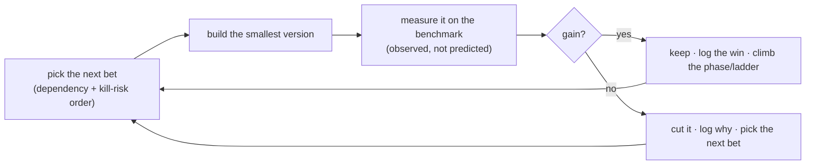

# 15 — Execution Roadmap (solo, ~8 hrs/week)

> A realistic, long-horizon plan to build and improve ADE under a hard constraint: **one developer, ~1 hour/day, ~8 hours/week.** This document is deliberately blunt. The analysis phase (docs 08, 10, 12–14) produced a vision and a gap map that would occupy a *team for years*; this roadmap's job is to reconcile that ambition with the time actually available — by ruthless prioritisation, cheap decision gates, and permission to stop. It ends with a critical review of the plan and the endeavour itself (§9).

---

## 0. The reality check (read this first)

**The scope and the time are mismatched by an order of magnitude, and pretending otherwise guarantees failure.** Be clear-eyed:

- **Updated commitment: ~3–4 hrs/day (one substantial daily session), ≈ 21–28 hrs/week nominal.** Context-switch loss now matters *less*, not just less-often: a single ~20–30 min reorientation cost is a small fraction of a 3–4 hour block (vs. a third of a 1-hour one), so **effective time is ~21–25 hrs/week** — roughly **1,050–1,300 productive hours/year**, ≈ **3.7–4.4× the previous ~5–6 hrs/week.** (If the actual daily length varies, re-derive this from §1's formula rather than trusting a stale number.)
- **The vision is still huge, but compresses unevenly.** The full build is still realistically **700–1,200+ hours plus open-ended research** — and *build* hours compress roughly with the new rate. But **Phase 2/3's core hypotheses (H6 compounding, H8 taste-calibration) are bounded by calendar time, not coding hours** — they need many *completed projects* and *accumulated human verdicts*, which more hours/day doesn't directly buy (see §9.4). Taste calibration remains an *open research problem* even for well-funded teams — it may never be "done," regardless of hours available.
- **Therefore, at this new cadence: the build-heavy phases (0–1) compress dramatically — but the full vision, gated by real-world signal accumulation, is still a multi-year effort, and parts of it never complete.** That is not a reason to abandon it. It is a reason to (a) treat the full vision as a **north star, not a deliverable**, (b) build so that **every phase delivers standalone value**, and (c) put a **hard kill/continue gate after the cheapest test of the core idea (H1)** so that, if the premise is wrong, you have spent months not years.

**The three operating principles that follow from the constraint:**

1. **Smallest thing that answers the biggest question.** Never build anything you don't need to reach the next decision gate. The enemy is not lack of ideas — you have 110+ catalogued failures and 18 research bets — the enemy is **doing the wrong ones first.**
2. **Evidence over analysis.** You have now done four rounds of deep analysis. Further analysis has sharply diminishing returns. **The next step is to build the cheapest thing that produces real data** (the MVP loop), because after that, prioritisation becomes measured, not speculative.
3. **Protect momentum.** Solo multi-year projects die from **attrition, not technical failure.** A strict weekly rhythm and a visible artifact every few weeks matter more than any architectural decision.

---

## 1. Operating model (how to work in 1-hour sessions)

The stop-start format is the real constraint. These habits are non-negotiable:

- **Keep a `STATE.md` dev log.** The last 5 minutes of *every* session: write "what I did / what's next / open questions / where the code is." The first action of the next session is to read it. This single habit recovers most of the context-switch loss.
- **Task granularity ≤ 1 session.** At 3–4 hrs/session, most Phase-0 build steps (§3) fit in a single sitting — break anything bigger into a chunk with a clear "done" per day. Big fuzzy tasks ("build the orchestrator") are still where work stalls; keep the same discipline, just at the new session size.
- **Batch by domain.** Spend a whole week in one area (harness, or gates, or the loop) — never switch domains within a week; the reload cost is per-domain.
- **Use AI to build aggressively.** You are building an AI system; use Claude/Claude Code to write and review code. Realistically this **compresses the *build* hours ~30–40%** — but it does **not** compress the parts that are actually the bottleneck: **your review/verification, the human taste verdicts, and the measurement.** Treat AI as a fast junior engineer whose output you must still read.
- **Weekly rhythm:** ~5–6 build sessions + **1 review/plan session** (update this roadmap, check the current gate metric, log learnings), with the remainder absorbing spillover and reading. Do the review session on a fixed day; it is what keeps the plan alive.
- **Treat hours/week as a re-pluggable parameter, not a fixed constant.** Every duration in this document derives from *(total effort hours) ÷ (effective hrs/week)*. If the commitment changes again — up or down — re-run that division rather than rewriting the plan from scratch; only the phase/hypothesis structure is fixed, the calendar is not.

---

## 2. Prioritisation framework (how we choose what to do)

With 110+ failures (doc 10) and 18 bets (doc 14), you need a *rule*, not a wishlist. Apply these in order:

1. **Kill-risk first.** Do the cheapest thing that could prove the whole idea *wrong*. That is **H1** (does an agent that sees its own render actually design better?). Everything in Phase 0 exists only to answer H1 honestly.
2. **Dependency order.** Enablers before dependents: the **loop** before memory before taste; the **benchmark (R1)** before the reward model (R4); the **human-feedback channel (R2)** before anything that learns from verdicts.
3. **Protect the measurement, ignore the rest.** From the failure catalogue, in each phase implement **only** the failures that would *corrupt that phase's evidence* — and defer everything else. In Phase 0 that means render-health, the a11y/floor gate, best-so-far, durable trace, the two injected-failure tests, and *minimal* harness sandboxing (F-SEC-01: no secrets in scope, deny egress). **Security depth, legal, production-parity, code-quality, and 15 of the 18 R-bets are explicitly deferred.**
4. **Value-at-gate.** Prefer work that makes the current phase *usable or decidable* on its own.
5. **Signal-per-hour.** Between two options, pick the one whose result is easier to *measure*.

### The problem set, bucketed (now / next / later / deferred)

| Bucket | What | When |
|---|---|---|
| **NOW (Phase 0)** | the loop; render-health + a11y + best-so-far + durable trace; 2 injected-failure tests; minimal harness sandbox (F-SEC-01); H1 measurement (report + blind verdicts) | **weeks 1–8** (was months 1–5) |
| **NEXT (Phase 1 + R1)** | brand + crystallisation + hard stores + phase-exit reviews; **R1 the benchmark**; brand a11y check; H4 (token drift) | **~months 2–4** (was months 6–12) |
| **LATER (Phase 2–3 + R2–R4)** | Library + retrieval + write-back (H6); **R2 human channel → R3 constitution → R4 reward model**; taste calibration (H3/H8) | **~months 4–7, then calendar-bound** — building compresses, but H6/H8 need real accumulated projects/verdicts (was year 2+) |
| **DEFERRED (pull only when a phase needs it)** | most of F-SEC/F-LEG/F-PAR/F-COD/F-OPS; motion-eyes (R5); divergence-generation (R6); strategy layer (R9); outcome feedback (R16); multi-surface (F-SUR-04) | when value demands, or never — unaffected by the hours/week change |

> The discipline is: a catalogued problem is **not a task until its phase arrives and it blocks value.** The catalogue is a *watchlist*, not a backlog.

### 2.1 The problem ledger — every catalogued area, with its bucket

The table above buckets by *phase*. This is the same information at *problem-area* granularity — every area in the failure catalogue (`10`) and every research bet (`14`) gets an explicit "when," so nothing is silently unaddressed. This is deliberately **area-level, not ID-level**: an ID-by-ID plan would be false precision the catalogue itself warns against (`10`'s own framing is coverage, not a backlog).

| Area (doc `10`) | IDs | Bucket | Why |
|---|---|---|---|
| Input & brief understanding | F-INP-01..06 | **NOW** | Phase 0's input gate + Brief Comprehension step exist specifically for this area |
| Design generation | F-GEN-01..06 | **NOW** | render-health + import-allowlist + truncation check are Phase-0 gates |
| Render → screenshot (Eyes) | F-EYE-01..05 | **NOW** | the render-health gate + nonce fix + settle waits ARE Phase 0 |
| Model & integration | F-MOD-01..06 | **NOW** | retries/budget-caps/pinned-id are built into the provider abstraction from day one |
| Storage, versioning & integrity | F-STO-01/04 now, 02/03 next | **SPLIT** | atomic writes + durable trace (01, 04) are Phase 0; versioning + per-client concurrency (02, 03) need the hard stores, Phase 1 |
| Accessibility & quality floor | F-QF-01/02 now, 03 deferred | **SPLIT** | the deterministic a11y/floor gates are Phase 0; accessibility *depth* beyond axe-core (QF-03) is an accepted gap for now |
| Judging / Taste | F-JDG-02/03 now (structural), 01/04/06/07 later | **SPLIT** | self-grading/reward-hacking are closed structurally from Phase 0 (fresh-context Critic, I2); judge *reliability and bias* is the open Taste research problem — Phase 3, R3/R4 |
| Human feedback | F-HUM-01 now, 02–04 later | **SPLIT** | capturing verdicts starts Phase 0 (`verdicts.jsonl`); reviewer governance/bottleneck matters once there's real volume |
| Reference processing | F-REF-01..04 | **DEFERRED** | `--refs` is an explicit no-op in Phase 0; revisit at Phase 2 |
| Brand Foundation | F-BRD-01..04 | **NEXT** (Phase 1) | derivation, freeze, palette a11y pre-check, and the Phase-Exit Review all land together in Phase 1 |
| Design System & Crystallization | F-PDS-01..04 | **NEXT** (Phase 1) | crystallization + its Phase-Exit Review; proves H4 |
| Consistency & coherence | F-CON-01..04 | **NEXT** (Phase 1) | this *is* H4 |
| Memory & retrieval | F-MEM-01..08 | **LATER** (Phase 2) | no Library exists before Phase 2 |
| Library write-back & learning | F-WB-01..06, F-LRN-01/02 | **LATER** (Phase 2) | de-identification + abstraction-altitude review are Phase-2 gates from day one of that phase |
| Operations, repro & vendor | F-OPS-05 now (cheap), rest later | **SPLIT** | checking the Pro-credit ToS (OPS-05) is a five-minute read, do it early; nondeterminism/backups/migrations/latency matter at scale, not during Phase 0 |
| Security | F-SEC-01 now (minimal), 02–05 deferred | **SPLIT** | a bare sandbox (no secrets in scope, deny egress) is cheap and non-negotiable even in Phase 0; full depth is deferred — see the accepted-risk list below |
| Surface (product/marketing) | F-SUR-01..04 | **DEFERRED / likely NEVER at this scope** | product surfaces and non-marketing domains — see accepted-risk list |
| Legal, IP & ethics | F-LEG-01..04 | **DEFERRED / likely NEVER unless purpose = product** | see accepted-risk list |
| Production parity | F-PAR-01..04 | **DEFERRED** (Phase 4 only) | meaningless before there is a real deployment target |
| Output code quality | F-COD-01..04 | **DEFERRED** | matters once output is meant to be *used or shipped*, not while proving H1 |
| Architecture / hypothesis-level | F-SPEC-01..06 | **ONGOING, every gate** | not "solved" once — F-SPEC-01 (H1 false) *is* the Phase-0 gate itself; the rest are watched at every review cadence in §7 |

| Research bet (doc `14`) | Tier | Bucket | Depends on |
|---|---|---|---|
| **R1** benchmark | 0 (enabler) | **NEXT** (Phase 1) | nothing — build first among the R-series |
| **R2** human-feedback channel | 0 (enabler) | **NEXT/LATER boundary** | R1 |
| **R3** constitution-grounded Critic | 1 (outer loop) | **NEXT** (Phase 1, part of the "significantly improved" bar) | R1 |
| **R4** reward/preference model | 1 (outer loop) | **LATER** (Phase 2–3) | R1, R2 |
| **R5** motion/scroll-aware Eyes | 2 (top lever) | **LATER** | R1 |
| **R6** divergence→convergence generation | 2 (top lever) | **LATER** | R1 |
| **R7** escape greedy local search | 2 (top lever) | **LATER** | R1 |
| **R8** Pareto / anti-scalarisation selection | 2 (top lever) | **LATER** | R1 |
| **R9–R15** (strategy/IA, content-robustness, cross-domain retrieval, adaptive effort, trajectory-learning, uncertainty-routing, imagery/graphics) | 3 (depth) | **LATER, pulled only as each phase needs it** | R1, varies |
| **R16–R18** (outcome feedback, long-horizon Library dynamics, goal-fit heuristics) | 4 (frontier) | **DEFERRED — may never be reached at solo scale** (§9.4, §9.5) | everything above |

**Explicit "never / accepted risk" list** (a decision, not an oversight — revisit only if §9.1's purpose answer changes):
- Full production-hardening (F-SEC-02..05 depth, F-LEG-01..04, F-PAR-01..04, F-COD-01..04) — this is a personal/R&D tool, not a multi-tenant service or paying-client product, unless §9.1 resolves toward "product."
- Accessibility depth beyond axe-core (F-QF-03) — a real, acknowledged gap; revisit only if output is ever meant to serve real end-users, not just be judged by the Critic.
- Non-marketing surfaces (F-SUR-01..04: forms, multi-page, email, data-viz, print, product-app states) — out of scope indefinitely unless the purpose points at a product with those needs.
- R16–R18 (outcome feedback, long-horizon dynamics, goal-fit heuristics) — the frontier tier may simply never be reached solo; that's an acceptable outcome, not a failure, per §10's minimal-path philosophy.

---

## 3. Detailed weekly plan — Phase 0 through Phase 3 (Phase 4 stays milestone-level, and here's why)

**This section now covers every phase, not just Phase 0** — with an honest confidence gradient, not equal certainty pretending to be equal precision:

- **Phase 0 (§3.1): solid.** Nothing upstream of it can change its plan.
- **Phase 1 (§3.2): concrete, built directly on Phase 0's own outputs** (the schemas, provider, harness, and gates Phase 0 produces). High confidence, but re-check against whatever Phase 0's debugging actually revealed.
- **Phase 2 (§3.3): concrete for the *build*, explicitly calendar-bound for the *measurement*** (H6 needs a second real project, not just more hours — see §9.4).
- **Phase 3 (§3.4): a concrete ramp-up plan for the first several weeks, then genuinely open-ended** — taste calibration doesn't have a fixed end date by nature (§0, §9.5).
- **Phase 4 (§3.5): deliberately left at milestone-level**, not out of laziness — it's gated on the still-unanswered purpose question (§9.1, `open-questions.md` #1), and planning it in detail now would be planning for a version of the project that may not be the one you're actually building.

Re-run this whole section's numbers against §1's formula if the hours/week commitment changes again — every week count below derives from *(effort) ÷ (effective hrs/week)*, not a fixed calendar.

### 3.1 Phase 0 — Eyes/MVP

Phase 0 (prove H1) is ~**110–160 effective hours**, which at the new ~21–25 effective hrs/week is **~5–7 weeks of pure arithmetic — but ~7–10 weeks (~1.5–2.5 months) in practice**, because a few steps (the Eyes/Playwright integration, the orchestrator glue-code, and rating 10 briefs' worth of output) have real elapsed-time costs — debugging cycles, waiting to observe results, avoiding rater fatigue — that don't compress purely by adding hours to a day. The table below reflects that honestly, not a flat "divide by 4."

| Wk | Focus | Done-when | Closes (doc `10` / invariants) | Notes |
|---|---|---|---|---|
| **0** | **Audit existing code.** `src/`, `harness/`, `spike.ts`, `package.json` already exist in this repo from an earlier session — read them against *this current* plan (Tailwind CDN, per-candidate nonce, JSONL trace, import allowlist, budget caps all postdate that code) | a written keep/rewrite decision per file, logged in `STATE.md` | — | **Do this before Wk 1.** Building blind on top of possibly-stale scaffolding wastes the exact hours this plan protects (`knowledge/open-questions.md` #8). |
| **1** | **0.0 Agent-SDK spike** + **0.1 scaffold** + **0.2 zod schemas** + **0.3 config** | a script prints a vision completion + usage (no `ANTHROPIC_API_KEY`); `ade` runs; schemas validate a sample brief | F-OPS-05, F-INP-04, F-MOD-06 | **Make-or-break gate is still the spike, not the pace.** If vision/usage fails on the credit, resolve the access model *now* — a bigger daily block doesn't help if the foundation is wrong. |
| **2** | 0.4 provider abstraction (retry/backoff/timeout) · 0.5 prompts (generator + critic v1) · 0.6 generator (stream, truncation) | one real `complete()` call; generator returns raw `.tsx` for a brief | F-MOD-01/02/05, F-GEN-04/05/06 | |
| **3** | 0.7 harness (Vite + Tailwind CDN + ready-nonce + asset serving) · 0.8 Eyes (Playwright: viewport → `goto?cid` → nonce wait → screenshot → error capture) | a generated component is screenshotted at 3 breakpoints | F-EYE-01/02/03/04 (nonce) | **Still fiddly even with more hours/day** — rendering/browser integration has its own debugging cycle; may spill into Wk 4. |
| **4** | 0.9 gates ①+② (render-health, hard-constraint, brief-comprehension) · 0.10 critic · 0.11 trace | a broken component is caught not scored; a screenshot → structured scores + a trace line | F-GEN-01/03, F-EYE-05, I11, F-QF-01, F-INP-01/02/03, F-JDG-03 (I2), F-JDG-06, F-MOD-03, F-STO-04 | |
| **5–6** | 0.12 orchestrator (loop, best-so-far, budget, terminal state) · 0.13 CLI · debug until the loop *demonstrably improves* on one brief · the 2 injected-failure tests | **M1: first end-to-end run on the Burkes hero → terminal state + trace**; loop edits in response to critique | F-STO-01, I4, I10, F-MOD-04; validates F-EYE-05 + F-QF-01 are actually caught | Biggest glue + the real debugging arc. Give this 2 weeks even compressed — integration bugs take thinking time, not just typing time. |
| **7** | 0.14 write ~9 more briefs · 0.15 report + blind-verdict log · minimal harness sandbox (F-SEC-01) | `ade report` prints iter-0→final gain | F-SPEC-05 (real measurement), F-SEC-01 | |
| **8** | Run all ~10 briefs; collect trace + blind human ratings; fix what breaks | 10 runs with traces + verdicts | generates the H1/H2 evidence itself | **This step resists compression too** — it's your rating time and attention, not coding time; space it out if rater fatigue sets in. |
| **9** | **M2 / H1 GATE:** analyse — scores up in ≥70%? humans prefer final in ≥70%? H2 good-or-close? | **DECISION: continue / iterate / stop** | **F-SPEC-01 is being tested right now** | Honest go/no-go. If H1 fails, you've spent ~2 months, not years — by design (was ~5 months at the old cadence). |

**Do not proceed to §3.2 unless H1 passes.** Everything below assumes it did.

### 3.2 Phase 1 — Brand + Consistency + R1

~140–200 effective hours ≈ **~7–9 weeks (~1.5–2 months)**, continuing the week count from Phase 0 (so this spans roughly weeks 10–18). Builds directly on Phase 0's schema/provider/harness/gates — nothing here is speculative, it's the next real layer.

| Wk | Focus | Done-when | Closes (doc `10` / invariants) | Notes |
|---|---|---|---|---|
| **10** | Schema additions: `BrandData`(full), `BrandFoundation`(w/ per-element provenance), `ProjectDesignSystem`, `Artifact`/`Section` · `store.ts` (atomic/versioned writer, per-client lock) | schemas validate a sample brand-data file; a versioned write survives a simulated crash | F-STO-01/02/03 (10d) | |
| **11** | `brand.ts` (derive + palette a11y pre-check) · `prompts.ts` (derive-brand + brand-review prompts) · `critic.ts` `reviewArtifact()` for brand · Phase-Exit Review wiring · `approveBrand`/`reDerive` | a derived brand is reviewed, then a human approves it → frozen | F-BRD-01/03/04 (10a), MP-13 | First real Phase-Exit Review boundary. |
| **12** | `crystallizer.ts` (extract PDS from the approved hero + its own Phase-Exit Review + freeze) · `prompts.ts` (crystallizer + crystallization-review prompts) | hero approved → PDS extracted, reviewed, frozen | F-PDS-01 (10a), MP-13 | Second Phase-Exit Review boundary. |
| **13** | `guardrails.ts` full token-allowlist gate · `orchestrator.ts` `assembleInputBundle` with conflict precedence + PDS-as-hard-law + prior-section-screenshots-as-context | an injected off-system hex is caught by the allowlist | F-PDS-02 (10a), I1 | |
| **14** | `orchestrator.ts` section sequencing (`design site`) + whole-artifact QA pass · `cli.ts` `design brand`/`design section`/`design site` subcommands | `design site` runs hero→about→pricing end to end | F-CON-03 (10c) | |
| **15–16** | **M3: run hero→about→pricing under one frozen brand+PDS; the H4 drift test** — zero off-token colors/type/space, retained layout variety | H4 passes: zero token drift + human "feels consistent, not monotonous" | F-CON-01/02 (10c) | Debug until clean; this is the real Phase-1 gate, not a formality. |
| **17** | **R1 build** — assemble a multi-domain golden-core benchmark (~10–15 briefs beyond Burkes: SaaS, e-commerce, editorial, enterprise, playful-consumer); define the multi-rater protocol | the golden core exists with recorded inter-rater agreement | F-SPEC-06 (10d), F-HUM-02 (10c) | See `spec/13`. Held out — never written to the Library. |
| **18** | **M4 / Phase-1 GATE:** H4 passed (wk 15–16) + R1 exists (wk 17) + brand re-derivation versions correctly | **DECISION: continue to Phase 2 / iterate / stop** | — | If H4 fails, fix crystallization/precedence before Phase 2 — don't build on a broken foundation. |

### 3.3 Phase 2 — Memory + R2

~120–170 effective hours to **build** ≈ **~6–8 weeks (~1.5–2 months)**, roughly weeks 19–26 — **but the phase's actual hypothesis (H6) is calendar-bound, not build-bound** (see §9.4): the table below gets you a working Library and a richer feedback channel; it does not by itself get you a second completed project to compare against the first.

| Wk | Focus | Done-when | Closes (doc `10` / invariants) | Notes |
|---|---|---|---|---|
| **19** | `embeddings.ts` — a **local** embedding provider (e.g. Ollama-hosted), staying key-free per the access model | an embedding call returns a vector with no `ANTHROPIC_API_KEY` set | F-OPS-05 (10e) | Confirms the Phase-2 access-model decision from `IMPLEMENTATION_PLAN.md`. |
| **20** | `library.ts` — flat-file cosine vector store; `LibraryEntry` schema with the embed-vs-payload split enforced | a seeded entry round-trips (embed → store → retrieve by similarity) | F-MEM-04 (10c) | |
| **21** | `retriever.ts` — brief → problem-space query synthesis → ANN top-k → soft-tagged entries into the bundle | a known-relevant seeded entry is retrieved for a matching brief | F-MEM-01/02 (10c) | |
| **22** | `writeback.ts` — de-identification gate → abstraction → **Phase-Exit Review of abstraction altitude** → dedup/merge or create | an adversarial write-back (client name/exact tokens) is blocked; a too-specific/too-vague entry is returned for re-abstraction | F-WB-01/02/06 (10c), MP-7, MP-13 | Third Phase-Exit Review boundary. |
| **23** | **R2 build** — replace the CLI approve/reject/notes capture with a richer channel: pairwise choice between candidates, per-dimension ratings, annotated-screenshot marks, a reasons field | a verdict captured through the new channel has strictly more structure than the old one | F-HUM-01/04 (10c) | This is the prerequisite for R4 (`open-questions.md` doesn't let R4 skip this). |
| **24** | Wire retrieval into the live loop — `assembleInputBundle` now includes `softLibrary`; confirm retrieval degrades gracefully if the store is unavailable | a run with the Library killed mid-run still completes on brand+brief alone | F-MEM-07 (10c) | |
| **25–26** | Seed the Library from Phase-0/1 approved artifacts; run the **first Library-on vs Library-off A/B** on a matched pair of briefs | a trace comparison exists for one matched pair | — | One pair is a pilot, not the H6 verdict — see wk 27+. |
| **27+** | **M5 — H6 signal.** Complete a **second real (or deliberately synthetic) project** and compare Library-on vs off | H6 passes/fails on **actual observed** quality/speed delta, not a single pilot pair | F-LRN-01 (10c) | **This step does not have a fixed week number** — it ends when a second project actually completes. More hours/day doesn't manufacture a second client; see §9.4 on synthetic briefs as the lever you actually control. |

### 3.4 Phase 3 — Taste (R3 → R4): a ramp-up plan, then genuinely ongoing

The *build* for the first few weeks is concrete; what it produces (a calibrated judge) is not a thing you finish, it's a thing you maintain — consistent with §0 and §9.5's "never done" framing. Do not expect a Phase-3 "GATE" row like the ones above; there isn't one.

| Wk | Focus | Done-when | Closes (doc `10` / invariants) | Notes |
|---|---|---|---|---|
| **28** | **R3 build** — ground the Critic prompt in `spec/12`'s 8 principles + rationale; assemble a small set of anchored exemplars (scored reference screenshots, multi-domain) | the grounded Critic prompt exists and runs | F-JDG-01/07 (10b) | |
| **29** | **R3 measurement** — A/B the constitution-grounded Critic vs. the original prose-rubric Critic on the R1 benchmark; measure agreement + test-retest variance | a *measured* agreement gain (or a documented non-gain) | F-JDG-06 (10b) | **This is M4's second half** — if there's no gain, that's a real result: revise or drop the constitution's grounding, don't force it. |
| **30** | `calibration.ts` — track Critic-vs-human agreement **per boundary** (section / brand / PDS / library), using verdicts already accumulating since Phase 0 | four independent agreement numbers exist, one per boundary | H8 (spec `08`) | |
| **31–32** | **R4 build** — assemble the accumulated pairwise-verdict dataset (now richer thanks to R2); implement a Bradley-Terry-style preference model; train on what exists so far | a trained model produces a preference score for a held-out pair | — | Depends on R1 (benchmark to validate against) and R2 (rich verdicts to train on) — both already done. |
| **33+** | **R4 measurement, then ongoing** — held-out pairwise accuracy vs. the prompted Critic; if it wins, consider distilling into a cheaper judge | a documented held-out accuracy number, re-measured periodically (monthly, per §7) as more verdicts accumulate | F-SPEC-06 (10d) | **This is where "ongoing" starts.** Re-run the measurement on a cadence, don't treat any single number as final. |
| **ongoing** | Autonomy-ladder rung 0→1 — relax the human gate at **one** boundary only once that boundary's agreement clears a pre-set bar (§7.1's per-boundary framing) | one boundary's "pass" is trusted without a human spot-check, and stays trustworthy over subsequent runs | F-HUM-03 (10c) | Never relax more than one boundary at a time; watch for regression per §7's monthly cadence. |

### 3.5 Phase 4 — Scale & Production: why this stays milestone-level

Phase 4 is **conditional on §9.1's answer.** If the purpose turns out to be "personal tool" or "research/portfolio," most of Phase 4 (production access switch, cross-browser/SSR parity, multi-tenant security depth) may never be built at all — it's explicitly in `§2.1`'s accepted-risk list until then. Planning it week-by-week now would mean planning for a specific future (a shipped product) that hasn't been chosen yet, which is exactly the kind of false precision this whole document argues against (§0). What's known now, at milestone level:

| Milestone | What | Gated on |
|---|---|---|
| Whole-artifact assembly at scale + cross-surface QA | extends Phase 1's whole-artifact QA to multi-artifact, multi-surface | Phase 1 complete |
| Website → product reuse | shared frozen Brand Foundation → a new per-surface Project Design System | H5 (spec `08`); a second surface actually being built |
| Autonomy-ladder rungs 2–4 | relax more gates, per boundary, only as H8 evidence justifies it | sustained per-boundary agreement from Phase 3 |
| Production access switch | `ADE_PROVIDER=api` + spend caps — the Pro credit is for R&D, not serving real users | §9.1 resolving toward "product" |
| Production-parity closure | Next.js/SSR harness, cross-browser validation, full F-PAR-*/F-SEC-*/F-LEG-*/F-COD-* closure (10e) | §9.1 resolving toward "product" |

**When §9.1 resolves, re-open this section and build it out to the same week-by-week detail as §3.1–3.4** — using whatever Phases 0–3 actually taught about real throughput, not the estimates in this document.

---

## 4. Compact phase overview (cross-reference — see §3 for the actual execution detail)

A one-page summary of what §3 now covers in full week-by-week detail (§3.1–3.4) plus the deliberately-not-detailed Phase 4 (§3.5). Use this table for orientation; use §3 to actually execute. Each phase is independently abandonable at its gate.

| Phase | Builds | Effort | Elapsed | Gate |
|---|---|---|---|---|
| **P0 — Eyes/MVP** | the loop | ~110–160 h | **~2 mo** (was ~5 mo) | **H1** |
| **P1 — Brand + Consistency + R1** | brand derive/approve/freeze; crystalliser; hard stores; phase-exit reviews; **the benchmark (R1)** | ~140–200 h | **~1.5–2 mo** (was ~6–8 mo) | **H4** (zero token drift) + R1 exists |
| **P2 — Memory + R2** | local embeddings; flat-file → vector store; retriever; write-back + de-id; **human-feedback channel (R2)** | ~120–170 h *build*, plus calendar time to accumulate real projects | **~1.5–2 mo to build, then calendar-bound** (was ~6–8 mo) | **H6** (Library-on beats off) — needs enough *completed projects* to test, not just build hours |
| **P3 — Taste (R3 → R4)** | constitution grounding (R3); reward model from verdicts (R4); calibration | open-ended | **still open-ended, ongoing** — bounded by accumulated verdicts over time, not hours/day | **H3/H8 trending** (never fully "done") |
| **P4 — Scale/Production** | *only if pursuing a product* — parity harness, cross-surface, autonomy ladder rungs | large | year 1+ (was year 4+) | sustained quality at low human touch |

**Honest totals:** the build-heavy phases (P0–P1) now land in **~3.5–4 months** instead of ~11–13; **P2 onward remains substantially calendar-bound** (real project/verdict volume), so the "mature system" horizon compresses less than the raw hours/week ratio would suggest — realistically **~1–3 years** rather than 3–6, with taste calibration still open-ended regardless. With aggressive AI-assisted building, shave maybe a third off the *build* hours on top of this — but not the measurement, verdicts, or research.

---

## 5. Post-analysis phase → the build→measure→learn loop

**"We've identified the problems — now what?"** The transition is the hard part, because analysis is comfortable and infinite, and building is uncomfortable and finite. The next steps, in order:

1. **Stop analysing.** You have enough. Further gap-hunting is now procrastination.
2. **Triage once** (done: §2 buckets). Don't re-triage every week.
3. **Build the MVP to get data** (Phase 0). Until the loop runs, all prioritisation is speculation.
4. **Enter the loop** (this is the answer to "after solving a problem, what's next?"):

**After each solved problem, the next step is never "solve the next problem on the list" — it is "measure whether the last solution actually helped, then let the data choose the next bet."** That is the entire discipline that separates real improvement from motion (F-SPEC-05). The long arc: repeat this loop, climbing H1 → H4 → H6 → H3/H8, until the "significantly improved" bar (§6), then keep climbing toward the north star for as long as it's worth it.

---

## 6. Timeline, milestones & the "significantly improved" bar

**Trackable milestones (leading indicators, not vanity):**

- **M1 (~wk 6):** first end-to-end run produces a terminal state + trace (was ~wk 12).
- **M2 (~wk 9):** H1 verdict — the go/no-go for the whole approach (was ~wk 20).
- **M3 (~mo 3):** a brand freezes; a hero crystallises a design system; H4 (zero token drift) holds across 3 sections. **The system now produces a consistent multi-section artifact from a brief, unattended.** (was ~mo 8)
- **M4 (~mo 4):** the benchmark (R1) exists and the constitution-grounded Critic (R3) shows a *measured* agreement gain on it. (was ~mo 12)
- **M5 (~mo 5–7, then calendar-bound):** H6 — a second similar project is measurably better/faster with the Library on than off. This one **compresses least** — it needs real completed projects, not just build hours (was ~mo 14–18).

**The "significantly improved" bar — define it now so you can recognise it:**

> ADE is **significantly improved** when it can, **unattended**, take a brief and produce a **consistent multi-section artifact** that (a) passes the deterministic floor, (b) **demonstrably improves across iterations** (H1), (c) a human rates good-or-close **≥50%** of the time (H2), (d) stays on-brand with **zero token drift** across sections (H4), and (e) at least **one outer-loop bet** (e.g., the anchored-rubric Critic, R3) shows a **measured** gain on the benchmark.

That bar = **P0 + P1 + R1 + R3 ≈ 4–6 months** at this cadence (was ≈ 12–18 months at the old 8 hrs/week — the build itself compresses close to linearly with hours/day; the range reflects real debugging/rating time, not a flat divide-by-4). It is deliberately *not* "full autonomy" or "calibrated taste" — those are the north star, reached (if ever) years later, gated by calendar time more than effort. Anchoring "significantly improved" here keeps it **achievable and motivating.**

---

## 7. Goal evaluation & staying on course

**Are we moving in the right direction?** Yes on method (measured, gated, honest); the *risk* is not direction but scope and sustainability (§0, §9). Guard it with three review cadences:

| Cadence | Question | Action |
|---|---|---|
| **Weekly** (the review session) | Did I move the current milestone? Is `STATE.md` current? | replan the next 1–2 weeks; unblock |
| **Monthly** | Am I still on the critical path to the next gate, or polishing? | cut scope creep; re-affirm the "smallest thing" |
| **At each gate (now roughly monthly, was quarterly-ish)** | Did the hypothesis pass on *observed* numbers? | **continue / iterate / pivot / stop** — honestly |

**Kill / pivot criteria (decide these *before* you're emotionally invested):**
- **H1 fails** → stop building; either rethink the critique signal or accept the premise is wrong (the spec's own rule).
- **Two consecutive months of no milestone movement** → the scope or the cadence is wrong; cut or pause, don't grind.
- **The benchmark can't be built** (no stable ground truth from a solo reviewer) → the whole "gets smarter" thesis is at risk; address §9's taste-SPOF question before proceeding.

**Continuous alignment:** every task must trace to a gate (H-something) or a High-severity failure that blocks the current phase. If it traces to neither, it is scope creep — cut it. Re-read the "significantly improved" bar (§6) monthly; it is your compass.

### 7.1 Direction check — this pass

Applying the framework above, honestly, right now:

- **Method: confirmed sound.** Gated hypotheses, a falsifiable benchmark-first R&D program, an explicit problem ledger (§2.1) instead of an unstructured backlog, and permission to stop at any gate — this is not drifting.
- **Scope/purpose: still NOT confirmed**, because **§9.1 is still unanswered.** It was asked explicitly and remains open (tracked in `knowledge/open-questions.md` #1). Direction cannot be fully confirmed while the most upstream question — product, personal tool, research/portfolio, or open-ended pursuit — is unresolved, since the four answers imply materially different priorities. This isn't a new problem; it's the same one, still waiting.
- **One new, concrete fact changes the very next action:** real Phase-0 scaffolding (`src/`, `harness/`, `spike.ts`) already exists in this repo, predating the harness-hardening fixes this plan assumes. **The literal next action, before anything else in §3's table, is Wk 0 — audit that code against this plan and log a keep/rewrite decision.** Skipping it risks building Wk 1–20 on a foundation that doesn't match what's actually already there.
- **Conditional read:** if §9.1's answer is "personal tool" or "research/portfolio," the current plan is close to right as scoped. If it's "product," §9.2 (build vs. buy) needs a real answer before investing further, and F-LEG/F-PAR/F-COD (currently in §2.1's accepted-risk list) stop being deferrable.

---

## 8. Recommended strategic adjustments (my honest advice)

1. **Answer the purpose question first (§9.1)** — it changes everything downstream.
2. **Narrow the target.** A loop that reliably designs **one surface (marketing) in one domain** to a bar you'd actually *use* beats a broad, unfinished autonomous system. Ship-and-use a narrow slice; generalise only if it earns it.
3. **Treat the compounding/Library thesis as a hypothesis to test cheaply (H6), not a foundation to assume** — it may not pay off at solo volume (§9.4).
4. **Front-load the kill-risk (H1) and honour the gate.** ~Two months to a real go/no-go is now the plan's best feature (was five).
5. **Build with AI; spend your scarce human hours on review, taste verdicts, and measurement** — the things AI can't do for you.
6. **Protect motivation structurally:** fixed weekly review, a visible artifact every ~4 weeks, and explicit permission to stop at any gate without it being "failure."

---

## 9. Critical review — open questions & risks to the plan itself

The plan above is only as good as the assumptions under it. These are the questions that most threaten it, roughly in order of how much they'd change the plan. **Several should be answered before or during Phase 0, not deferred.**

### 9.1 What is this *for*? (the biggest unanswered question)
Is ADE a **product** (to sell), a **personal tool** (to use), a **research/portfolio** project (to learn and demonstrate), or an **open-ended intellectual pursuit**? Each implies a *different plan*: a product needs users, differentiation, and go-to-market long before "calibrated taste"; a personal tool should be narrow and *used*; a research project should optimise for publishable/learnable results, not completeness. **Prioritisation is impossible without this answer, and right now it's implicit.** *Resolve first.*

### 9.2 Is building from scratch the right bet in a fast-moving market?
Tools like v0, Lovable, Framer AI, Figma AI, and Anthropic's own artifacts are commoditising AI-driven UI generation rapidly. **What is ADE's durable differentiation?** The thesis is the *compounding, taste-calibrated Library* — but is that defensible, or worth 3–6 solo years, when the generation layer keeps getting cheaper commercially? Consider building the *differentiated* part (the taste/memory loop) *on top of* existing generation tools rather than rebuilding generation. *Revisit at the H1 gate.*

### 9.3 You are the single point of taste failure (the binding constraint)
The entire "gets smarter" outer loop needs human verdicts as ground truth (R2/R4, H8) — and **you are the only rater.** Can one person, at ~8 hrs/week, generate *enough, consistent* verdicts to calibrate a Critic or train a reward model? And can you avoid **grading your own homework generously** (personal-scale measurement theater, F-SPEC-05 + F-HUM-04)? This may be the real ceiling on the whole vision — more than any code. *Design the verdict process to be cheap and self-check your consistency (test-retest yourself).*

### 9.4 Does the compounding thesis even hold at solo volume?
H6 ("project N+1 beats N via the Library") likely needs *many* projects to show signal. A solo dev may complete only a handful of real projects a year — possibly **never reaching the volume where compounding pays off.** **This is worth restating even after the time-budget increase to 3–4 hrs/day: more hours/day makes you build faster, but it does not by itself make more real client projects arrive.** The only way more daily hours actually buys H6 signal is if some of that time is deliberately spent running many *synthetic/practice* briefs through the pipeline — a real choice to make, not an automatic side effect of a bigger daily block. If H6 can't be shown at your throughput, Phase 2's central premise is unfalsifiable *for you*, and the plan should route around it. *Test H6 as early and cheaply as possible; don't build the whole Library expecting it.*

### 9.5 The "never done" problem
An autonomous system that "gets better forever" has **no finish line.** Without a defined "good enough to stop/ship/use," the project can absorb infinite time. §6's "significantly improved" bar is a first answer — but you should also define **"good enough to actually use for real work,"** which may be far earlier and narrower than any hypothesis gate.

### 9.6 The measurement paradox
You need the benchmark + verdicts to know if you're improving — but **building and maintaining them is itself a large, ongoing time sink** competing directly with the build. At 8 hrs/week, the meta-work (measurement) and the object-work (features) are rivals for the same hours. *Keep the benchmark deliberately tiny (§13 charter) and resist the urge to make it comprehensive.*

### 9.7 Sustainability / attrition (the most likely actual failure mode)
The most probable way this ends is not a failed hypothesis — it's **losing momentum over a multi-year solo effort.** Life events, motivation dips, and the long gap between effort and reward are the real risks. The plan mitigates with cadence and visible artifacts, but be honest that **a multi-year solo hobby project has a high natural attrition rate**, and design for graceful pause/resume (the `STATE.md` habit, phase independence).

**A new version of this risk, worth naming directly now:** 3–4 hrs/day is a **3–4× jump** in daily commitment from the original 1 hr/day this plan was built around. That's not automatically good news — a bigger daily block can go either way: it *could* compress the calendar-time-to-value enough that motivation never has time to decay (genuinely helpful for attrition), or it could simply be a harder daily commitment to sustain alongside whatever else fills the day, in which case the *effective* rate quietly reverts toward the old one and the compressed timeline above doesn't actually happen. **Watch this at the first few weekly reviews specifically** — if 3–4 hrs/day isn't holding, don't quietly let the plan's numbers become fiction; explicitly re-derive them at whatever rate is actually true (per §1's re-pluggable-parameter note), the same way this update just did.

### 9.8 Smaller but real open questions
- **Cost/credit sustainability:** will the Pro credit sustain the loop's volume across years? Embeddings need a local model (no first-party API). ToS for automated use is unconfirmed (F-OPS-05).
- **Single-domain overfit:** validating everything on Burkes risks a system that only works for editorial real-estate (N1, F-SUR).
- **Verification bottleneck:** if AI writes most of the code, your review quality is the ceiling — and reviewing unfamiliar AI-written code at 1 hr/day is slow and error-prone.
- **The Windows/tooling reality:** Playwright, sandboxing, and the harness on Windows add friction the plan's hours must absorb.
- **Reward-hacking yourself:** as sole builder *and* judge *and* beneficiary, you have every incentive to see improvement that isn't there. The benchmark's human-anchored, held-out discipline (doc 13) is your only real defence — take it seriously even when it's inconvenient.

---

## 10. If even 8 hrs/week isn't sustainable — the minimal path

If 3–4 hrs/day doesn't hold, there are two fallback tiers before abandoning:

**Tier 1 — revert to the previous plan.** The original ~1 hr/day, ~8 hrs/week version of this roadmap (20-week Phase 0, 12–18-month "significantly improved" bar) is still valid — it's simply this document's numbers before this update, recoverable by re-deriving from §1's formula at the old rate. Reverting the *commitment*, not the *plan*, is a legitimate, non-failure outcome.

**Tier 2 — if even that isn't sustainable, shrink to the irreducible core:**
1. Do **only** the Phase 0 loop on **one brief**, using AI to write most of it.
2. Skip the 10-brief H1 study; do an **informal** version (3 briefs, your own eyeball).
3. Answer just one question: *does seeing-and-critiquing visibly improve the output?*
4. That alone — a working render→critique→edit loop you can run — is a **complete, valuable, finishable artifact** and a genuine proof of the core idea, even if nothing else is ever built.

> The worst outcome is not "a narrow tool." The worst outcome is three years of a half-built broad system that was never used and never proved anything. **Narrow-and-finished beats broad-and-abandoned.**
