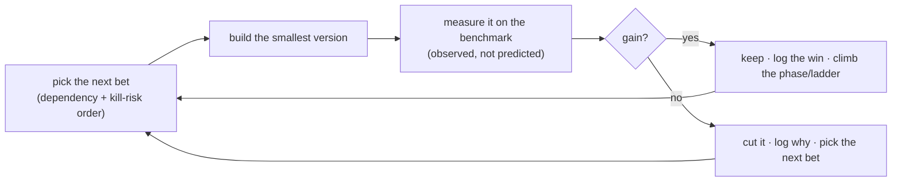

# 15 — Execution Roadmap (solo, ~8 hrs/week)

> A realistic, long-horizon plan to build and improve ADE under a hard constraint: **one developer, ~1 hour/day, ~8 hours/week.** This document is deliberately blunt. The analysis phase (docs 08, 10, 12–14) produced a vision and a gap map that would occupy a *team for years*; this roadmap's job is to reconcile that ambition with the time actually available — by ruthless prioritisation, cheap decision gates, and permission to stop. It ends with a critical review of the plan and the endeavour itself (§9).

---

## 0. The reality check (read this first)

**The scope and the time are mismatched by an order of magnitude, and pretending otherwise guarantees failure.** Be clear-eyed:

- **8 hrs/week ≈ 0.2 FTE.** After context-switching cost (a 1-hour stop-start session loses ~20 min to reloading where you were), **effective build time is ~5–6 hrs/week** — roughly **250–300 productive hours/year.**
- **The vision is huge.** The full autonomous, ever-improving, multi-surface designer, with a calibrated taste model and a compounding Library, is realistically a **700–1,200+ hour build plus open-ended research.** Taste calibration (Phase 3 / H3/H8) is an *open research problem* even for well-funded teams — it may never be "done."
- **Therefore, at this cadence, the full vision is a 3–6+ year effort, and parts of it never complete.** That is not a reason to abandon it. It is a reason to (a) treat the full vision as a **north star, not a deliverable**, (b) build so that **every phase delivers standalone value**, and (c) put a **hard kill/continue gate after the cheapest test of the core idea (H1)** so that, if the premise is wrong, you have spent months not years.

**The three operating principles that follow from the constraint:**

1. **Smallest thing that answers the biggest question.** Never build anything you don't need to reach the next decision gate. The enemy is not lack of ideas — you have 110+ catalogued failures and 18 research bets — the enemy is **doing the wrong ones first.**
2. **Evidence over analysis.** You have now done four rounds of deep analysis. Further analysis has sharply diminishing returns. **The next step is to build the cheapest thing that produces real data** (the MVP loop), because after that, prioritisation becomes measured, not speculative.
3. **Protect momentum.** Solo multi-year projects die from **attrition, not technical failure.** A strict weekly rhythm and a visible artifact every few weeks matter more than any architectural decision.

---

## 1. Operating model (how to work in 1-hour sessions)

The stop-start format is the real constraint. These habits are non-negotiable:

- **Keep a `STATE.md` dev log.** The last 5 minutes of *every* session: write "what I did / what's next / open questions / where the code is." The first action of the next session is to read it. This single habit recovers most of the context-switch loss.
- **Task granularity ≤ 2 sessions.** Break every task into chunks with a clear "done" that fit in ~2 hours, so no session ends mid-fog. Big fuzzy tasks ("build the orchestrator") are where stop-start work stalls.
- **Batch by domain.** Spend a whole week in one area (harness, or gates, or the loop) — never switch domains within a week; the reload cost is per-domain.
- **Use AI to build aggressively.** You are building an AI system; use Claude/Claude Code to write and review code. Realistically this **compresses the *build* hours ~30–40%** — but it does **not** compress the parts that are actually the bottleneck: **your review/verification, the human taste verdicts, and the measurement.** Treat AI as a fast junior engineer whose output you must still read.
- **Weekly rhythm:** ~5 build sessions + **1 review/plan session** (update this roadmap, check the current gate metric, log learnings). The ~2 hrs of slack absorb spillover and reading. Do the review session on a fixed day; it is what keeps the plan alive.

---

## 2. Prioritisation framework (how we choose what to do)

With 110+ failures (doc 10) and 18 bets (doc 14), you need a *rule*, not a wishlist. Apply these in order:

1. **Kill-risk first.** Do the cheapest thing that could prove the whole idea *wrong*. That is **H1** (does an agent that sees its own render actually design better?). Everything in Phase 0 exists only to answer H1 honestly.
2. **Dependency order.** Enablers before dependents: the **loop** before memory before taste; the **benchmark (R1)** before the reward model (R4); the **human-feedback channel (R2)** before anything that learns from verdicts.
3. **Protect the measurement, ignore the rest.** From the failure catalogue, in each phase implement **only** the failures that would *corrupt that phase's evidence* — and defer everything else. In Phase 0 that means render-health, the a11y/floor gate, best-so-far, durable trace, the two injected-failure tests, and *minimal* harness sandboxing (F-SEC-01: no secrets in scope, deny egress). **Security depth, legal, production-parity, code-quality, and 15 of the 18 R-bets are explicitly deferred.**
4. **Value-at-gate.** Prefer work that makes the current phase *usable or decidable* on its own.
5. **Signal-per-hour.** Between two options, pick the one whose result is easier to *measure*.

### The problem set, bucketed (now / next / later / deferred)

| Bucket | What | When |
|---|---|---|
| **NOW (Phase 0)** | the loop; render-health + a11y + best-so-far + durable trace; 2 injected-failure tests; minimal harness sandbox (F-SEC-01); H1 measurement (report + blind verdicts) | months 1–5 |
| **NEXT (Phase 1 + R1)** | brand + crystallisation + hard stores + phase-exit reviews; **R1 the benchmark**; brand a11y check; H4 (token drift) | months 6–12 |
| **LATER (Phase 2–3 + R2–R4)** | Library + retrieval + write-back (H6); **R2 human channel → R3 constitution → R4 reward model**; taste calibration (H3/H8) | year 2+ |
| **DEFERRED (pull only when a phase needs it)** | most of F-SEC/F-LEG/F-PAR/F-COD/F-OPS; motion-eyes (R5); divergence-generation (R6); strategy layer (R9); outcome feedback (R16); multi-surface (F-SUR-04) | when value demands, or never |

> The discipline is: a catalogued problem is **not a task until its phase arrives and it blocks value.** The catalogue is a *watchlist*, not a backlog.

---

## 3. Phase 0 — detailed weekly plan (the only part worth planning week-by-week)

Planning 150 weeks in detail is fiction. Phase 0 (prove H1) is ~**110–160 effective hours ≈ 20 weeks (~5 months)** and *can* be planned concretely. Everything after is milestone-level (§4).

| Wk | Focus | Done-when | Notes |
|---|---|---|---|
| **1** | **0.0 Agent-SDK spike** — text + vision + token-usage + headless OAuth on the Pro credit; repo skeleton | a script prints a vision completion + usage, no `ANTHROPIC_API_KEY` | **Make-or-break gate.** If vision/usage fails on the credit, resolve the access model *now* (route Critic to `api`/`local`) before anything else. |
| **2** | 0.1 scaffold · 0.2 zod schemas · 0.3 config | `ade` runs, schemas validate a sample brief | |
| **3** | 0.4 provider abstraction + retry/backoff/timeout | one `complete()` call through the real interface | |
| **4** | 0.5 prompts (generator + critic v1) · 0.6 generator (stream, truncation) | generator returns raw `.tsx` for a brief | |
| **5** | 0.7 harness (Vite + Tailwind CDN + ready-nonce + asset serving) | a hand-written component renders in the harness | |
| **6–7** | 0.8 Eyes (Playwright: viewport → `goto?cid` → nonce wait → screenshot → error capture) | a generated component is screenshotted at 3 breakpoints | Fiddly; budget 2 weeks. |
| **8** | 0.9 gates ① — input gate + render-health (esbuild syntax, import-allowlist, non-blank, overlay) | a broken component is caught, not screenshotted-as-good | |
| **9** | 0.9 gates ② — hard-constraint (axe a11y, 375 overflow, content/no-placeholder, colour allowlist) + brief-comprehension | a low-contrast fixture fails the gate | |
| **10** | 0.10 critic (vision, fresh ctx, schema-validated) · 0.11 trace (jsonl atomic append) | a screenshot → structured scores + a trace line | |
| **11–12** | 0.12 orchestrator (loop, best-so-far, budget, terminal state) · 0.13 CLI | **M1: first end-to-end run on the Burkes hero → terminal state + trace** | Biggest glue; budget 2 weeks. |
| **13–14** | Debug the full loop until it *iterates and improves* on one brief; the 2 injected-failure tests | loop demonstrably edits in response to critique | |
| **15** | 0.15 report + blind-verdict log · 0.14 write ~9 more briefs · minimal harness sandbox (F-SEC-01) | `ade report` prints iter-0→final gain | |
| **16–18** | Run all ~10 briefs; collect trace + blind human ratings; fix what breaks | 10 runs with traces + verdicts | Runs take time + your rating time — this is real work, not a button-press. |
| **19–20** | **M2 / H1 GATE:** analyse — scores up in ≥70%? humans prefer final in ≥70%? H2 good-or-close? | **DECISION: continue / iterate / stop** | Honest go/no-go. If H1 fails, you have spent ~5 months, not years — by design. |

---

## 4. Beyond Phase 0 — milestone-level roadmap

Estimates are *effective build hours* at ~5–6/week; treat as ranges, not promises. Each phase is independently abandonable at its gate.

| Phase | Builds | Effort | Elapsed | Gate |
|---|---|---|---|---|
| **P0 — Eyes/MVP** | the loop | ~110–160 h | ~5 mo | **H1** |
| **P1 — Brand + Consistency + R1** | brand derive/approve/freeze; crystalliser; hard stores; phase-exit reviews; **the benchmark (R1)** | ~140–200 h | ~6–8 mo | **H4** (zero token drift) + R1 exists |
| **P2 — Memory + R2** | local embeddings; flat-file → vector store; retriever; write-back + de-id; **human-feedback channel (R2)** | ~120–170 h | ~6–8 mo | **H6** (Library-on beats off) |
| **P3 — Taste (R3 → R4)** | constitution grounding (R3); reward model from verdicts (R4); calibration | open-ended | 12+ mo, ongoing | **H3/H8 trending** (never fully "done") |
| **P4 — Scale/Production** | *only if pursuing a product* — parity harness, cross-surface, autonomy ladder rungs | large | year 4+ | sustained quality at low human touch |

**Honest totals:** to a *mature* system ≈ **3–6 years** at this cadence; taste calibration continues indefinitely. With aggressive AI-assisted building, shave maybe a third off the *build* hours — but not the measurement, verdicts, or research.

---

## 5. Post-analysis phase → the build→measure→learn loop

**"We've identified the problems — now what?"** The transition is the hard part, because analysis is comfortable and infinite, and building is uncomfortable and finite. The next steps, in order:

1. **Stop analysing.** You have enough. Further gap-hunting is now procrastination.
2. **Triage once** (done: §2 buckets). Don't re-triage every week.
3. **Build the MVP to get data** (Phase 0). Until the loop runs, all prioritisation is speculation.
4. **Enter the loop** (this is the answer to "after solving a problem, what's next?"):

**After each solved problem, the next step is never "solve the next problem on the list" — it is "measure whether the last solution actually helped, then let the data choose the next bet."** That is the entire discipline that separates real improvement from motion (F-SPEC-05). The long arc: repeat this loop, climbing H1 → H4 → H6 → H3/H8, until the "significantly improved" bar (§6), then keep climbing toward the north star for as long as it's worth it.

---

## 6. Timeline, milestones & the "significantly improved" bar

**Trackable milestones (leading indicators, not vanity):**

- **M1 (~wk 12):** first end-to-end run produces a terminal state + trace.
- **M2 (~wk 20):** H1 verdict — the go/no-go for the whole approach.
- **M3 (~mo 8):** a brand freezes; a hero crystallises a design system; H4 (zero token drift) holds across 3 sections. **The system now produces a consistent multi-section artifact from a brief, unattended.**
- **M4 (~mo 12):** the benchmark (R1) exists and the constitution-grounded Critic (R3) shows a *measured* agreement gain on it.
- **M5 (~mo 14–18):** H6 — a second similar project is measurably better/faster with the Library on than off.

**The "significantly improved" bar — define it now so you can recognise it:**

> ADE is **significantly improved** when it can, **unattended**, take a brief and produce a **consistent multi-section artifact** that (a) passes the deterministic floor, (b) **demonstrably improves across iterations** (H1), (c) a human rates good-or-close **≥50%** of the time (H2), (d) stays on-brand with **zero token drift** across sections (H4), and (e) at least **one outer-loop bet** (e.g., the anchored-rubric Critic, R3) shows a **measured** gain on the benchmark.

That bar = **P0 + P1 + R1 + R3 ≈ 12–18 months** at this cadence. It is deliberately *not* "full autonomy" or "calibrated taste" — those are the north star, reached (if ever) years later. Anchoring "significantly improved" here keeps it **achievable and motivating.**

---

## 7. Goal evaluation & staying on course

**Are we moving in the right direction?** Yes on method (measured, gated, honest); the *risk* is not direction but scope and sustainability (§0, §9). Guard it with three review cadences:

| Cadence | Question | Action |
|---|---|---|
| **Weekly** (the review session) | Did I move the current milestone? Is `STATE.md` current? | replan the next 1–2 weeks; unblock |
| **Monthly** | Am I still on the critical path to the next gate, or polishing? | cut scope creep; re-affirm the "smallest thing" |
| **At each gate (quarterly-ish)** | Did the hypothesis pass on *observed* numbers? | **continue / iterate / pivot / stop** — honestly |

**Kill / pivot criteria (decide these *before* you're emotionally invested):**
- **H1 fails** → stop building; either rethink the critique signal or accept the premise is wrong (the spec's own rule).
- **Two consecutive months of no milestone movement** → the scope or the cadence is wrong; cut or pause, don't grind.
- **The benchmark can't be built** (no stable ground truth from a solo reviewer) → the whole "gets smarter" thesis is at risk; address §9's taste-SPOF question before proceeding.

**Continuous alignment:** every task must trace to a gate (H-something) or a High-severity failure that blocks the current phase. If it traces to neither, it is scope creep — cut it. Re-read the "significantly improved" bar (§6) monthly; it is your compass.

---

## 8. Recommended strategic adjustments (my honest advice)

1. **Answer the purpose question first (§9.1)** — it changes everything downstream.
2. **Narrow the target.** A loop that reliably designs **one surface (marketing) in one domain** to a bar you'd actually *use* beats a broad, unfinished autonomous system. Ship-and-use a narrow slice; generalise only if it earns it.
3. **Treat the compounding/Library thesis as a hypothesis to test cheaply (H6), not a foundation to assume** — it may not pay off at solo volume (§9.4).
4. **Front-load the kill-risk (H1) and honour the gate.** Five months to a real go/no-go is the plan's best feature.
5. **Build with AI; spend your scarce human hours on review, taste verdicts, and measurement** — the things AI can't do for you.
6. **Protect motivation structurally:** fixed weekly review, a visible artifact every ~4 weeks, and explicit permission to stop at any gate without it being "failure."

---

## 9. Critical review — open questions & risks to the plan itself

The plan above is only as good as the assumptions under it. These are the questions that most threaten it, roughly in order of how much they'd change the plan. **Several should be answered before or during Phase 0, not deferred.**

### 9.1 What is this *for*? (the biggest unanswered question)
Is ADE a **product** (to sell), a **personal tool** (to use), a **research/portfolio** project (to learn and demonstrate), or an **open-ended intellectual pursuit**? Each implies a *different plan*: a product needs users, differentiation, and go-to-market long before "calibrated taste"; a personal tool should be narrow and *used*; a research project should optimise for publishable/learnable results, not completeness. **Prioritisation is impossible without this answer, and right now it's implicit.** *Resolve first.*

### 9.2 Is building from scratch the right bet in a fast-moving market?
Tools like v0, Lovable, Framer AI, Figma AI, and Anthropic's own artifacts are commoditising AI-driven UI generation rapidly. **What is ADE's durable differentiation?** The thesis is the *compounding, taste-calibrated Library* — but is that defensible, or worth 3–6 solo years, when the generation layer keeps getting cheaper commercially? Consider building the *differentiated* part (the taste/memory loop) *on top of* existing generation tools rather than rebuilding generation. *Revisit at the H1 gate.*

### 9.3 You are the single point of taste failure (the binding constraint)
The entire "gets smarter" outer loop needs human verdicts as ground truth (R2/R4, H8) — and **you are the only rater.** Can one person, at ~8 hrs/week, generate *enough, consistent* verdicts to calibrate a Critic or train a reward model? And can you avoid **grading your own homework generously** (personal-scale measurement theater, F-SPEC-05 + F-HUM-04)? This may be the real ceiling on the whole vision — more than any code. *Design the verdict process to be cheap and self-check your consistency (test-retest yourself).*

### 9.4 Does the compounding thesis even hold at solo volume?
H6 ("project N+1 beats N via the Library") likely needs *many* projects to show signal. A solo dev may complete only a handful of real projects a year — possibly **never reaching the volume where compounding pays off.** If H6 can't be shown at your throughput, Phase 2's central premise is unfalsifiable *for you*, and the plan should route around it. *Test H6 as early and cheaply as possible; don't build the whole Library expecting it.*

### 9.5 The "never done" problem
An autonomous system that "gets better forever" has **no finish line.** Without a defined "good enough to stop/ship/use," the project can absorb infinite time. §6's "significantly improved" bar is a first answer — but you should also define **"good enough to actually use for real work,"** which may be far earlier and narrower than any hypothesis gate.

### 9.6 The measurement paradox
You need the benchmark + verdicts to know if you're improving — but **building and maintaining them is itself a large, ongoing time sink** competing directly with the build. At 8 hrs/week, the meta-work (measurement) and the object-work (features) are rivals for the same hours. *Keep the benchmark deliberately tiny (§13 charter) and resist the urge to make it comprehensive.*

### 9.7 Sustainability / attrition (the most likely actual failure mode)
The most probable way this ends is not a failed hypothesis — it's **losing momentum over a multi-year solo effort.** Life events, motivation dips, and the long gap between effort and reward are the real risks. The plan mitigates with cadence and visible artifacts, but be honest that **a 3–6 year solo hobby project has a high natural attrition rate**, and design for graceful pause/resume (the `STATE.md` habit, phase independence).

### 9.8 Smaller but real open questions
- **Cost/credit sustainability:** will the Pro credit sustain the loop's volume across years? Embeddings need a local model (no first-party API). ToS for automated use is unconfirmed (F-OPS-05).
- **Single-domain overfit:** validating everything on Burkes risks a system that only works for editorial real-estate (N1, F-SUR).
- **Verification bottleneck:** if AI writes most of the code, your review quality is the ceiling — and reviewing unfamiliar AI-written code at 1 hr/day is slow and error-prone.
- **The Windows/tooling reality:** Playwright, sandboxing, and the harness on Windows add friction the plan's hours must absorb.
- **Reward-hacking yourself:** as sole builder *and* judge *and* beneficiary, you have every incentive to see improvement that isn't there. The benchmark's human-anchored, held-out discipline (doc 13) is your only real defence — take it seriously even when it's inconvenient.

---

## 10. If even 8 hrs/week isn't sustainable — the minimal path

If the cadence slips, don't abandon — **shrink to the irreducible core:**
1. Do **only** the Phase 0 loop on **one brief**, using AI to write most of it.
2. Skip the 10-brief H1 study; do an **informal** version (3 briefs, your own eyeball).
3. Answer just one question: *does seeing-and-critiquing visibly improve the output?*
4. That alone — a working render→critique→edit loop you can run — is a **complete, valuable, finishable artifact** and a genuine proof of the core idea, even if nothing else is ever built.

> The worst outcome is not "a narrow tool." The worst outcome is three years of a half-built broad system that was never used and never proved anything. **Narrow-and-finished beats broad-and-abandoned.**
