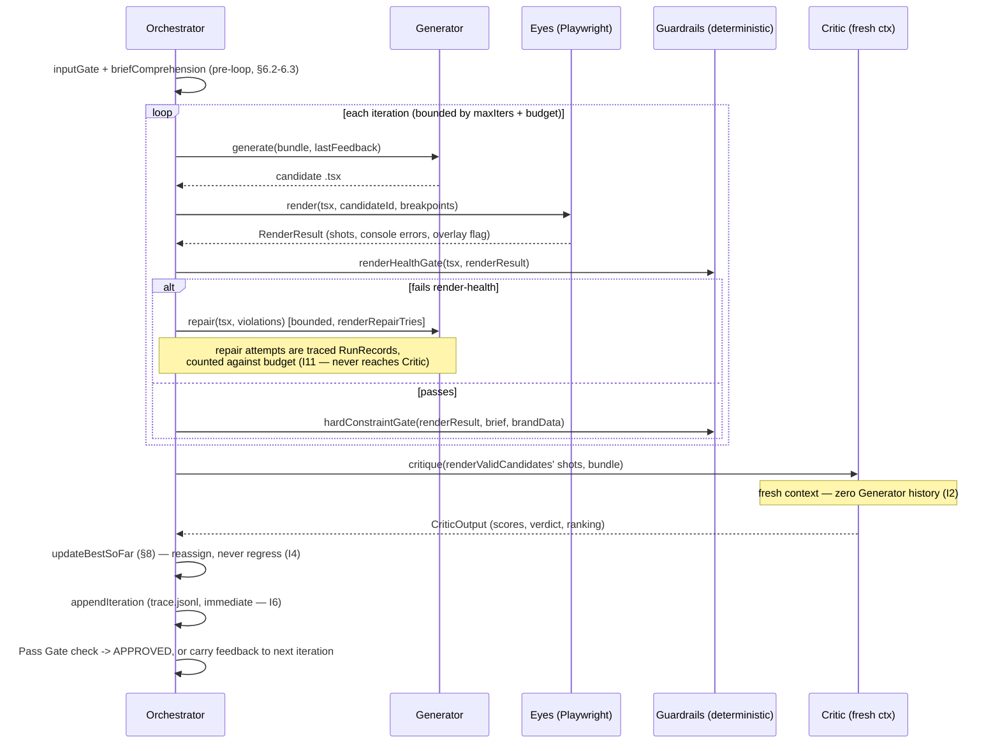
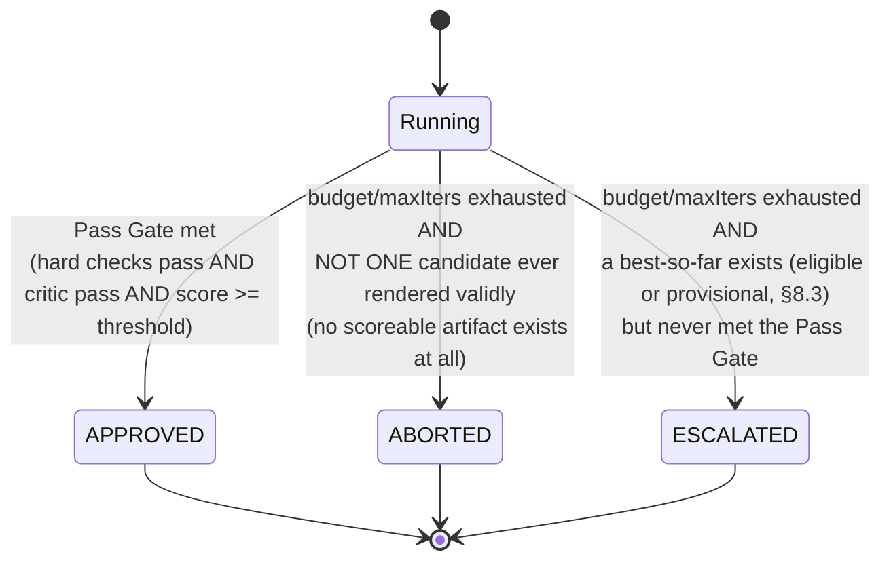

# 16 — Phase 0 Detailed Specification (Eyes / MVP)

> The Phase-0-specific implementation specification. This document consolidates every technical design decision needed to build the MVP closed loop, pulling from [05](./05-generation-loop.md), [07](./07-mvp-cli.md), [11](./11-guardrails-and-invariants.md), [02](./02-architecture.md), [03](./03-data-model.md), [08](./08-hypotheses-and-validation.md), [15](./15-execution-roadmap.md), and the `IMPLEMENTATION_PLAN.md`. An implementing agent should be able to build Phase 0 from this document + `03` (data model) + `08` (hypotheses) alone, without cross-referencing other sources.

---

## 0. Purpose & scope

**Phase 0 proves one thing: H1 — does an agent that sees its own render produce a measurably better section?** Everything in this document exists only to answer that question honestly and cheaply.

### What Phase 0 builds
The closed **generate → render → screenshot → critique → edit** loop on **one section** at a time. A CLI `ade generate` that takes a brief (+ optional brand-data) and produces a finished `.tsx` component + screenshots + a measurable `trace.jsonl`, unattended.

### What Phase 0 explicitly defers
| Deferred | Arrives in | Why deferred |
|---|---|---|
| Library / vector DB / retrieval | Phase 2 | No Library exists; H6 not testable yet |
| Brand Foundation (derivation / approval / freeze) | Phase 1 | MVP uses raw `BrandData` palette+type as fixed tokens |
| Project Design System / crystallization | Phase 1 | No second section needs consistency yet |
| Phase-Exit Reviews (brand / PDS / library) | Phase 1–2 | No hard-store artifacts exist to review |
| Multi-section consistency / whole-site assembly | Phase 1 | Needs frozen tokens + section sequencing |
| Write-back / de-identification | Phase 2 | No Library to write to |
| References (`--refs`) | Phase 2 | Accepted no-op flag; wired later |
| Multi-file `supporting/*.tsx` output | Phase 1 | MVP emits one self-contained `.tsx` |
| Mid-run resume | Later | A crashed run re-runs from scratch; `trace.jsonl` preserves the measurement substrate |
| Production security depth (F-SEC-02..05) | Phase 4 | Personal R&D tool, not multi-tenant |
| Taste calibration (H8) | Phase 3 | Needs accumulated verdicts over time |

### Failures Phase 0 must close
Every `F-*` ID listed in [15 §3.1](./15-execution-roadmap.md)'s weekly table. The full mapping is in [§14](#14-phase-0-failure-coverage-map) of this document.

### Invariants Phase 0 must enforce
I1 (precedence), I2 (fresh Critic context), I3 (objective→deterministic), I4 (best-so-far), I6 (durable trace), I9 (brief-as-data), I10 (terminal state), I11 (render-valid precedes critique), I12 (human-anchored measurement).

---

## 1. Provider abstraction

The model provider is the single most load-bearing assumption in Phase 0. If the access model fails, nothing else matters.

### 1.1 The interface

```ts
export interface CompletionRequest {
  system: string;
  messages: Msg[];           // text turns
  images?: ImageRef[];       // for vision (Critic)
  maxTokens: number;
  stream?: boolean;
  schemaName?: string;       // when a structured JSON reply is required
}

export interface CompletionResult {
  text: string;
  usage: { input: number; output: number };
}

export interface ModelProvider {
  readonly id: string;       // pinned model id — recorded in every RunRecord
  complete(req: CompletionRequest): Promise<CompletionResult>;
}

export function getProvider(cfg: Config): ModelProvider;
```

### 1.2 The three adapters

| Adapter | Auth | When | Key rule |
|---|---|---|---|
| **`agentSdk.ts`** (DEV DEFAULT) | Claude Code OAuth login, Pro Agent-SDK credit | R&D (Phases 0–3) | **Must NOT read `ANTHROPIC_API_KEY`** — its presence forces API billing |
| **`anthropicApi.ts`** | `ANTHROPIC_API_KEY` env var | Production (Phase 4) | Standard `@anthropic-ai/sdk` |
| **`localOllama.ts`** | None (local) | Fallback / offline | POSTs to a local Ollama vision model |

Selected by `ADE_PROVIDER=agent-sdk|api|local` (default `agent-sdk`).

### 1.3 The `ADE_PROVIDER` switch

The provider is a **config swap, never a rewrite**. Every model call flows through the `ModelProvider` interface. The Orchestrator, Generator, and Critic never know which adapter is behind it.

### 1.4 Retry, backoff & timeout (centralized)

All retry/backoff/timeout logic lives **inside** the provider layer, not in the callers:
- **429 / 5xx / timeout** → exponential backoff with jitter, up to 3 retries.
- **Refusal** (benign-task safety refusal) → one reframe retry with softened phrasing, then throw `ProviderError`.
- **Streaming** for large Generator outputs (sections can be large); generous `maxTokens`.
- **Structured output validation** via the Schema Gate on every machine-read response.
- **Pinned model id** (`provider.id`) recorded in every `RunRecord` — re-baseline metrics on any model change.

### 1.5 Per-role model selection

The interface takes a `modelId` per call, so roles can differ:
- **Critic** = strongest model (taste ceiling, F-JDG-01).
- **Generator** = can be cheaper in Phase 4 (cost lever).
- Config carries `criticModelId` / `genModelId` separately from day one, even though they're the same model in Phase 0.

### 1.6 `--mock` / `--dry-run` mode

For testing and development without burning credit:
- **`--mock`**: uses a deterministic fake `ModelProvider` that returns canned `.tsx` and scores. Used by the integration test suite.
- **`--dry-run`**: validates the brief, assembles the input bundle, and prints what would be sent to the model, without making any calls.

### 1.7 Day-0 spike (build step 0.0 — do first)

Before building the loop, prove the Agent SDK adapter can be driven as a single-shot completer on the Pro credit. The spike must demonstrate:

1. **One text completion** with a custom system prompt and bounded `maxTokens`.
2. **One vision completion** (image in → text out) — this is how the Critic works.
3. **Token-usage retrieval** — needed for the trace, H7, and budget caps.
4. **Headless OAuth pickup** with **no `ANTHROPIC_API_KEY`** set.

> **The Agent SDK is an *agentic* framework (tool loop, sessions, its own system identity), not a chat-completions client.** The spike must prove it can be wrapped as a single-shot completer. If vision is unavailable on the credit path, route the Critic to `anthropicApi`/`localOllama` for vision while the Generator stays on `agentSdk` — the abstraction makes this per-role.

**If the spike fails, stop and resolve before writing the loop.** Record the outcome in `STATE.md`.

---

## 2. Generator output contract

The Generator produces a React + TypeScript component. These rules are stated as **explicit hard constraints in the Generator prompt** — they prevent F-GEN-03, F-GEN-04, F-GEN-05, and F-GEN-06.

### 2.1 The five rules

| # | Rule | Prevents |
|---|---|---|
| 1 | **Exactly one self-contained `.tsx` file** that default-exports the section and renders in the harness with no extra wiring. No multi-file output in Phase 0. | F-GEN-03 |
| 2 | **Import allowlist: `react` only.** No icon libraries, no image libraries, no UI component libraries. Inline SVGs instead. Hallucinated imports crash the build. | F-GEN-04 |
| 3 | **Static Tailwind class strings only.** No runtime-constructed class names (e.g., no `` `text-${color}` ``). The Tailwind Play CDN JIT can't see what isn't a literal string. | F-GEN-03 |
| 4 | **No placeholders.** No `lorem ipsum`, no `TODO`, no `{{ }}` template markers. Use the brief's real content exactly as provided. | F-GEN-05 |
| 5 | **Reference assets only by harness-served paths.** The Orchestrator copies assets into `harness/public/` and provides the paths. The Generator uses those paths, never invents file paths. | F-INP-05 |

### 2.2 Truncation detection (F-GEN-06)

If the stream stops on `max_tokens` or the output has unbalanced braces / JSX tags:
1. **Treat as incomplete** — do not attempt to render.
2. **Retry once** with a higher token budget (counts against `maxModelCalls`).
3. If still truncated → route to render-repair (the code will fail the Render-Health Gate).

### 2.3 Output extraction

The raw model output may contain markdown fences (` ```tsx ... ``` `). The Generator module:
1. Strips markdown fences.
2. Returns raw `.tsx` source.
3. Records `usage: { input, output }` from the provider.

---

## 3. InputBundle (Phase 0 subset)

The Orchestrator assembles one `InputBundle` per generation call. Phase 0 uses a minimal subset; Phase 1 extends this type.

### 3.1 Phase 0 shape

```ts
interface InputBundle {
  brief: Brief;                    // required — business context + section content
  brandData?: BrandData;           // optional — palette + typography as fixed tokens
  refs?: ReferenceRef[];           // accepted but no-op in Phase 0
  lastFeedback?: string;           // serialized violations + Critic notes from previous iteration
}
```

### 3.2 Phase 1 extensions (not built now, but the type is designed for them)

```ts
// Phase 1 adds:
interface InputBundle {
  // ... Phase 0 fields ...
  hardBrand?: BrandFoundation;     // frozen brand identity
  hardSystem?: ProjectDesignSystem; // frozen tokens + component recipes
  softLibrary?: LibraryEntry[];    // top-k retrieved entries
  ctxShots?: Screenshot[];         // screenshots of already-built sections
}
```

### 3.3 Assembly rules

1. **Brief is always required.** Missing brief → Input Gate rejects before spend.
2. **BrandData, when present, is HARD.** Its palette values become the color allowlist. Its typography becomes the only permitted font families.
3. **Refs are SOFT and capped at 5** (I8). In Phase 0 they are accepted but not wired.
4. **LastFeedback** is the serialized output of the Feedback Serialization mechanism ([§7](#7-feedback-serialization)).

---

## 4. Harness technical design

The harness is a thin Vite + React app whose only job is to mount the generated component so the Eyes can render and screenshot it. It is **not** the design output — it is the preview host.

### 4.1 Project layout

```
harness/
├── index.html            # shell — loads Tailwind Play CDN + mounts React root
├── vite.config.ts        # fixed port, React plugin
├── public/               # assets copied here by the Orchestrator per run
│   ├── hero-bg.png       # (example — from brief's assets)
│   └── ...
└── src/
    ├── main.tsx           # imports ./candidate/Section.tsx, mounts, fires ready nonce
    └── candidate/
        └── Section.tsx    # THE MOUNT SLOT — overwritten by the Orchestrator each iteration
```

### 4.2 Tailwind via the Play CDN (not build-time)

```html
<!-- harness/index.html -->
<script src="https://cdn.tailwindcss.com"></script>
```

**Why the CDN, not a build-time `content` scan:** The candidate `.tsx` file is written at runtime by the Orchestrator. A build-time Tailwind JIT would need to know the candidate's class names in advance — but they're generated by the LLM and unpredictable. The Play CDN does JIT **in the browser**, so arbitrary generated classes work.

**Offline / `local` fallback:** A broad safelist build that pre-generates all common Tailwind classes. Acceptable for the MVP; not needed until the `local` provider is used.

**Phase 4 note:** The CDN↔production-build difference is a known parity gap (F-PAR-*). Production uses a proper Tailwind build. Deferred.

### 4.3 Per-candidate ready nonce (`__ADE_READY_ID__`)

The harness uses a **per-candidate nonce**, not a boolean, to signal render readiness. This prevents the Eyes from screenshotting a stale render (F-EYE-02).

```tsx
// harness/src/main.tsx (simplified)
import Section from './candidate/Section';

const params = new URLSearchParams(window.location.search);
const cid = params.get('cid');

const root = ReactDOM.createRoot(document.getElementById('root')!);
root.render(<Section />);

// Signal readiness ONLY after mount + fonts + one frame
document.fonts.ready.then(() => {
  requestAnimationFrame(() => {
    (window as any).__ADE_READY_ID__ = cid;
  });
});
```

The Eyes wait for `window.__ADE_READY_ID__ === candidateId` before capturing. A stale nonce (from a previous candidate) will never match.

### 4.4 `?cid=` routing

The Orchestrator loads the harness URL with a unique candidate id as a query parameter:
```
http://localhost:<port>/?cid=<candidateId>
```
The `cid` is a unique string per candidate per iteration (e.g., `iter-0-cand-1`). It flows through to the nonce mechanism above.

### 4.5 Asset & font provisioning

**Assets:**
1. The Orchestrator reads the brief's `section.assets` field.
2. It copies each referenced file into `harness/public/`.
3. It provides the harness-relative paths to the Generator prompt (e.g., `/hero-bg.png`).
4. Missing assets are caught by the Input Gate **before** any generation spend (F-INP-05).

**Fonts:**
1. **Google Fonts:** loaded via a `<link>` tag in `index.html` (the Orchestrator writes the link based on `brandData.typography`).
2. **Commercial / unavailable fonts** (e.g., "Canela"): mapped to a near-fallback (e.g., "Georgia, serif") and the substitution is **recorded** in the run config so that screenshots aren't graded against the wrong font (F-EYE-03).
3. The harness waits on `document.fonts.ready` before signaling readiness.

### 4.6 Entrance animation disabling

For the critique snapshot, entrance animations are **disabled**, not waited-out. A CSS settle wait is unreliable (F-EYE-04). The harness injects:

```css
/* harness/index.html or a global style */
*, *::before, *::after {
  animation-duration: 0s !important;
  animation-delay: 0s !important;
  transition-duration: 0s !important;
  transition-delay: 0s !important;
}
```

This ensures the screenshot captures the final state, not a mid-animation frame.

---

## 5. Eyes (screenshot pipeline)

The Eyes module (`eyes.ts`) renders the generated component in the harness and captures screenshots at three breakpoints.

### 5.1 Rendering sequence (strictly sequential)

Candidates render **one at a time** against the single mount slot. No parallelism in Phase 0:

```
For each candidate:
  1. Write tsx → harness/src/candidate/Section.tsx  (atomic: temp + rename)
  2. Ensure Vite dev server is running (spawn once, reuse)
  3. For each breakpoint [1440, 768, 375]:
     a. Set Playwright viewport to breakpoint width
     b. Full page.goto(harnessUrl + '?cid=' + candidateId)
        — a full navigation per candidate, NOT HMR (more deterministic, F-EYE-02)
     c. waitForFunction(() => window.__ADE_READY_ID__ === candidateId)
        — the nonce match guarantees THIS candidate, not the previous one
     d. Screenshot → save to iterations/iter-N/cand-K/shots/<breakpoint>.png
  4. Capture console errors + Vite error-overlay element → pass to render-health gate
```

### 5.2 Wait chain (what "render ready" means)

The nonce fires only after all three conditions are met:
1. **React mount** complete (the component is in the DOM).
2. **`document.fonts.ready`** resolved (all web fonts loaded — F-EYE-03).
3. **One `requestAnimationFrame`** (layout has settled — F-EYE-04).

For Phase 0 this is sufficient. F-EYE-06 (async data components) is not a Phase 0 risk because generated components are static — they don't fetch data.

### 5.3 Atomic file writes on Windows

On Windows, `fs.rename()` fails if the target exists. The Eyes module:
1. Writes to a temp file (`Section.tsx.tmp`).
2. Unlinks the existing `Section.tsx` if present.
3. Renames `Section.tsx.tmp` → `Section.tsx`.

### 5.4 Browser lifecycle

- **Spawn once** at the start of a run. Reuse across all candidates and iterations.
- **Close cleanly** at run end (or on error / abort).
- Pages are created and closed per candidate, not reused.

### 5.5 The `RenderResult` type

```ts
interface RenderResult {
  candidateId: string;
  shots: Record<'1440' | '768' | '375', string>;  // file paths to PNGs
  consoleErrors: string[];                          // captured browser console errors
  hasErrorOverlay: boolean;                         // Vite error overlay detected
  domHeight: number;                                // body height in px (non-blank check)
  domTextLength: number;                            // total text content length
}
```

---

## 6. Guardrails (Phase 0 subset)

Phase 0 activates a subset of the full Guardrail Layer ([11](./11-guardrails-and-invariants.md)). Each gate is deterministic — no model calls.

### 6.1 Which gates are active

| Gate | Phase 0 | Notes |
|---|---|---|
| **Input Gate** | ✅ | Brief schema, asset check, content/placeholder |
| **Brief Comprehension** | ✅ | One cheap model call (the only pre-loop model call) |
| **Render-Health Gate** | ✅ | Build/syntax check, non-blank, fonts/images, settle |
| **Hard-Constraint Gate** (a11y + responsive + content + color allowlist) | ✅ | Color allowlist only when `brandData` supplied |
| **Schema Gate** | ✅ | On every structured LLM output |
| **Token-Allowlist Gate** (full spacing/radius/shadow) | ❌ | No design system yet; arrives Phase 1 |
| **De-identification Gate** | ❌ | No Library; arrives Phase 2 |
| **Phase-Exit Review** (brand/PDS/library) | ❌ | No hard-store artifacts; arrives Phase 1–2 |

### 6.2 Input Gate detail

```
inputGate(brief, brandData?) → { pass: boolean; violations: Violation[] }
```

Checks:
1. **Zod schema validation** — brief matches the `Brief` schema; brandData (if present) matches `BrandData`.
2. **Required fields present** — client, industry, goal, section.name, section.content are non-empty.
3. **Contradiction check** — flag conflicting signals in the brief (e.g., "urgency" goal with "restrained" personality). Surface them, don't resolve them (F-INP-03).
4. **Assets exist on disk** — every path in `section.assets` resolves to a real file (F-INP-05).
5. **Content sanitized** — brief/content is treated as **data, never instructions** (I9). No prompt injection from client copy.

Fail → precise error message, exit before any model spend.

### 6.3 Brief Comprehension step

The one exception to "guardrails are deterministic": a single **cheap** model call **before** the loop begins.

```
brief → COMPREHEND → { restatedGoal, audience, constraints, detectedGaps, detectedConflicts }
```

- **Restate** the brief as goal/audience/constraints — the human can confirm or correct (F-INP-01).
- **Detect missing required fields** and **contradictions** — surface them instead of inventing (F-INP-02, F-INP-03).
- The comprehension output is **recorded** and fed to both the Generator and Critic as the canonical interpretation.
- On a material mismatch or a missing required fact → surface to human, do not invent.

### 6.4 Render-Health Gate detail

```
renderHealthGate(tsx, renderResult) → { pass: boolean; violations: Violation[] }
```

Runs **before** critique (I11). Two phases:

**Pre-render (static analysis):**
1. **Syntax check via `esbuild.transform()`** — esbuild strips types; it does **not** type-check. This catches syntax errors fast, without starting Vite. Semantic errors surface at runtime via the Vite error overlay.
2. **Import-allowlist lint** — scan import statements; reject anything outside `react` (F-GEN-04). This prevents hallucinated-import crashes before the harness even tries.

**Post-render (from `RenderResult`):**
3. **No error overlay** — `renderResult.hasErrorOverlay === false`.
4. **Non-blank DOM** — `renderResult.domHeight > threshold` AND `renderResult.domTextLength > threshold`.
5. **Fonts loaded** — guaranteed by the nonce mechanism (F-EYE-03).
6. **Layout settled** — guaranteed by the animation-disabling CSS (F-EYE-04).

Fail → **render-repair** signal. The candidate is routed to the repair path, **never** to the Critic. A render bug is never judged as design (I11, F-EYE-05).

### 6.5 Hard-Constraint Gate detail

```
hardConstraintGate(renderResult, brief, brandData?) → { pass: boolean; violations: Violation[] }
```

Runs on a healthy render, before/with critique:

1. **Accessibility audit** — `@axe-core/playwright` on the rendered page. **Fail on serious/critical violations only.** Calibrate the rule subset against 1–2 hand-built known-good sections first, so the gate doesn't reject every AI page and make H1 unmeasurable (F-QF-01).

2. **Responsive overflow** — at the 375px breakpoint: `scrollWidth ≤ clientWidth + ε` (small tolerance for sub-pixel rendering). Fail if the page overflows horizontally.

3. **Content-present** — every string from `brief.section.content` appears in the rendered DOM (not necessarily verbatim — allow minor whitespace differences). Fail if content is missing. **Numeric literals are checked exactly, not fuzzily** (F-GEN-07): any price, percentage, or statistic in the brief's content must appear **unchanged** in the DOM — a generator that "helpfully" rounds `$1,299` to `$1,300` or restates `87%` as "the majority" passes the fuzzy string check but silently corrupts data the brief owner cares about. Extract numeric tokens from the brief content (a simple regex for currency/percentage/digit-groups is sufficient for Phase 0) and require an exact substring match in the DOM text.

4. **No-placeholder** — scan the DOM for `lorem`, `TODO`, `{{ }}`, `placeholder`, `img.svg` dummy images. Fail if found (F-GEN-05).

5. **Color allowlist** (only when `brandData` is supplied) — the sampled-tolerance mechanism:

### 6.6 Color allowlist — sampled-tolerance mechanism

This is **not** a strict CSS-property-value subset check (which would false-positive on shadows, rgba, anti-aliasing, and browser defaults). It is a **sampled-tolerance** check:

```
For each rendered node in the DOM:
  For each of [color, background-color, border-color, fill, stroke]:
    1. Read the computed style value.
    2. Skip: transparent, currentColor, inherit, initial, unset.
    3. Skip: a defined neutral ramp (pure black, pure white, and grays within
       the palette's hue family — these are structural, not brand-violating).
    4. Convert to a common color space (e.g., OKLCH or LAB).
    5. Find the nearest palette color from brandData.palette.
    6. If distance > ε (a tunable tolerance) → violation: "off-palette color
       <value> on <element>; nearest palette color is <nearest> at distance <d>."
```

The tolerance `ε` is calibrated empirically — too tight and shadows/anti-aliasing false-positive; too loose and off-brand colors slip through. Start with a generous `ε` and tighten after observing real outputs.

### 6.7 Schema Gate detail

```
schemaGate(schemaName, rawJson) → { pass: boolean; violations: Violation[] }
```

Validates every structured LLM output (Critic verdict, comprehension output) against its zod schema:
1. Parse the raw JSON.
2. Validate against the named schema.
3. On failure: **one re-ask** (send the parse error back to the model and request a corrected output).
4. On second failure: **fail-closed safe default** — verdict = `fail`, neutral scores, parse failure logged. **Never default to pass.**

---

## 7. Feedback serialization

The mechanism by which the Orchestrator turns the previous iteration's violations and Critic notes into the next Generator prompt. This is the core H1 mechanism — the signal that makes "iteration N+1 better than N" possible.

### 7.1 Structure

The feedback block appended to the next iteration's Generator prompt has three sections, in order:

```
── FEEDBACK FROM PREVIOUS ITERATION ──

🔴 MUST FIX (hard-gate violations — these will fail the build if not addressed):
  1. [violation type]: [specific description]
  2. [violation type]: [specific description]
  ...

🟡 IMPROVE (Critic notes — these will improve your score):
  1. [specific, actionable note from the Critic]
  2. [specific, actionable note from the Critic]
  ...

🟢 KEEP (what worked — preserve these in your revision):
  - [brief summary of what the Critic praised or what passed gates]
```

### 7.2 Rules

1. **Hard violations first** — these are from the Hard-Constraint Gate. They are labelled "MUST FIX" and framed as build-breaking (because they are — nothing passes the Pass Gate with a hard violation).
2. **Critic notes second** — these are the actionable feedback from the Critic's structured output. They are labelled "IMPROVE."
3. **"Keep what worked" third** — a brief summary of what passed or what the Critic praised. This prevents the Generator from over-correcting and losing what was already good (F-LOOP-03 mitigation).
4. **If no feedback exists** (iteration 0), this block is omitted entirely.

### 7.3 Scope discipline

Feedback is scoped narrowly: "fix *this*, preserve *that*." This prevents the Generator from interpreting a narrow note as permission to redesign everything (F-LOOP-03 — oscillation / non-convergence).

---

## 8. Best-so-far selection & eligibility

The best-so-far mechanism ensures the loop can never end worse than its best-seen candidate (I4). This is the detailed selection logic.

### 8.1 Eligibility

A candidate is **eligible** for best-so-far only if:
1. It is **render-valid** (passed the Render-Health Gate).
2. It **passed** the Hard-Constraint Gate (all hard checks pass).

A candidate that fails either condition is **ineligible**.

### 8.2 Selection rules

```
After each iteration's critique:
  1. Collect all eligible candidates from this iteration.
  2. Rank eligible candidates by weighted_total.
  3. Tie-break: higher craft score → then lower iteration number.
  4. Compare the best eligible candidate against the current best-so-far:
     - If no current best-so-far exists → the best eligible becomes best-so-far.
     - If the best eligible scores STRICTLY HIGHER → it replaces best-so-far.
     - If equal or lower → best-so-far is retained (I4: never regress).
```

### 8.3 Edge case: no eligible candidate yet

**Precision needed here:** "ineligible" covers two genuinely different cases, and only one of them can produce a rankable provisional best-so-far. A candidate that failed the **Render-Health Gate** is never critiqued (§9.1 only critiques `renderValidCandidates`) — it has no `scores`, so it **cannot** be ranked by `weighted_total`. A candidate that **rendered validly but failed the Hard-Constraint Gate** *does* get critiqued and scored — this is the only kind of ineligible candidate that can serve as a provisional best-so-far.

The rule, precisely: if no candidate has ever passed the Hard-Constraint Gate, keep the **highest-scoring render-valid-but-hard-failed** candidate as a provisional best-so-far. Replace it the moment any fully-eligible candidate appears. If **no candidate has ever even rendered validly** (nothing to score at all), there is no provisional best-so-far to keep — that is precisely the condition that produces **ABORTED** rather than `ESCALATED` (§9.1's `iterationsWithNoValidRender` counter, §9.2).

### 8.4 Final output

When the loop terminates:
- **APPROVED:** the best-so-far (which passed the Pass Gate) is written to `final/`.
- **ESCALATED:** the best-so-far (whether eligible or provisional) is written to `final/` with a note that it did not pass.
- **ABORTED:** the best attempt is written to `final/` with a note that the render was unrepairable.

---

## 9. Orchestrator loop (detailed algorithm)

The Orchestrator (`orchestrator.ts`) runs the [05 §2](./05-generation-loop.md) loop. This is the detailed pseudocode.

### 9.0 Loop sequence (actors)



### 9.0.1 Terminal-state decision (when each state actually fires)



The distinction that matters: **ABORTED means there is no design artifact to review at all** (every candidate, every iteration, failed render-health even after repair) — a tooling/generation failure, not a quality one. **ESCALATED means a real, scored artifact exists** (possibly hard-failing, possibly just under threshold) but the loop ran out of budget before it passed. Conflating the two (as the original pseudocode implicitly did, by never actually triggering ABORTED) would make it impossible to tell "the harness/generator is broken" apart from "the design just isn't good enough yet" from the trace alone — an important distinction for debugging Phase 0 itself.

### 9.1 Algorithm

```
runLoop(cfg, brief, brandData?, outDir) → RunResult:

  // ── PRE-LOOP ──
  inputGate(brief, brandData)                     // §6.2 — fail → exit 1
  comprehension = briefComprehension(brief)       // §6.3 — one model call
  bundle = assembleBundle(brief, brandData, comprehension)
  writeRunConfig(outDir, cfg, bundle)
  bestSoFar = null
  terminalState = null
  iterationsWithNoValidRender = 0   // tracks whether ANYTHING has ever rendered validly (see ABORTED, §9.2)

  // ── LOOP ──
  for i in 0 .. cfg.maxIters - 1:

    // Budget check (§10)
    if budgetExceeded(tokens, seconds, calls):
      terminalState = ESCALATED
      break

    // Generate N candidates
    candidates = generator.generate(bundle, lastFeedback, cfg.variations)
    // each candidate gets a unique id: "iter-{i}-cand-{k}"

    renderValidCandidates = []

    for each candidate (sequentially):
      candidateId = "iter-{i}-cand-{k}"

      // Render
      renderResult = eyes.render(candidate.tsx, candidateId, cfg.breakpoints)

      // Render-Health Gate (I11)
      rhg = renderHealthGate(candidate.tsx, renderResult)
      if not rhg.pass:
        // Render-repair sub-loop (bounded)
        for repair in 0 .. cfg.renderRepairTries - 1:
          repairedTsx = generator.repair(candidate.tsx, rhg.violations)
          // Each repair attempt is a model call → counts against budget
          // Each repair attempt is traced as a RunRecord
          appendIteration(outDir, repairRecord)
          renderResult = eyes.render(repairedTsx, candidateId + "-repair-{repair}")
          rhg = renderHealthGate(repairedTsx, renderResult)
          if rhg.pass: break
        if not rhg.pass:
          // Unrepairable → this candidate contributes nothing; continue to next
          continue

      // Hard-Constraint Gate
      hcg = hardConstraintGate(renderResult, brief, brandData)
      renderValidCandidates.push({ candidate, renderResult, hcg })

    // If no candidate rendered valid this iteration
    if renderValidCandidates.empty():
      iterationsWithNoValidRender += 1
      lastFeedback = serializeRenderErrors(allRenderErrors)
      appendIteration(outDir, iterationRecord)  // I6 — immediate
      // ABORTED trigger: if this was the LAST iteration (budget/maxIters exhausted)
      // and NOT ONE candidate has ever rendered validly across the ENTIRE run,
      // there is no design artifact to show — this is ABORTED, not ESCALATED.
      // (ESCALATED means "a best-so-far exists but didn't pass"; ABORTED means
      // "nothing ever reached a renderable state at all" — see §9.2 and §8.3.)
      if i == cfg.maxIters - 1 AND iterationsWithNoValidRender == i + 1:
        terminalState = ABORTED
        break
      continue

    // A candidate rendered validly this iteration — reset the ABORTED counter
    iterationsWithNoValidRender = 0

    // Critique render-valid candidates (fresh context — I2)
    criticResult = critic.critique(
      renderValidCandidates.map(c => c.renderResult.shots),
      bundle
    )
    // Schema Gate on critic output
    schemaGate('CriticOutput', criticResult)

    // Update best-so-far (§8) — REASSIGN, do not call-and-discard
    bestSoFar = updateBestSoFar(bestSoFar, renderValidCandidates, criticResult)

    // Trace — immediate, before next iteration (I6)
    appendIteration(outDir, iterationRecord)

    // Pass Gate = hard checks pass AND critic pass AND score ≥ threshold
    bestCandidate = getBestThisIteration(renderValidCandidates, criticResult)
    if bestCandidate.hcg.pass AND criticResult.verdict == 'pass'
       AND criticResult.scores.weighted_total >= cfg.threshold:
      terminalState = APPROVED
      break

    // Carry feedback forward (§7)
    lastFeedback = serializeFeedback(bestCandidate.hcg.violations, criticResult.feedback)

  // ── POST-LOOP ──
  if terminalState is null:
    terminalState = ESCALATED   // budget or iterations exhausted, but bestSoFar exists (§8.3)

  writeFinal(outDir, bestSoFar, terminalState)
  return { terminalState, bestSoFar, trace }
```

### 9.2 Terminal states (I10)

Every run ends in exactly **one** recorded state:

| State | Exit code | Meaning |
|---|---|---|
| **APPROVED** | 0 | Pass Gate met — the best candidate passed both deterministic and Critic gates |
| **ESCALATED** | 2 | Budget exhausted — best-so-far is emitted for human review |
| **ABORTED** | 3 | Unrepairable — all candidates in the final iteration had unrepairable render failures |
| **ERROR** | 1 | Infrastructure failure — provider error, config error, input gate failure |

No run vanishes. No silent failure.

### 9.3 Render-repair sub-loop

The repair path is **separate** from design critique (I11). It has its own bounded try-limit (`renderRepairTries`, default 2):

1. Each repair attempt is a model call → counted against the overall budget.
2. Each repair attempt is traced as a `RunRecord` (with a flag indicating it's a repair, not a design iteration).
3. After `renderRepairTries` failures → the candidate is **abandoned**, not endlessly retried (F-LOOP-05).

---

## 10. Budget & cost controls

The dev Pro credit is the most constrained resource. Budget caps are **hard** — exceeding any cap ends the run in `ESCALATED`, never silently (F-MOD-04).

### 10.1 Per-run ceilings

| Setting | Env var | Default | What it limits |
|---|---|---|---|
| Max run tokens | `ADE_MAX_RUN_TOKENS` | `500,000` | Total input + output tokens across all model calls in one run |
| Max run seconds | `ADE_MAX_RUN_SECONDS` | `600` (10 min) | Wall-clock time from run start to termination |
| Max model calls | `ADE_MAX_MODEL_CALLS` | `30` | Total model API calls (generate + critique + repair + comprehension) |

**Sizing rationale (so these aren't arbitrary):** at `maxIters=4` and `variations=1`, a full run makes roughly 1 generate + 1 critique per iteration + comprehension (1) + headroom for repairs — well under 30 calls; the cap exists to catch a runaway (e.g. a repair loop that doesn't converge) well before it burns the whole session's credit, not to constrain normal operation. Tighten these once real Phase-0 runs establish the actual per-run token/call profile (`ade report`'s tokens-per-section output, H7) — treat these as a starting ceiling, not a measured optimum.

### 10.2 Temperature settings

| Role | Setting | Default | Rationale |
|---|---|---|---|
| Generator | `ADE_GEN_TEMPERATURE` | `0.7` | Higher temperature → more creative/divergent output |
| Critic | `ADE_CRITIC_TEMPERATURE` | `0.2` | Lower temperature → more stable, consistent scoring (F-JDG-06) |

### 10.3 Budget enforcement

```
Before each model call:
  1. Check tokens spent so far against maxRunTokens.
  2. Check elapsed seconds against maxRunSeconds.
  3. Check model calls made against maxModelCalls.
  4. If any exceeded → set terminalState = ESCALATED, break the loop.
```

The budget check happens **before** each model call, not after. This prevents a single large call from blowing past the cap.

---

## 11. Trace format (JSONL)

The trace is the measurement substrate for H1. It must be durable, append-only, and survive crashes.

### 11.1 Format: JSONL, not JSON

The trace file is `trace.jsonl` — **one `RunRecord` per line**, not a JSON array. This is a deliberate choice:

| | JSON array | JSONL |
|---|---|---|
| Append | Read-modify-write (non-atomic) | True append (atomic) |
| Crash safety | Partial array is corrupt | All complete lines survive |
| Streaming reads | Must parse entire file | Read line by line |

JSONL is the only format that honors "persisted before the next iteration begins" durably (I6, F-STO-04).

### 11.2 Write semantics

```ts
appendIteration(outDir, record):
  1. Serialize record as one JSON line (no newlines within).
  2. Append to trace.jsonl.
  3. fsync() — ensure the data is on disk before returning.
```

This happens **immediately** after each iteration, before the next begins. A crash between iterations never loses the last completed iteration's data.

### 11.3 The `RunRecord` schema (Phase 0)

Per [03 §6](./03-data-model.md):

```ts
interface RunRecord {
  run_id: string;
  section_id: string;
  iteration: number;              // 0, 1, 2, ...
  candidate_id?: string;          // "iter-0-cand-1"
  is_repair?: boolean;            // true if this is a render-repair attempt
  input_bundle_ref: string;       // what was fed (for reproducibility)
  output_code_ref: string;        // path to the .tsx file
  screenshots: Record<string, string>;  // breakpoint → path
  det_gate_results: {             // deterministic gate results
    render_health: GateResult;
    hard_constraint: GateResult;
  };
  scores: DimensionScores | null; // null if critique was skipped (render-invalid)
  verdict: 'pass' | 'fail' | 'skip';
  critic_feedback: string;        // targeted, actionable
  duration_ms: number;
  tokens: { input: number; output: number };
  model_id: string;               // pinned provider.id
  timestamp: string;              // ISO 8601
}
```

### 11.4 Reading the trace

```ts
readTrace(outDir):
  1. Read trace.jsonl line by line.
  2. Parse each line as a RunRecord.
  3. Return RunRecord[].
```

---

## 12. Report & blind-verdict tools

H1 **cannot be validated from `trace.jsonl` alone** — its pass metric requires human blind preference. Trusting the Critic's own rising scores is measurement theater (F-SPEC-05, I12).

### 12.1 `ade report` (automated)

```
ade report --out <dir>        # one run
ade report --all runs/        # all runs
```

Reads `trace.jsonl` and prints:

| Metric | Source | What it shows |
|---|---|---|
| **Per-iteration score deltas** | `RunRecord.scores` | How scores changed iteration-over-iteration |
| **Iter-0 → final gain** | First and last scored iteration | The H1 signal (A): did the loop improve the design? |
| **Tokens per section** | `RunRecord.tokens` | H7 instrument: is context cost bounded? |
| **Pass rate** | `RunRecord.verdict` | What fraction of iterations passed the Pass Gate? |
| **Model calls** | Count of records | Budget utilization |
| **Terminal state** | Last record | APPROVED / ESCALATED / ABORTED |

### 12.2 Blind verdict log (human)

```
ade verdict --out <dir>
```

Presents iter-0 vs final screenshots **in random order** (the human does not know which is which). The human provides:

1. **Pick**: which of the two is better (A or B)?
2. **Rating**: 4-point scale — bad / weak / good / strong.
3. **Optional notes**: free-text.

Output is appended to `verdicts.jsonl`:

```jsonl
{"run_id":"burkes-hero-001","shown_order":["final","iter-0"],"pick":"A","rating":"good","notes":"...","timestamp":"..."}
```

This provides:
- **H1 signal (B):** Do humans prefer the final over iter-0 in ≥70% of blind pairs?
- **H2 signal:** Are ≥50% of finals rated good-or-strong?
- **H3 seed data:** First Critic↔human correlation (compare Critic's verdict with human's pick).

---

## 13. Minimal sandbox (F-SEC-01)

Phase 0's security posture is **minimal but non-zero**. The boundary:

### 13.1 What is enforced

| Control | How |
|---|---|
| **No secrets in harness scope** | The harness process does not have access to `.env`, API keys, or any credentials. It is a pure rendering environment. |
| **Deny-by-default egress** | The generated component runs in a browser context. Playwright's browser is configured to **block all network requests** except to `localhost` (the Vite dev server) and the Tailwind Play CDN. No generated code can phone home. |
| **Import allowlist** | The Render-Health Gate rejects any import outside `react` (§6.4). No `fs`, no `child_process`, no `fetch` in the generated component. |
| **Brief-as-data (I9)** | Brief content is treated as data in the prompt, never as instructions. Hard constraints survive any input. |

### 13.2 What is NOT enforced (accepted risk in Phase 0)

| Deferred control | Why | Arrives |
|---|---|---|
| Full sandboxing (container isolation) | Personal R&D tool, single user | Phase 4 |
| Content Security Policy | The harness is local-only | Phase 4 |
| Rate limiting | Single user, no external access | Phase 4 |
| Trace encryption | Local files on a personal machine | Phase 4 |

This is a **decision, not an oversight**. Revisit if the purpose question (Spec 15 §9.1) resolves toward "product."

---

## 14. Phase 0 failure coverage map

Every `F-*` ID that Phase 0 must close, mapped to the section in this document that addresses it.

### Input & brief understanding

| Failure | Severity | Closed by |
|---|---|---|
| F-INP-01 (misinterpretation) | High | §6.3 Brief Comprehension |
| F-INP-02 (invention on missing field) | High | §6.3 Brief Comprehension |
| F-INP-03 (conflicting instructions) | Med | §6.2 Input Gate contradiction check |
| F-INP-04 (malformed brief JSON) | Med | §6.2 Input Gate zod validation |
| F-INP-05 (missing/broken assets) | Med | §6.2 Input Gate asset check + §4.5 asset provisioning |
| F-INP-06 (prompt injection) | High | §6.2 Input Gate content sanitization (I9) |

### Design generation

| Failure | Severity | Closed by |
|---|---|---|
| F-GEN-01 (ignores hard constraints) | High | §6.5 Hard-Constraint Gate |
| F-GEN-03 (syntax/runtime errors) | High | §6.4 Render-Health Gate |
| F-GEN-04 (hallucinated imports) | High | §2.1 Import allowlist (rule 2) + §6.4 import-allowlist lint |
| F-GEN-05 (placeholder text) | Med | §2.1 No-placeholder rule (rule 4) + §6.5 no-placeholder check |
| F-GEN-06 (truncation) | Med | §2.2 Truncation detection |
| F-GEN-07 (numeric/data rendering inaccuracy) | High | **Gap, now closed:** extend §6.5's content-present check (rule 3) to also verify that any numeric literal appearing in `brief.section.content` (prices, stats, percentages) appears **unchanged** in the rendered DOM — not just that non-numeric strings are present. This was previously unaddressed by any Phase-0 gate despite being High severity. |

### Render → screenshot (Eyes)

| Failure | Severity | Closed by |
|---|---|---|
| F-EYE-01 (blank screenshot) | High | §6.4 Render-Health Gate non-blank check |
| F-EYE-02 (harness flakiness) | Med | §4.3 Per-candidate nonce + §5.1 full reload per candidate |
| F-EYE-03 (fonts not loaded) | Med | §4.5 Font provisioning + §5.2 `document.fonts.ready` wait |
| F-EYE-04 (capture before settle) | Med | §4.6 Entrance animation disabling |
| F-EYE-05 (render bug misjudged as bad design) | High | §6.4 Render-Health Gate before critique (I11) |

### Model & integration

| Failure | Severity | Closed by |
|---|---|---|
| F-MOD-01 (transient API errors) | High | §1.4 Retry with backoff |
| F-MOD-02 (safety refusal) | Med | §1.4 Refusal handling |
| F-MOD-03 (malformed structured output) | Med | §6.7 Schema Gate |
| F-MOD-04 (runaway cost) | High | §10 Budget & cost controls |
| F-MOD-05 (model version drift) | Med | §1.4 Pinned model id |
| F-MOD-06 (context-window overflow) | Med | **Low risk in Phase 0, worth stating explicitly rather than silently omitting.** §3.1's `InputBundle` is deliberately minimal (brief + brandData + lastFeedback only), and §9.1's `lastFeedback = serializeFeedback(...)` **reassigns** (not accumulates) each iteration — so context stays bounded by construction. This row was previously mislabeled in this table as "usage tracking" (a capability, not a failure) and F-MOD-06 itself went unaddressed; the correction here is definitional, not a new mechanism — the real risk starts in Phase 1+ as `hardBrand`/`hardSystem`/`ctxShots` accumulate (see [17](./17-phase-1-detailed-specification.md)), which is where an actual trimming mechanism becomes necessary. |

### Storage & trace

| Failure | Severity | Closed by |
|---|---|---|
| F-STO-01 (partial/corrupt writes) | High | §5.3 Atomic file writes + §11.2 JSONL append + fsync |
| F-STO-04 (lost trace) | High | §11.1 JSONL format + §11.2 immediate append (I6) |

### Accessibility & quality floor

| Failure | Severity | Closed by |
|---|---|---|
| F-QF-01 (a11y violations ship) | High | §6.5 a11y audit via axe-core |
| F-QF-02 (responsive overflow) | Med | §6.5 Responsive overflow check |

### Judging / taste (structural closures only)

| Failure | Severity | Closed by |
|---|---|---|
| F-JDG-02 (reward hacking — structural) | High | §12.2 Human verdicts (I12) |
| F-JDG-03 (self-grading / context bleed) | High | §9.1 Fresh Critic context (I2) |
| F-JDG-06 (Critic non-determinism) | Med | §10.2 Low Critic temperature |

### Human feedback

| Failure | Severity | Closed by |
|---|---|---|
| F-HUM-01 (verdicts not captured) | Med | §12.2 Blind verdict log → `verdicts.jsonl` |

### Security

| Failure | Severity | Closed by |
|---|---|---|
| F-SEC-01 (no sandbox at all) | High | §13 Minimal sandbox |

### Loop dynamics

| Failure | Severity | Closed by |
|---|---|---|
| F-LOOP-01 (runaway loop) | High | §10 Budget caps |
| F-LOOP-02 (regression) | High | §8 Best-so-far (I4) |
| F-LOOP-03 (oscillation / non-convergence) | Med | §7.2-7.3 "Keep what worked" + scope discipline in feedback serialization (was addressed in prose but missing from this table — added here for completeness) |
| F-LOOP-04 (silent exhaustion) | High | §9.2 Terminal-state guarantee (I10) |
| F-LOOP-05 (unbounded render-repair) | Med | §9.3 Bounded repair sub-loop |

### Operations

| Failure | Severity | Closed by |
|---|---|---|
| F-OPS-05 (ToS / credit sustainability) | Med | §1.7 Day-0 spike verifies the access model |

### Architecture / hypothesis-level

| Failure | Severity | Closed by |
|---|---|---|
| F-SPEC-01 (H1 false — the core risk) | Critical | §15 — Phase 0 IS the test of F-SPEC-01 |
| F-SPEC-05 (measurement theater) | High | §12 Report + blind verdicts (I12) |

---

## 15. Phase 0 done-criteria (consolidated)

All criteria must pass before proceeding to Phase 1. Pulled from [07 §8](./07-mvp-cli.md) and [08 H1/H2](./08-hypotheses-and-validation.md).

### 15.1 The loop works

1. `ade generate` runs the full loop **unattended** on the Burkes hero brief and emits a finished section + screenshots + `trace.jsonl`.
2. The loop **demonstrably edits in response to critique** — iteration N+1 addresses iteration N's feedback (visible in `iterations/`).

### 15.2 H1 passes (two-pronged)

Across ≥10 briefs:
- **(A) Critic signal:** The Critic's `weighted_total` is higher at final than iter-0 in **≥70%** of runs (from `trace.jsonl`, via `ade report`).
- **(B) Human signal:** Humans prefer the final over iter-0 in **≥70%** of blind pairs (from `verdicts.jsonl`, via `ade verdict`).

### 15.3 H2 viability

**≥50%** of final outputs are rated good-or-strong by the human on the 4-point scale (bad / weak / good / strong). This is a viability bar, not a quality ceiling — a low H2 with a passing H1 means "the loop works but quality needs Memory/Taste."

### 15.4 Guardrails work (injected-failure tests)

Two mandatory injected-failure tests:
1. **Injected render bug** → caught by the Render-Health Gate, routed to repair, **never** scored by the Critic.
2. **Injected a11y/contrast failure** → **cannot** pass the Pass Gate.

### 15.5 Milestones

- **M1 (~week 6):** First end-to-end run on the Burkes hero → terminal state + trace.
- **M2 (~week 9):** H1 verdict — the go/no-go for the whole approach.

### 15.6 Decision rule

```
H1 fails → STOP. Do not build Phase 1.
             Rethink the critique signal or accept the premise is wrong.
             You've spent ~2 months, not years — by design.

H1 passes, H2 weak → PROCEED. Quality gap is the job of Memory + Taste (expected).

H1 passes, H2 strong → PROCEED with confidence.
```

---

## Cross-references

| This document | Canonical source |
|---|---|
| Loop sequence & state diagram | [05 §2–§3](./05-generation-loop.md) |
| Critic rubric (4 dimensions, weights) | [05 §4](./05-generation-loop.md) |
| Guardrail gates (full system) | [11 §2](./11-guardrails-and-invariants.md) |
| Data model schemas | [03](./03-data-model.md) |
| 13 invariants | [11 §7](./11-guardrails-and-invariants.md) |
| CLI surface & output layout | [07 §2, §5](./07-mvp-cli.md) |
| Hypotheses & pass metrics | [08](./08-hypotheses-and-validation.md) |
| Execution timeline | [15 §3.1](./15-execution-roadmap.md) |
| Full failure catalogue | [10a](./10a-failures-input-and-generation.md), [10b](./10b-failures-eyes-judging-and-loop.md) |

---

## Revision history

- **v0.1 (initial):** the design as first written.
- **v0.2 (review + fix pass):** the orchestrator loop pseudocode (§9.1) never actually reassigned `bestSoFar` (called `updateBestSoFar` and discarded the result) and never triggered the `ABORTED` terminal state despite defining it in §9.2/§8.4 — fixed, with an explicit trigger condition (nothing ever rendered validly across the whole run) and a new sequence + state diagram (§9.0, §9.0.1) making the distinction between `ABORTED` (no artifact ever existed) and `ESCALATED` (an artifact exists but didn't pass) checkable. §8.3's "highest-scoring ineligible candidate" was self-contradictory (a render-invalid candidate is never critiqued and so has no score to rank by) — clarified to the only case that actually works: render-valid-but-hard-failed. The §14 coverage map had F-MOD-06 mislabeled as "usage tracking" instead of its real definition (context-window overflow) — corrected; F-LOOP-03 was addressed in prose (§7.2-7.3) but missing from the table — added; F-GEN-07 (numeric/data rendering inaccuracy, High severity) was entirely unaddressed — closed by extending the content-present check (§6.5 rule 3) to verify numeric literals exactly, not fuzzily. §10.1's budget defaults were literal "TBD" placeholders — filled in with the actual implemented `config.ts` values (500,000 tokens / 600s / 30 calls) plus sizing rationale.
