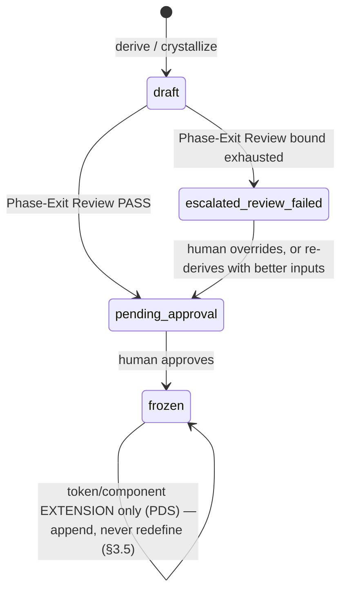

# 17 — Phase 1 Detailed Specification (Brand + Consistency)

> The Phase 1 implementation specification. This document consolidates every technical design decision needed to build Phase 1 (Brand Derivation, Crystallization, Hard Stores, and Phase-Exit Reviews). It pulls from [03](./03-data-model.md), [04](./04-memory-and-consistency.md), [06](./06-workflows.md), [11](./11-guardrails-and-invariants.md), and the `IMPLEMENTATION_PLAN.md`.

---

## 0. Purpose & scope

**Phase 1 proves H4: zero token drift across sections with retained variety.** It establishes state across time: the Brand Foundation (hard, per client) and the Project Design System (hard, per surface).

### What Phase 1 builds
- Atomic, versioned **Hard Stores** (`store.ts`) for persisting Brand and Design Systems safely.
- The **Brand Derivation Pipeline** (`brand.ts`), turning provided givens into a cohesive strategy, verified by a Phase-Exit Review.
- The **Crystallizer** (`crystallizer.ts`), extracting exact tokens and components from an approved hero section into frozen law.
- The **Token-Allowlist Gate**, upgrading the Hard-Constraint Gate to strictly enforce the frozen tokens on all subsequent sections.
- **Multi-Section Orchestration**, injecting the frozen system as hard law and rendering previous sections as visual context.

### What Phase 1 explicitly defers
- The Global Library, retrieval, and write-back (Phase 2).
- Autonomous taste calibration (Phase 3).
- Full production scale and Next.js harness (Phase 4).

### Invariants Phase 1 must enforce
I1 (precedence), I5 (hard stores atomic/versioned/deliberate-events), I13 (no artifact becomes downstream hard input without passing its Phase-Exit Gate).

### 0.1 Phase 1 lifecycle (sequence)

```mermaid
sequenceDiagram
    actor H as Human
    participant O as Orchestrator
    participant B as brand.ts
    participant CR as crystallizer.ts
    participant C as Critic (fresh ctx)
    participant S as store.ts

    H->>O: ade design brand --brand-data ...
    O->>B: deriveBrand(brandData, brief)
    B->>B: palette a11y pre-check (§2.2) — blocks before any LLM spend
    B-->>O: BrandFoundation (draft)
    O->>C: Phase-Exit Review (§2.4)
    alt pass
        C-->>O: reviewed draft, status=pending-approval
    else issues (bounded <=1-2 retries)
        C-->>B: re-derive with issues
        B-->>O: revised draft
    else still failing after bound
        O->>O: status = escalated-review-failed
    end
    O-->>H: present draft
    H->>O: approve
    O->>S: writeBrand (atomic, version++, status=frozen)

    H->>O: ade design section hero
    Note over O: runs the Phase-0 loop (16 sec9), hardBrand as law
    O-->>H: approved hero
    O->>CR: crystallize(hero, brandFoundation)
    CR->>C: PDS Phase-Exit Review (§3.3)
    C-->>CR: pass (or bounded correction)
    CR->>S: writePDS (atomic, version++, status=foundation-frozen)

    H->>O: ade design site (sections 2..N)
    loop each remaining section
        O->>O: assembleBundle(hardBrand, hardSystem, ctxShots of prior sections)
        Note over O: Token-Allowlist Gate (§5) enforces frozen tokens;<br/>escape valve (§3.5) only for genuine gaps, never arbitrary values
    end
    O->>C: Whole-Artifact QA (§6.4) — coherence AND distinctiveness
    O-->>H: assembled artifact
```

### 0.2 Hard-store artifact status (state)



---

## 1. Hard store infrastructure (`store.ts`)

Phase 1 introduces persisted state. Storage must enforce integrity, versioning, and concurrency control to prevent F-STO-01, F-STO-02, and F-STO-03.

### 1.1 Store layout (MVP file-based)

For Phase 1, stores are local JSON files (migrating to a DB in later phases):
```
projects/
└── <client_id>/
    ├── brand.json               # The Brand Foundation
    └── website/                 # Surface directory
        └── system.json          # The Project Design System
```

### 1.2 Generic atomic writer

Every write to a hard store must be atomic (F-STO-01).

```ts
// Generic atomic writer logic (pseudo-code)
function atomicWrite(targetPath: string, data: any): void {
  const tempPath = targetPath + '.tmp-' + uuid();
  fs.writeFileSync(tempPath, JSON.stringify(data, null, 2));
  // On Windows, renameSync fails if target exists, so unlink first (safely)
  if (isWindows && fs.existsSync(targetPath)) {
    // Note: a true atomic replace on Windows requires special handling, 
    // but a fast unlink-then-rename is the MVP standard for this tool.
    fs.unlinkSync(targetPath);
  }
  fs.renameSync(tempPath, targetPath);
}
```

### 1.3 Append-only versioning (I5)

Hard stores are append-only. A file may be overwritten by the atomic writer, but the `version` integer **must always increment**. 
- `BrandFoundation.version` increments on approval or re-derivation.
- `ProjectDesignSystem.version` increments on crystallization and every time a new component is added.

Reads are snapshot-consistent: an Orchestrator loads the file once per run and uses that specific `version`.

### 1.4 Concurrency control & lock

To prevent two concurrent runs for the same client from clobbering the hard stores (F-STO-03):
- **MVP lock**: A simple `.lock` file per `<client_id>` directory.
- `readBrand()` and `writeBrand()` check for lock existence. If locked, fail with a specific "ConcurrencyError" (triggering backoff/retry in the Orchestrator).
- Hard stores change **only** by deliberate events (approval, crystallization), never as a side-effect of a generation loop.

**Gap closed: lock acquisition, release, and staleness.** The original design specified detection (checking for the lock) but never its lifecycle — a process that crashes while holding the lock leaves it in place forever, permanently blocking every future run for that client with no recovery path. This is worse than the race it prevents. The complete lock protocol:
1. **Acquire**: write `.lock` containing `{ pid, acquired_at }` (atomic create — fail if it already exists, matching §1.2's atomic-writer discipline).
2. **Release**: delete `.lock` in a `finally`-equivalent path — on `APPROVED`/`ESCALATED`/`ABORTED`/`ERROR` alike. A lock is released on every terminal state (I10), not just success.
3. **Staleness reclaim**: if `.lock` exists, read its `pid` and `acquired_at`. If the process for `pid` is no longer running (a simple liveness check) **or** `acquired_at` is older than a configured staleness window (e.g. the longest plausible single run — a generous multiple of `maxRunSeconds` from [16 §10.1](./16-phase-0-detailed-specification.md)), the lock is considered **stale**: log it, reclaim it, and proceed. A genuinely-live lock (recent, owning process alive) still fails fast with `ConcurrencyError`, unchanged from above.

---

## 2. Brand establishment pipeline (`brand.ts`)

The Brand Foundation dictates the identity for everything a client ships. It is built in dependency order: human provides givens → AI derives strategy → human approves.

### 2.1 The input (`BrandData`)

The human provides a small `BrandData` JSON file containing only the essential visual givens:
- `client_id`
- `palette`: Array of `{ role, value }` (e.g., `role: "primary", value: "#F00"`)
- `typography`: Array of `{ role, family, fallback }` (e.g., `role: "display", family: "Inter", fallback: "sans-serif"`)
- `logo_ref` (optional)

### 2.2 Palette accessibility pre-check (F-BRD-04)

**Before** any LLM spend, run a deterministic check on the provided `BrandData.palette`:
1. Use WCAG 2.1 contrast formulas.
2. Check primary brand colors against standard backgrounds (white/black).
3. If no accessible pairings exist, **block the derivation**.
4. Emit an error: "The provided palette has no accessible pairings. Adjust BrandData before proceeding."

### 2.3 Brand derivation (The Generator)

```ts
deriveBrand(brandData: BrandData, brief: Brief) -> BrandFoundation (draft)
```
- Passes the validated `BrandData` and the business context (`Brief`) to the LLM.
- The LLM **derives**:
  - `personality`: Array of strings (e.g., `["trust", "legacy", "reliable"]`)
  - `tone`: A voice directive (e.g., "assured, editorial, never urgent")
  - `motion_voice`: Animation style (e.g., "restrained cinematic, no bounce")
  - Palette usage rules (mapping provided colors to specific UI contexts).
- Every element gets a `provenance` tag (`provided` vs `derived`).

### 2.4 The Brand Phase-Exit Review (F-BRD-01)

Before a human sees the draft, it must pass a Phase-Exit Review (I13).
- **Tool**: Reuse `critic.ts` with fresh context.
- **Rubric**: "Does the derived personality, tone, and motion voice fit the business context? Are the decisions logically grounded in the provided palette/type?"
- **Action**: 
  - If PASS → Draft is presented to the human, `status = 'pending-approval'`.
  - If ISSUES → Bounded re-derivation (≤ 1-2 times) passing the Critic's issues back to the Generator. If still failing after the bound is exhausted, **`status = 'escalated-review-failed'`** — a distinct, recorded status (not silently reused `draft` or `pending-approval`), so a human reviewing this artifact later can tell "this passed automated review" from "this is being shown to you *because* automated review couldn't clear it." The human's decision from here is the same as any escalation: approve anyway (with the override logged), request a different `BrandData`/`Brief` input and re-derive, or abandon. This status distinction applies identically to the PDS Phase-Exit Review (§3.3).

### 2.5 Approval & Re-derivation (I5)

- **Approval**: Human reviews the draft. If approved, `status` becomes `frozen`, and it is atomically written to `projects/<client_id>/brand.json`.
- **Re-derivation**: If the human disagrees with a derived element, they **do not hand-patch the file**. They adjust the `BrandData` or `Brief` and trigger `reDerive()`, which bumps the `version` and regenerates the derived fields.

---

## 3. Crystallization (`crystallizer.ts`)

Crystallization is the mechanism that freezes the design primitives into law after Section 1 (the Hero) is approved.

### 3.1 The extraction process

When the human approves the first section, the Orchestrator invokes `crystallizer.ts`:
1. It analyzes the approved hero `.tsx` component and its Tailwind utility classes.
2. It extracts the **Foundation** (tokens):
   - Exact color hex codes used for UI elements.
   - Typography scales and families.
   - Spacing units (e.g., padding/margin scales).
   - Border radii and shadows.
   - Motion (durations, easings).
3. It extracts the **Components**:
   - The anatomy and variants of the specific UI components built in the hero (e.g., `button`, `nav`).

### 3.2 The Project Design System schema

The extracted data forms the `ProjectDesignSystem` (PDS):
- `status`: Transitions from `open` to `foundation-frozen`.
- `tokens`: The frozen foundation.
- `components`: An extensible array of recipes. Each recipe is tagged with `locked_in: "hero"`.

### 3.3 The PDS Phase-Exit Review (F-PDS-01)

Before freezing the PDS, it must pass a Phase-Exit Review (I13).
- **Tool**: Reuse `critic.ts` with fresh context.
- **Context**: The extracted PDS draft, the Brand Foundation, and the approved hero screenshots.
- **Rubric**: "Do the extracted tokens faithfully capture the hero without over-specifying (creating rules too rigid for later sections) or under-specifying (missing core spacing/color rules)?"
- **Action**: Bounded correction loop (≤ 1-2 times). Only a reviewed foundation is frozen. Same status discipline as brand (§2.4): pass → `pending-approval`; bound exhausted → `escalated-review-failed`, recorded distinctly rather than silently treated as a normal pending draft.

### 3.4 Freeze Foundation, Grow Components

The cardinal rule of the PDS:
- After Section 1, the **tokens are law** and never change.
- Later sections may **ADD** new components (e.g., a `card` in Section 2). These are appended to the `components` array and locked from then on.
- A later section may **NEVER** redefine a token or alter an already-locked component.

### 3.5 The token-extension escape valve (closes F-PDS-04)

The rule above has a real hole the original design left silent: **what happens when a later section genuinely needs a token the hero never established** — e.g. Section 4 is a pricing table that needs a semantic `error`/`warning` color the hero's marketing copy never touched? Under the rule as written, the Token-Allowlist Gate ([§5](#5-token-allowlist-gate)) would hard-fail this forever — not a safety feature at that point, a design dead end. This is exactly catalogued failure **F-PDS-04** ("foundation cannot express a later need"), and it must not be left unanswered just because the happy path (component reuse) works.

**The resolution — distinguish "redefine" from "extend":**
- **Redefining** an existing token (changing what `--color-primary` maps to) — **forbidden, always.** This is what "tokens are law" actually protects.
- **Extending** the token set with a genuinely new, additive token that does not touch, alias, or visually collide with anything already frozen (e.g. adding `--color-error` when no error/warning semantic existed before) — **allowed, but gated**, not silently permitted:
  1. The Generator may propose a new token only when the Token-Allowlist Gate rejects a section for a **missing semantic category**, not an arbitrary preference (i.e., the gate's violation message itself is the trigger — this is not a general "add whatever you want" door).
  2. The proposed extension goes through its **own bounded Phase-Exit Review** (reusing the same mechanism as §3.3, a fresh-context Critic check): does this token plausibly derive from the frozen Brand Foundation (`hardBrand`), or is it an arbitrary invention that happens to solve the immediate problem? A proposed "error red" that clashes with the brand's palette family fails this review.
  3. On review pass, the new token is **appended** to `tokens` (never mutating an existing key) and the PDS `version` increments — the same append-only discipline as any other hard-store mutation (I5). It is now frozen too, for every section after it.
  4. On review fail → bounded correction (≤1-2 tries, matching §3.3's cadence) → if still failing, escalate to the human rather than silently blocking the section forever.

**Why this also partially closes F-BRD-05** (incomplete token model — no semantic colors/dark-mode axis in the original palette): the crystallization step ([§3.1](#31-the-extraction-process)) should **reserve** semantic-color slot names (`error`, `success`, `warning`) as recognized categories from the start, even if unpopulated until a section actually needs one — so a later extension has a known place to land rather than being an ad hoc addition each time.

---

## 4. Phase-Exit Reviews

Phase-Exit Reviews represent the expansion of the Critic's role. It is no longer just judging pixel renders; it is validating the strategic artifacts (Brand, PDS) before they become downstream hard inputs.

### 4.1 Mechanism

- It uses the exact same `critic.ts` machinery (fresh context, vision if necessary, structured JSON output).
- It applies a specific **Rubric** depending on the boundary (Brand vs PDS).
- It acts as a **Gate**, not a loop. It permits at most 1 or 2 repair attempts. If the artifact still fails the review, it escalates to the human rather than endlessly looping.

### 4.2 Calibration Data (H8)

The verdict of the Phase-Exit Review (Pass/Fail) and the eventual Human verdict on that same artifact are both logged. This pairs data for the future Phase 3 Taste Calibration.

---

## 5. Token-Allowlist Gate

Once the PDS is `foundation-frozen`, the Guardrail Layer upgrades its enforcement mechanism.

### 5.1 From Tolerance to Strict Enforcement

In Phase 0, the Hard-Constraint Gate used a "sampled-tolerance" color check because no exact design system existed yet.
In Phase 1 (for sections 2+), the **Token-Allowlist Gate** becomes active.

### 5.2 Rules

1. **Tokens**: Parses the candidate `.tsx` output. Any Tailwind utility class related to color, typography size, spacing, radius, or shadow **MUST** map to a token defined in the frozen PDS.
2. **Components**: If the candidate implements a component already in the PDS `components` array, it must adhere strictly to that component's anatomy and variants.
3. **Failure**: Any unauthorized token (e.g., an arbitrary `text-[#123456]` or a non-system spacing `p-[17px]`) triggers a **hard fail**. It is fed back as a "MUST FIX" violation, and the candidate is rejected. **Exception:** if the violation is specifically an unauthorized token in a **semantic category the PDS has no entry for at all** (not an arbitrary off-brand value, but a genuine gap — e.g. no `error` color exists anywhere in the system), this is the trigger condition for the **token-extension escape valve** ([§3.5](#35-the-token-extension-escape-valve-closes-f-pds-04)), not an automatic dead end. A candidate that invents an off-brand value where a real system option *does* exist still hard-fails with no exception.

---

## 6. Multi-Section Orchestration & InputBundle

Phase 1 orchestrates the assembly of a full page (`design site`) by sequencing section generation.

### 6.1 The Expanded InputBundle

The `InputBundle` is now fully populated:
```ts
interface InputBundle {
  brief: Brief;
  brandData?: BrandData; 
  lastFeedback?: string;
  hardBrand?: BrandFoundation;       // Loaded from projects/<client_id>/brand.json
  hardSystem?: ProjectDesignSystem;  // Loaded from projects/<client_id>/website/system.json
  ctxShots?: Screenshot[];           // Screenshots of PREVIOUSLY BUILT sections
}
```

### 6.2 Precedence Enforcement (I1)

The Orchestrator ensures that **hard inputs always override soft inputs**. The Generator prompt explicitly instructs the LLM: 
"The Project Design System (`hardSystem`) and Brand Foundation (`hardBrand`) are absolute laws. The brief (`brief`) is the content requirement. You must obey these above all else."

### 6.3 Sequential Generation & Visual Context

When running `design site`:
1. Generate Section 1 (Hero). Approve. Crystallize.
2. Generate Section 2 (About). The `InputBundle` receives the frozen PDS and the `ctxShots` containing screenshots of the approved Hero.
3. Generate Section 3. The `InputBundle` receives the frozen PDS and `ctxShots` of the Hero and About sections.

Providing `ctxShots` allows the LLM to see the surrounding layout, enabling compositional variety while strict tokens enforce consistency.

### 6.4 Whole-Artifact QA

After all sections are generated, a final cross-section coherence pass is executed. A Critic reviews the fully assembled page screenshots for things **no single-section gate can see**: nav consistency across sections, spacing/rhythm coherence at section boundaries, and jarring transitions — this is what **F-CON-03 (whole-artifact incoherence)** actually names. (Corrected here: an earlier draft of this section described this check as "responsive overflow," which is a different, already-closed, per-section deterministic check — [16 §6.5](./16-phase-0-detailed-specification.md) rule 2 catches horizontal overflow at 375px per section; whole-artifact QA's distinct job is the *cross-section* view a per-section gate structurally cannot have.)

**Gap closed — retained variety has no check at all.** H4's own definition of success is "zero token drift **without** monotony" (§0), but nothing in Phase 1 as originally specified actually *measures* the "without monotony" half — only token compliance is gated (§5); variety is merely asserted as an outcome of showing `ctxShots` to the Generator, never verified (**F-CON-02**). The whole-artifact QA pass should explicitly score this: the Critic's rubric here includes a **distinctiveness-across-sections** dimension — do sections 2+ visibly differ from the hero in layout/composition despite sharing every token, or has the Generator defaulted to reusing the hero's exact structure with new copy? A whole-artifact QA that only checks coherence would silently accept a monotonous, safe result as long as it's *consistent* — which is precisely the failure mode described.

---

## 7. Phase 1 CLI Surface

Phase 1 introduces the CLI tools for managing the lifecycle.

| Command | Action |
|---|---|
| `ade design brand --client <id> --context <brief> --brand-data <data.json>` | Derives the Brand Foundation and presents for approval. On `--approve`, freezes it. |
| `ade design section <name> --client <id>` | Generates a specific section. If it is the first section, triggers crystallization on approval. If subsequent, uses the frozen PDS. |
| `ade design site --client <id> --manifest <manifest.json>` | Orchestrates generation of all sections defined in the manifest sequentially, followed by whole-artifact QA. |

---

## 8. Phase 1 Failure Coverage Map

| Failure | Severity | Closed by |
|---|---|---|
| F-STO-01 (partial/corrupt writes) | High | §1.2 Atomic writer |
| F-STO-02 (destructive overwrites) | High | §1.3 Append-only versioning (I5) |
| F-STO-03 (concurrent clobbering) | High | §1.4 Concurrency lock |
| F-BRD-01 (off-brief brand strategy) | High | §2.4 Brand Phase-Exit Review |
| F-BRD-02 (stale rationale / hand-patching) | Med | §2.5 Re-derivation rule |
| F-BRD-03 (brand too vague to constrain) | Med | **Partial gap:** the Phase-Exit Review rubric (§2.4) checks off-brief fit, not vagueness/under-specification directly — extend the rubric to also ask "is this specific enough to actually constrain a later design decision, or would it equally justify any output?" |
| F-BRD-04 (inaccessible brand palette) | High | §2.2 Palette accessibility pre-check |
| F-BRD-05 (incomplete token model — no semantic colors/dark-mode axis) | Med | §3.5's semantic-color-slot reservation (partial — dark-mode/theming axis remains an open gap beyond Phase 1's scope) |
| F-PDS-01 (over/under-specified PDS) | High | §3.3 PDS Phase-Exit Review |
| F-PDS-02 (token contradiction by later section) | High | §5 Token-Allowlist Gate (present in the design, previously missing from this table) |
| F-PDS-03 (component-layer bloat/duplicates) | Low | **Gap, not addressed:** nothing in §3.1/§3.4 checks the extensible `components` array for near-duplicate recipes (e.g. two visually-identical `card` variants added independently). Accepted gap for Phase 1 — revisit if the array grows unmanageable in practice. |
| F-PDS-04 (foundation cannot express a later need) | Med | §3.5 Token-extension escape valve (previously unaddressed — the original "never redefine or alter" rule had no path for a legitimate new need) |
| F-CON-01 (token drift across sections) | High | §5 Token-Allowlist Gate |
| F-CON-02 (monotony / no variation) | Med | §6.4's distinctiveness-across-sections check (previously unaddressed — only token compliance was gated, variety was asserted, never measured) |
| F-CON-03 (whole-artifact incoherence) | Med | §6.4 Whole-Artifact QA (description corrected — see §6.4's note) |
| F-SPEC-03 (hard/soft conflation) | High | §6.2 Precedence Enforcement (I1) |

---

## Revision history

- **v0.1 (initial):** the design as first written.
- **v0.2 (review + fix pass):** three real gaps closed, not just documented:
  1. **§1.4** — the lock had detection but no lifecycle: no release semantics and no staleness recovery, meaning a crashed run would permanently deadlock all future work for that client. Added explicit acquire/release/staleness-reclaim protocol.
  2. **§3.5 (new)** — **F-PDS-04** (foundation cannot express a later need) was entirely unaddressed; the "tokens are law, never redefine" rule had no answer for a later section's *genuine* new requirement (e.g. a semantic error color the hero never used), which would otherwise make the Token-Allowlist Gate a permanent dead end rather than a safety net. Added a gated token-extension mechanism (redefine forbidden, additive extension allowed only via its own bounded Phase-Exit Review) — also partially closes F-BRD-05 by reserving semantic-color slot names during crystallization.
  3. **§2.4/§3.3** — Phase-Exit Review escalation had no distinct recorded status; a human couldn't tell "passed automated review" from "shown to you because automated review failed" from the artifact's state alone. Added `escalated-review-failed` as its own status, distinct from `draft`/`pending-approval`/`frozen`.
  - Also fixed: §6.4 described its check as "responsive overflow" when F-CON-03 actually means whole-artifact incoherence (a different, already-closed, per-section check) — corrected the description; added an explicit distinctiveness-across-sections check since F-CON-02 (monotony) had no mechanism at all, only an assertion that `ctxShots` would produce variety. Coverage map gained F-PDS-02/03, F-BRD-03/05, F-CON-02, previously present in the design's own body text or entirely absent. Added a lifecycle sequence diagram (§0.1) and a hard-store status state diagram (§0.2).
