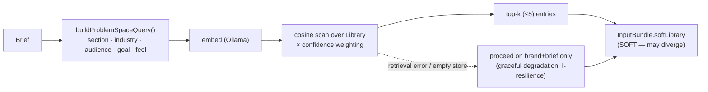
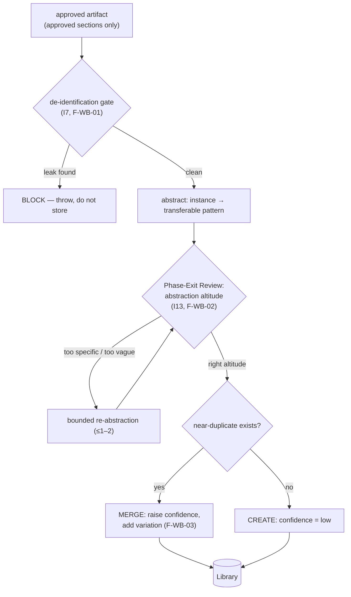

# 36 — Phase 2 Detailed Specification (Memory / Library)

> The Phase 2 implementation specification. It consolidates every technical design decision needed to build Phase 2 (the soft **Global Library**: retrieval, write-back, de-identification, confidence weighting, and the abstraction-altitude Phase-Exit Review). It pulls from [03 §2](./03-data-model.md), [04 §5–6](./04-memory-and-consistency.md), [11 §2.3, §4](./11-guardrails-and-invariants.md), the `IMPLEMENTATION_PLAN.md` Phase 2 section, and [15 §3.3](./15-execution-roadmap.md).
>
> **Numbering note.** Detailed phase specs are [16](./16-phase-0-detailed-specification.md) (Phase 0) and [17](./17-phase-1-detailed-specification.md) (Phase 1); docs 18–35 were taken by the R-series research specs, so this Phase 2 detailed spec continues at the next free number (36). It is the direct sibling of 16 and 17, not part of the R-series.

---

## 0. Purpose & scope

**Phase 2 proves H6: the Library makes project N+1 measurably better/faster than project N — compounding, not just accumulating.** Everything here exists to make "gets smarter over time" real and *falsifiable*, not asserted.

### What Phase 2 builds
- A **local embedding provider** (`embeddings.ts`) that stays key-free per the access model.
- The soft **Global Library** (`library.ts`): a flat-file cosine vector store of de-identified, confidence-weighted design knowledge.
- **Retrieval**: brief → problem-space query → nearest-neighbour → top-k **soft** entries into the input bundle.
- **Write-back** (`writeback.ts`): approved artifact → de-identification gate → abstraction → **Phase-Exit Review of abstraction altitude** → dedup/merge or create.
- **Loop wiring**: `assembleInputBundle` now includes `softLibrary`, with **graceful degradation** if retrieval is unavailable.
- The **H6 A/B experiment** harness (Library-on vs Library-off on matched briefs).

### What Phase 2 explicitly defers
| Deferred | Arrives in | Why |
|---|---|---|
| `pgvector` / real ANN index | Phase 4 (scale) | flat-file cosine is sufficient at solo project volume; O(n) scan is fine for hundreds of entries |
| A learned reward/preference model | Phase 3 (R4) | Phase 2 accumulates the verdict data; it does not train on it |
| Cross-domain / serendipitous retrieval (R11) | later | Phase 2 does same-domain retrieval; the novelty-suppression fix (F-MEM-09) is a named research bet, not a Phase-2 gate |
| Constitution-grounded retrieval scoring (R3) | Phase 3 | ranking here is similarity × confidence, not constitution-aware |

### Invariants Phase 2 must enforce
- **I7** — the Library is written **only** from approved artifacts, and **only** through the de-identification gate.
- **I8** — references remain soft, capped at ≤5, and are **never** scored for resemblance (unchanged from Phase 0/1; restated because the Library is a *second* soft source now and must obey the same non-resemblance rule).
- **I13** — no Library entry becomes retrievable without passing its Phase-Exit Gate (de-identification ∧ abstraction-altitude review).
- **Graceful degradation** ([11 §4](./11-guardrails-and-invariants.md)) — if retrieval fails or the store is empty/unavailable, the run **proceeds on brand + brief alone**, never blocks.

### ⚠ Reality check against the existing Phase-2 code
Phase-2 code already exists in this repo (`src/library.ts`, `src/writeback.ts`, `src/embeddings.ts`). Two divergences from this spec's design must be reconciled **before** trusting an H6 result — both are called out inline below and summarized here so they aren't missed:
1. **The abstraction-altitude Phase-Exit Review (F-WB-02, I13) is NOT implemented.** `writeBackArtifact` currently goes de-id → schema-validate → embed → upsert, with **no Critic review of abstraction altitude** (§6.3). This is a required Phase-2 gate that is missing.
2. **The default embedding is a deterministic *hash* embedding, not a semantic one** (`createLocalHashEmbeddingProvider`). Hash embeddings give reproducibility but **near-zero semantic retrieval quality** — two briefs about "trust-led real estate" and "trustworthy financial advisor" will not be neighbours unless they share literal tokens. An H6 test run on hash embeddings would likely **falsely reject H6** (retrieval returns noise → Library-on looks no better than off). The real semantic embedding path (Ollama, §1) must be the one used for any H6 measurement (§9).

---

## 1. Embedding provider (`embeddings.ts`)

Retrieval quality is bounded by embedding quality. This is the load-bearing dependency of Phase 2, the way the provider spike was for Phase 0.

### 1.1 The access-model collision (decided)
Anthropic has **no first-party embeddings API**, and the Pro Agent-SDK credit does **not** cover paid third-party embeddings (Voyage/OpenAI). To stay key-free (the non-negotiable dev rule — never set `ANTHROPIC_API_KEY`), Phase 2 **extends the `local` provider with a local embedding model** (e.g. a `nomic-embed`-class model via Ollama). A paid embeddings API is explicitly the **prod-only** alternative and would break the no-key dev stance.

### 1.2 The interface
```ts
export interface EmbeddingResult { vector: number[]; modelId: string; }
export interface EmbeddingProvider {
  readonly id: string;              // pinned embedding model id — stored on every entry (F-MEM-03)
  embed(text: string): Promise<EmbeddingResult>;
}
export function getEmbeddingProvider(cfg: Config): EmbeddingProvider;
```

### 1.3 The two adapters
| Adapter | What | When |
|---|---|---|
| **Ollama embedding** (`ADE_EMBEDDING_PROVIDER=ollama`) | POSTs to a local Ollama embedding model | **the real path** — use for any H6 measurement |
| **Local hash embedding** (default in code today) | deterministic hash → vector | **placeholder only** — reproducible but semantically blind; acceptable for wiring/unit tests, **not** for H6 |

> **This spec's requirement:** the hash embedding is fine as a fallback for tests and offline development, but **must not be the provider used to evaluate H6** (§0 reality-check #2). The H6 experiment (§9) must run on the Ollama semantic path, or its result is meaningless.

### 1.4 Embedding drift (F-MEM-03)
The embedding model id is **stored on every entry** (`entry.embedding.model_id`). If the embedding model changes, all stored vectors are in a different space and cosine similarity across models is meaningless. Rule: **on an embedding-model change, re-embed the whole Library** (a one-shot migration), and never mix vectors from two model ids in one similarity computation. Retrieval must skip (or re-embed) any entry whose `model_id` differs from the current provider's `id`.

---

## 2. LibraryEntry data model (embed-vs-payload split)

The single most important schema rule of Phase 2: an entry has an **embedded problem-space** (what it's *retrieved by*) and a **payload** (what's *returned on a hit*). Mixing them (F-MEM-04) poisons retrieval — you'd match on implementation detail instead of problem fit.

### 2.1 The split ([03 §2](./03-data-model.md), matches the implemented `LibraryEntrySchema`)
```ts
interface LibraryEntry {
  id: string;
  type: 'principle' | 'pattern' | 'component-recipe' | 'anti-pattern';
  title: string;

  // ── EMBEDDED problem-space (what retrieval matches against) ──
  intent: string;                    // "Solve a hero problem for B2B services where the goal is lead-gen"
  context_fit: {
    domain: string; audience: string; personality: string[]; goal: string; feel: string[];
  };

  // ── PAYLOAD (returned on a hit; reusable craft knowledge, NOT matched on) ──
  construction: string[];            // how to build it
  rationale: string[];               // why it works
  pairs_with: string[];
  avoid: string[];
  recipe_values?: Record<string,string>;
  provenance: string[];              // project hashes, NEVER client-identifying
  outcome: { human_verdict: string; confidence: number; times_used: number };
  tags: string[];
  created_at: string; updated_at: string;

  // ── Vector record (stored, NEVER placed in a prompt) ──
  embedding: { model_id: string; text: string; vector: number[] };
}
```

### 2.2 The rule
- **Embed only** `intent` + `context_fit` fields (the *problem*), via `buildEmbeddingText()`. This is what makes retrieval match "same kind of problem," not "same colors."
- **The `embedding.vector` is never a prompt input** — it's a storage/search artifact only. Placing it in a prompt is an F-MEM-04 violation.
- **The payload is never embedded** — construction/rationale/recipe are returned *after* a match, not searched on.

---

## 3. Library store (`library.ts`)

### 3.1 Format: flat-file JSONL
The Library is `library/entries.jsonl` — one `LibraryEntry` per line, mirroring the trace's JSONL discipline (atomic append, crash-survivable, streamable). Writes use a temp-file + atomic-rename (Windows-safe unlink-then-rename), matching [17 §1.2](./17-phase-1-detailed-specification.md).

### 3.2 Why flat-file, not a DB (and when that breaks — F-MEM-08)
A flat-file cosine scan is **O(n)** per query. At solo project volume (hundreds of entries) this is imperceptible and radically simpler than standing up `pgvector`. **This is a deliberate scope decision, not an oversight** — but it has a known ceiling: the scan cost grows linearly, and there's no ANN index. The migration trigger to `pgvector` (Phase 4) is explicit: **when the entry count makes per-query latency a felt cost in a real run** (track it; don't guess). Until then, flat-file is correct.

### 3.3 Retrieval scoring
```
score(entry) = cosineSimilarity(query, entry.embedding.vector) × (0.7 + confidence × 0.3)
```
- Ranks by **similarity × confidence** — validated knowledge surfaces, unproven guesses sink ([04 §6](./04-memory-and-consistency.md)).
- Returns **top-k (k ≤ 5)** soft entries.
- **Determinism (F-MEM-08):** the scan + sort is deterministic *given a fixed store and a fixed embedding model*. The nondeterminism to guard against is the store *changing between runs* — which is exactly why the H6 A/B (§9) must freeze the Library snapshot for the duration of a matched-pair comparison.

---

## 4. Retrieval pipeline (into the loop)



### 4.1 Assembly & precedence (I1, I6)
`softLibrary` enters the bundle at **rank 5** of the conflict precedence ([04 §7](./04-memory-and-consistency.md)) — below the floor, brand, PDS, and brief; above references. The Generator prompt must label these entries **soft direction**, explicitly synthesizable-and-divergable, never law (F-MEM-06 — soft obeyed as hard). This is the same authority-tagging discipline the brief/brand already use; the Library does not get a new mechanism, it gets a label at rank 5.

### 4.2 Graceful degradation (F-MEM-05, F-MEM-07)
Retrieval is wrapped so that **any** failure — empty store (cold start), embedding-provider down, malformed entries — logs a warning and returns `[]`, and the run continues on brand + brief. A missing Library never blocks a run. (The existing `retrieveLibraryForBrief` already does this; keep it.)

### 4.3 Same-domain novelty suppression (F-MEM-09) — acknowledged, not closed here
Pure brief-similarity retrieval biases toward the category mean (a fintech gets fintech patterns), which is the *opposite* of the differentiation the system wants. This is real and **left open in Phase 2 on purpose** — the fix (deliberate cross-domain retrieval) is research bet R11, not a Phase-2 gate. Phase 2 must **log** when all top-k hits share the brief's domain, so the suppression is visible in the trace rather than silent — a cheap instrument that makes R11 measurable later.

---

## 5. Write-back pipeline (`writeback.ts`) — the gate sequence

Write-back is the **only** path that grows the Library, and it runs **only** on approved artifacts (I7). The full required sequence:



### 5.1 De-identification gate (I7, F-WB-01) — **implemented**
The gate builds a forbidden-set from the artifact's `client_id`/`artifact_id`, every brief's `client` + literal copy (headline/subhead/body/cta/tags/nav), the brand palette hex values, and the PDS color tokens — then blocks if **any** forbidden value (length ≥ 3) appears anywhere in the candidate entry. On a hit it **throws** (does not silently drop) so the leak is loud. This matches the implemented `deidentificationGate` and is correct as-is.

### 5.2 Confidentiality / strategy leak (F-WB-06) — **strengthen the gate**
The current gate catches *literal* identifiers (names, exact tokens, copy). It does **not** catch a pattern abstracted so thinly that it re-identifies a client by *strategy* (e.g. "a real-estate hero that leads with a multi-generational family legacy angle and a warm-neutral editorial palette" is Burkes to anyone who's seen it, even with the name stripped). Phase 2 requirement: the de-id gate's forbidden-set is necessary but **not sufficient**; the abstraction-altitude review (§6.3) must **also** reject entries specific enough to re-identify a source client. This is why §6.3 is not optional.

### 5.3 De-id gate is also an injection defense (F-SEC-02)
The Library is now a **second untrusted retrieval source** (alongside references). An adversarial or accidentally-instruction-shaped entry retrieved into the bundle could try to override hard rules. Two defenses, both required: (a) retrieved Library content is inserted as clearly-delimited **data, never instructions** (same I9 discipline as the brief), and hard constraints survive it; (b) write-back screens entries so instruction-shaped text can't be stored in the first place. Retrieved entries can **never** override the floor/brand/PDS/brief — enforced by precedence (§4.1), not by trust.

---

## 6. The abstraction-altitude Phase-Exit Review (I13, F-WB-02) — **the missing gate**

> **This gate is specified here and is NOT in the current code** (§0 reality-check #1). It is a required Phase-2 deliverable, not optional polish.

### 6.1 Why it's mandatory
The hardest part of write-back is choosing the *altitude* of the lesson. Too specific → it never transfers (a "Burkes hero recipe" helps no future client). Too vague → it never helps ("use good hierarchy"). A Library full of mis-abstracted entries doesn't just fail to compound — it actively pollutes retrieval and can **falsify H6 for the wrong reason** (F-WB-02, F-WB-04, F-WB-05). Both failure directions are invisible to the de-id gate, which only checks for literal leaks.

### 6.2 Mechanism (reuse `critic.ts`, exactly as Phase 1's Phase-Exit Reviews do)
Identical machinery to the Brand and PDS reviews ([17 §4](./17-phase-1-detailed-specification.md)): a **fresh-context Critic** (I2), a per-boundary **rubric**, acting as a **bounded gate** (≤1–2 correction cycles, then escalate), not a loop.
- **Rubric:** *"Is this lesson at a transferable altitude — a reusable pattern that would help a **different** client with a similar problem, without being either a one-off instance tied to its source or an empty generality? Could a reader re-identify the source client from its strategy (F-WB-06)?"*
- **Fail → bounded re-abstraction:** the Critic's issue (too specific / too vague / re-identifiable) is passed back for one, at most two, re-distillation attempts. Still failing → the entry is **not stored** and the case is logged (not silently dropped).
- Both the review verdict and the eventual human verdict on the entry's *usefulness* (when it later gets retrieved and its output approved/rejected) are **recorded**, feeding Phase 3 calibration (H8) — the same dual-logging as Phase 1's reviews.

### 6.3 Placement in the sequence
De-identification (§5.1) runs **first** (cheap, deterministic, catches literal leaks), then abstraction, then **this review** (model call, catches altitude + strategic re-identification), then dedup/merge. Order matters: never spend a Critic call reviewing an entry that a free deterministic gate would have blocked.

---

## 7. Confidence weighting, dedup & decay

### 7.1 Confidence lifecycle (F-WB-04, F-WB-05)
- New entry from one project → **`confidence: low`** (~0.2) — a hypothesis, not a fact.
- Corroboration (a near-duplicate arrives from a *different* project) → **merge**, raise confidence, add the variation.
- Positive human verdicts on outputs that *used* the entry → confidence rises. Rejections → confidence falls; a persistently-bad entry is down-weighted or deleted (prevents bad-pattern enshrinement, F-WB-04).
- **This is where human taste accretes into the system** — the whole point of "gets smarter."

### 7.2 Dedup (F-WB-03)
On write-back, if an entry with the same `id` (derived from section-name + goal + domain) exists, **merge** rather than duplicate: union the construction/rationale/pairs_with/avoid/provenance/tags, take the max-plus-increment confidence, bump `times_used`. (Matches the implemented `mergeLibraryEntries`.) The known weakness: id-based dedup misses *semantically* duplicate entries with different ids — an accepted Phase-2 limitation; log suspected semantic duplicates (high mutual cosine similarity among stored entries) for periodic manual review rather than auto-merging (a false-merge is worse than a duplicate).

### 7.3 Decay & the "approved-then-reconsidered" problem (F-WB-07)
An artifact approved today, regretted later, has *already* taught the Library. Phase 2 requirement: entries carry `provenance` project refs, so if a source project is later marked bad, its contributed entries can be **found and down-weighted**. Confidence also **decays with disuse/age** so stale entries sink without manual pruning ([04 §6](./04-memory-and-consistency.md)) — implement decay as a read-time adjustment (age-discount the stored confidence at retrieval), not a destructive rewrite, so the audit trail is preserved.

---

## 8. CLI surface (Phase 2 additions)

| Command | Action |
|---|---|
| `ade learn --out <run-dir> [--verdict <text>]` | Run write-back on an approved artifact: de-id → abstract → altitude review → dedup/store. |
| `ade library search <query>` | Debug/inspect: show top-k retrieved entries + scores for a query string. |
| `ade library stats` | Entry count, confidence distribution, domain spread (surfaces monoculture, F-WB-05). |
| `ade generate … ` (extended) | Now retrieves `softLibrary` into the bundle automatically; `--no-library` forces Library-off (for the H6 A/B, §9). |

---

## 9. The H6 experiment (the whole point of Phase 2)

H6 is **calendar-bound, not build-bound** ([15 §3.3, §9.4](./15-execution-roadmap.md)): building the Library is ~weeks; *proving it compounds* needs real accumulated projects. The experiment:

### 9.1 Protocol
1. Seed the Library by running write-back on the Phase-0/1 approved artifacts.
2. **Freeze a Library snapshot** (so the store doesn't change mid-comparison — F-MEM-08 determinism).
3. Take a matched brief (ideally a genuinely new project, or a deliberately synthetic one — §9.3) and run it **twice**: `--no-library` (off) vs. Library-on, everything else identical.
4. Compare via `ade report`: iteration-to-approval count, iter-0 score, final score, tokens — and a **blind human preference** on the two finals (the same blind-verdict discipline as H1; never trust the Critic's own scores alone, F-SPEC-05, I12).

### 9.2 Decisive metric (F-LRN-01)
Library-on is **measurably better or faster** than Library-off — higher human-preferred rate on finals, or fewer iterations to the same quality — on **actual observed** numbers, across enough matched pairs to not be a single-pair fluke. One pair is a pilot, not a verdict.

### 9.3 The solo-volume caveat (F-LRN-01, honest)
A solo developer may never reach the *real* project volume where compounding shows. The lever actually under your control is **synthetic briefs**: deliberately run many varied briefs through the pipeline to populate the Library and generate matched pairs, rather than waiting for real clients. If H6 can't be shown even with synthetic volume, Phase 2's central premise is unfalsifiable *for this scale* — route around it rather than grinding ([15 §9.4](./15-execution-roadmap.md)).

### 9.4 Embedding-quality precondition (repeat of §0 #2)
**Run H6 on the Ollama semantic embedding path, not the hash placeholder.** Hash embeddings would make retrieval return near-noise, which would falsely reject H6. This precondition is not optional.

---

## 10. Phase 2 failure coverage map

### Memory & retrieval
| Failure | Severity | Closed by |
|---|---|---|
| F-MEM-01 (retrieval miss) | Med | §2 embed-vs-payload split + §4 problem-space query |
| F-MEM-02 (retrieval pollution) | Med | §2.2 embed only problem-space; §7.1 confidence weighting sinks bad entries |
| F-MEM-03 (embedding drift) | Med | §1.4 stored model_id + re-embed-on-change |
| F-MEM-04 (embed-vs-payload violation) | Med | §2 the split is the core schema rule |
| F-MEM-05 (cold-start blocks generation) | Low | §4.2 graceful degradation — empty store → brand+brief |
| F-MEM-06 (soft obeyed as hard) | Med | §4.1 rank-5 precedence + soft labeling |
| F-MEM-07 (vector store unavailable) | Med | §4.2 graceful degradation |
| F-MEM-08 (nondeterminism / flat-file scaling) | Med | §3.2 deterministic scan + migration trigger; §9.1 frozen snapshot for H6 |
| F-MEM-09 (same-domain suppresses novelty) | Med | §4.3 **logged, not closed** — deferred to R11 (explicit) |

### Library write-back & learning
| Failure | Severity | Closed by |
|---|---|---|
| F-WB-01 (de-identification leak) | High | §5.1 de-id gate (implemented) |
| F-WB-02 (over/under-abstraction) | Med | §6 abstraction-altitude Phase-Exit Review — **gap in current code, required here** |
| F-WB-03 (dedup failure) | Med | §7.2 id-based merge; semantic-dup logging |
| F-WB-04 (bad-pattern enshrinement) | High | §7.1 confidence decay on rejection |
| F-WB-05 (poisoning / monoculture) | Med | §7.1 confidence weighting + §8 `library stats` domain-spread visibility |
| F-WB-06 (confidentiality / strategy leak via patterns) | High | §5.2 + §6.2 re-identification check in the altitude review |
| F-WB-07 (approved-then-reconsidered already taught) | Med | §7.3 provenance-linked down-weighting + decay |
| F-LRN-01 (no compounding — H6 fails) | High | §9 the H6 experiment IS the test of this |
| F-LRN-02 (calibration non-transfer across domains) | Med | logged via `library stats` domain spread; full treatment is Phase 3 |

### Security (Library as a new attack surface)
| Failure | Severity | Closed by |
|---|---|---|
| F-SEC-02 (indirect prompt injection via retrieved memory) | High | §5.3 retrieved-as-data + precedence + write-back screening (partial — full depth is Phase 4) |

---

## 11. Phase 2 done-criteria (gate to Phase 3)

1. **Embedding path real:** the Ollama semantic embedding provider works key-free; the hash placeholder is confined to tests (§1, §9.4).
2. **Round-trip works:** a seeded entry embeds → stores → is retrieved by a matching brief's problem-space query (§4).
3. **De-id gate blocks leaks:** an adversarial write-back (client name / exact tokens / literal copy) is thrown, not stored (§5.1).
4. **Abstraction-altitude review works:** a too-specific and a too-vague entry are each caught and returned for bounded re-abstraction before insert; a re-identifiable-by-strategy entry is rejected (§6) — **this closes the current code gap.**
5. **Graceful degradation:** a run with the Library killed mid-run still completes on brand + brief alone (§4.2).
6. **H6 measured on observed numbers:** across enough matched pairs, Library-on is measurably better/faster than Library-off on **human-anchored** metrics, run on the semantic embedding path (§9). A negative result is a valid, logged outcome — do not force H6.

### Decision rule
```
H6 passes → PROCEED to Phase 3 (Taste / calibration).
H6 fails on hash embeddings → NOT a valid rejection — re-run on the Ollama path first (§9.4).
H6 fails on the semantic path across real+synthetic volume → the compounding thesis
    doesn't hold at this scale. Curate/shrink or defer the Library; route around Phase 2's
    premise per [15 §9.4] rather than grinding. This is a legitimate, non-failure outcome.
```

---

## Cross-references
| This document | Canonical source |
|---|---|
| Two-memory model, retrieval, write-back | [04 §1, §5, §6](./04-memory-and-consistency.md) |
| LibraryEntry schema, embed-vs-payload | [03 §2](./03-data-model.md) |
| De-identification gate (I7), Phase-Exit Review (I13) | [11 §2.3](./11-guardrails-and-invariants.md) |
| Graceful degradation (resilience) | [11 §4](./11-guardrails-and-invariants.md) |
| Conflict precedence (I1) | [04 §7](./04-memory-and-consistency.md) |
| Phase 2 build sequence + H6 timing | [15 §3.3](./15-execution-roadmap.md), `IMPLEMENTATION_PLAN.md` Phase 2 |
| Phase-Exit Review pattern (reused from Phase 1) | [17 §4](./17-phase-1-detailed-specification.md) |
| Full failure catalogue | [10c](./10c-failures-memory-and-learning.md), [10e](./10e-failures-security-legal-and-production.md) |

---

## Revision history
- **v0.1 (initial):** the Phase 2 detailed specification, consolidating the memory/Library design (04, 03 §2, 11) into a buildable phase spec matching the depth of [16](./16-phase-0-detailed-specification.md) and [17](./17-phase-1-detailed-specification.md). Grounded against the existing `library.ts`/`writeback.ts`/`embeddings.ts` code and flagged two divergences that must be reconciled before an H6 result is trusted: (1) the abstraction-altitude Phase-Exit Review (F-WB-02, I13) is specified in §6 but **not implemented** in the current write-back path; (2) the default hash embedding is semantically blind and must not be the provider used to evaluate H6 (§9.4). No code written — R&D/spec work only.
