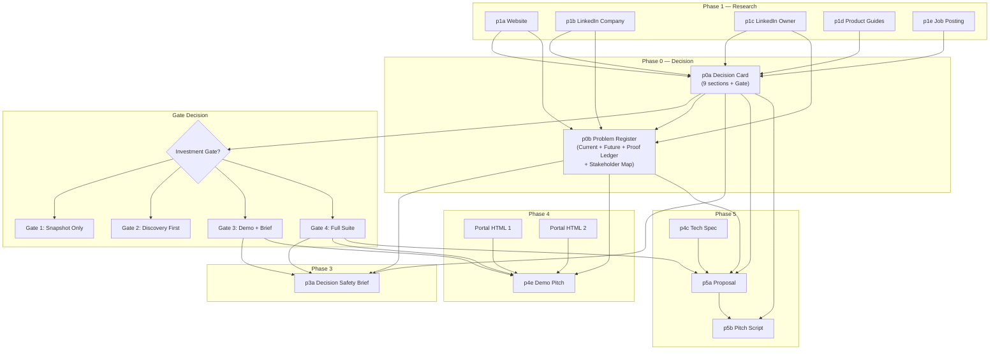

# Decision-Led Proof Pipeline — Full Workflow README

> How the Dev8X TreeRaise sales pipeline works after the Decision-Led Proof Perspective v2 integration is complete.

---

## Table of Contents

1. [What Changed and Why](#1-what-changed-and-why)
2. [Pipeline Overview — The 6 Phases](#2-pipeline-overview--the-6-phases)
3. [Phase 0 — Decision Card & Problem Register](#3-phase-0--decision-card--problem-register)
4. [The Investment Gate System](#4-the-investment-gate-system)
5. [Phase 1 — Research (Unchanged)](#5-phase-1--research)
6. [Phase 3 — Decision Safety Brief](#6-phase-3--decision-safety-brief)
7. [Phase 4 — Demo Pitch (Belief Order)](#7-phase-4--demo-pitch)
8. [Phase 5 — Proposal & Pitch Script](#8-phase-5--proposal--pitch-script)
9. [ROI Integrity Enforcement](#9-roi-integrity-enforcement)
10. [Data Flow Diagram](#10-data-flow-diagram)
11. [Step-by-Step Execution for Any Prospect](#11-step-by-step-execution)
12. [Six Anti-Failure Rules](#12-six-anti-failure-rules)
13. [Post-Deal (Deferred to Part 2)](#13-post-deal)

---

## 1. What Changed and Why

The old pipeline had three failure modes:

| Failure | Old Behaviour | New Behaviour |
|---------|--------------|---------------|
| **Wrong priority anchor** | Pitch led with the seller's strongest angle | Pitch leads with the buyer's scored #1 goal |
| **Unproven claims** | Metrics were "conservative estimates" | Every metric is classified L1–L4; only L1/L2 reach headlines |
| **Demo disconnected from research** | Feature tour with loose pain-point references | Every demo screen must map to a Proof Ledger entry |

The core shift:

```
Old question:  "What is our strongest narrative angle?"
New question:  "What does this buyer need to believe, see, and trust to say yes?"
```

The implementation adds a **mandatory Phase 0** before any deliverable is built, upgrades Phases 3–5 with proof-based enforcement, and introduces the **Investment Gate** system that controls how much work is appropriate per prospect.

---

## 2. Pipeline Overview — The 6 Phases

```
PHASE 0 — Decision Card   Research → Decision Card + Problem Register → Gate assessment
PHASE 1 — Research        Raw data → clean context files
PHASE 2 — Outreach        Context → LinkedIn warming plan
PHASE 3 — First Touch     Decision Card + Research → Decision Safety Brief
PHASE 4 — Demo & Scoping  Problem Register + Portals → Demo pitch script
PHASE 5 — Proposal        Decision Card + Problem Register + Tech Spec → Full proposal suite
```

### Phase Dependency Chain

```
Phase 0        Phase 1        Phase 2       Phase 3          Phase 4               Phase 5
──────────     ──────────     ──────────    ────────────     ──────────────────    ────────────────
p0a_ Card  →  p1_ files  →  p2_ Warming   p3_ Decision     p4a_ Ops Manual       p5a_ Proposal
p0b_ Reg       (parallel)    (parallel)    Safety Brief     p4b_ Report      →   p5b_ Pitch Script
 ↓                                        (if Gate 3+)      p4c_ Tech Spec        p5c_ Blueprint
 feeds all                                                   p4d_ Portals
 phases 3-5                                                  p4e_ Demo Pitch
```

> [!IMPORTANT]
> Phase 0 runs **after** Phase 1 research files exist but **before** any Phase 3/4/5 work begins. The Decision Card is the mandatory input to every downstream deliverable.

---

## 3. Phase 0 — Decision Card & Problem Register

Phase 0 is the single biggest change. It produces two documents that every downstream prompt reads before generating content.

### Step 0A — Decision Card (`p0a_Decision_Card.md`)

The Decision Card is a 9-section analysis built from all research files. It answers: *"Is this prospect ready for a full build, and what must be proven?"*

**The 9 Sections:**

| # | Section | What It Produces |
|---|---------|-----------------|
| 1 | **Desired Outcome — Scored Goal Table** | Every detected goal scored across 5 dimensions (Source Weight 25%, Frequency 15%, Recency 20%, Specificity 20%, Buying Relevance 20%). Ranked table, not a single winner. |
| 2 | **Buying Reason** | Why they would approve a purchase *right now* — distinct from Desired Outcome |
| 3 | **Current Bottleneck** | ONE specific operational bottleneck in plain language, traceable to research |
| 4 | **Buyer Confirmation Status** | Every claim tagged: Confirmed / Partially confirmed / Hypothesis only |
| 5 | **Decision Risk** | What could stop the buyer even after a strong demo |
| 6 | **Adoption Risk** | Team tech maturity, process change magnitude, training requirement — each rated High/Med/Low |
| 7 | **Required Proof Table** | Every claim mapped to: doubt → proof needed → demo screen → confidence level. Also produces the **Opening Screen**, **Ordered Proof Route**, and **Fallback Opening Screen** |
| 8 | **ROI Integrity Ladder** | Every metric classified L1 (Sourced) / L2 (Estimated) / L3 (Proxy) / L4 (Excluded) |
| 9 | **Delivery Confidence** | Product fit, delivery realism, adoption readiness, stakeholder alignment — each rated |

**Output:** The final section is the **Investment Gate Assessment** — Gate 1, 2, 3, or 4 — which controls what gets built next.

### Step 0B — Problem Register (`p0b_Problem_Register.md`)

Reads the completed Decision Card plus research files. Produces **five outputs** in one document:

| Output | Purpose |
|--------|---------|
| **Current Problem Register** | 4–8 operational problems, each traced to research, with role who feels it, what it blocks, and whether the demo can prove it |
| **Manual Operations Mapping** | For every provable problem: manual operation → why it blocks the goal → solution response → demo screen |
| **Future Problem Register** | 3+ problems that hit in 12–24 months if nothing changes, each with a leading indicator and quotable preventive narrative |
| **Proof Ledger** | Master record: Claim → Evidence → Proof Condition → Proof Location → Remaining Doubt → Backup Language |
| **Stakeholder Decision Map** | Every person who can approve, block, or influence — with what they want, fear, and their likely support level |

> [!NOTE]
> Problems without a demo proof screen are NOT deleted — they become **discovery questions** that gather stronger evidence for future deliverables.

---

## 4. The Investment Gate System

The Gate determines how much to build before the buyer has confirmed intent. It is the output of the Decision Card.

```
┌─────────────────────────────────────────────────────────────────────────┐
│                        INVESTMENT GATE DECISION                        │
├──────────┬──────────────────────────────┬──────────────────────────────┤
│  Gate 1  │  Snapshot Only               │  Confirmation = Hypothesis   │
│          │  24-hr snapshot + discovery   │  No demo. No report.         │
│          │  ask only                     │  No proposal.                │
├──────────┼──────────────────────────────┼──────────────────────────────┤
│  Gate 2  │  Discovery First             │  Outcome partially clear,    │
│          │  Decision Card + discovery    │  bottleneck visible, but     │
│          │  questions only               │  stakeholders unknown        │
├──────────┼──────────────────────────────┼──────────────────────────────┤
│  Gate 3  │  Demo + Decision Safety Brief│  Outcome clear, bottleneck   │
│          │  Proceed to p0b → p3a → p4e  │  concrete, proof screens     │
│          │                              │  exist                       │
├──────────┼──────────────────────────────┼──────────────────────────────┤
│  Gate 4  │  Full Proposal Suite         │  Buying reason confirmed,    │
│          │  Proceed to full Phase 3-5   │  ROI defensible at L1/L2,    │
│          │                              │  no Low delivery scores      │
└──────────┴──────────────────────────────┴──────────────────────────────┘
```

**The Gate Rule:** No full deliverable may be produced if the Decision Card's Buyer Confirmation Status is "Hypothesis only" and no Discovery has been completed.

**Gate → Prompt Routing:**

| Gate | What Runs Next |
|------|---------------|
| Gate 1 | Stop. Produce snapshot document only. |
| Gate 2 | Stop. Send discovery questions. Schedule call. |
| Gate 3 | Run p0b → p3a (Decision Safety Brief) → p4e (Demo Pitch) |
| Gate 4 | Run p0b → p3a → p4e → p5a (Proposal) → p5b (Pitch Script) |

---

## 5. Phase 1 — Research

**Unchanged.** Raw prospect data is processed into clean context files:

- `p1a_Website.md` — Website content
- `p1b_Linkedin_Company.md` — Company LinkedIn
- `p1c_Linkedin_Owner.md` — Owner LinkedIn
- `p1d_*.md` — Product guides (Nonprofit, School, Faith-Based)
- `p1e_Job_Posting.md` — Hiring signals

These files are the **raw inputs** to Phase 0's Decision Card.

---

## 6. Phase 3 — Decision Safety Brief

The old "Outcome Report" is now a **Decision Safety Brief** — it gives the buyer what they need to feel safe approving the decision, not just what makes the solution look attractive.

### Key Changes from Old Report

| Aspect | Old Behaviour | New Behaviour |
|--------|--------------|---------------|
| **Hero numbers** | "42 hrs/week saved" — estimated | L1 metrics only. L2 with "[Estimated]" label. No L3/L4. |
| **Section 2** | Generic "Current Challenges" table | Pulls directly from the Problem Register — exact rows, exact sources |
| **New Section 3B** | Did not exist | **Proof Ledger Summary** — shows buyer that every claim has a traceable proof source |
| **Section 5** | Generic deliverable checklist | Each deliverable links to a Problem Register row: "✓ [Name] — solves Problem #[N]" |
| **CTA** | Always "Watch the Demo" | **Varies by Gate** — Gate 1/2 push for discovery call, Gate 3/4 push for demo |

### Section Structure After Implementation

| Section | Content |
|---------|---------|
| 1 — Hero | Company name + "Decision Safety Brief", 3 headline L1 numbers, Buyer Confirmation badge |
| 2 — Current Problem Register | Top 4–6 problems from p0b, with role and what each blocks |
| 3 — Solution Cards | 4–7 cards, each referencing a specific problem from Section 2 |
| 3B — Proof Ledger Summary | Claim → Proof Condition → Demo Screen → Confidence |
| 4 — Projected Annual Impact | Metrics with ROI Integrity labels |
| 5 — What Gets Built | Deliverables linked to Problem Register rows |
| 6 — Recommended Next Action | CTA adjusted to Investment Gate level |

### Primary Inputs

| File | Role |
|------|------|
| `p0a_Decision_Card_[Client].md` | Investment Gate, Goal Score, ROI Integrity |
| `p0b_Problem_Register_[Client].md` | Current/Future Problems, Proof Ledger |

---

## 7. Phase 4 — Demo Pitch

The demo is no longer a feature tour. It is a **Proof Sequence** — ordered by what the buyer needs to *believe*, not by what looks most polished.

### Belief Order (Screen Sequence)

| Position | Screen Role | What It Must Prove |
|----------|------------|-------------------|
| Screen 1 | Expose the bottleneck | The current problem is real and visible |
| Screen 2 | Remove the manual work | The automation that replaces the bottleneck |
| Screen 3 | Operator usability | A daily user can navigate without chaos |
| Screen 4 | Leadership visibility | Executives see control and data they lack |
| Screen 5 | Future problem prevention | Platform handles scale that would break current ops |
| Screen 6+ | Strategic upside | Only after proof is established |

### Opening Screen Selection

The first screen is chosen by rule, not taste:

1. Start with the highest-priority problem from the Current Problem Register that has a viable demo proof path
2. From the Proof Ledger, find the highest-confidence claim's screen
3. Select the screen that makes the bottleneck visible fastest with the least setup

### New Demo Sections

| Old Structure | New Structure |
|--------------|---------------|
| 00 Hook | 00 Hook |
| 01 Portal 1 | 01 Portal 1 (Belief Order enforced) |
| 02 Portal 2 | 02 Portal 2 (Belief Order enforced) |
| 03 Before vs After | **03 Proof Sequence** (Manual Ops Mapping → Before/After per problem) |
| 04 Next Step | **04 Before vs After** (Future Problem Register → preventive narrative) |
| — | **05 Next Step** |

### Enforcement Rules

- Every screen shown must appear in the Proof Ledger as a "Proof Location"
- First screen must be the `Opening Screen` from the Decision Card
- If Adoption Risk is High, Screen 3 must address that area specifically
- Screen selection references the Manual Operations Mapping table from p0b

---

## 8. Phase 5 — Proposal & Pitch Script

### Proposal (`p5a_Proposal.md`)

The proposal is now a **Safe Change Case** — it answers why change is needed, not why the product is good.

**New additions:**

| Addition | Where | What It Does |
|----------|-------|-------------|
| **Section 0 — Why Act Now** | Before the cover | Two paragraphs: (1) current bottleneck + L1/L2 cost, (2) future problem from Problem Register |
| **Section 4B — Implementation Safety** | After cost estimate | Delivery Confidence + Adoption Risk from Decision Card; mitigation plans for any Low rating |
| **ROI Integrity Note** | Inside Section 4B | Confirms L1/L2 only in financial tables, L3/L4 excluded, assumptions stated |

### Pitch Script (`p5b_Proposal_Pitch.md`)

**Changes:**

| Change | Detail |
|--------|--------|
| **Section 04 SPEAK** | Now includes ROI Integrity statement: "Every number is classified. Where we estimated, we stated assumptions." |
| **QA #5** | Now addresses the **Decision Risk** from Section 5 of the Decision Card (not a generic concern) |
| **QA #6 (new)** | "How do we know these numbers aren't inflated?" — explains the L1/L2/L3 classification system |

---

## 9. ROI Integrity Enforcement

Every metric in every deliverable is classified before use:

| Level | Label | Definition | Rule |
|-------|-------|-----------|------|
| **L1** | Sourced | Directly from prospect's own data or filings | May lead headlines |
| **L2** | Estimated | Calculated from signals with stated assumptions | May support, must be labelled "[Estimated]" |
| **L3** | Proxy | Industry benchmark, not prospect-specific | Illustrative only — **never headline** |
| **L4** | Excluded | Too speculative or unverifiable | **Remove from all deliverables** |

### Enforcement by Deliverable

| Deliverable | Hero/Headlines | Supporting | Spoken Numbers |
|-------------|---------------|------------|---------------|
| Decision Safety Brief | L1 only | L1 or L2 (labelled) | — |
| Demo Script | L1 or L2 | Directional language if L3 only | L1 or L2 only |
| Proposal | L1/L2 as "Confident projection" | L2 assumptions shown | — |
| Pitch Script | — | — | L1 or L2 only; must answer "where does that come from?" |

> [!WARNING]
> If the only available metrics are L3 or L4, **do not fabricate stronger ones**. Use discovery questions to gather L1 data: *"How many hours per week does your team spend on [process]?"* — that answer becomes L1.

---

## 10. Data Flow Diagram



---

## 11. Step-by-Step Execution for Any Prospect

### Full Execution Sequence

```
┌─────────────────────────────────────────────────────────────────────┐
│  STEP 1:  Run Phase 1 research prompts                             │
│           Collect raw data → produce p1a through p1e context files  │
├─────────────────────────────────────────────────────────────────────┤
│  STEP 2:  Run p0a_Decision_Card.md                                 │
│           Attach: prompt + ALL p1_ context files                   │
│           Output: p0a_Decision_Card_[Client].md                    │
│           Token budget: 40k–80k                                    │
├─────────────────────────────────────────────────────────────────────┤
│  STEP 3:  READ the Selected Gate at the bottom of the Decision Card│
│                                                                     │
│           Gate 1 → STOP. Deliver snapshot + discovery ask.          │
│           Gate 2 → STOP. Deliver discovery questions. Book call.    │
│           Gate 3 → CONTINUE to Step 4.                              │
│           Gate 4 → CONTINUE to Step 4.                              │
├─────────────────────────────────────────────────────────────────────┤
│  STEP 4:  Run p0b_Problem_Register.md                              │
│           Attach: prompt + p0a output + p1a, p1b, p1c              │
│           Output: p0b_Problem_Register_[Client].md                 │
│           Token budget: 30k–60k                                    │
├─────────────────────────────────────────────────────────────────────┤
│  STEP 5:  Run p3a_Outcome_Report.md (produces Decision Safety Brief)│
│           Attach: prompt + p0a + p0b + p1a, p1b                    │
│           Output: p3a_Decision_Safety_Brief_[Client].html          │
│           Token budget: 30k–60k                                    │
├─────────────────────────────────────────────────────────────────────┤
│  STEP 6:  Run p4e_Demo_Pitch.md                                    │
│           Attach: prompt + p0a + p0b + both portal HTMLs           │
│           Output: p4e_Demo_Pitch_[Client].docx                     │
│           Token budget: 30k–65k                                    │
├─────────────────────────────────────────────────────────────────────┤
│  STEP 7:  (Gate 4 only) Run p5a_Proposal.md                       │
│           Attach: prompt + p0a + p0b + Tech Spec                   │
│           Output: p5a_Proposal_[Client].docx                       │
│           Token budget: 25k–55k                                    │
├─────────────────────────────────────────────────────────────────────┤
│  STEP 8:  (Gate 4 only) Run p5b_Proposal_Pitch.md                 │
│           Attach: prompt + p5a output + p0a                        │
│           Output: p5b_Proposal_Pitch_[Client].docx                 │
│           Token budget: 15k–35k                                    │
└─────────────────────────────────────────────────────────────────────┘
```

### TreeRaise-Specific Execution

TreeRaise already has portals built and research files complete, so it enters at **Gate 3 or 4**:

| Step | Prompt | Produces |
|------|--------|----------|
| 1 | `p0a_Decision_Card.md` + all p1_ files | `p0a_Decision_Card_TreeRaise.md` |
| 2 | Read Gate → proceed (TreeRaise = Gate 3/4) | — |
| 3 | `p0b_Problem_Register.md` + p0a + research | `p0b_Problem_Register_TreeRaise.md` |
| 4 | `p3a_Outcome_Report.md` + p0a + p0b | `p3a_Decision_Safety_Brief_TreeRaise.html` |
| 5 | `p4e_Demo_Pitch.md` + p0a + p0b + portals | `p4e_Demo_Pitch_TreeRaise.docx` |
| 6 | `p5a_Proposal.md` + p0a + p0b + Tech Spec | `p5a_Proposal_TreeRaise.docx` |
| 7 | `p5b_Proposal_Pitch.md` + p5a + p0a | `p5b_Proposal_Pitch_TreeRaise.docx` |

---

## 12. Six Anti-Failure Rules

These rules are enforced across **every deliverable in every sales process**:

| # | Rule | What It Prevents |
|---|------|-----------------|
| 1 | **Proof before persuasion** | No lead claim without a confirmed proof condition |
| 2 | **ROI integrity before ROI headlines** | Classify every metric before it enters a deliverable |
| 3 | **Bottleneck before ambition** | Lead with the operational problem, not the strategic vision |
| 4 | **Gate before build** | Don't invest in full personalization before the Gate confirms readiness |
| 5 | **Stakeholder before proposal** | Map stakeholders before the proposal is written |
| 6 | **Stay commercially practical** | If a prospect is clearly ready and the Card is 80% complete, build the proposal — don't let process slow good deals |

---

## 13. Post-Deal (Deferred to Part 2)

Two artifacts are **out of scope for Part 1** — they activate after a deal closes or dies:

| Artifact | When | Purpose |
|----------|------|---------|
| **Delivery Intent Brief** (`p6a`) | Deal closes, before dev begins | Passes the buyer's decision context (what they cared about, what was promised, what proof won trust) to the implementation team |
| **Outcome Feedback Record** (`p6b`) | After every deal closes or dies | Lightweight capture that builds a pattern library — winning proof, weak proof, ROI pushback — to improve future Decision Cards |

---

## Token Budget Summary

| Phase | Prompt | Est. Tokens |
|-------|--------|-------------|
| 0 | p0a Decision Card | 40k–80k |
| 0 | p0b Problem Register | 30k–60k |
| 1 | p1_ (each) | 10k–40k |
| 3 | p3a Decision Safety Brief | 30k–60k |
| 4 | p4e Demo Pitch | 30k–65k |
| 5 | p5a Proposal | 25k–55k |
| 5 | p5b Pitch Script | 15k–35k |

---

## File Structure After Implementation

```
treeraise/
├── context/
│   ├── p0a_Decision_Card_TreeRaise.md          ← output of p0a
│   ├── p0b_Problem_Register_TreeRaise.md       ← output of p0b
│   ├── p1a_Website.md
│   ├── p1b_Linkedin_Company.md
│   ├── p1c_Linkedin_Owner.md
│   ├── p1d_*.md
│   ├── p1e_Job_Posting.md
│   ├── p2a_Lead_Warming.md
│   ├── p3a_Decision_Safety_Brief_TreeRaise.html
│   ├── p4e_Demo_Pitch_TreeRaise.docx
│   ├── p5a_Proposal_TreeRaise.docx
│   └── p5b_Proposal_Pitch_TreeRaise.docx
├── prompts/
│   ├── phase0_decision/
│   │   ├── p0a_Decision_Card.md                ← NEW
│   │   └── p0b_Problem_Register.md             ← NEW
│   ├── phase2_outreach/
│   ├── phase3_first_touch/
│   │   └── p3a_Outcome_Report.md               ← MODIFIED
│   ├── phase4_demo_scoping/
│   │   └── p4e_Demo_Pitch.md                   ← MODIFIED
│   └── phase5_proposal/
│       ├── p5a_Proposal.md                     ← MODIFIED
│       └── p5b_Proposal_Pitch.md               ← MODIFIED
├── portals/
│   ├── p4d_admin.html
│   └── p4d_partner-portal.html
└── prespective/
    └── Decision_Led_Proof_Perspective_v2.md     ← READ ONLY (the framework)
```
