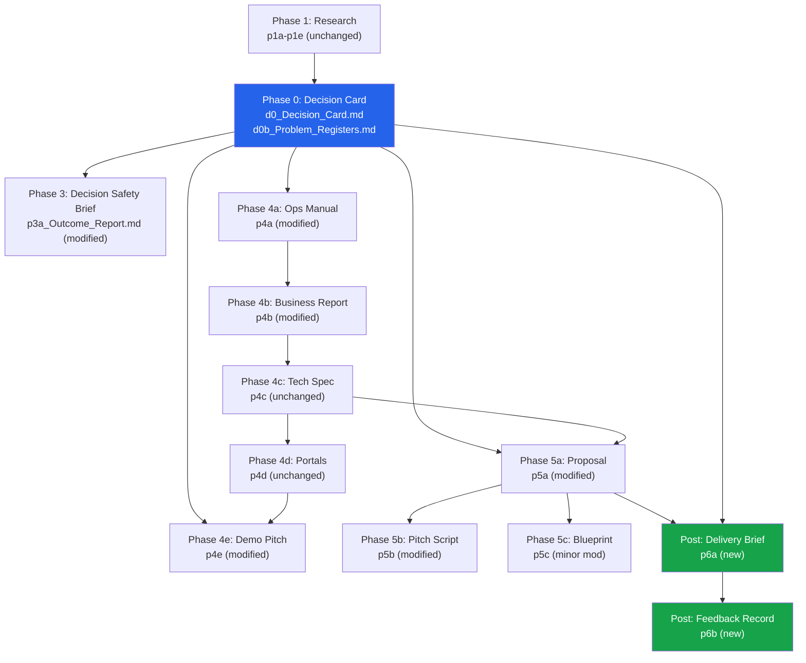

# Implementation Plan — Part 2: File Maps, Dependencies & Micro-Detail

> Companion document to Part 1. Contains the dependency graph, exact file-level change maps,
> and micro-level implementation detail for each prompt modification.

---

## Dependency Graph



---

## New Folder Structure (Final State)

```
treeraise/
├── prompts/
│   ├── README.md                                    ← MODIFIED
│   ├── phase0_decision_card/                        ← NEW FOLDER
│   │   ├── d0_Decision_Card.md                      ← NEW FILE
│   │   └── d0b_Problem_Registers.md                 ← NEW FILE
│   ├── phase1_research/                             ← UNCHANGED
│   │   ├── p1a_Website.md
│   │   ├── p1b_Linkedin_Company.md
│   │   ├── p1c_Linkedin_Owner.md
│   │   ├── p1d_Document.md
│   │   └── p1e_Job_Posting.md
│   ├── phase2_outreach/                             ← UNCHANGED
│   │   └── p2a_Lead_Warming.md
│   ├── phase3_first_touch/                          ← MODIFIED
│   │   └── p3a_Outcome_Report.md                    ← MODIFIED
│   ├── phase4_demo_scoping/                         ← MODIFIED
│   │   ├── p4a_Business_Operations_Doc_Generator.md ← MODIFIED
│   │   ├── p4b_Business_Report_Doc_Generator.md     ← MODIFIED
│   │   ├── p4c_Tech_Spec_Doc_Generator.md           ← UNCHANGED
│   │   ├── p4d_TreeRaise_Implementation_Changes.md  ← UNCHANGED
│   │   └── p4e_Demo_Pitch.md                        ← MODIFIED
│   └── phase5_proposal/                             ← MODIFIED
│       ├── p5a_Proposal.md                          ← MODIFIED
│       ├── p5b_Proposal_Pitch.md                    ← MODIFIED
│       └── p5c_Proposal_Development_Blueprint.md    ← MINOR MOD
│   └── post_deal/                                   ← NEW FOLDER
│       ├── p6a_Delivery_Intent_Brief.md             ← NEW FILE
│       └── p6b_Outcome_Feedback_Record.md           ← NEW FILE
│
├── context/                                         ← NEW OUTPUTS ADDED
│   ├── d0_Decision_Card_{PROSPECT}.md               ← NEW OUTPUT
│   ├── d0b_Problem_Registers_{PROSPECT}.md          ← NEW OUTPUT
│   ├── p1a_Website.md                               ← existing
│   ├── p1b_Linkedin_Company.md                      ← existing
│   ├── ...                                          ← existing
│   ├── p3a_Decision_Safety_Brief_{PROSPECT}.html    ← RENAMED OUTPUT
│   ├── ...                                          ← existing
│   ├── p6a_Delivery_Intent_Brief_{PROSPECT}.md      ← NEW OUTPUT
│   └── p6b_Feedback_{PROSPECT}.md                   ← NEW OUTPUT
│
├── portals/                                         ← UNCHANGED
│   ├── p4d_admin.html
│   └── p4d_partner-portal.html
│
└── prespective/                                     ← UNCHANGED (reference only)
    ├── Decision_Led_Proof_Perspective_v2.md
    └── ...
```

---

## Detailed Change Map Per File

### File: `prompts/phase3_first_touch/p3a_Outcome_Report.md`

| Line Range | Current Content | New Content | v2 Source |
|---|---|---|---|
| 1 | Role: "B2B sales strategist + web developer" | Role: "B2B decision analyst + web developer" | v2 §4 principle |
| Before 38 | (none) | NEW Rule 0: Read Decision Card first | v2 §6 |
| 64-90 | Rule 3: Quantification method | Add ROI Integrity Ladder (L1-L4) enforcement | v2 §11 |
| 109-148 | 6-section report structure | 9-section Decision Safety Brief structure | v2 §14 |
| 211-223 | Attach: prompt + report + ops manual | Add: d0 Decision Card + Problem Registers | v2 §6 |
| 226-227 | Save as: `p3_Outcome_Report_*.html` | Save as: `p3a_Decision_Safety_Brief_*.html` | v2 §14 |

### File: `prompts/phase4_demo_scoping/p4a_Business_Operations_Doc_Generator.md`

| Line Range | Current Content | New Content | v2 Source |
|---|---|---|---|
| 9 | Rules 1-9 | Add Rule 10: flag manual processes explicitly | v2 §7 |
| After 218 | (end of Section 14) | Add Section 15: Decision Safety Inputs (4 subsections) | v2 §§7,8,10,20 |

### File: `prompts/phase4_demo_scoping/p4b_Business_Report_Doc_Generator.md`

| Line Range | Current Content | New Content | v2 Source |
|---|---|---|---|
| After 11 | 6 report requirements | Add items 7-9: Proof Ledger, Feasibility Gate, ROI Classification | v2 §§9,11,12 |

### File: `prompts/phase4_demo_scoping/p4e_Demo_Pitch.md`

| Line Range | Current Content | New Content | v2 Source |
|---|---|---|---|
| 1 | Role statement | Add: "demo is a Proof Sequence" | v2 §14 |
| 15-38 | What to read first | Add: Decision Card reading instructions | v2 §6 |
| 95-216 | 5-section script (Hook → Portal1 → Portal2 → Before/After → Next) | 8-section Proof Sequence (Hook → Bottleneck → Removal → Usability → Control → Future Prevention → Before/After → Next) | v2 §14 |
| 289-304 | Attach table | Add Decision Card + Problem Registers | v2 §6 |

### File: `prompts/phase5_proposal/p5a_Proposal.md`

| Line Range | Current Content | New Content | v2 Source |
|---|---|---|---|
| Before 47 | (none) | NEW Section 0: Why Act Now | v2 §14 |
| After 146 | (after Section 6 References) | NEW Section 7: Implementation Safety | v2 §§12,14 |
| After new §7 | (none) | NEW Section 8: ROI by Integrity Level | v2 §11 |
| 269-280 | Attach table | Add Decision Card + Problem Registers | v2 §6 |

### File: `prompts/phase5_proposal/p5b_Proposal_Pitch.md`

| Line Range | Current Content | New Content | v2 Source |
|---|---|---|---|
| 70 | Section index: 6 sections | Section index: 8 sections (add Why Now, Proof, Safety) | v2 §14 |
| 76-88 | Section 00: Introduction | Replace with Section 00: Why Act Now | v2 §14 |
| After 88 | (none) | NEW Section 01: What Proof Exists | v2 §9 |
| After new §05 | (none) | NEW Section 06: Implementation Safety | v2 §§12,14 |
| 221-244 | QA: 5 items | QA: 7 items (add adoption + ROI integrity questions) | v2 §§11,20 |

---

## v2 Artifact → Implementation Mapping

This maps every artifact from v2 §5 to its implementation location:

| v2 Artifact | Implementation Location | Prompt |
|---|---|---|
| d0 Decision Card | `context/d0_Decision_Card_{PROSPECT}.md` | `d0_Decision_Card.md` |
| Current Problem Register | `context/d0b_Problem_Registers_{PROSPECT}.md` | `d0b_Problem_Registers.md` |
| Future Problem Register | `context/d0b_Problem_Registers_{PROSPECT}.md` | `d0b_Problem_Registers.md` |
| Proof Ledger | Embedded in p4b Business Report output | `p4b (modified)` |
| Stakeholder Decision Map | Embedded in d0 Decision Card §9 | `d0_Decision_Card.md` |
| ROI Integrity Ladder | Embedded in d0 Decision Card §8 + p3a + p5a | Multiple prompts |
| Feasibility & Delivery Gate | Embedded in p4b Business Report output + d0 §9 | `p4b + d0` |
| Delivery Intent Brief | `context/p6a_Delivery_Intent_Brief_{PROSPECT}.md` | `p6a (new)` |

---

## Investment Gate → Deliverable Mapping

| Gate | Condition | Deliverables Allowed |
|---|---|---|
| Gate 1: Snapshot | Outcome unclear, buying reason unconfirmed, proof weak | d0 Decision Card only + discovery ask |
| Gate 2: Discovery | Bottleneck visible, decision risk uncertain, stakeholder support unknown | d0 + Problem Registers + discovery questions |
| Gate 3: Demo + Report | Current problem concrete, proof ledger viable, buyer ≥ partial confirmation, delivery confidence ≠ low | d0 + Registers + Demo + Decision Safety Brief |
| Gate 4: Proposal | Buying reason confirmed, proof exists, ROI defensible, implementation believable | All artifacts including Proposal + Pitch + Blueprint |

**Implementation**: The Investment Gate is assessed in the d0 Decision Card output. Downstream prompts reference this gate level to adjust their CTA language and depth of output.

---

## Token Budget (Updated)

| Phase | Prompt | Inputs | Est. Tokens |
|---|---|---|---|
| 0 | d0 Decision Card | Prompt + all p1_ context files | 20k–40k |
| 0 | d0b Problem Registers | Prompt + d0 + p1_ files | 15k–30k |
| 1 | p1_ (each) | Prompt + one raw file | 10k–40k |
| 2 | p2_ | Prompt + CEO LinkedIn + Ops Manual | 20k–50k |
| 3 | p3_ | Prompt + d0 + d0b + Report + Ops Manual | 35k–70k |
| 4 | p4a_ | Prompt + all p1_ context files | 60k–130k |
| 4 | p4b_ | Prompt + p4a_ only | 35k–75k |
| 4 | p4c_ | Prompt + p4a_ + p4b_ | 60k–120k |
| 4 | p4d_ | Prompt + p4c_ | 40k–100k |
| 4 | p4e_ | Prompt + d0 + d0b + 2 portals + p4a_ | 30k–60k |
| 5 | p5a_ | Prompt + d0 + d0b + p4c_ | 25k–55k |
| 5 | p5b_ | Prompt + p5a_ only | 15k–35k |
| 5 | p5c_ | Prompt + p4c_ + p5a_ | 20k–50k |
| Post | p6a_ | Prompt + d0 + d0b + p5a_ | 10k–25k |
| Post | p6b_ | Prompt + free-form notes | 5k–15k |

> All estimates remain within the 190k Claude session limit.

---

## Critical Rules to Enforce Across All Modified Prompts

These rules from v2 must be embedded as hard constraints in every modified prompt:

1. **No L3/L4 metrics in headlines** — Only L1 (Sourced) may lead. L2 (Estimated) may support with label. L3 (Proxy) may illustrate only. L4 (Excluded) must be removed.

2. **No full deliverable without Buyer Confirmation Status visible** — If status is "Hypothesis only," output must include a prominent disclaimer and recommend discovery first.

3. **No claim without proof** — If Proof Condition is not visible in demo or report, do not make the claim. Use Backup Language from Proof Ledger instead.

4. **No lead proof with Low feasibility** — If Feasibility Gate scores any lead item as Low, it must be reframed as future-state or removed from core pitch.

5. **Stakeholder low-support trigger** — If any critical stakeholder has "Low" support level, the system must recommend discovery or objection-handling before full proposal.

6. **Anti-failure rules** (v2 §20) — The framework must remain evidence-based, fast, buyer-relevant, proof-first, and commercially practical. Prompts must not encourage over-engineering.
